# 1294 等离子枪 Plasma Gun

精校状态：中文行文已逐段精校，部分术语仍为暂定

分类：武器 / 远程武器

原文来源：https://www.bilibili.com/opus/1002090228941324288

原作者：帝国神选罐头

原文时间：编辑于 2025年06月24日 22:36

[返回分类目录](目录.md) · [全书目录](../../目录.md)

<!-- A1294-B0001 -->
**英文原文**

Plasma gun is a generic term for a two-handed, rifle-like, plasma based weapon used by the forces of the Imperium as well as Chaos in a support role.

<!-- /A1294-B0001 -->

<!-- A1294-B0002 -->

原译文

等离子枪是一种双手、类似步枪、基于等离子的武器的通用术语，由帝国部队和混沌部队用于支援。

**校订译文**

等离子枪是一类需要双手持用、外形类似步枪的等离子武器的统称，帝国与混沌军队都将其用作支援武器。

<!-- /A1294-B0002 -->

<!-- A1294-B0003 图片 -->
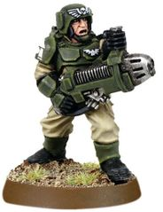

<!-- A1294-B0004 -->

原译文

Cadian Shock Trooper 卡迪亚突击队

**校订译文**

Cadian Shock Trooper 卡迪亚突击军士兵

<!-- /A1294-B0004 -->

<!-- A1294-B0005 -->
## Description 描述

<!-- /A1294-B0005 -->

<!-- A1294-B0006 -->
**英文原文**

An uncommon weapon, even in the ranks of the Imperial Guard or Adeptus Astartes, most extant plasma guns are hundreds if not thousands of years old. As a testament to their design, they remain as deadly today as the day of their fabrication.

<!-- /A1294-B0006 -->

<!-- A1294-B0007 -->

原译文

等离子枪是一种罕见的武器，即使在帝国卫队或阿斯塔特修会中也是如此，大多数现存的等离子枪都有数百年甚至数千年的历史。作为它们设计的证明，它们在今天仍然和制造时一样致命。

**校订译文**

即使在帝国卫队或阿斯塔特修会中，等离子枪也并不常见。现存武器大多已有数百乃至数千年历史，却仍与造出时一样致命，足见其设计之精良。

<!-- /A1294-B0007 -->

<!-- A1294-B0008 图片 -->
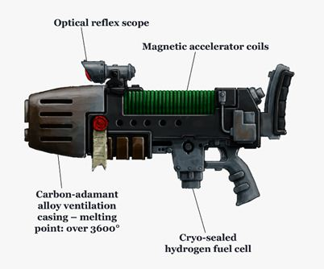

<!-- A1294-B0009 -->

原译文

Imperial Diagram of a Plasma Gun 等离子枪的帝国示意图

**校订译文**

Imperial Diagram of a Plasma Gun 等离子枪的帝国示意图

<!-- /A1294-B0009 -->

<!-- A1294-B0010 -->
**英文原文**

Aesthetically they appear to be stubby and rather clunky, with a ribbed back and flared cooling vents along the front. Hydrogen flasks stick out of the butt and bottom of the weapon. These flasks generally contain enough fuel for at least 10 shots before needing to be replaced. An alternative to using plasma flasks, it can use a backpack with a feed line.

<!-- /A1294-B0010 -->

<!-- A1294-B0011 -->

原译文

从美学角度来看，它们显得又粗又笨重，背部有螺纹，前部有喇叭形的冷却通风口。氢瓶从武器的枪托和底部伸出。在需要更换之前，这些瓶子通常含有足够至少10次射击的燃料。除了使用等离子瓶，它还可以使用带进料线的背包。

**校订译文**

等离子枪外形粗短笨重，顶部带有肋状结构，前部设有外扩的冷却通风口。氢燃料瓶从枪托及枪身底部伸出，通常至少可供射击十次，也可改用带输送管线的背负式燃料容器。

<!-- /A1294-B0011 -->

<!-- A1294-B0012 图片 -->
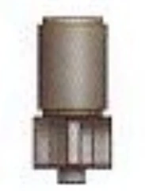

<!-- A1294-B0013 -->

原译文

Hydrogen flasks 氢瓶

**校订译文**

Hydrogen flasks 氢瓶

<!-- /A1294-B0013 -->

<!-- A1294-B0014 -->
**英文原文**

Plasma guns can generally be fired in two modes: standard mode (the normal and safest), or a higher-powered blast with a longer range and higher temperature. The latter requiring a short time to replenish the plasma back to firing levels.

<!-- /A1294-B0014 -->

<!-- A1294-B0015 -->

原译文

等离子枪通常可以在两种模式下发射：标准模式（正常和最安全），或更高功率、更远射程和更高温度的爆炸。后者需要短时间将等离子体补充到开火水平。

**校订译文**

等离子枪通常有两种射击模式：常规且最安全的标准模式，以及威力更强、射程更远、温度更高的高功率模式。使用后者后，需要短暂等待等离子体恢复至可再次开火的水平。

<!-- /A1294-B0015 -->

<!-- A1294-B0016 图片 -->
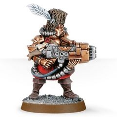

<!-- A1294-B0017 -->

原译文

Vostroyan Firstborn 沃斯托尼亚长子团

**校订译文**

Vostroyan Firstborn 沃斯托尼亚长子团

<!-- /A1294-B0017 -->

<!-- A1294-B0018 -->
**英文原文**

The weapon fires a highly energized ball of hydrogen-based plasma. Plasma guns, like most plasma weaponry, work by energizing (heating) liquid hydrogen fuel into plasma that is held in the weapon by powerful magnetic containment fields. When fired, the fields dilate open and the plasma is ejected via a linear electromagnetic accelerator in a bolt of superheated matter akin to a solar flare in appearance and temperature. Emergency cooling ducts and exhaust vents periodically expel excess heat from the gun.

<!-- /A1294-B0018 -->

<!-- A1294-B0019 -->

原译文

该武器发射了一个高能量的氢基等离子体球。与大多数等离子武器一样，等离子枪的工作原理是将液态氢燃料加热成等离子体，等离子体由强大的磁场控制在武器中。当开火时，磁场会膨胀打开，等离子体通过线性电磁加速器在过热物质中喷射出来，在外观和温度上类似于太阳耀斑。应急冷却管道和排气口会定期排出枪中的多余热量。

**校订译文**

等离子枪发射高能氢等离子团。与大多数等离子武器一样，它将液态氢燃料加热成等离子体，以强磁约束场将其封存在枪内。开火时，磁场张开，由线性电磁加速器将过热物质射出，其外观与温度宛如太阳耀斑。应急冷却管道和排气口会定期释放多余热量。

<!-- /A1294-B0019 -->

<!-- A1294-B0020 -->
**英文原文**

The weapon is useful against both heavily armoured infantry and light armoured vehicles. In combat, a plasma gun is capable of heavily damaging Tau Battlesuits, Tyranid assault organisms, Ork Meganobs, APCs, and light tanks

<!-- /A1294-B0020 -->

<!-- A1294-B0021 -->

原译文

该武器对重型装甲步兵和轻型装甲车都有用。在战斗中，等离子枪能够严重破坏钛战斗服、泰伦突击生物、欧克超重装老大、装甲运兵车和轻型坦克

**校订译文**

它既能对付重装步兵，也能对付轻型装甲载具，可重创钛族战斗服、泰伦突击生物、欧克超重装老大、装甲运兵车和轻型坦克。

<!-- /A1294-B0021 -->

<!-- A1294-B0022 -->
## Dangers 危险

<!-- /A1294-B0022 -->

<!-- A1294-B0023 -->
**英文原文**

Generally, Imperial models are prone to overheating with continual firing and can cause severe injury or death to the user should they experience such a meltdown. When the weapon reaches critical temperatures, it will release a cloud of super-heated vapour. Imperial Guardsmen consider it a dubious honor to be chosen as a squad's plasma gunner for this exact reason. Astartes push the limits of their own resilience by using hydrogen in a "higher quantum state" than standard Imperial patterns.

<!-- /A1294-B0023 -->

<!-- A1294-B0024 -->

原译文

一般来说，帝国型号在持续开火时容易过热，如果使用者遇到这种熔毁，可能会导致严重伤害或死亡。当武器达到临界温度时，它会释放出一团过热的蒸汽。由于这个确切原因，帝国卫队认为被选为小队的等离子枪手是一种可疑的荣誉。阿斯塔特通过使用比标准帝国型号“更高量子态”的氢来突破他们自身韧性的极限。

**校订译文**

帝国型号在持续射击时普遍容易过热，发生熔毁时可能重伤乃至杀死使用者。武器达到临界温度后，会喷出一团过热蒸气。正因如此，帝国卫队士兵对被选为小队等离子枪手这份“荣誉”往往心存疑虑。阿斯塔特则使用比标准帝国型号处于“更高量子态”的氢，也让自身的耐受能力面临极限考验。

**校注：** 本段以Astartes为主语，their own resilience指阿斯塔特自身承受能力；区别1292篇以武器为主语的句子。

<!-- /A1294-B0024 -->

<!-- A1294-B0025 图片 -->
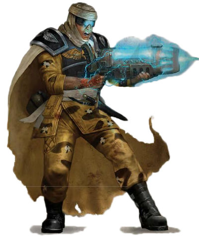

<!-- A1294-B0026 -->

原译文

A Plasma Gun overheating 过热的等离子枪

**校订译文**

A Plasma Gun overheating 过热的等离子枪

<!-- /A1294-B0026 -->

<!-- A1294-B0027 -->
**英文原文**

In the event of overheating, the weapon is likely to survive, though the wielder is often less fortunate. Space Marines are at least afforded a degree of protection against these catastrophic overheats because of their power armour, the ceramite plates and hard seals usually limiting the damage to their surroundings. Even so, an overheat can still kill or maim a Space Marine, especially if the exhaust vents clog or the coils crack from the intense heat. For less protected soldiers, like Imperial Guardsmen, overheating plasma guns are almost always fatal. In rare cases, plasma guns are even capable of detonating if they get too hot. This may occur as a result of excessive firing, but can also be the result of a flaw during manufacture. Should the casing crack or the magnetic containment fail, the firer will have only a fraction of a second before the gun turns into a ball of blazing energy in his hands, consuming itself with the heat of a star and vaporizing everything with reach.

<!-- /A1294-B0027 -->

<!-- A1294-B0028 -->

原译文

在过热的情况下，武器很可能会幸存下来，尽管使用者往往不那么幸运。由于其动力装甲、陶钢板和硬密封件通常限制了对周围环境的破坏，星际战士至少在一定程度上得到了对这些灾难性过热的保护。即便如此，过热仍然会杀死或致残星际战士，特别是在排气口堵塞或线圈因高温而破裂的情况下。对于像帝国卫队这样保护较少的士兵来说，过热的等离子枪几乎总是致命的。在极少数情况下，等离子枪甚至能够在过热时引爆。这可能是由于过度射击造成的，但也可能是制造过程中的缺陷造成的。如果外壳破裂或磁性外壳失效，引爆者只有几分之一秒的时间，枪就会变成他手中燃烧的能量球，用恒星的热量消耗自己，并蒸发触手可及下的一切。

**校订译文**

发生过热后，武器本身很可能仍然完好，持枪者却往往没有这么幸运。星际战士至少还有动力装甲的保护；陶钢板和坚固的密封结构，通常能将伤害限制在装甲外部。即便如此，过热仍可能使星际战士死亡或残疾，尤其是在排气口堵塞、线圈因高温开裂时。对帝国卫队士兵等防护较弱的使用者而言，等离子枪过热几乎总是致命的。极少数情况下，武器还会因过热而爆炸，原因可能是过度射击，也可能是制造缺陷。一旦外壳开裂或磁约束失效，射手只有转瞬即逝的反应时间；随后武器便在手中化为炽烈的能量球，以恒星般的高温熔毁自身，并汽化波及范围内的一切。

<!-- /A1294-B0028 -->

<!-- A1294-B0029 -->
**英文原文**

In addition to the dangers of an overheat, plasma guns are difficult to reload. Only with the requisite prayers should the hydrogen flasks be screwed into place, their unstable ammunition all too prone to spilling or fouling the plasma intakes. An incorrectly attached flask can cause the weapon to explode the first time it is fired, as an empty or partially filled magnetic chamber creates inescapable pressure that will tear the gun apart in addition to its user. Removing a flask is also dangerous, as even a small amount of plasma leaking out of a broken seal or an incorrectly closed valve can burn away a hand or cost the shooter several fingers. For these reasons, plasma guns are slow and difficult to load or unload on the battlefield, a task often best left to a Techmarine or Tech-Priest and long hours of binary prayer. In combat, a Space Marine can rely on a plasma gun for a dozen or so consecutive shots before the flask starts to run dry, and he runs the risk of triggering a catastrophic overheat.

<!-- /A1294-B0029 -->

<!-- A1294-B0030 -->

原译文

除了过热的危险外，等离子枪很难重新装弹。只有经过必要的祈祷，才能将氢瓶拧到位，因为它们不稳定的弹药很容易溢出或污染等离子入口。一个连接不正确的瓶子可能会导致武器在第一次发射时爆炸，因为一个空的或部分填充的磁室会产生不可避免的压力，除了使用者外，还会将枪撕裂。移除瓶子也是危险的，因为即使少量等离子从破裂的密封件或错误关闭的阀门中泄漏，也会烧坏一只手或让射手损失几根手指。由于这些原因，等离子枪在战场上装弹或卸弹缓慢而困难，这项任务通常最好留给技术军士或技术神甫，以及长时间的二进制祈祷。在战斗中，一名星际战士可以在瓶子开始干涸之前依靠等离子枪连续射击十几次左右，他有可能引发灾难性的过热。

**校订译文**

等离子枪不仅容易过热，更换燃料也很困难。安装氢瓶时必须完成规定的祈祷，再将其旋紧到位；不稳定的燃料很容易溢出或堵污等离子入口。燃料瓶若连接不当，武器可能第一次开火就爆炸：空置或未充满的磁约束室会积聚无法排出的压力，将枪械与使用者一并撕碎。拆卸燃料瓶同样危险，即使只有少量等离子体从破损密封处或未关妥的阀门漏出，也足以烧掉一只手或几根手指。因此，在战场上装卸燃料既慢又困难，通常最好交给科技战士或技术祭司，并辅以长时间的二进制祷告。星际战士在战斗中往往只能连续射击十来次，燃料瓶便会接近耗尽，此时也面临引发灾难性过热的风险。

<!-- /A1294-B0030 -->

<!-- A1294-B0031 -->
## Imperial Plasma Gun Patterns 帝国等离子枪型号

<!-- /A1294-B0031 -->

<!-- A1294-B0032 -->
## Accatran Pattern 阿卡特兰型

<!-- /A1294-B0032 -->

<!-- A1294-B0033 -->

原译文

MK I Accatran Pattern Mk.l阿卡特兰型

**校订译文**

MK I Accatran Pattern Mk.I 阿卡特兰型

<!-- /A1294-B0033 -->

<!-- A1294-B0034 -->
**英文原文**

Less commonly seen among the ranks of the Elysian Drop Troops, this pattern is used as the main weapon of a regiment's Veterans.

<!-- /A1294-B0034 -->

<!-- A1294-B0035 -->

原译文

在艾丽西亚空降部队的队伍中不太常见，这种型号被用作一个团老兵的主要武器。

**校订译文**

这一型号在艾丽西亚空降部队中较少见，通常作为团内老兵的主要武器。

<!-- /A1294-B0035 -->

<!-- A1294-B0036 图片 -->
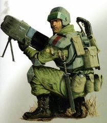

<!-- A1294-B0037 -->

原译文

MK I Accatran Pattern Mk.l阿卡特兰型

**校订译文**

MK I Accatran Pattern Mk.I 阿卡特兰型

<!-- /A1294-B0037 -->

<!-- A1294-B0038 -->

原译文

MK II Accatran Pattern Mk.II阿卡特兰型

**校订译文**

MK II Accatran Pattern Mk.II阿卡特兰型

<!-- /A1294-B0038 -->

<!-- A1294-B0039 -->
**英文原文**

The MK II Accatran Pattern is the standard plasma gun of the Elysian Drop Troops. It is an improvement over the MK I due to an attached carrying handle (which also houses the weapon's optic) and optional bipod. Two photonic hydrogen fuel cells screw in underneath the weapon.

<!-- /A1294-B0039 -->

<!-- A1294-B0040 -->

原译文

Mk.II 阿卡特兰型是艾丽西亚空降部队的标准等离子枪。由于配备了携带手柄（也容纳了武器的光学元件）和可选的双脚架，这是对MK.I的改进。两个光子氢燃料电池拧在武器下面。

**校订译文**

Mk.II 阿卡特兰型是艾丽西亚空降部队的制式等离子枪。它在 Mk.I 基础上加装了内置瞄准装置的提把，并可选配两脚架。两枚光子氢燃料单元旋装于枪身下方。

<!-- /A1294-B0040 -->

<!-- A1294-B0041 图片 -->
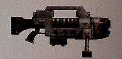

<!-- A1294-B0042 -->

原译文

MK II Accatran Pattern Mk.II阿卡特兰型

**校订译文**

MK II Accatran Pattern Mk.II阿卡特兰型

<!-- /A1294-B0042 -->

<!-- A1294-B0043 -->

原译文

MK IId Accatran Pattern Mk.IId阿卡特兰型

**校订译文**

MK IId Accatran Pattern Mk.IId阿卡特兰型

<!-- /A1294-B0043 -->

<!-- A1294-B0044 -->
**英文原文**

The MK IId Accatran Pattern Plasma Gun was special issued to and used by the Death Korps of Krieg's 134th Heavy Infantry Regiment's Thamyris Taskforce during the Necron invasion of the Orpheus Sector sometime before 998.M41.

<!-- /A1294-B0044 -->

<!-- A1294-B0045 -->

原译文

MK.IId 阿卡特兰型等离子枪是在998.M41之前的某个时候，在死灵入侵俄耳甫斯星区期间，为克里格死亡军团的第134重步兵团塔米里斯特遣部队特别发行并使用的。

**校订译文**

998.M41之前，太空死灵入侵俄耳甫斯星区期间，克里格死亡军团第134重步兵团的塔米里斯特遣队获特别配发并使用 Mk.IId 阿卡特兰型等离子枪。

<!-- /A1294-B0045 -->

<!-- A1294-B0046 图片 -->
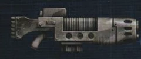

<!-- A1294-B0047 -->

原译文

MK IId Accatran Pattern Mk.IId阿卡特兰型

**校订译文**

MK IId Accatran Pattern Mk.IId阿卡特兰型

<!-- /A1294-B0047 -->

<!-- A1294-B0048 -->

原译文

MK I Apollo Pattern Mk.I阿波罗型

**校订译文**

MK I Apollo Pattern Mk.I阿波罗型

<!-- /A1294-B0048 -->

<!-- A1294-B0049 -->
**英文原文**

First adopted by the Blood Angels, the MK I Apollo Pattern Plasma Gun was created by one of their lesser known Techpriests. The weapon gained popularity with other “fire based” chapters, like the Salamanders, when it was shown to have a “molten lava” like effect when fired on most worlds. While the blue-white coils burn hotter than standard blue plasma weapons, resulting in a longer damage over time effect, they are also prone to overheating faster.

<!-- /A1294-B0049 -->

<!-- A1294-B0050 -->

原译文

MK.I阿波罗型等离子枪最初被圣血天使采用，是由他们一位鲜为人知的技术神甫创造的。当它被证明在大多数世界上发射时具有“熔岩”般的效果时，这种武器在其他“火基”的战团中越来越受欢迎，比如火蜥蜴。虽然蓝白色线圈比标准蓝色等离子武器燃烧得更热，随着时间的推移造成的伤害更长，但它们也容易更快地过热。

**校订译文**

Mk.I 阿波罗型等离子枪最早由圣血天使采用，据底稿所述，出自他们一位鲜为人知的技术祭司之手。它在多数世界上开火时会呈现类似“熔岩”的效果，因此也受到火蜥蜴等重视火焰的战团欢迎。蓝白色线圈的温度高于常规蓝色等离子武器，因而造成的持续伤害更久，但也更容易迅速过热。

**校注：** 所给英文称设计者为Techpriest，故保留技术祭司；未擅自改为更常见的Techmarine。

<!-- /A1294-B0050 -->

<!-- A1294-B0051 图片 -->
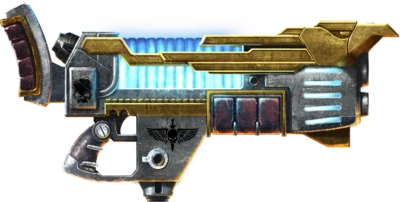

<!-- A1294-B0052 -->

原译文

MK I Apollo Pattern Mk.I阿波罗型

**校订译文**

MK I Apollo Pattern Mk.I阿波罗型

<!-- /A1294-B0052 -->

<!-- A1294-B0053 -->
### Asandre Pattern Plasma Gun 阿桑德雷型等离子枪

<!-- /A1294-B0053 -->

<!-- A1294-B0054 -->
**英文原文**

Following its acceptance of the Imperial Creed, the world of Asandre underwent a period of radical technological advancement as Jollus Marquette brought the planet into the fold of the Imperium of Man. With the help of adepts of the Mechanicus, Asandres' already burgeoning industrial capacity was vastly improved and turned to manufacturing arms and military equipment. Among the weapons manufactured on Asandre are plasma guns modelled on the venerable Mezoa-pattern. Unfortunately, some defect in the plans and schematics provided by the Tech-Priests resulted in unforeseen fluctuations in the weapon's power output, resulting in somewhat irregular blasts. The defect has been noted by the adepts assigned to Asandre, but the manufactorums continue to produce these plasma guns nevertheless.

<!-- /A1294-B0054 -->

<!-- A1294-B0055 -->

原译文

在接受了帝国信条之后，阿桑德雷世界经历了一段激进的技术进步时期，因为乔卢斯·马奎特将星球带入了人类帝国的怀抱。在机械神教的帮助下，阿桑德雷已经蓬勃发展的工业能力得到了极大的提高，并转向制造武器和军事装备。在阿桑德雷制造的武器中，有仿照古老的梅佐亚型的等离子枪。不幸的是，技术神甫提供的计划和示意图中的一些缺陷导致了武器输出功率的意外波动，从而导致了一些无规律的爆炸。阿桑德雷的专家已经注意到了这一缺陷，但制造商仍在继续生产这些等离子枪。

**校订译文**

乔卢斯·马奎特将阿桑德雷纳入人类帝国后，这个接受了帝国教义的世界经历了技术飞跃。在机械修会技术人员帮助下，当地原本蓬勃发展的工业大幅扩张，转向生产武器和军用装备，其中包括仿照古老梅佐亚型制造的等离子枪。然而，技术祭司提供的设计图纸存在缺陷，使武器功率出现意外波动，射击输出不够稳定。派驻阿桑德雷的技术人员已注意到问题，但各制造厂仍在继续生产。

<!-- /A1294-B0055 -->

<!-- A1294-B0056 -->
### Burning Sun 烈阳

<!-- /A1294-B0056 -->

<!-- A1294-B0057 -->
**英文原文**

A highly modifiable plasma gun pattern, popular amongst the gangers and hired guns of Necromunda. Associated with the gangers of House Escher.

<!-- /A1294-B0057 -->

<!-- A1294-B0058 -->

原译文

一种高度可修改的等离子枪型号，在涅克罗蒙达的歹徒和雇佣枪手中很受欢迎。与埃舍尔家族的歹徒有关联。

**校订译文**

这种等离子枪便于进行多种改装，在涅克罗蒙达的帮派成员和雇佣枪手中很受欢迎，尤其与埃舍尔家族帮派关系密切。

<!-- /A1294-B0058 -->

<!-- A1294-B0059 图片 -->
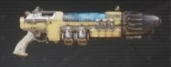

<!-- A1294-B0060 -->

原译文

Burning Sun 烈阳

**校订译文**

Burning Sun 烈阳

<!-- /A1294-B0060 -->

<!-- A1294-B0061 -->

原译文

MK IV Clovis Pattern MK.IV克洛维斯型

**校订译文**

MK IV Clovis Pattern MK.IV克洛维斯型

<!-- /A1294-B0061 -->

<!-- A1294-B0062 -->
**英文原文**

While the Clovis Munitorum is deservedly known for its shoddy and low-quality manufacturing, this gun represents a genuine attempt to imitate an ancient high-quality weapon using recently-sanctified designs discovered just decades earlier. The goal of manufacturing a more powerful plasma gun met with failure, however, given the near-impossible task of properly applying the underlying holy sciences involved; the Dark Age of Technology still remains a shadowy beacon over humanity which may never be grasped. The Mark IV pattern nevertheless became an accidental success of sorts, as its weaker collimation system produces smaller, more diffuse plasma spurts. Though it has lesser power than standard (and better manufactured) plasma weapons, the Mark IV allows the user to spray several blasts with one shot, providing effective suppressive fire against even heavily-entrenched enemies.

<!-- /A1294-B0062 -->

<!-- A1294-B0063 -->

原译文

虽然克洛维斯弹药以其劣质和低质的制造而闻名，但这款枪代表了使用最近几十年前发现的神圣的设计来模仿古代高质量武器的真正尝试。然而，鉴于正确应用所涉及的隐含的神圣科学几乎是不可能的任务，制造更强大的等离子枪的目标失败了；黑暗技术时代仍然是人类的一个模糊的灯塔，可能永远不会被抓住。尽管如此，Mark.IV型还是取得了某种意外的成功，因为其较弱的准直系统会产生更小、更扩散的等离子体喷射。尽管Mark.IV的威力不如标准（且制造更好）等离子武器，但它允许使用者一次发射多次爆炸，即使对根深蒂固的敌人也能提供有效的压制火力。

**校订译文**

克洛维斯军械机构一向以粗劣的制造质量著称，然而这款枪确实是一次仿制古代优质武器的认真尝试：所用设计在数十年前才被发现，并于近期获得祝圣认可。遗憾的是，正确运用其中的神圣科学几乎是不可能完成的任务，制造更强等离子枪的目标最终落空。黑暗科技时代仍如笼罩在人类头顶的朦胧灯塔，看得见，却可能永远无法企及。Mk.IV 型却意外取得了另一种成功：较弱的准直系统射出的等离子团更小、更分散。虽然威力不及制造精良的标准型号，它却能在一次射击中喷出多团等离子体，甚至有效压制躲在坚固工事中的敌人。

**校注：** Clovis Munitorum指制造军械的机构，并非弹药。机构全名与官方译名待核。

<!-- /A1294-B0063 -->

<!-- A1294-B0064 图片 -->
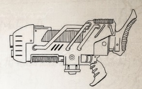

<!-- A1294-B0065 -->

原译文

MK IV Clovis Pattern MK.IV克洛维斯型

**校订译文**

MK IV Clovis Pattern MK.IV克洛维斯型

<!-- /A1294-B0065 -->

<!-- A1294-B0066 -->
### Dekker Pattern Plasma Gun 德克尔型等离子枪

<!-- /A1294-B0066 -->

<!-- A1294-B0067 -->
**英文原文**

A rare Baal-variant model. The Dekker Pattern Plasma Gun is a thickset, twin-core design. The weapon’s cowling is enamelled in blood red, and dressed with a skull emblem in beaten gold. An example of this weapon is carried by Sergeant Rafen of the Blood Angels, which has etched below the skull emblem the name of a missing Blood Angel hero: Brother-Captain Aryon.

<!-- /A1294-B0067 -->

<!-- A1294-B0068 -->

原译文

罕见的巴尔变体型号，德克尔型等离子枪是一种厚的，双核设计。武器的整流罩上涂有血红色的珐琅，并饰有镀金骷髅徽章。这种武器的一个例子是圣血天使的拉芬军士，他在头骨徽章下方刻下了一位失踪的圣血天使英雄的名字：连长阿瑞昂兄弟。

**校订译文**

德克尔型是罕见的巴尔改型，枪身粗壮，采用双核心设计，护罩涂有血红色珐琅，并饰以锤打成形的金骷髅徽记。圣血天使军士拉芬就携带一把；骷髅徽记下方刻着一位失踪英雄的名字——兄弟连长阿瑞昂。

<!-- /A1294-B0068 -->

<!-- A1294-B0069 -->
### Gantic Pattern Plasma Gun 甘提克型等离子枪

<!-- /A1294-B0069 -->

<!-- A1294-B0070 -->
**英文原文**

The Gantic Pattern Plasma Gun is used by House Van Saar of Necromunda and is named after a gang master who performed an exceptional service to them.

<!-- /A1294-B0070 -->

<!-- A1294-B0071 -->

原译文

甘提克型等离子枪由涅克罗蒙达的凡萨尔家族使用，以一位为他们提供卓越服务的帮派头目命名。

**校订译文**

甘提克型等离子枪由涅克罗蒙达的凡·萨尔家族使用，得名于一位曾为该家族立下卓著功劳的帮派头目。

<!-- /A1294-B0071 -->

<!-- A1294-B0072 -->
### Luther Pattern 卢瑟型

<!-- /A1294-B0072 -->

<!-- A1294-B0073 -->
**英文原文**

Used by the Astra Militarum, Luther Pattern plasma weapons are known to leave the hands of long-time operators with distinctive scarring.

<!-- /A1294-B0073 -->

<!-- A1294-B0074 -->

原译文

众所周知，星界军使用的卢瑟型等离子武器会给长期操作者留下明显的疤痕。

**校订译文**

星界军使用的卢瑟型等离子武器，会在长期操作者的双手上留下独特疤痕。

<!-- /A1294-B0074 -->

<!-- A1294-B0075 -->
## Magnacore Pattern 巨核型

<!-- /A1294-B0075 -->

<!-- A1294-B0076 -->
### M35 Magnacore Pattern M35巨核型

<!-- /A1294-B0076 -->

<!-- A1294-B0077 -->
**英文原文**

The M35 Magnacore Pattern is the standard issue plasma gun of the Cadian Shock Troops.

<!-- /A1294-B0077 -->

<!-- A1294-B0078 -->

原译文

M35 巨核型是卡迪亚突击队的标准等离子枪。

**校订译文**

M35 巨核型是卡迪亚突击军的制式等离子枪。

<!-- /A1294-B0078 -->

<!-- A1294-B0079 图片 -->
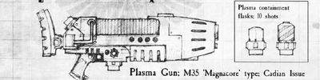

<!-- A1294-B0080 -->

原译文

M35 Magnacore Pattern M35巨核型

**校订译文**

M35 Magnacore Pattern M35巨核型

<!-- /A1294-B0080 -->

<!-- A1294-B0081 -->

原译文

M35 Magnacore Mk II Plasma Gun M35巨核型Mk.II等离子枪

**校订译文**

M35 Magnacore Mk II Plasma Gun M35巨核型Mk.II等离子枪

<!-- /A1294-B0081 -->

<!-- A1294-B0082 -->
**英文原文**

Firing an energized ball of hydrogen-based plasma along a linear electromagnetic accelerator, plasma guns are deadly, if prone to dangerous overheating.

<!-- /A1294-B0082 -->

<!-- A1294-B0083 -->

原译文

等离子枪沿着线性电磁加速器发射一个带电的氢基等离子体球，如果容易发生危险的过热，就会致命。

**校订译文**

等离子枪利用线性电磁加速器射出高能氢等离子团，杀伤力极强，但也容易发生危险的过热。

<!-- /A1294-B0083 -->

<!-- A1294-B0084 图片 -->
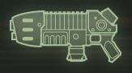

<!-- A1294-B0085 -->

原译文

M35 Magnacore Mk II Plasma Gun M35巨核型Mk.II等离子枪

**校订译文**

M35 Magnacore Mk II Plasma Gun M35巨核型Mk.II等离子枪

<!-- /A1294-B0085 -->

<!-- A1294-B0086 -->
## Mars Pattern 火星型

<!-- /A1294-B0086 -->

<!-- A1294-B0087 -->

原译文

Mars Pattern MK III Sunfury Assault Plasma Gun 火星型MK.III日怒突击等离子枪

**校订译文**

Mars Pattern MK III Sunfury Assault Plasma Gun 火星型MK.III日怒突击等离子枪

<!-- /A1294-B0087 -->

<!-- A1294-B0088 -->
**英文原文**

A high-power weapon issued to Imperial Guard units facing heavily armoured foes. The Sunfury can spit out plasma bolts capable of destroying even light vehicles with ease, although its rate of fuel consumption is high. Its reputation grew in the Calixis Sector when it was used great effect during the Meritates Uprising along the Ixaniad border several hundred years ago against the augmetic reavers of the savage Meritech Clans.

<!-- /A1294-B0088 -->

<!-- A1294-B0089 -->

原译文

一种高功率武器，发放给面对重装甲敌人的帝国卫队部队。尽管其燃料消耗率很高，但日怒可以喷出等离子爆矢，即使是轻型车辆也能轻易摧毁。几百年前，在伊克萨尼德边境的梅里塔斯特叛乱中，当它被用来对抗野蛮的梅里塔斯特氏族的强化掠夺者时，它的声誉在卡利西斯星区得到了提升。

**校订译文**

日怒是配发给帝国卫队、用来对付重装敌人的高功率武器。它射出的等离子团甚至能轻易摧毁轻型载具，代价是燃料消耗很大。数百年前，伊克萨尼德边境爆发梅里塔特斯叛乱；日怒在对抗野蛮的梅里泰克氏族那些植入机械增强体的劫掠者时表现出色，自此在卡利西斯星区声名大噪。

**校注：** Meritates叛乱与Meritech氏族为两个不同英文词，原译混成同名。

<!-- /A1294-B0089 -->

<!-- A1294-B0090 -->

原译文

MK V Mars Pattern MK.V火星型

**校订译文**

MK V Mars Pattern MK.V火星型

<!-- /A1294-B0090 -->

<!-- A1294-B0091 -->
**英文原文**

The MK V Mars Pattern plasma gun is used by the Dark Angels and Red Scorpions.

<!-- /A1294-B0091 -->

<!-- A1294-B0092 -->

原译文

MK.V火星型等离子枪被黑暗天使和红蝎使用。

**校订译文**

MK.V火星型等离子枪被黑暗天使和红蝎使用。

<!-- /A1294-B0092 -->

<!-- A1294-B0093 图片 -->
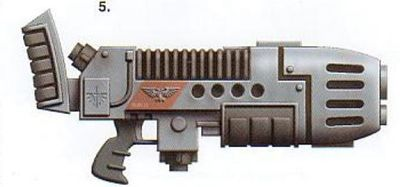

<!-- A1294-B0094 -->

原译文

MK V Mars Pattern MK.V火星型

**校订译文**

MK V Mars Pattern MK.V火星型

<!-- /A1294-B0094 -->

<!-- A1294-B0095 -->
### Mezoa Pattern Plasma Gun 梅佐亚型等离子枪

<!-- /A1294-B0095 -->

<!-- A1294-B0096 -->
**英文原文**

This is a squad-support weapon intended for use by battlefleet armsmen, which has subsequently found extensive use in the private cadres of many Rogue Traders and with renegades and pirates wealthy or fortunate enough to acquire them.

<!-- /A1294-B0096 -->

<!-- A1294-B0097 -->

原译文

这是一种供作战舰队武装人员使用的小队支援武器，随后在许多行浪商人的私人干部以及富有或幸运的叛徒和海盗中得到了广泛的使用。

**校订译文**

这一型号最初是为战斗舰队舰上武装人员设计的小队支援武器，后来广泛流入许多行商浪人的私人卫队，以及有财力或运气获得它的叛逆者和海盗手中。

<!-- /A1294-B0097 -->

<!-- A1294-B0098 图片 -->
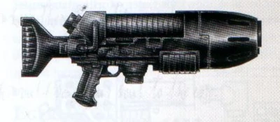

<!-- A1294-B0099 -->

原译文

Mezoa Pattern Plasma Gun 梅佐亚型等离子枪

**校订译文**

Mezoa Pattern Plasma Gun 梅佐亚型等离子枪

<!-- /A1294-B0099 -->

<!-- A1294-B0100 -->
### Nihilus Pattern Plasma Gun 虚无型等离子枪

<!-- /A1294-B0100 -->

<!-- A1294-B0101 -->
**英文原文**

The Nihilus Pattern Plasma Gun is used by House Van Saar of Necromunda.

<!-- /A1294-B0101 -->

<!-- A1294-B0102 -->

原译文

虚无型等离子枪由涅克罗蒙达的凡萨尔家族使用。

**校订译文**

虚无型等离子枪由涅克罗蒙达的凡·萨尔家族使用。

<!-- /A1294-B0102 -->

<!-- A1294-B0103 图片 -->
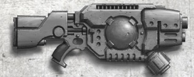

<!-- A1294-B0104 -->

原译文

Nihilus Pattern Plasma Gun 虚无型等离子枪

**校订译文**

Nihilus Pattern Plasma Gun 虚无型等离子枪

<!-- /A1294-B0104 -->

<!-- A1294-B0105 -->
### Plasma Carbine 等离子卡宾枪

<!-- /A1294-B0105 -->

<!-- A1294-B0106 -->
**英文原文**

Compact version of the Plasma Gun used by airborne Tempestus Aquilons.

<!-- /A1294-B0106 -->

<!-- A1294-B0107 -->

原译文

空降暴风天鹰使用的等离子枪的紧凑型版本。

**校订译文**

这是等离子枪的紧凑型版本，由执行空降任务的风暴天鹰使用。

<!-- /A1294-B0107 -->

<!-- A1294-B0108 图片 -->
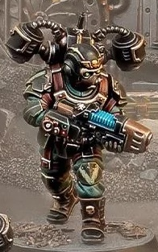

<!-- A1294-B0109 -->

原译文

Tempestus Aquilon with Plasma Carbine 暴风天鹰装备等离子卡宾枪

**校订译文**

Tempestus Aquilon with Plasma Carbine 装备等离子卡宾枪的风暴天鹰

<!-- /A1294-B0109 -->

<!-- A1294-B0110 -->
### Quinspirus Pattern 昆斯皮鲁斯型

<!-- /A1294-B0110 -->

<!-- A1294-B0111 -->
**英文原文**

The Quinspirus Pattern Plasma Gun is used by House Orlock of Necromunda

<!-- /A1294-B0111 -->

<!-- A1294-B0112 -->

原译文

涅克罗蒙达的欧洛克家族使用的昆斯皮鲁斯型等离子枪

**校订译文**

昆斯皮鲁斯型等离子枪由涅克罗蒙达的欧洛克家族使用。

<!-- /A1294-B0112 -->

<!-- A1294-B0113 图片 -->
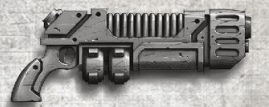

<!-- A1294-B0114 -->

原译文

Quinspirus Pattern 昆斯皮鲁斯型

**校订译文**

Quinspirus Pattern 昆斯皮鲁斯型

<!-- /A1294-B0114 -->

<!-- A1294-B0115 -->
## Ragefire Pattern 怒火型

<!-- /A1294-B0115 -->

<!-- A1294-B0116 -->
**英文原文**

The most common model of this uncommon technology, Ragefire pattern plasma guns are often deployed by the Adeptus Astartes in situations where raw takedown power is required against highly resistant or armoured enemies.

<!-- /A1294-B0116 -->

<!-- A1294-B0117 -->

原译文

这种不同寻常的技术最常见的型号是怒火型等离子枪，通常由阿斯塔特修会在需要对高抵抗力或装甲敌人进行原始打击的情况下部署。

**校订译文**

怒火型是这类罕见武器中最常见的型号。阿斯塔特修会需要以强大火力击倒生命力顽强或装甲厚重的敌人时，往往会使用它。

<!-- /A1294-B0117 -->

<!-- A1294-B0118 图片 -->
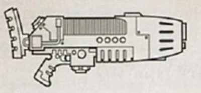

<!-- A1294-B0119 -->

原译文

Ragefire pattern 怒火型

**校订译文**

Ragefire pattern 怒火型

<!-- /A1294-B0119 -->

<!-- A1294-B0120 -->

原译文

MK II Ragefire Pattern MK.II怒火型

**校订译文**

MK II Ragefire Pattern MK.II怒火型

<!-- /A1294-B0120 -->

<!-- A1294-B0121 -->
**英文原文**

The MK II Ragefire Pattern is a pattern that was used by the Raptors Space Marine chapter during the Badab War.

<!-- /A1294-B0121 -->

<!-- A1294-B0122 -->

原译文

MK.II怒火型是巴达布战争期间猛禽星际战士使用的一种型号。

**校订译文**

MK.II怒火型是巴达布战争期间猛禽星际战士使用的一种型号。

<!-- /A1294-B0122 -->

<!-- A1294-B0123 图片 -->
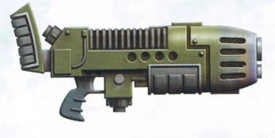

<!-- A1294-B0124 -->

原译文

MK II Ragefire Pattern MK.II怒火型

**校订译文**

MK II Ragefire Pattern MK.II怒火型

<!-- /A1294-B0124 -->

<!-- A1294-B0125 -->

原译文

MK XII Ragefire Pattern MK.XII怒火型

**校订译文**

MK XII Ragefire Pattern MK.XII怒火型

<!-- /A1294-B0125 -->

<!-- A1294-B0126 -->
**英文原文**

The MK XII Ragefire is a common plasma gun pattern used by the Adeptus Astartes, with it being found in the armories of many chapters. It is capable of holding up to 100 shots before needing to reload, firing up to 16 shots before overheating, would refuse to fire once overheated (to prevent explosive weapon failure), and could be manually vented to release heat build up. When overcharged this pattern loses effective range and ammo efficiency, but the plasma bolt fired is hotter and causes a damaging explosion upon impacting the target.

<!-- /A1294-B0126 -->

<!-- A1294-B0127 -->

原译文

MK.XII 怒火是阿斯塔特修会使用的常见等离子枪型号，在许多战团的军械库中都有发现。它能够在需要重新装弹之前最多容纳100发子弹，在过热之前最多发射16发子弹，一旦过热就会拒绝发射（以防止爆炸性武器故障），并且可以手动通风以释放积聚的热量。当过度充能时，这种型号会失去有效射程和弹药效能，但发射的等离子会更热，并在撞击目标时造成破坏性爆炸。

**校订译文**

Mk.XII 怒火型是阿斯塔特修会常用的等离子枪，许多战团的军械库中都有收藏。一次补充燃料最多可供射击100次，连续射击16次后便会过热；过热时，它会停止开火，以防武器爆炸，也可手动排热。切换至过载模式后，有效射程和燃料利用率都会下降，但射出的等离子团温度更高，命中目标时会猛烈爆炸。

**校注：** 本型号的射击次数与常规型号不同，沿英文保留，不以通用描述改写。

<!-- /A1294-B0127 -->

<!-- A1294-B0128 图片 -->
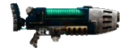

<!-- A1294-B0129 -->

原译文

MK XII Ragefire Pattern MK.XII怒火型

**校订译文**

MK XII Ragefire Pattern MK.XII怒火型

<!-- /A1294-B0129 -->

<!-- A1294-B0130 -->
### Ryza Thunderbolt Pattern 瑞扎霹雳型

<!-- /A1294-B0130 -->

<!-- A1294-B0131 -->
**英文原文**

Used by the Legio Astartes during the Great Crusade and Horus Heresy.

<!-- /A1294-B0131 -->

<!-- A1294-B0132 -->

原译文

在大远征和荷鲁斯叛乱期间，阿斯塔特军团使用。

**校订译文**

大远征和荷鲁斯之乱期间，阿斯塔特军团曾使用这一型号。

<!-- /A1294-B0132 -->

<!-- A1294-B0133 图片 -->
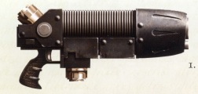

<!-- A1294-B0134 -->

原译文

Ryza Thunderbolt Pattern 瑞扎霹雳型

**校订译文**

Ryza Thunderbolt Pattern 瑞扎霹雳型

<!-- /A1294-B0134 -->

<!-- A1294-B0135 -->
### Sequana Sub-Type 赛奎安娜子型

<!-- /A1294-B0135 -->

<!-- A1294-B0136 -->
**英文原文**

Used by House Escher of Necromunda.

<!-- /A1294-B0136 -->

<!-- A1294-B0137 -->

原译文

由涅克罗蒙达的埃舍尔家族使用。

**校订译文**

由涅克罗蒙达的埃舍尔家族使用。

<!-- /A1294-B0137 -->

<!-- A1294-B0138 图片 -->
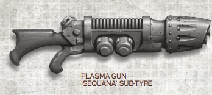

<!-- A1294-B0139 -->

原译文

Sequana Plasma Gun 赛奎安娜等离子枪

**校订译文**

Sequana Plasma Gun 赛奎安娜等离子枪

<!-- /A1294-B0139 -->

<!-- A1294-B0140 -->

原译文

MK VI Sunwolf Pattern MK.VI日狼型

**校订译文**

MK VI Sunwolf Pattern MK.VI日狼型

<!-- /A1294-B0140 -->

<!-- A1294-B0141 -->
**英文原文**

Plasma Guns and the blazing bolts of energy they fire are very popular with the Space Wolves, who as mortals revered the sun just as much as the moon, and take any excuse to grant the foe the searing kiss of the Wolf's Eye.

<!-- /A1294-B0141 -->

<!-- A1294-B0142 -->

原译文

等离子枪及其发射的炽热能量在太空野狼中非常受欢迎，作为凡人，他们像尊重月亮一样尊重太阳，并不惜一切理由给予敌人狼之眼的灼热之吻。

**校订译文**

太空野狼十分喜爱等离子枪及其射出的炽烈能量团。他们尚为凡人时，对太阳与月亮同样敬畏，成为星际战士后仍总想找机会，让敌人尝尝“狼之眼”的灼热之吻。

<!-- /A1294-B0142 -->

<!-- A1294-B0143 图片 -->
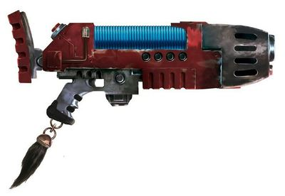

<!-- A1294-B0144 -->

原译文

MK VI Sunwolf Pattern MK.VI日狼型

**校订译文**

MK VI Sunwolf Pattern MK.VI日狼型

<!-- /A1294-B0144 -->

<!-- A1294-B0145 -->
## Squat Plasma Gun Patterns 矮人等离子枪型号

<!-- /A1294-B0145 -->

<!-- A1294-B0146 -->
### Etacarn Plasma Gun 埃特卡恩等离子枪

<!-- /A1294-B0146 -->

<!-- A1294-B0147 -->
**英文原文**

The Etacarn Plasma Gun is a Leagues of Votann plasma weapon that has superior performance to its Imperial counterpart.

<!-- /A1294-B0147 -->

<!-- A1294-B0148 -->

原译文

埃特卡恩等离子枪是沃坦联盟的等离子武器，其性能优于帝国同行。

**校订译文**

埃特卡恩等离子枪是沃坦联盟的等离子武器，性能优于帝国的同类产品。

<!-- /A1294-B0148 -->

<!-- A1294-B0149 图片 -->
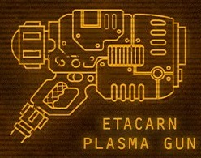

<!-- A1294-B0150 -->

原译文

Etacarn Plasma Gun 埃特卡恩等离子枪

**校订译文**

Etacarn Plasma Gun 埃特卡恩等离子枪

<!-- /A1294-B0150 -->

<!-- A1294-B0151 -->
### Etacarn Plasma Beamer 埃特卡恩等离子光束枪

<!-- /A1294-B0151 -->

<!-- A1294-B0152 -->
## Variants 变体

<!-- /A1294-B0152 -->

<!-- A1294-B0153 -->
### Plasma Blaster 等离子爆破枪

<!-- /A1294-B0153 -->

<!-- A1294-B0154 -->
**英文原文**

A unique variant crafted as a combi-weapon, it incorporates two plasma guns which, when fired together, give twice the effective damage, but also at a higher risk to the user. The guns share the same fuel canisters, lowering the weight of the weapon but keeping the number of shots it can fire to roughly the same as a regular plasma gun.

<!-- /A1294-B0154 -->

<!-- A1294-B0155 -->

原译文

作为一种独特的复合武器，它结合了两支等离子枪，当它们一起发射时，会造成两倍的有效伤害，但对使用者来说风险更高。这些枪共用相同的燃料罐，降低了武器的重量，但使其可以发射的子弹数与普通等离子枪大致相同。

**校订译文**

等离子爆破枪是由两支等离子枪组合而成的独特复合武器。两枪同时开火时，杀伤效果翻倍，使用风险也随之增加。它们共用燃料罐，以减轻重量，但可射击的次数仍与普通等离子枪大致相同。

<!-- /A1294-B0155 -->

<!-- A1294-B0156 图片 -->
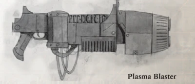

<!-- A1294-B0157 -->

原译文

Plasma Blaster 等离子爆破枪

**校订译文**

Plasma Blaster 等离子爆破枪

<!-- /A1294-B0157 -->

<!-- A1294-B0158 -->
### Ryza Hellshot Plasma Blaster 瑞扎地狱射击等离子爆破枪

<!-- /A1294-B0158 -->

<!-- A1294-B0159 -->
**英文原文**

The Ryza 'Hellshot' Pattern Plasma Blaster was available for personal requisition by Legio Astartes during the Great Crusade.

<!-- /A1294-B0159 -->

<!-- A1294-B0160 -->

原译文

在大远征期间，阿斯塔特军团可以个人征用瑞扎“地狱射击”型等离子爆破枪。

**校订译文**

大远征期间，阿斯塔特军团成员可为个人申领瑞扎“地狱射击”型等离子爆破枪。

<!-- /A1294-B0160 -->

<!-- A1294-B0161 图片 -->
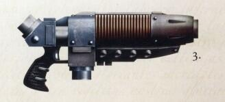

<!-- A1294-B0162 -->

原译文

Ryza Hellshot Plasma Blaster 瑞扎地狱射击等离子爆破枪

**校订译文**

Ryza Hellshot Plasma Blaster 瑞扎地狱射击等离子爆破枪

<!-- /A1294-B0162 -->

<!-- A1294-B0163 -->

原译文

MK III Belisarius Pattern Plasma Incinerator MK.III贝利撒留型等离子焚化者

**校订译文**

MK III Belisarius Pattern Plasma Incinerator Mk.III 贝利萨留斯型等离子焚化枪

<!-- /A1294-B0163 -->

<!-- A1294-B0164 -->
**英文原文**

Developed by Magos Belisarius Cawl, it is a refinement of the older plasma gun design and the most advanced of its kind in the Imperial arsenal. The Plasma Incinerator fires a potent armour-melting blast with no risk of overload, though safety can not be assured when it is fired on an overloaded charge setting. The plasma incinerator comes in multiple variants of its own.

<!-- /A1294-B0164 -->

<!-- A1294-B0165 -->

原译文

由贤者贝利撒留·考尔开发，它是对旧等离子枪设计的改进，是帝国军械库中同类产品中最先进的。等离子焚化者能够发射强大的熔甲爆炸，没有过载的风险，尽管在过载装药设置下发射时无法保证安全。等离子焚化者有多种变体。

**校订译文**

等离子焚化枪由贤者贝利萨留斯·考尔在旧式等离子枪基础上改进而来，是帝国军械库中最先进的同类武器。正常射击时，它能释放足以熔穿装甲的强大能量而没有过载风险；但在过载充能模式下，仍无法保证安全。等离子焚化枪本身也有多种改型。

<!-- /A1294-B0165 -->

<!-- A1294-B0166 图片 -->
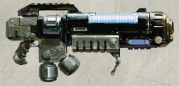

<!-- A1294-B0167 -->

原译文

MK III Belisarius Pattern Plasma Incinerator MK.III贝利撒留型等离子焚化者

**校订译文**

MK III Belisarius Pattern Plasma Incinerator Mk.III 贝利萨留斯型等离子焚化枪

<!-- /A1294-B0167 -->

<!-- A1294-B0168 -->
### Barrage Plasma Gun 弹幕等离子枪

<!-- /A1294-B0168 -->

<!-- A1294-B0169 -->
**英文原文**

Barrage Plasma Guns are rare and venerated Plasma Weapons, jealously guarded by the Techmarines of the Jericho Reach Deathwatch, and issued only to the most honoured Space Marines.

<!-- /A1294-B0169 -->

<!-- A1294-B0170 -->

原译文

弹幕等离子枪是一种罕见而受人尊敬的等离子武器，由杰里科到达死亡守望的技术军士小心翼翼地守卫，只发放给最受尊敬的星际战士。

**校订译文**

弹幕等离子枪是罕见而备受尊崇的等离子武器，由杰里科疆域死亡守望的科技战士严加保管，只配发给功勋最为卓著的星际战士。

<!-- /A1294-B0170 -->

<!-- A1294-B0171 -->
### Plasma Repeater 等离子连射枪

原题：Plasma Repeater 等离子收割者

<!-- /A1294-B0171 -->

<!-- A1294-B0172 -->
**英文原文**

A double-barrelled, fully automatic, short ranged, plasma weapon. Developed during the Age of Strife and sanctioned for use only by the Dark Angels during the Great Crusade and Horus Heresy.

<!-- /A1294-B0172 -->

<!-- A1294-B0173 -->

原译文

一种双管、全自动、短程等离子武器。在纷争时代开发，仅在大远征和荷鲁斯叛乱期间被黑暗天使批准使用。

**校订译文**

这是一种双管、全自动、短射程的等离子武器，研制于纷争时代。在大远征和荷鲁斯之乱期间，仅获准供黑暗天使使用。

<!-- /A1294-B0173 -->

<!-- A1294-B0174 -->
### Phased Plasma Rifle 相位等离子步枪

<!-- /A1294-B0174 -->

<!-- A1294-B0175 -->
**英文原文**

One of the more dangerous special issue weapons within the Crimson Guard, the Phased Plasma Rifle foes away with many of the drawbacks common to Imperial plasma weaponry, all but eliminating the need for recharging, and significantly reducing the excess heat that conventional plasma weapons tend to generate. This technology is guarded jealously, and since it was rediscovered the Tech-Priests of the Lathes have refused any attempts to adapt the technology for more general use. From their perspective, the Phased Plasma Rifle is a weapon of purity, and to change it in any way would defile the machine-spirits that drive each weapon. With the Adeptus Mechanicus' glacial opinion unlikely to change, this weapon will remain only within the hands of the Crimson Guard.

<!-- /A1294-B0175 -->

<!-- A1294-B0176 -->

原译文

相位等离子步枪是绯红守卫中较为危险的特殊武器之一，它消除了帝国等离子武器的许多常见缺点，几乎消除了换弹的需要，并大大减少了传统等离子武器产生的多余热量。这项技术被小心翼翼地保护着，自从它被重新发现以来，拉塞斯的技术神甫们拒绝了任何将这项技术应用于更广泛用途的尝试。在他们看来，相位等离子步枪是一种纯净的武器，以任何方式改变它都会玷污驱动每件武器的机魂。由于机械神教的冷酷观点不太可能改变，这种武器将只掌握在绯红守卫手中。

**校订译文**

相位等离子步枪是绯红守卫威力较大的特种配发武器之一。它克服了帝国等离子武器的许多常见缺点，几乎无须停下来补能，也大幅减少了常规武器产生的多余热量。自这项技术被重新发现以来，拉特诸世界的技术祭司便一直严守秘密，拒绝将其改造后推广使用。在他们看来，这是一种纯净的武器，任何改动都会亵渎驱动它的机魂。机械修会的僵硬立场看来不会改变，因此相位等离子步枪仍将只由绯红守卫使用。

**校注：** recharging指重新充能，不是重新装填；英文foes away为does away的笔误，译文按语义修正。 此处Crimson Guard为拉特诸世界部队，暂沿绯红守卫，与225篇同名星际战士战团深红守卫分开。

<!-- /A1294-B0176 -->

<!-- A1294-B0177 -->
### Selvanus Pattern “Sentinel” Plasma Rifle 塞尔瓦努斯型“哨兵”等离子步枪

<!-- /A1294-B0177 -->

<!-- A1294-B0178 -->
**英文原文**

A Cerix Magnus design perfected by the dogmatic scrutiny of Selvanus Binary, the Sentinel pulse rilfe eliminates the usual drawbacks of plasma weaponry by changing the nature of the energy discharge, through smaller pulses rather than large bolts. This pattern also includes a higher rate of fire and a better targeting system. Designed in tandem with the Praetor Armour of the Ebon Guard, Askellian collectors go to great lengths to acquire one.

<!-- /A1294-B0178 -->

<!-- A1294-B0179 -->

原译文

哨兵脉冲步枪是塞里克斯·马格努斯的设计，经过塞尔瓦努斯的教条式二进制审查而完善，通过改变能量放电的性质，通过较小的脉冲而不是大型爆矢，消除了等离子武器的常见缺点。这种型号还包括更高的射速和更好的瞄准系统。与乌木守卫的执政官盔甲协同设计，阿斯凯利安收藏家不遗余力地获得一个。

**校订译文**

“哨兵”源自塞里克斯·马格努斯的设计，经塞尔瓦努斯双星严格依照教条审验后完善。它改变了能量释放方式，以较小的脉冲取代大团等离子体，从而消除等离子武器的常见缺点，同时提高射速并改进瞄准系统。这款武器与乌木守卫的执政官装甲配套设计，阿斯凯隆星区的收藏家往往不惜代价也要弄到一把。

**校注：** Selvanus Binary为专名中的双星，不是二进制审查；英文pulse rifle在等离子步枪条目中使用，保留来源差异，不据此改成钛族脉冲武器。

<!-- /A1294-B0179 -->

<!-- A1294-B0180 -->
## Notable plasma guns 著名等离子枪

<!-- /A1294-B0180 -->

<!-- A1294-B0181 -->
**英文原文**

Blasphemy of the Mechanicus — Blood Ravens.

<!-- /A1294-B0181 -->

<!-- A1294-B0182 -->

原译文

机械教的亵渎 — 血鸦。

**校订译文**

机械教的亵渎 — 血鸦。

<!-- /A1294-B0182 -->

<!-- A1294-B0183 -->
**英文原文**

Blaze of Retribution — Blood Ravens.

<!-- /A1294-B0183 -->

<!-- A1294-B0184 -->

原译文

天罚之火 — 血鸦

**校订译文**

天罚之火 — 血鸦

<!-- /A1294-B0184 -->

<!-- A1294-B0185 -->
**英文原文**

Blazing Light of Truth — Blood Ravens.

<!-- /A1294-B0185 -->

<!-- A1294-B0186 -->

原译文

闪耀真理之光 — 血鸦。

**校订译文**

闪耀真理之光 — 血鸦。

<!-- /A1294-B0186 -->

<!-- A1294-B0187 -->
**英文原文**

Fearsome Light of Faith — Blood Ravens.

<!-- /A1294-B0187 -->

<!-- A1294-B0188 -->

原译文

信仰恐惧之光 — 血鸦。

**校订译文**

信仰威光——血鸦。

<!-- /A1294-B0188 -->

<!-- A1294-B0189 -->
**英文原文**

Jupiter Thunder — Blood Ravens.

<!-- /A1294-B0189 -->

<!-- A1294-B0190 -->

原译文

木星雷霆 — 血鸦。

**校订译文**

木星雷霆 — 血鸦。

<!-- /A1294-B0190 -->

<!-- A1294-B0191 -->
**英文原文**

Lamentation of Heretics — Blood Ravens.

<!-- /A1294-B0191 -->

<!-- A1294-B0192 -->

原译文

异端哀悼 — 血鸦。

**校订译文**

异端哀号——血鸦。

<!-- /A1294-B0192 -->

<!-- A1294-B0193 -->
**英文原文**

Light of Salvation — Blood Ravens.

<!-- /A1294-B0193 -->

<!-- A1294-B0194 -->

原译文

救赎之光 — 血鸦。

**校订译文**

救赎之光 — 血鸦。

<!-- /A1294-B0194 -->

<!-- A1294-B0195 -->
**英文原文**

Plasma Gun 438 — Deathwatch.

<!-- /A1294-B0195 -->

<!-- A1294-B0196 -->

原译文

等离子枪438 — 死亡守望。

**校订译文**

等离子枪438 — 死亡守望。

<!-- /A1294-B0196 -->

<!-- A1294-B0197 -->
**英文原文**

Purifier of Tombs — Blood Ravens.

<!-- /A1294-B0197 -->

<!-- A1294-B0198 -->

原译文

墓穴净化者 — 血鸦。

**校订译文**

墓穴净化者 — 血鸦。

<!-- /A1294-B0198 -->

<!-- A1294-B0199 -->
**英文原文**

Scourging Fury — Blood Ravens.

<!-- /A1294-B0199 -->

<!-- A1294-B0200 -->

原译文

狂怒鞭挞 — 血鸦。

**校订译文**

狂怒鞭挞 — 血鸦。

<!-- /A1294-B0200 -->

<!-- A1294-B0201 -->
**英文原文**

Searing Plasma Gun — Blood Ravens.

<!-- /A1294-B0201 -->

<!-- A1294-B0202 -->

原译文

灼热等离子枪 — 血鸦。

**校订译文**

灼热等离子枪 — 血鸦。

<!-- /A1294-B0202 -->

本篇核心术语与暂定项

以下列出本篇出现的英文原形及核心术语表用词。同形词可能指不同对象，具体词义以本篇正文和校注为准；单复数、别名和仅见于图注的名称可能尚未列入。完整候选见[术语表](../../术语表/双语术语候选.csv)。

| 英文 | 采用中文 | 状态 |
| --- | --- | --- |
| Space Marines | 星际战士 | 官方已核对 |
| Adeptus Astartes | 阿斯塔特修会 | 官方已核对 |
| Blood Angels | 圣血天使 | 官方已核对 |
| Dark Angels | 黑暗天使 | 官方已核对 |
| Deathwatch | 死亡守望 | 官方已核对 |
| Space Wolves | 太空野狼 | 官方已核对 |
| Adeptus Mechanicus | 机械修会 | 官方已核对 |
| Astra Militarum | 星界军 | 官方已核对 |
| Imperial Guard | 帝国卫队 | 暂定·语境区分 |
| Leagues of Votann | 沃坦联盟 | 官方已核对 |
| Horus Heresy | 荷鲁斯之乱 | 官方已核对 |
| Imperium of Man | 人类帝国 | 官方已核对 |
| Imperium | 帝国 | 暂定·简称 |
| Tech-Priest | 技术祭司 | 官方已核对 |
| Dark Age of Technology | 黑暗科技时代 | 暂定 |
| Equipment | 装备 | 编辑用语已统一 |
| Blood Ravens | 血鸦 | 暂定 |
| Techmarine | 科技战士 | 官方已核对 |
| Necromunda | 涅克罗蒙达 | 暂定·官方待核 |
| House Van Saar | 凡·萨尔家族 | 暂定·官方待核 |
| House Escher | 埃舍尔家族 | 暂定·官方待核 |
| Great Crusade | 大远征 | 暂定·官方待核 |
| Age of Strife | 纷争时代 | 暂定·官方待核 |
| Horus | 荷鲁斯 | 暂定·官方待核 |
| Hellshot | 地狱枪 | 暂定·官方待核 |
| Imperial Creed | 帝国教义 | 暂定·官方待核 |
| Sector | 星区 | 暂定·官方待核 |
| Salamanders | 火蜥蜴 | 暂定·官方待核 |
| Badab | 巴达布 | 暂定·官方待核 |
| Mars | 火星 | 暂定·官方待核 |
| Jupiter | 木星 | 暂定·官方待核 |
| Ryza | 瑞扎 | 暂定·官方待核 |
| Mezoa | 梅佐亚 | 暂定·官方待核 |
| Baal | 巴尔 | 暂定·官方待核 |
| Tech | 技术语 | 暂定·官方待核 |
| Master | 导师（审判庭职衔）／舰务官（舰员职务） | 语境定译·官方待核 |
| Plasma Incinerator | 等离子焚化枪 | 暂定·官方待核 |
| Ancient | 旗手 | 官方已核对 |
| Belisarius Cawl | 贝利萨留斯·考尔 | 官方已核对 |
| Praetor | 执政官 | 暂定·官方待核 |
| Power Armour | 动力盔甲 | 暂定·官方待核 |
| Space Marine | 星际战士 | 暂定·官方待核 |
| Chapter | 战团 | 暂定·官方待核 |
| Captain | 连长 | 暂定·官方待核 |
| Sergeant | 军士 | 暂定·官方待核 |
| Brother | 修士 | 暂定·官方待核 |
| Red Scorpions | 红蝎 | 暂定·官方待核 |
| Raptors | 猛禽 | 暂定·官方待核 |
| Crimson Guard | 深红守卫 | 暂定·官方待核 |
| Armsmen | 武装水手 | 暂定·官方待核 |
| Brother-Captain | 兄弟会连长（灰骑士）／兄弟连长（通称） | 语境定译·灰骑士职衔官译已核 |
| Cadian Shock Troops | 卡迪亚突击军 | 官方已核对 |
| Death Korps of Krieg | 克里格死亡军团 | 官方已核对 |
| Jericho Reach | 杰里科疆域 | 暂定·官方待核 |
| Reavers | 劫掠者 | 官方已核对 |
| Rafen | 拉芬 | 暂定·官方待核 |
| Incinerator | 焚化枪 | 暂定·官方待核 |
| The Weapon | 武器 | 暂定·官方待核 |
| Gun | 甘 | 暂定·官方待核 |
| The Dark | 《黑暗》 | 暂定·官方待核 |
| The Blood | 鲜血 | 暂定·官方待核 |
| Ragefire | 愤怒之火 | 暂定·官方待核 |
| System | 星系（恒星系统） | 暂定·官方待核 |
| Calixis Sector | 卡利西斯星区 | 暂定·官方待核 |
| Krieg | 克里格 | 暂定·官方待核 |
| The Lathes | 拉特诸世界 | 暂定·官方待核 |
| Accatran | 阿卡特兰 | 暂定·官方待核 |
| Combi-weapon | 复合武器 | 暂定·官方待核 |
| Plasma Blaster | 等离子爆破枪 | 暂定·官方待核 |
| Bolt | 爆矢 | 暂定·官方待核 |
| Plasma Weapons | 等离子武器 | 暂定·官方待核 |
| Orpheus Sector | 俄耳甫斯星区 | 暂定·官方待核 |
| Tempestus Aquilons | 风暴天鹰 | 官方已核对 |
| Plasma Weapon | 等离子武器 | 暂定·官方待核 |
| Plasma Rifle | 等离子步枪 | 暂定·官方待核 |
| Etacarn Plasma Gun | 埃特卡恩等离子枪 | 暂定·官方待核 |
| Thamyris Taskforce | 塔米里斯特遣队 | 暂定·官方待核 |
| Asandre | 阿桑德雷 | 暂定·官方待核 |
| Jollus Marquette | 乔卢斯·马奎特 | 暂定·官方待核 |
| Clovis Munitorum | 克洛维斯军械机构 | 暂定·官方待核 |
| Aryon | 阿瑞昂 | 暂定·官方待核 |
| Gantic Pattern Plasma Gun | 甘提克型等离子枪 | 暂定·官方待核 |
| Magnacore Pattern | 巨核型 | 暂定·官方待核 |
| Meritates Uprising | 梅里塔特斯叛乱 | 暂定·官方待核 |
| Meritech Clans | 梅里泰克氏族 | 暂定·官方待核 |
| Nihilus Pattern Plasma Gun | 虚无型等离子枪 | 暂定·官方待核 |
| Quinspirus Pattern | 昆斯皮鲁斯型 | 暂定·官方待核 |
| Ragefire Pattern | 怒火型 | 暂定·官方待核 |
| Phased Plasma Rifle | 相位等离子步枪 | 暂定·官方待核 |
| Selvanus Binary | 塞尔瓦努斯双星 | 暂定·官方待核 |
| Cerix Magnus | 塞里克斯·马格努斯 | 暂定·官方待核 |
| Ebon Guard | 乌木守卫 | 暂定·官方待核 |
| Praetor Armour | 执政官装甲 | 暂定·官方待核 |
| Fearsome Light of Faith | 信仰威光 | 暂定·官方待核 |
| Lamentation of Heretics | 异端哀号 | 暂定·官方待核 |
| Plasma gun | 等离子枪 | 官方已核对 |
| Power weapon | 动力武器 | 官方已核对 |
| House Orlock | 欧洛克家族 | 暂定·官方待核 |
| Elysian Drop Troops | 艾丽西亚空降兵 | 暂定·官方待核 |

