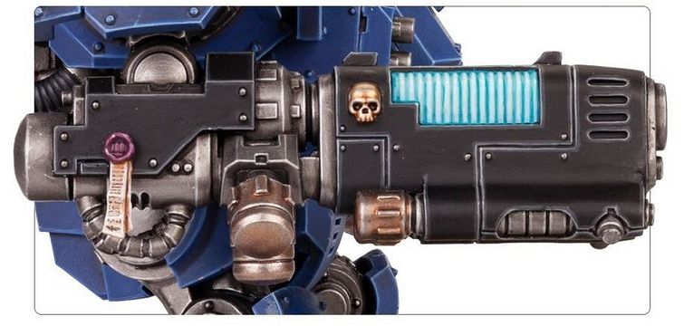

# 1295 等离子焚化枪 Plasma Incinerator

精校状态：中文行文已逐段精校，部分术语仍为暂定

分类：武器 / 远程武器

原文来源：https://www.bilibili.com/opus/1001020438514499592

原作者：帝国神选罐头

原文时间：2024年11月18日 13:10

[返回分类目录](目录.md) · [全书目录](../../目录.md)

<!-- A1295-B0001 -->
**英文原文**

The Mk.III Belisarius-pattern Plasma Incinerator is a type of Plasma Gun used by the Primaris Space Marines.

<!-- /A1295-B0001 -->

<!-- A1295-B0002 -->

原译文

Mk.III 贝利撒留型等离子焚化者是原铸星际战士使用的一种等离子枪。

**校订译文**

Mk.III 贝利萨留斯型等离子焚化枪是原铸星际战士使用的一种等离子枪。

<!-- /A1295-B0002 -->

<!-- A1295-B0003 -->
## Overview 概述

<!-- /A1295-B0003 -->

<!-- A1295-B0004 -->
**英文原文**

Developed by Magos Belisarius Cawl, it is a refinement of the older Plasma Gun design and the most advanced of its kind in the Imperial arsenal. The Plasma Incinerator fires a potent armour-melting blast with no risk of overload, though safety cannot be assured when it is fired on an overloaded charge setting.

<!-- /A1295-B0004 -->

<!-- A1295-B0005 -->

原译文

由贤者贝利撒留·考尔开发，它是对旧等离子枪设计的改进，是帝国军械库中同类产品中最先进的。等离子焚化者能够发射强大的熔甲爆炸，没有过载的风险，尽管在过载装药设置下发射时无法保证安全。

**校订译文**

等离子焚化枪由贤者贝利萨留斯·考尔在旧式等离子枪基础上改进而来，是帝国军械库中最先进的同类武器。正常射击时，它能释放足以熔穿装甲的强大能量而没有过载风险；但在过载充能模式下，仍无法保证安全。

<!-- /A1295-B0005 -->

<!-- A1295-B0006 图片 -->

<!-- A1295-B0007 -->

原译文

Plasma Incinerator 等离子焚化者

**校订译文**

Plasma Incinerator 等离子焚化枪

<!-- /A1295-B0007 -->

<!-- A1295-B0008 -->
**英文原文**

Plasma Incinerators are typically wielded by Hellblaster Squads.

<!-- /A1295-B0008 -->

<!-- A1295-B0009 -->

原译文

等离子焚化者通常由地狱轰击者小队使用。

**校订译文**

等离子焚化枪通常由地狱轰击者小队使用。

<!-- /A1295-B0009 -->

<!-- A1295-B0010 -->
## Variants 变体

<!-- /A1295-B0010 -->

<!-- A1295-B0011 -->
**英文原文**

Plasma Exterminator — Handheld pistol version.

<!-- /A1295-B0011 -->

<!-- A1295-B0012 -->

原译文

等离子歼灭者 — 手持式手枪版本。

**校订译文**

等离子灭绝枪——便于单手持用的手枪版本。

<!-- /A1295-B0012 -->

<!-- A1295-B0013 -->
**英文原文**

Assault Plasma Incinerator — Features additional targeting arrays.

<!-- /A1295-B0013 -->

<!-- A1295-B0014 -->

原译文

突击等离子焚化者 — 配备额外的瞄准阵列。

**校订译文**

突击等离子焚化枪——配有额外的瞄准阵列。

<!-- /A1295-B0014 -->

<!-- A1295-B0015 图片 -->

<!-- A1295-B0016 -->

原译文

Assault Plasma Incinerator 突击等离子焚化者

**校订译文**

Assault Plasma Incinerator 突击等离子焚化枪

<!-- /A1295-B0016 -->

<!-- A1295-B0017 -->
**英文原文**

Heavy Plasma Incinerator — Larger infantry-portable version that features a power backpack.

<!-- /A1295-B0017 -->

<!-- A1295-B0018 -->

原译文

重型等离子焚化者 — 更大的步兵便携式版本，配有动力背包。

**校订译文**

重型等离子焚化枪——尺寸更大的步兵携行版本，配有供能背包。

<!-- /A1295-B0018 -->

<!-- A1295-B0019 图片 -->

<!-- A1295-B0020 -->

原译文

Heavy Plasma Incinerator 重型等离子焚化者

**校订译文**

Heavy Plasma Incinerator 重型等离子焚化枪

<!-- /A1295-B0020 -->

<!-- A1295-B0021 -->
**英文原文**

Macro Plasma Incinerator — Heaviest type used by Redemptor Dreadnoughts and Repulsor Executioners.

<!-- /A1295-B0021 -->

<!-- A1295-B0022 -->

原译文

巨型等离子焚化炮 — 救赎者无畏和处决反击者使用的最重类型。

**校订译文**

巨型等离子焚化炮——最大的型号，由救赎者无畏机甲和处决者型反重力战车使用。

<!-- /A1295-B0022 -->

<!-- A1295-B0023 图片 -->

<!-- A1295-B0024 -->

原译文

Macro Plasma Incinerator 巨型等离子焚化炮

**校订译文**

Macro Plasma Incinerator 巨型等离子焚化炮

<!-- /A1295-B0024 -->

本篇核心术语与暂定项

以下列出本篇出现的英文原形及核心术语表用词。同形词可能指不同对象，具体词义以本篇正文和校注为准；单复数、别名和仅见于图注的名称可能尚未列入。完整候选见[术语表](../../术语表/双语术语候选.csv)。

| 英文 | 采用中文 | 状态 |
| --- | --- | --- |
| Space Marines | 星际战士 | 官方已核对 |
| Plasma Incinerator | 等离子焚化枪 | 暂定·官方待核 |
| Plasma Exterminator | 等离子灭绝枪 | 暂定·官方待核 |
| Belisarius Cawl | 贝利萨留斯·考尔 | 官方已核对 |
| Hellblaster | 地狱轰击者 | 暂定·官方待核 |
| Executioners | 处刑者 | 语境定译·官方待核 |
| Repulsor | 反重力战车 | 官方已核 |
| Hellblaster Squads | 地狱轰击者小队 | 暂定·官方待核 |
| Incinerator | 焚化枪 | 暂定·官方待核 |
| Gun | 甘 | 暂定·官方待核 |
| Assault Plasma Incinerator | 突击等离子焚化枪 | 暂定·官方待核 |
| Heavy Plasma Incinerator | 重型等离子焚化枪 | 暂定·官方待核 |
| Macro Plasma Incinerator | 巨型等离子焚化炮 | 暂定·官方待核 |
| Plasma gun | 等离子枪 | 官方已核对 |

