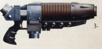

# 1296 等离子爆破枪 Plasma Blaster

精校状态：中文行文已逐段精校，部分术语仍为暂定

分类：武器 / 远程武器

原文来源：https://www.bilibili.com/opus/1009982965775597573

原作者：帝国神选罐头

原文时间：2024年12月12日 16:49

[返回分类目录](目录.md) · [全书目录](../../目录.md)

<!-- A1296-B0001 -->
**英文原文**

The Plasma Blaster is an Imperial Combi-Weapon which combines two Plasma Guns. These weapons date back to the Great Crusade era. All but unknown in the battlefields of the 41st Millennium, these weapons were more reliable than modern Plasma Guns, as plasma technology was far better understood at the dawn of the Imperium.

<!-- /A1296-B0001 -->

<!-- A1296-B0002 -->

原译文

等离子爆破枪是一种结合了两支等离子枪的帝国复合武器。这些武器可以追溯到大远征时代。在41千年的战场上，这些武器几乎不为人知，它们比现代等离子枪更可靠，因为等离子技术在帝国黎明时得到了更好的理解。

**校订译文**

等离子爆破枪是一种将两支等离子枪组合起来的帝国复合武器，可追溯至大远征时代。M41的战场上已几乎看不到它，但它比现代等离子枪更加可靠，因为帝国初创时的人类对等离子技术掌握得更充分。

<!-- /A1296-B0002 -->

<!-- A1296-B0003 图片 -->

<!-- A1296-B0004 -->

原译文

Ryza 'Hellshot' Pattern Plasma Blaster 瑞扎‘地狱射击’型等离子爆破枪

**校订译文**

Ryza 'Hellshot' Pattern Plasma Blaster 瑞扎‘地狱射击’型等离子爆破枪

<!-- /A1296-B0004 -->

<!-- A1296-B0005 -->
## Notable Users 著名使用者

<!-- /A1296-B0005 -->

<!-- A1296-B0006 -->
**英文原文**

Saul Invictus, First Captain of the Ultramarines. Died in the First Tyrannic War.

<!-- /A1296-B0006 -->

<!-- A1296-B0007 -->

原译文

索尔·英维克图斯，极限战士一连长。死于第一次泰伦战争。

**校订译文**

索尔·英维克图斯，极限战士一连长。死于第一次泰伦战争。

<!-- /A1296-B0007 -->

本篇核心术语与暂定项

以下列出本篇出现的英文原形及核心术语表用词。同形词可能指不同对象，具体词义以本篇正文和校注为准；单复数、别名和仅见于图注的名称可能尚未列入。完整候选见[术语表](../../术语表/双语术语候选.csv)。

| 英文 | 采用中文 | 状态 |
| --- | --- | --- |
| Ultramarines | 极限战士 | 官方已核对 |
| Imperium | 帝国 | 暂定·简称 |
| Great Crusade | 大远征 | 暂定·官方待核 |
| First Captain | 第一连长 | 暂定·官方待核 |
| Captain | 连长 | 暂定·官方待核 |
| Saul Invictus | 索尔·英维克图斯 | 暂定·官方待核 |
| Combi-weapon | 复合武器 | 暂定·官方待核 |
| Plasma Blaster | 等离子爆破枪 | 暂定·官方待核 |

