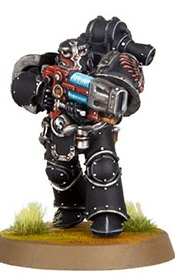

# 1298 等离子燃烧枪 Plasma Burner

精校状态：中文行文已逐段精校，部分术语仍为暂定

分类：武器 / 远程武器

原文来源：https://www.bilibili.com/opus/1009983498364125189

原作者：帝国神选罐头

原文时间：编辑于 2025年01月13日 14:56

[返回分类目录](目录.md) · [全书目录](../../目录.md)

<!-- A1298-B0001 -->
**英文原文**

Plasma Burners were a type of Plasma Weapon used by Dark Angels Interemptors during the Great Crusade and Horus Heresy.

<!-- /A1298-B0001 -->

<!-- A1298-B0002 -->

原译文

等离子燃烧枪是黑暗天使屠灭者在大远征和荷鲁斯叛乱期间使用的一种等离子武器。

**校订译文**

等离子燃烧枪是黑暗天使屠灭者在大远征和荷鲁斯之乱期间使用的一种等离子武器。

<!-- /A1298-B0002 -->

<!-- A1298-B0003 图片 -->

<!-- A1298-B0004 -->

原译文

Interemptor with a Plasma Burner 装备等离子燃烧枪的拦截者

**校订译文**

Interemptor with a Plasma Burner 装备等离子燃烧枪的屠灭者

**校注：** Interemptor统一屠灭者，与Inceptor先驱者及Interceptor拦截者区别。

<!-- /A1298-B0004 -->

<!-- A1298-B0005 -->
**英文原文**

A dangerous offshoot of more common plasma technology, Plasma Burners vented plasma gas through a magnetic bottle in high-speed jets. Any enemy caught in the path of such a jet was quickly reduced to molten slag. However, the magnetic fields that keep the superheated gas contained were fragile and emitted a radiation, and as such the average Interemptor remained combat-viable for only a few short decades before requiring augmetic replacements or Dreadnought entombment.

<!-- /A1298-B0005 -->

<!-- A1298-B0006 -->

原译文

等离子燃烧枪是更常见的等离子技术的一个危险分支，它通过磁瓶以高速射流排放等离子体。任何被这种喷射路径捕捉到的敌人，都会迅速被烧成熔融的残渣。然而，保持超高温气体的约束磁场非常脆弱，并会发出辐射。因此，普通的屠灭者通常只能在战斗中坚持几十年的时间，之后就需要进行机械增强替换或被封存在无畏机甲中。

**校订译文**

等离子燃烧枪是常规等离子技术的一个危险分支，通过磁瓶将等离子气体以高速射流喷出。喷流路径上的敌人会迅速化为熔渣。然而，用于约束过热气体的磁场并不牢固，而且会产生辐射。因此，屠灭者通常只能维持数十年的战斗能力，随后便须用机械增强体替换受损部位，或被安置进无畏机甲。

**校注：** 战斗能力可维持数十年，不是连续战斗数十年。

<!-- /A1298-B0006 -->

本篇核心术语与暂定项

以下列出本篇出现的英文原形及核心术语表用词。同形词可能指不同对象，具体词义以本篇正文和校注为准；单复数、别名和仅见于图注的名称可能尚未列入。完整候选见[术语表](../../术语表/双语术语候选.csv)。

| 英文 | 采用中文 | 状态 |
| --- | --- | --- |
| Dark Angels | 黑暗天使 | 官方已核对 |
| Horus Heresy | 荷鲁斯之乱 | 官方已核对 |
| Great Crusade | 大远征 | 暂定·官方待核 |
| Horus | 荷鲁斯 | 暂定·官方待核 |
| Interemptor | 屠灭者 | 暂定·沿用现稿 |
| Dreadnought | 无畏机甲 | 暂定·官方待核 |
| Plasma Weapon | 等离子武器 | 暂定·官方待核 |

