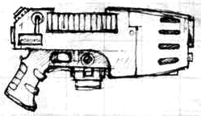
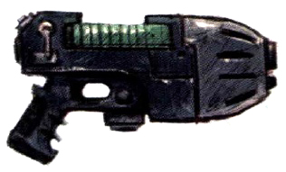
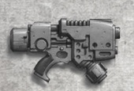
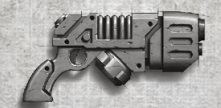
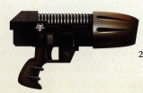
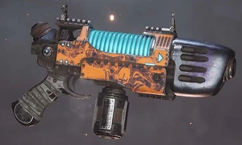
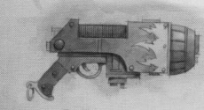
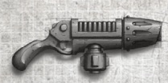
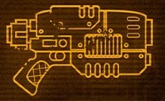

# 1299 等离子手枪 Plasma Pistol

精校状态：中文行文已逐段精校，部分术语仍为暂定

分类：武器 / 远程武器

原文来源：https://www.bilibili.com/opus/1002474589867999235

原作者：帝国神选罐头

原文时间：2024年11月22日 11:13

[返回分类目录](目录.md) · [全书目录](../../目录.md)

<!-- A1299-B0001 -->
**英文原文**

The Plasma Pistol is a smaller version of the Plasma Gun, just as dangerous as other Imperial Plasma Weapons.

<!-- /A1299-B0001 -->

<!-- A1299-B0002 -->

原译文

等离子手枪是等离子枪的较小版本，与其他帝国等离子武器一样危险。

**校订译文**

等离子手枪是等离子枪的较小版本，与其他帝国等离子武器一样危险。

<!-- /A1299-B0002 -->

<!-- A1299-B0003 图片 -->

<!-- A1299-B0004 -->

原译文

Plasma Pistol 等离子手枪

**校订译文**

Plasma Pistol 等离子手枪

<!-- /A1299-B0004 -->

<!-- A1299-B0005 -->
## Overview 概述

<!-- /A1299-B0005 -->

<!-- A1299-B0006 -->
**英文原文**

Officers favour plasma pistols for their power to neutralize heavily-armoured enemies in an easily-handled pistol configuration. As well, their rarity marks plasma pistols as icons of status that the bearer is considered important enough to have access to one. Amongst Space Marines, plasma pistols are available to Assault Squads to become more effective as tank hunters.

<!-- /A1299-B0006 -->

<!-- A1299-B0007 -->

原译文

军官们喜欢等离子手枪，因为它们能够以易于操作的手枪配置压制重甲敌人。此外，它们的稀有性标志着等离子手枪是地位的象征，持有者被认为足够重要才可以获得一把。在星际战士中，突击小队可以使用等离子手枪，使其作为坦克猎手变得更加有效。

**校订译文**

军官青睐等离子手枪，是因为它便于操作，却足以消灭重装敌人。它也因稀有而成为地位象征，表明持有者足够重要，才有资格获配一把。星际战士突击小队也可使用等离子手枪，以增强猎杀坦克的能力。

<!-- /A1299-B0007 -->

<!-- A1299-B0008 图片 -->

<!-- A1299-B0009 -->

原译文

Plasma Pistol 等离子手枪

**校订译文**

Plasma Pistol 等离子手枪

<!-- /A1299-B0009 -->

<!-- A1299-B0010 -->
## Known Plasma Pistol Patterns 已知等离子手枪型号

<!-- /A1299-B0010 -->

<!-- A1299-B0011 -->
### Helicon Pattern 赫利孔型

<!-- /A1299-B0011 -->

<!-- A1299-B0012 -->
**英文原文**

A "subatomic" plasma pistol with an effective range of 100 meters and lethal out to 200 meters. It had a capacity of ten shots with a 25.73 second recharge time between each shot. Production discontinued in 843.M41 due to a 47% increase in the overheat margin per shot past the fifth shot.

<!-- /A1299-B0012 -->

<!-- A1299-B0013 -->

原译文

一种“亚原子”等离子手枪，有效射程为100米，200米内致命。它的容量为10次射击，每次射击之间的充能时间为25.73秒。由于第五次射击后每次射击的过热额度增加了47%，于843.M41停产。

**校订译文**

一种“亚原子”等离子手枪，有效射程为100米，在200米内仍可致命。一次装填可射击十次，每次射击后需25.73秒重新充能。由于超过第五发后，每发的过热指标会增加47%，该型号于843.M41停产。

**校注：** overheat margin原文用语不够明确，暂称过热指标；不擅自将47%解释成固定爆炸概率。

<!-- /A1299-B0013 -->

<!-- A1299-B0014 -->
### Mars Pattern 火星型

<!-- /A1299-B0014 -->

<!-- A1299-B0015 -->
**英文原文**

Mars "Sunfury" pattern, used by the Novamarines and Minotaurs

<!-- /A1299-B0015 -->

<!-- A1299-B0016 -->

原译文

火星“日怒”型，由新星战士和米诺陶使用

**校订译文**

火星“日怒”型，由新星战士和米诺陶使用

<!-- /A1299-B0016 -->

<!-- A1299-B0017 -->
### Primus Pattern 首要型

<!-- /A1299-B0017 -->

<!-- A1299-B0018 -->
**英文原文**

Used by House Van Saar of Necromunda.

<!-- /A1299-B0018 -->

<!-- A1299-B0019 -->

原译文

由涅克罗蒙达的凡萨尔家族使用。

**校订译文**

由涅克罗蒙达的凡·萨尔家族使用。

<!-- /A1299-B0019 -->

<!-- A1299-B0020 图片 -->

<!-- A1299-B0021 -->

原译文

Primus Pattern 首要型

**校订译文**

Primus Pattern 首要型

<!-- /A1299-B0021 -->

<!-- A1299-B0022 -->
### Quinspirus Pattern 昆斯皮鲁斯型

<!-- /A1299-B0022 -->

<!-- A1299-B0023 -->
**英文原文**

Used by House Orlock of Necromunda.

<!-- /A1299-B0023 -->

<!-- A1299-B0024 -->

原译文

由涅克罗蒙达的欧洛克家族使用。

**校订译文**

由涅克罗蒙达的欧洛克家族使用。

<!-- /A1299-B0024 -->

<!-- A1299-B0025 图片 -->

<!-- A1299-B0026 -->

原译文

Quinspirus Pattern 昆斯皮鲁斯型

**校订译文**

Quinspirus Pattern 昆斯皮鲁斯型

<!-- /A1299-B0026 -->

<!-- A1299-B0027 -->
### Ryza Pattern 瑞扎型

<!-- /A1299-B0027 -->

<!-- A1299-B0028 -->
**英文原文**

Mk. III Ryza pattern: used by the Inquisition

<!-- /A1299-B0028 -->

<!-- A1299-B0029 -->

原译文

Mk.III 瑞扎型：审判庭使用

**校订译文**

Mk.III 瑞扎型：审判庭使用

<!-- /A1299-B0029 -->

<!-- A1299-B0030 -->
**英文原文**

Mk. V Ryza pattern: used by the Inquisition

<!-- /A1299-B0030 -->

<!-- A1299-B0031 -->

原译文

Mk.V 瑞扎型：审判庭使用

**校订译文**

Mk.V 瑞扎型：审判庭使用

<!-- /A1299-B0031 -->

<!-- A1299-B0032 -->
**英文原文**

Ryza Pattern "Wraith"- a duellist’s plasma pistol, made in limited numbers in the Calixis Sector and popular amongst the nobility there. Finely crafted (and correspondingly rare) these weapons are longer-ranged and higher-powered, but lacks s semi-automatic fire setting than Ryza’s typical plasma pistols.

<!-- /A1299-B0032 -->

<!-- A1299-B0033 -->

原译文

瑞扎型“幽灵” - 决斗者的等离子手枪，在卡利西斯星区限量生产，在那里的贵族中很受欢迎。这些武器制作精良（相对罕见），射程更远，功率更高，但比瑞扎的典型等离子手枪相比缺乏半自动火力设置。

**校订译文**

瑞扎“幽灵”型——为决斗者设计的等离子手枪，在卡利西斯星区限量制造，受到当地贵族欢迎。它做工精良，因而也相当罕见；相比瑞扎常规型号，射程更远、威力更大，却没有半自动射击模式。

<!-- /A1299-B0033 -->

<!-- A1299-B0034 -->
**英文原文**

Ryza Pattern "Sunspite" - Used during the Horus Heresy

<!-- /A1299-B0034 -->

<!-- A1299-B0035 -->

原译文

瑞扎型“日怨” - 在荷鲁斯叛乱期间使用

**校订译文**

瑞扎“日怨”型——曾在荷鲁斯之乱期间使用。

<!-- /A1299-B0035 -->

<!-- A1299-B0036 图片 -->

<!-- A1299-B0037 -->

原译文

Ryza Sunspite Pattern 瑞扎日怨型

**校订译文**

Ryza Sunspite Pattern 瑞扎日怨型

<!-- /A1299-B0037 -->

<!-- A1299-B0038 -->
**英文原文**

Ryza Pattern "Sunspite Mk IIIv":used by the Ultramarines during the Horus Heresy

<!-- /A1299-B0038 -->

<!-- A1299-B0039 -->

原译文

瑞扎型“日怨 Mk.IIIv”：在荷鲁斯叛乱期间被极限战士使用

**校订译文**

瑞扎“日怨 Mk.IIIv”型——极限战士在荷鲁斯之乱期间曾使用。

<!-- /A1299-B0039 -->

<!-- A1299-B0040 -->
### Other 其他

<!-- /A1299-B0040 -->

<!-- A1299-B0041 -->
**英文原文**

Barrage Plasma pistols are unique to the Jericho Reach Deathwatch, and only a few exist within their armouries. It features a higher rate of fire at the cost of increased overheating and energy consumption.

<!-- /A1299-B0041 -->

<!-- A1299-B0042 -->

原译文

弹幕等离子手枪是杰里科到达的死亡守望独有的，他们的军械库中只有少数。它的特点是以增加过热和能耗为代价射速更快。

**校订译文**

弹幕等离子手枪为杰里科疆域的死亡守望独有，其军械库中仅存少量。这一型号射速更高，代价是过热风险和能耗也更大。

<!-- /A1299-B0042 -->

<!-- A1299-B0043 -->
**英文原文**

The Firebird is a plasma pistol pattern popular amongst the gangers and hired guns of Necromunda. Associated with the gangers of House Escher.

<!-- /A1299-B0043 -->

<!-- A1299-B0044 -->

原译文

火鸟是一种等离子手枪型号，在涅克罗蒙达的歹徒和雇佣枪手中很受欢迎。与埃舍尔家族的歹徒有关联。

**校订译文**

火鸟型在涅克罗蒙达的帮派成员和雇佣枪手中很受欢迎，尤其与埃舍尔家族帮派关系密切。

<!-- /A1299-B0044 -->

<!-- A1299-B0045 图片 -->

<!-- A1299-B0046 -->

原译文

Firebird 火鸟

**校订译文**

Firebird 火鸟

<!-- /A1299-B0046 -->

<!-- A1299-B0047 -->
**英文原文**

Kronos Mk.III Plasma Pistol: Produced in the Calixis Sector. These weapons are often constructed as part of an aspiring Tech-Priests trials.

<!-- /A1299-B0047 -->

<!-- A1299-B0048 -->

原译文

科罗努斯 Mk.III等离子手枪：在卡利西斯星区生产。这些武器通常是作为有抱负的技术神甫实验的一部分而制造的。

**校订译文**

科罗努斯 Mk.III 等离子手枪——产自卡利西斯星区，制造这种武器往往是技术祭司候选人试炼的一部分。

<!-- /A1299-B0048 -->

<!-- A1299-B0049 图片 -->

<!-- A1299-B0050 -->

原译文

Kronos Mk.III Plasma Pistol 科罗努斯 Mk.III等离子手枪

**校订译文**

Kronos Mk.III Plasma Pistol 科罗努斯 Mk.III等离子手枪

<!-- /A1299-B0050 -->

<!-- A1299-B0051 -->
**英文原文**

Sunfury Mk III: The Sunfury fires an ionised gas nova produced by its fusion reactor and can melt ten centimetres of plasteel.

<!-- /A1299-B0051 -->

<!-- A1299-B0052 -->

原译文

日怒 Mk.III：日怒发射由其聚变反应堆产生的电离气体新星，可以熔化10厘米的塑钢。

**校订译文**

日怒 Mk.III——射出由聚变反应堆产生的炽烈电离气团，可熔穿10厘米厚的塑钢。

<!-- /A1299-B0052 -->

<!-- A1299-B0053 -->
**英文原文**

Sunwrath Pattern: Developed by Belisarius Cawl, these pistols have superior venting coils and a barrel made of a mysterious heat-conducting crystal which prevents them from overheating while repeatedly fired.

<!-- /A1299-B0053 -->

<!-- A1299-B0054 -->

原译文

日火型：由贝利撒留·考尔开发，这些手枪具有卓越的排气线圈和由神秘的导热晶体制成的枪管，可以防止它们在反复射击时过热。

**校订译文**

日火型——由贝利萨留斯·考尔研制，配有性能优良的散热线圈，枪管则由一种神秘的导热晶体制成，反复射击也不会过热。

**校注：** Sunwrath沿现稿日火，区别Sunfury日怒；同样是等离子手枪，性能因型号不同而异。

<!-- /A1299-B0054 -->

<!-- A1299-B0055 -->
**英文原文**

Ultra Mk II: Used by Marines Errant Space Marine Chapter

<!-- /A1299-B0055 -->

<!-- A1299-B0056 -->

原译文

Ultra Mk II：被游侠战士星际战士战团使用

**校订译文**

极限 Mk.II 型——由游侠战士战团使用。

<!-- /A1299-B0056 -->

<!-- A1299-B0057 -->
**英文原文**

Valthek-II: Astral Claws chapter pattern variant of monocore plasma pistol

<!-- /A1299-B0057 -->

<!-- A1299-B0058 -->

原译文

瓦尔特克-II：单核等离子手枪星空之爪战团型号变体

**校订译文**

瓦尔特克 II 型——星辰之爪战团使用的单核心等离子手枪改型。

<!-- /A1299-B0058 -->

<!-- A1299-B0059 -->
**英文原文**

Vixen Sub-Type - Used by House Escher of Necromunda.

<!-- /A1299-B0059 -->

<!-- A1299-B0060 -->

原译文

悍妇亚型 - 由涅克罗蒙达的埃舍尔家族使用。

**校订译文**

悍妇亚型 - 由涅克罗蒙达的埃舍尔家族使用。

**校注：** Vixen可指雌狐或泼辣女子，暂沿原稿悍妇，官译待核。

<!-- /A1299-B0060 -->

<!-- A1299-B0061 图片 -->

<!-- A1299-B0062 -->

原译文

Vixen Plasma Pistol 悍妇等离子手枪

**校订译文**

Vixen Plasma Pistol 悍妇等离子手枪

<!-- /A1299-B0062 -->

<!-- A1299-B0063 -->
**英文原文**

Mk V "Wrathfire": a more compact pattern than the Sunfury or Ultra.

<!-- /A1299-B0063 -->

<!-- A1299-B0064 -->

原译文

Mk V“怒火”：比日怒或超越更紧凑的型号。

**校订译文**

Mk.V“怒火”型——比日怒型或极限型更紧凑。

<!-- /A1299-B0064 -->

<!-- A1299-B0065 -->
**英文原文**

The Etacarn Plasma Pistol is a Votann plasma pistol design superior to its Imperial counterparts.

<!-- /A1299-B0065 -->

<!-- A1299-B0066 -->

原译文

埃特卡恩等离子手枪是沃坦联盟等离子手枪的设计，优于帝国同类产品。

**校订译文**

埃特卡恩等离子手枪是沃坦联盟研制的型号，性能优于帝国同类武器。

<!-- /A1299-B0066 -->

<!-- A1299-B0067 图片 -->

<!-- A1299-B0068 -->

原译文

Etacarn Plasma Pistol 埃特卡恩等离子手枪

**校订译文**

Etacarn Plasma Pistol 埃特卡恩等离子手枪

<!-- /A1299-B0068 -->

<!-- A1299-B0069 -->
## Famous Plasma Pistol Users 著名等离子手枪使用者

<!-- /A1299-B0069 -->

<!-- A1299-B0070 -->
### Imperial Guard 帝国卫队

<!-- /A1299-B0070 -->

<!-- A1299-B0071 -->
**英文原文**

Captain Al'rahem of the Tallarn Desert Raiders

<!-- /A1299-B0071 -->

<!-- A1299-B0072 -->

原译文

塔兰沙漠突袭者的阿尔·拉赫姆连长

**校订译文**

塔兰沙漠突袭者的阿尔·拉希姆连长。

<!-- /A1299-B0072 -->

<!-- A1299-B0073 -->
**英文原文**

Colonel Schaeffer of the 13th Penal Legion

<!-- /A1299-B0073 -->

<!-- A1299-B0074 -->

原译文

第13刑罚军团的斯凯弗上校

**校订译文**

第13刑罚军团的谢弗上校。

<!-- /A1299-B0074 -->

<!-- A1299-B0075 -->
**英文原文**

Colonel "Iron Hand" Straken of the Catachan Jungle Fighters

<!-- /A1299-B0075 -->

<!-- A1299-B0076 -->

原译文

卡塔昌丛林战士的“铁手”斯塔肯上校

**校订译文**

卡塔昌丛林斗士的“铁手”斯特瑞肯上校。

<!-- /A1299-B0076 -->

<!-- A1299-B0077 -->
**英文原文**

Commissar Viktor Hark of the Tanith First and Only

<!-- /A1299-B0077 -->

<!-- A1299-B0078 -->

原译文

坦尼斯第一唯一团政委维克托·哈克

**校订译文**

塔尼斯第一唯一团政委维克托·哈克。

<!-- /A1299-B0078 -->

<!-- A1299-B0079 -->
**英文原文**

Shiv of the 13th Penal Legion

<!-- /A1299-B0079 -->

<!-- A1299-B0080 -->

原译文

第13刑罚军团的希夫

**校订译文**

第13刑罚军团的希夫

<!-- /A1299-B0080 -->

<!-- A1299-B0081 -->
### Space Marines 星际战士

<!-- /A1299-B0081 -->

<!-- A1299-B0082 -->
**英文原文**

Mephiston - Chief Librarian of the Blood Angels

<!-- /A1299-B0082 -->

<!-- A1299-B0083 -->

原译文

墨菲斯顿 - 圣血天使的首席智库管理员

**校订译文**

墨菲斯顿——圣血天使首席智库员。

<!-- /A1299-B0083 -->

<!-- A1299-B0084 -->
**英文原文**

Cato Sicarius - Captain of the Ultramarines 2nd Company

<!-- /A1299-B0084 -->

<!-- A1299-B0085 -->

原译文

卡托·西卡留斯 - 极限战士第二连连长

**校订译文**

卡托·西卡留斯 - 极限战士第二连连长

<!-- /A1299-B0085 -->

<!-- A1299-B0086 -->
**英文原文**

Lukas the Trickster - Blood Claw of the Space Wolves

<!-- /A1299-B0086 -->

<!-- A1299-B0087 -->

原译文

骗子卢卡斯 - 太空野狼的血爪

**校订译文**

骗子卢卡斯 - 太空野狼的血爪

<!-- /A1299-B0087 -->

<!-- A1299-B0088 -->
**英文原文**

Ulrik the Slayer - Wolf High Priest of the Space Wolves

<!-- /A1299-B0088 -->

<!-- A1299-B0089 -->

原译文

乌尔里克·屠戮者 - 太空野狼的大祭司

**校订译文**

杀戮者乌尔里克——太空野狼的至高狼牧师。

<!-- /A1299-B0089 -->

<!-- A1299-B0090 -->
### Chaos Space Marines 混沌星际战士

<!-- /A1299-B0090 -->

<!-- A1299-B0091 -->
**英文原文**

Khârn the Betrayer of the World Eaters

<!-- /A1299-B0091 -->

<!-- A1299-B0092 -->

原译文

吞世者的背叛者卡恩

**校订译文**

吞世者的背叛者卡恩

<!-- /A1299-B0092 -->

<!-- A1299-B0093 -->
**英文原文**

Cypher of the Fallen Angels

<!-- /A1299-B0093 -->

<!-- A1299-B0094 -->

原译文

堕天使的赛弗

**校订译文**

堕天使的赛弗

<!-- /A1299-B0094 -->

<!-- A1299-B0095 -->
**英文原文**

Sorot Tchure of the Word Bearers

<!-- /A1299-B0095 -->

<!-- A1299-B0096 -->

原译文

怀言者的索洛特·卓尔

**校订译文**

怀言者的索罗特·丘尔。

<!-- /A1299-B0096 -->

<!-- A1299-B0097 -->
## Notable Plasma Pistols 著名等离子手枪

<!-- /A1299-B0097 -->

<!-- A1299-B0098 -->
**英文原文**

Spite Furnace - Used by Angron.

<!-- /A1299-B0098 -->

<!-- A1299-B0099 -->

原译文

憎恶熔炉 - 由安格隆使用。

**校订译文**

憎恶熔炉 - 由安格隆使用。

<!-- /A1299-B0099 -->

<!-- A1299-B0100 -->
**英文原文**

Psyfire Serpenta - Used by Magnus.

<!-- /A1299-B0100 -->

<!-- A1299-B0101 -->

原译文

灵火之蛇 - 马格努斯使用。

**校订译文**

灵火之蛇 - 马格努斯使用。

<!-- /A1299-B0101 -->

<!-- A1299-B0102 -->
**英文原文**

Emperor's Fury - 43rd Iotan Dragons.

<!-- /A1299-B0102 -->

<!-- A1299-B0103 -->

原译文

帝皇之怒 - 第43伊奥坦之龙军团。

**校订译文**

帝皇之怒 - 第43伊奥坦之龙军团。

<!-- /A1299-B0103 -->

<!-- A1299-B0104 -->
**英文原文**

Fusil Actinaeus - Used by Lion El'Jonson.

<!-- /A1299-B0104 -->

<!-- A1299-B0105 -->

原译文

阿克缇纳厄斯离子枪 - 莱昂·艾尔庄森使用。

**校订译文**

阿克缇纳厄斯枪——莱昂·艾尔’庄森使用。

**校注：** Fusil并非Ion；删除原译无依据的离子分类，保留武器专名暂译。

<!-- /A1299-B0105 -->

<!-- A1299-B0106 -->
**英文原文**

The Crimson Killer - Relics of the World Eaters.

<!-- /A1299-B0106 -->

<!-- A1299-B0107 -->

原译文

绯红杀手 - 吞世者的遗物。

**校订译文**

绯红杀手 - 吞世者的遗物。

<!-- /A1299-B0107 -->

<!-- A1299-B0108 -->
**英文原文**

Sorrowsong - Used by Palatine Erika Luminas.

<!-- /A1299-B0108 -->

<!-- A1299-B0109 -->

原译文

悲歌 - 庭官埃里卡·卢米纳斯使用。

**校订译文**

悲歌——宫廷官埃里卡·卢米纳斯使用。

<!-- /A1299-B0109 -->

本篇核心术语与暂定项

以下列出本篇出现的英文原形及核心术语表用词。同形词可能指不同对象，具体词义以本篇正文和校注为准；单复数、别名和仅见于图注的名称可能尚未列入。完整候选见[术语表](../../术语表/双语术语候选.csv)。

| 英文 | 采用中文 | 状态 |
| --- | --- | --- |
| Space Marines | 星际战士 | 官方已核对 |
| Blood Angels | 圣血天使 | 官方已核对 |
| Deathwatch | 死亡守望 | 官方已核对 |
| Space Wolves | 太空野狼 | 官方已核对 |
| World Eaters | 吞世者 | 官方已核对 |
| Librarian | 智库员 | 官方已核对 |
| Commissar | 政委 | 官方已核对 |
| Ultramarines | 极限战士 | 官方已核对 |
| Horus Heresy | 荷鲁斯之乱 | 官方已核对 |
| Inquisition | 审判庭 | 暂定 |
| Emperor | 帝皇 | 官方已核对 |
| Necromunda | 涅克罗蒙达 | 暂定·官方待核 |
| House Van Saar | 凡·萨尔家族 | 暂定·官方待核 |
| House Escher | 埃舍尔家族 | 暂定·官方待核 |
| Word Bearers | 怀言者 | 暂定·官方待核 |
| Horus | 荷鲁斯 | 暂定·官方待核 |
| Lion El'Jonson | 莱昂·艾尔’庄森 | 官方已核对 |
| Sector | 星区 | 暂定·官方待核 |
| Mars | 火星 | 暂定·官方待核 |
| Ryza | 瑞扎 | 暂定·官方待核 |
| Tallarn | 塔兰 | 暂定·官方待核 |
| Tanith | 塔尼斯 | 暂定·官方待核 |
| Catachan | 卡塔昌 | 暂定·官方待核 |
| Tech | 技术语 | 暂定·官方待核 |
| Chief Librarian | 首席智库员 | 暂定·官方待核 |
| Palatine | 宫廷官 | 官方已核对 |
| Minotaurs | 米诺陶 | 暂定·官方待核 |
| High Priest | 高阶祭司 | 暂定·官方待核 |
| Belisarius Cawl | 贝利萨留斯·考尔 | 官方已核对 |
| Khârn | 卡恩 | 暂定·官方待核 |
| Space Marine | 星际战士 | 暂定·官方待核 |
| Chapter | 战团 | 暂定·官方待核 |
| Captain | 连长 | 暂定·官方待核 |
| Cato Sicarius | 卡托·西卡留斯 | 暂定·官方待核 |
| Ulrik the Slayer | 杀戮者乌尔里克 | 官方已核 |
| Lukas the Trickster | 骗子卢卡斯 | 暂定·官方待核 |
| Mephiston | 墨菲斯顿 | 暂定·官方待核 |
| Novamarines | 新星战士 | 暂定·官方待核 |
| Marines Errant | 游侠战士 | 暂定·官方待核 |
| Assault Squads | 突击小队 | 暂定·官方待核 |
| Cypher | 塞弗 | 官方已核对 |
| Catachan Jungle Fighters | 卡塔昌丛林斗士 | 官方已核对 |
| Jericho Reach | 杰里科疆域 | 暂定·官方待核 |
| Fusil | 相位火枪 | 暂定·官方待核 |
| Khârn the Betrayer | 背叛者卡恩 | 官方已核对 |
| Angron | 安格隆 | 官方已核对 |
| Sorot Tchure | 索罗特·丘尔 | 暂定·官方待核 |
| Wolf High Priest | 至高狼牧师 | 暂定·官方待核 |
| Gun | 甘 | 暂定·官方待核 |
| The Blood | 鲜血 | 暂定·官方待核 |
| Calixis Sector | 卡利西斯星区 | 暂定·官方待核 |
| Spite Furnace | 憎恶熔炉 | 暂定·官方待核 |
| Astral Claws | 星辰之爪 | 暂定·官方待核 |
| Schaeffer | 谢弗 | 暂定·官方待核 |
| Psyfire Serpenta | 灵火之蛇 | 暂定·官方待核 |
| Firebird | 火鸟号 | 暂定·官方待核 |
| Tallarn Desert Raiders | 塔兰沙漠突袭者 | 暂定·官方待核 |
| claw | 利爪分队 | 暂定·官方待核 |
| Plasma Weapons | 等离子武器 | 暂定·官方待核 |
| Kronos Mk.III Plasma Pistol | 科罗努斯 Mk.III 等离子手枪 | 暂定·官方待核 |
| Sunwrath Pattern | 日火型 | 暂定·官方待核 |
| Valthek-II | 瓦尔特克 II 型 | 暂定·官方待核 |
| Etacarn Plasma Pistol | 埃特卡恩等离子手枪 | 暂定·官方待核 |
| Viktor Hark | 维克托·哈克 | 暂定·官方待核 |
| Shiv | 希夫 | 暂定·官方待核 |
| Fusil Actinaeus | 阿克缇纳厄斯枪 | 暂定·官方待核 |
| Sorrowsong | 悲歌 | 暂定·官方待核 |
| Erika Luminas | 埃里卡·卢米纳斯 | 暂定·官方待核 |
| Plasma pistol | 等离子手枪 | 官方已核对 |
| Straken | 斯特瑞肯 | 官方词根参考·简称待核 |
| Plasma gun | 等离子枪 | 官方已核对 |
| House Orlock | 欧洛克家族 | 暂定·官方待核 |

