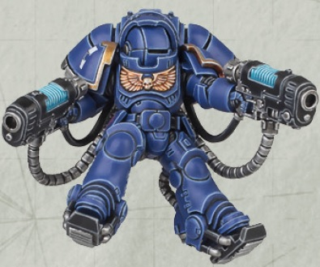

# 1300 等离子灭绝枪 Plasma Exterminator

精校状态：中文行文已逐段精校，部分术语仍为暂定

分类：武器 / 远程武器

原文来源：https://www.bilibili.com/opus/1001365968605151257

原作者：帝国神选罐头

原文时间：2024年11月19日 11:31

[返回分类目录](目录.md) · [全书目录](../../目录.md)

原篇名：等离子歼灭枪 Plasma Exterminator

<!-- A1300-B0001 -->
**英文原文**

The Plasma Exterminator is a type of Space Marine weapon. Essentially a smaller handheld version of the Plasma Incinerator, these are typically wielded by Inceptor Squads.

<!-- /A1300-B0001 -->

<!-- A1300-B0002 -->

原译文

等离子歼灭者是一种星际战士武器。本质上，这是等离子焚化者的小型手持版本，通常由先驱者小队使用。

**校订译文**

等离子灭绝枪是星际战士使用的武器，相当于等离子焚化枪的小型手持版本，通常由先驱者小队配备。

<!-- /A1300-B0002 -->

<!-- A1300-B0003 图片 -->

<!-- A1300-B0004 -->

原译文

Inceptor with twin Plasma Exterminators 先驱者装备双联等离子歼灭者

**校订译文**

Inceptor with twin Plasma Exterminators 双持等离子灭绝枪的先驱者

<!-- /A1300-B0004 -->

本篇核心术语与暂定项

以下列出本篇出现的英文原形及核心术语表用词。同形词可能指不同对象，具体词义以本篇正文和校注为准；单复数、别名和仅见于图注的名称可能尚未列入。完整候选见[术语表](../../术语表/双语术语候选.csv)。

| 英文 | 采用中文 | 状态 |
| --- | --- | --- |
| Plasma Incinerator | 等离子焚化枪 | 暂定·官方待核 |
| Plasma Exterminator | 等离子灭绝枪 | 暂定·官方待核 |
| Space Marine | 星际战士 | 暂定·官方待核 |
| Inceptor | 先驱者 | 暂定·官方待核 |
| Incinerator | 焚化枪 | 暂定·官方待核 |

