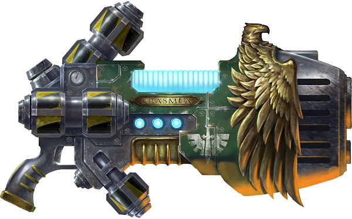
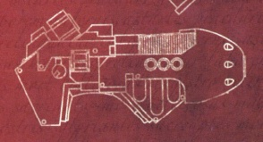
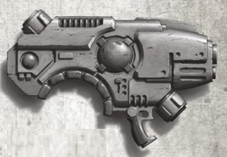
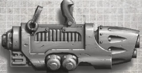

# 1301 等离子炮 Plasma Cannon

精校状态：中文行文已逐段精校，部分术语仍为暂定

分类：武器 / 远程武器

原文来源：https://www.bilibili.com/opus/1005823101008609287

原作者：帝国神选罐头

原文时间：编辑于 2025年09月23日 14:26

[返回分类目录](目录.md) · [全书目录](../../目录.md)

<!-- A1301-B0001 -->
**英文原文**

The plasma cannon or heavy plasma gun is a plasma weapon, a larger version of the plasma gun.

<!-- /A1301-B0001 -->

<!-- A1301-B0002 -->

原译文

等离子炮或重型等离子枪是等离子武器，是等离子枪的较大版本。

**校订译文**

等离子炮又称重型等离子枪，是等离子枪的放大版本。

<!-- /A1301-B0002 -->

<!-- A1301-B0003 -->
## Description 描述

<!-- /A1301-B0003 -->

<!-- A1301-B0004 -->
**英文原文**

Due to its size and massive power requirements, plasma cannons tend to be found mainly on vehicles, but Space Marines are known to use them in their Devastator Squads. The weapon generates plasma which it fires as a glowing super-heated bolt of energy, which on hitting an object, reacts with its matter to produce spheres of boiling nuclear energy like miniature suns. For this reason they have the informal name of "sun gun".

<!-- /A1301-B0004 -->

<!-- A1301-B0005 -->

原译文

由于其尺寸和巨大的功率要求，等离子炮往往主要安装在载具上，但众所周知，星际战士在他们的毁灭者小队中使用它们。这种武器会产生等离子体，并将其作为发光的极热能量爆矢发射，当它击中物体时，会与其物质发生反应，产生沸腾的核能球体，就像微型太阳一样。因此，他们有一个非正式的名字“太阳枪”。

**校订译文**

由于体积庞大、供能需求极高，等离子炮主要安装于载具，但星际战士的破坏者小队也会携行使用。它射出炽亮的过热等离子团，命中后与目标物质反应，形成如微型太阳般沸腾的核能球，因此也俗称“日光枪”。

<!-- /A1301-B0005 -->

<!-- A1301-B0006 -->
**英文原文**

Vehicles that can carry the plasma cannon include the Leman Russ Battle Tank, Sentinel, and Dreadnought.

<!-- /A1301-B0006 -->

<!-- A1301-B0007 -->

原译文

可以携带等离子炮的车辆包括黎曼鲁斯战斗坦克、哨兵和无畏机甲。

**校订译文**

可以携带等离子炮的车辆包括黎曼鲁斯战斗坦克、哨兵和无畏机甲。

<!-- /A1301-B0007 -->

<!-- A1301-B0008 -->
## Known Patterns of Imperial Plasma Cannon 著名帝国等离子炮型号

<!-- /A1301-B0008 -->

<!-- A1301-B0009 -->

原译文

Mk.I "Erasmus" pattern Mk.I“伊拉斯谟”型

**校订译文**

Mk.I "Erasmus" pattern Mk.I“伊拉斯谟”型

<!-- /A1301-B0009 -->

<!-- A1301-B0010 图片 -->

<!-- A1301-B0011 -->

原译文

Mk.I "Erasmus" pattern Mk.I“伊拉斯谟”型

**校订译文**

Mk.I "Erasmus" pattern Mk.I“伊拉斯谟”型

<!-- /A1301-B0011 -->

<!-- A1301-B0012 -->

原译文

Mk XII Ryza pattern Mk XII 瑞扎型

**校订译文**

Mk XII Ryza pattern Mk XII 瑞扎型

<!-- /A1301-B0012 -->

<!-- A1301-B0013 -->

原译文

Mk XII "Comet" pattern Mk XII“彗星”型

**校订译文**

Mk XII "Comet" pattern Mk XII“彗星”型

<!-- /A1301-B0013 -->

<!-- A1301-B0014 -->

原译文

Mk XIII Pattern Mk XIII型

**校订译文**

Mk XIII Pattern Mk XIII型

<!-- /A1301-B0014 -->

<!-- A1301-B0015 -->
**英文原文**

M31 Pattern — Used by Chaos Space Marines

<!-- /A1301-B0015 -->

<!-- A1301-B0016 -->

原译文

M31型 — 混沌星际战士使用

**校订译文**

M31型 — 混沌星际战士使用

<!-- /A1301-B0016 -->

<!-- A1301-B0017 -->
**英文原文**

Mars-pattern - pattern used since Great Crusade

<!-- /A1301-B0017 -->

<!-- A1301-B0018 -->

原译文

火星型 - 大远征以来使用的型号

**校订译文**

火星型 - 大远征以来使用的型号

<!-- /A1301-B0018 -->

<!-- A1301-B0019 -->
**英文原文**

Sol Militaris "Helion Fire" Pattern: Duplex magnacore type; Terran manufactured, issued to Legiones Astartes during the Great Crusade and Horus Heresy.

<!-- /A1301-B0019 -->

<!-- A1301-B0020 -->

原译文

太阳军“太阳烈焰”型：双磁芯型；泰拉制造，在大远征和荷鲁斯叛乱期间发行给阿斯塔特军团。

**校订译文**

太阳军“太阳烈焰”型——采用双巨核设计，在泰拉制造，曾于大远征和荷鲁斯之乱期间配发给阿斯塔特军团。

**校注：** magnacore沿前文Magnacore巨核，不是magnetic core磁芯。

<!-- /A1301-B0020 -->

<!-- A1301-B0021 图片 -->

<!-- A1301-B0022 -->

原译文

Sol Militaris "Helion Fire" Pattern 太阳军“太阳烈焰”型

**校订译文**

Sol Militaris "Helion Fire" Pattern 太阳军“太阳烈焰”型

<!-- /A1301-B0022 -->

<!-- A1301-B0023 -->
**英文原文**

Primus Pattern - Used by House Van Saar of Necromunda. Variant exists known as 'Supernova'.

<!-- /A1301-B0023 -->

<!-- A1301-B0024 -->

原译文

原铸型 - 由涅克罗蒙达的凡萨尔家族使用。存在被称为“超新星”的变体。

**校订译文**

首要型——由涅克罗蒙达的凡·萨尔家族使用，另有名为“超新星”的改型。

**校注：** Primus沿1299首要型；并非Primaris原铸。

<!-- /A1301-B0024 -->

<!-- A1301-B0025 图片 -->

<!-- A1301-B0026 -->

原译文

Primus Pattern 'Supernova' Variant 原铸型‘超新星’变体

**校订译文**

Primus Pattern 'Supernova' Variant 首要型“超新星”改型

<!-- /A1301-B0026 -->

<!-- A1301-B0027 -->
**英文原文**

Sulis Sub-Type - aka the Sun Gun, used by House Escher of Necromunda.

<!-- /A1301-B0027 -->

<!-- A1301-B0028 -->

原译文

苏利斯亚型 - 又名太阳枪，由涅克罗蒙达的埃舍尔家族使用。

**校订译文**

苏利斯亚型——又称日光枪，由涅克罗蒙达的埃舍尔家族使用。

<!-- /A1301-B0028 -->

<!-- A1301-B0029 图片 -->

<!-- A1301-B0030 -->

原译文

Sulis Sub-Type 苏利斯亚型

**校订译文**

Sulis Sub-Type 苏利斯亚型

<!-- /A1301-B0030 -->

本篇核心术语与暂定项

以下列出本篇出现的英文原形及核心术语表用词。同形词可能指不同对象，具体词义以本篇正文和校注为准；单复数、别名和仅见于图注的名称可能尚未列入。完整候选见[术语表](../../术语表/双语术语候选.csv)。

| 英文 | 采用中文 | 状态 |
| --- | --- | --- |
| Space Marines | 星际战士 | 官方已核对 |
| Chaos Space Marines | 混沌星际战士 | 官方已核对 |
| Horus Heresy | 荷鲁斯之乱 | 官方已核对 |
| Necromunda | 涅克罗蒙达 | 暂定·官方待核 |
| House Van Saar | 凡·萨尔家族 | 暂定·官方待核 |
| House Escher | 埃舍尔家族 | 暂定·官方待核 |
| Great Crusade | 大远征 | 暂定·官方待核 |
| Horus | 荷鲁斯 | 暂定·官方待核 |
| Legiones Astartes | 阿斯塔特军团 | 暂定·官方待核 |
| Mars | 火星 | 暂定·官方待核 |
| Sol | 太阳系 | 暂定·官方待核 |
| Devastator | 破坏者 | 暂定·官方待核 |
| Devastator Squads | 破坏者小队 | 暂定·官方待核 |
| Leman Russ Battle Tank | 黎曼鲁斯战斗坦克 | 官方已核对 |
| Primus | 领军 | 官方已核对 |
| Dreadnought | 无畏机甲 | 暂定·官方待核 |
| The Weapon | 武器 | 暂定·官方待核 |
| Gun | 甘 | 暂定·官方待核 |
| Bolt | 爆矢 | 暂定·官方待核 |
| Plasma Weapon | 等离子武器 | 暂定·官方待核 |
| Plasma cannon | 等离子炮 | 官方已核对 |
| Heavy Plasma Gun | 重型等离子枪 | 暂定·官方待核 |
| Sulis Sub-Type | 苏利斯亚型 | 暂定·官方待核 |
| Primus Pattern | 首要型 | 暂定·官方待核 |
| Plasma gun | 等离子枪 | 官方已核对 |

