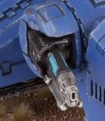

# 1303 等离子根除炮 Plasma Eradicator

精校状态：中文行文已逐段精校，部分术语仍为暂定

分类：武器 / 远程武器

原文来源：https://www.bilibili.com/opus/1005823199757205526

原作者：帝国神选罐头

原文时间：2024年12月01日 11:47

[返回分类目录](目录.md) · [全书目录](../../目录.md)

<!-- A1303-B0001 -->
**英文原文**

The Plasma Eradicator is a type of Plasma Weapon used by the Astraeus Super-Heavy Tank. These are frequently mounted on the sponsons of the vehicle in place of Las-Rippers.

<!-- /A1303-B0001 -->

<!-- A1303-B0002 -->

原译文

等离子根除者是阿斯特赖俄斯超重型坦克使用的一种等离子武器。这些经常安装在车辆的侧舷上，以代替激光开膛手。

**校订译文**

等离子根除炮是阿斯特赖俄斯超重型坦克使用的一种等离子武器，常安装于侧炮座，替代激光撕裂炮。

<!-- /A1303-B0002 -->

<!-- A1303-B0003 图片 -->

<!-- A1303-B0004 -->

原译文

Plasma Eradicator 等离子根除者

**校订译文**

Plasma Eradicator 等离子根除炮

<!-- /A1303-B0004 -->

本篇核心术语与暂定项

以下列出本篇出现的英文原形及核心术语表用词。同形词可能指不同对象，具体词义以本篇正文和校注为准；单复数、别名和仅见于图注的名称可能尚未列入。完整候选见[术语表](../../术语表/双语术语候选.csv)。

| 英文 | 采用中文 | 状态 |
| --- | --- | --- |
| Eradicator | 根除者 | 暂定·官方待核 |
| Astraeus | 阿斯特赖俄斯超重型坦克 | 暂定·官方待核 |
| Plasma Weapon | 等离子武器 | 暂定·官方待核 |
| Plasma Eradicator | 等离子根除炮 | 暂定·官方待核 |
| Astraeus Super-heavy Tank | 阿斯特赖俄斯超重型坦克 | 暂定·官方待核 |

