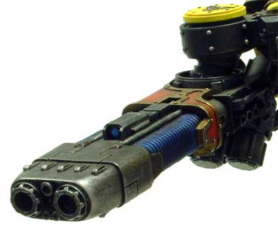

# 1304 等离子爆破炮 Plasma Blastgun

精校状态：中文行文已逐段精校，部分术语仍为暂定

分类：武器 / 远程武器

原文来源：https://www.bilibili.com/opus/1011764363605835795

原作者：帝国神选罐头

原文时间：2024年12月17日 12:02

[返回分类目录](目录.md) · [全书目录](../../目录.md)

<!-- A1304-B0001 -->
**英文原文**

A plasma blastgun is a plasma weapon employed by the Imperium. Generally used against Titans, the plasma blastgun can devastate swaths of the battlefield with its superheated blasts of energy. It is able to be mounted on all Imperial Titans as well as certain Super-Heavy Tanks and other vehicles.

<!-- /A1304-B0001 -->

<!-- A1304-B0002 -->

原译文

等离子爆破炮是帝国使用的等离子武器。等离子爆破炮通常用于对抗泰坦，可以用其过热的能量爆炸摧毁战场的大片区域。它能够安装在所有帝国泰坦以及某些超重型坦克和其他车辆上。

**校订译文**

等离子爆破炮是帝国使用的重型等离子武器，通常用于对抗泰坦，其过热能量足以摧毁战场上的大片区域。它可安装于各种帝国泰坦、部分超重型坦克及其他载具。

<!-- /A1304-B0002 -->

<!-- A1304-B0003 -->
## Overview 概述

<!-- /A1304-B0003 -->

<!-- A1304-B0004 -->
**英文原文**

The plasma blastgun uses the same technology as its smaller cousins, the plasma pistol, gun, and cannon, but on a massive scale. Unlike its smaller brethren the blastgun does not suffer from the same overheating problems due to the fact that the massive engines carrying it can install more efficient cooling systems. Still, the sheer amount of waste heat and thermal shockwave generated by the plasma blastgun can be dangerous to anyone standing too near, requiring some caution when operating around friendly units. The firepower unleashed by a plasma blastgun is stupendous, able to defeat Titan-grade Void Shields in a few shots and reduce armour to slag. For this reason, the weapon is a suitable replacement for the Volcano Cannon in cases where a field refit must be carried out, although the plasma blastgun cannot match it in terms of range and requires the firer to get closer their target. The blastgun also benefits from the fact it taps directly into the plasma reactor of the Titan carrying it, allowing for an unlimited number of shots. Smaller vehicles which cannot carry reactors must make due with massive photonic fuel cells which provide fewer shots, however, even with this in mind the blastgun is simpler to maintain and supply than other comparable weapons like Turbo-laser Destructors, making it the ideal choice for extended operations. Like many other plasma weapons the blastgun has multiple firing modes, able to unleash either a single full-powered blast or a series of weaker rapid-fire shots, increasing its utility against many different types of opponents.

<!-- /A1304-B0004 -->

<!-- A1304-B0005 -->

原译文

等离子爆破炮使用与其较小的表亲等离子手枪、等离子枪和等离子炮相同的技术，但规模很大。与较小的同类产品不同，由于携带它的大型发动机可以安装更高效的冷却系统，爆破炮不会出现同样的过热问题。尽管如此，等离子爆破炮产生的大量废热和热能冲击波对任何站得太近的人来说都是危险的，在友军附近操作时需要谨慎。等离子爆破炮释放的火力是惊人的，能够在几次射击中击败泰坦级虚空盾，并将护甲减少到炉渣。因此，在必须进行野战改装的情况下，该武器是火山炮的合适替代品，尽管等离子爆破炮在射程方面无法与之匹敌，需要射击者更接近目标。爆破炮还受益于它直接连接携带它的泰坦的等离子反应堆，允许无限次射击。不能携带反应堆的小型车辆必须配备大量光子燃料电池，因为光子燃料电池提供的射击次数更少，然而，即使考虑到这一点，爆破炮也比涡轮激光破坏炮等其他类似武器更容易维护和供应，使其成为长期作战的理想选择。与许多其他等离子武器一样，爆破炮具有多种射击模式，能够发射一次全功率爆炸或一连串较弱的速射，从而提高了其对许多不同类型对手的效用。

**校订译文**

等离子爆破炮采用与等离子手枪、等离子枪和等离子炮相同的技术，只是规模大得多。承载它的大型战争机器能安装更高效的冷却系统，因此不像小型武器那样容易过热。不过，它产生的大量废热和热冲击波仍会危及附近人员，在友军周围开火时必须谨慎。其威力惊人，几次射击便能击溃泰坦级虚空盾，将装甲熔成残渣。因此，需要在战地进行改装时，它可作为火山炮的替代武器；只是射程较短，必须更接近目标。安装于泰坦时，它能直接从泰坦的等离子反应堆取能，因而不受常规弹药数量限制。较小的载具无法搭载反应堆，只能使用大型光子燃料单元，射击次数也较少。即使如此，它仍比涡轮激光破坏炮等同级武器更易维护、补给，很适合长时间作战。它还可选择单次全功率射击或连续发射多团威力较低的等离子体，以应对不同类型的敌人。

**校注：** engines在此指承载武器的战争机器，不是发动机；不限射击次数沿泰坦直接取能的设定理解。

<!-- /A1304-B0005 -->

<!-- A1304-B0006 -->
**英文原文**

Plasma blastguns can be mounted on the arm hardpoints of Warhound Scout Titans or the carapace hardpoints of Reaver and Warlord Battle Titans. They can also be mounted on the carapace hardpoints of the mighty Emperor Titans. Plasma blastguns are also the main armament for the Stormblade and Macharius 'Omega' tanks. Plasma blastguns also served as the primary weapon of the Hammerblade Fighter-Bomber, an obsolete pattern of Imperial attack craft.

<!-- /A1304-B0006 -->

<!-- A1304-B0007 -->

原译文

等离子爆破炮可以安装在战犬侦察泰坦的手臂硬点上，也可以安装在掠夺者和军阀战斗泰坦的甲壳硬点上。它们也可以安装在强大的帝皇泰坦的甲壳硬点上。等离子爆破炮也是风暴刃和马卡里乌斯“欧米伽”坦克的主要武器。等离子爆破炮也是锤刃战斗轰炸机的主要武器，这是帝国攻击机的一种过时型号。

**校订译文**

等离子爆破炮可安装于战犬级侦察泰坦的臂部挂点，以及掠夺者级、战将级战斗泰坦的背甲挂点；更强大的帝皇级泰坦也可在背甲上搭载。它还是风暴刃和马卡里乌斯“欧米伽”坦克的主武器，也曾装备于现已过时的帝国锤刃战斗轰炸机。

<!-- /A1304-B0007 -->

<!-- A1304-B0008 -->
## Known Patterns 已知型号

<!-- /A1304-B0008 -->

<!-- A1304-B0009 -->
### Mars Pattern Plasma Blastgun 火星型等离子爆破炮

<!-- /A1304-B0009 -->

<!-- A1304-B0010 -->
**英文原文**

Found on Mars Pattern Warhound Scout Titans.

<!-- /A1304-B0010 -->

<!-- A1304-B0011 -->

原译文

安装在火星型战犬侦查泰坦上。

**校订译文**

安装于火星型战犬级侦察泰坦。

<!-- /A1304-B0011 -->

<!-- A1304-B0012 图片 -->

<!-- A1304-B0013 -->

原译文

plasma blastgun mounted on a Mars Pattern Warhound Titan 安装在火星型战犬泰坦上的等离子爆破炮

**校订译文**

plasma blastgun mounted on a Mars Pattern Warhound Titan 安装在火星型战犬泰坦上的等离子爆破炮

<!-- /A1304-B0013 -->

<!-- A1304-B0014 -->
### Ryza Pattern Plasma Blastgun 瑞扎型等离子爆破炮

<!-- /A1304-B0014 -->

<!-- A1304-B0015 -->
**英文原文**

The most common version of the plasma blastgun.

<!-- /A1304-B0015 -->

<!-- A1304-B0016 -->

原译文

等离子爆破炮最常见的版本。

**校订译文**

等离子爆破炮最常见的版本。

<!-- /A1304-B0016 -->

<!-- A1304-B0017 -->
### Omega Pattern Plasma Blastgun 欧米伽型等离子爆破炮

<!-- /A1304-B0017 -->

<!-- A1304-B0018 -->
**英文原文**

A variant of the more common Ryza pattern, the Omega pattern blastgun was recovered in M39 by Explorator Vaslistle Hum'nal, though doctrinal arguments within the Adeptus Mechanicus would prevent its field testing and development for centuries. The weapon uses a more compact generator design and force crucible, which is easier to manufacture and repair and can be mounted in smaller war machines such as the Macharius Heavy Tank, but also generates more heat and is less stable than the Ryza pattern. Regardless the weapon's benefits outweigh its drawbacks and it is constructed on Lucius, Hellgrace and Dynax Primus.

<!-- /A1304-B0018 -->

<!-- A1304-B0019 -->

原译文

欧米伽型爆破炮是更常见的瑞扎型爆破炮的一种变体，由探索者瓦斯利斯特尔·胡姆纳尔在M39发现，尽管机械神教内部的教义争论阻止其几个世纪的实地测试和开发。该武器采用更紧凑的发电机设计和动力熔炉，更容易制造和维修，可以安装在较小的战争机器上，如马卡里乌斯重型坦克，但也会产生更多的热量，比瑞扎型更不稳定。无论如何，该武器的优点大于缺点，它是在卢修斯、地狱恩典和戴纳克斯主星上建造的。

**校订译文**

欧米伽型是常见瑞扎型的一种改型，由探索者瓦斯利斯特尔·胡姆纳尔在M39重新发现。然而，机械修会内部的教义争论使其现场试验和开发搁置了数百年。它采用更紧凑的发电装置与力场熔炉，便于制造和维修，也能安装于马卡里乌斯重型坦克等较小的战争机器上；代价是发热更多，稳定性低于瑞扎型。总体而言，它仍利大于弊，目前在卢修斯、地狱恩典和戴纳克斯主星制造。

**校注：** force crucible暂译力场熔炉；原文技术部件定义有限，不扩写结构。

<!-- /A1304-B0019 -->

<!-- A1304-B0020 -->
**英文原文**

It is used, for example, in the Macharius Omega tank.

<!-- /A1304-B0020 -->

<!-- A1304-B0021 -->

原译文

例如，它被用于马卡里乌斯欧米伽坦克。

**校订译文**

例如，它被用于马卡里乌斯欧米伽坦克。

<!-- /A1304-B0021 -->

本篇核心术语与暂定项

以下列出本篇出现的英文原形及核心术语表用词。同形词可能指不同对象，具体词义以本篇正文和校注为准；单复数、别名和仅见于图注的名称可能尚未列入。完整候选见[术语表](../../术语表/双语术语候选.csv)。

| 英文 | 采用中文 | 状态 |
| --- | --- | --- |
| Adeptus Mechanicus | 机械修会 | 官方已核对 |
| Imperium | 帝国 | 暂定·简称 |
| Emperor | 帝皇 | 官方已核对 |
| Mars | 火星 | 暂定·官方待核 |
| Lucius | 卢修斯 | 暂定·官方待核 |
| Ryza | 瑞扎 | 暂定·官方待核 |
| Titan | 泰坦 | 暂定·官方待核 |
| Scout | 侦察兵 | 暂定·官方待核 |
| Primus | 领军 | 官方已核对 |
| The Weapon | 武器 | 暂定·官方待核 |
| Crucible | 熔炉星 | 暂定·官方待核 |
| Gun | 甘 | 暂定·官方待核 |
| Macharius | 马卡里乌斯 | 暂定·官方待核 |
| Plasma Weapons | 等离子武器 | 暂定·官方待核 |
| Plasma Weapon | 等离子武器 | 暂定·官方待核 |
| Plasma Blastgun | 等离子爆破炮 | 暂定·官方待核 |
| Hammerblade Fighter-Bomber | 锤刃战斗轰炸机 | 暂定·官方待核 |
| Hellgrace | 地狱恩典 | 暂定·官方待核 |
| Dynax Primus | 戴纳克斯主星 | 暂定·官方待核 |
| Volcano cannon | 火山炮 | 官方已核对 |
| Plasma pistol | 等离子手枪 | 官方已核对 |
| Stormblade | 风暴刃 | 暂定·官方待核 |

