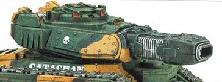

# 1305 等离子毁灭炮 Plasma Destroyer

精校状态：中文行文已逐段精校，部分术语仍为暂定

分类：武器 / 远程武器

原文来源：https://www.bilibili.com/opus/1012146362305740821

原作者：帝国神选罐头

原文时间：2024年12月18日 12:44

[返回分类目录](目录.md) · [全书目录](../../目录.md)

原篇名：等离子破坏炮 Plasma Destroyer

<!-- A1305-B0001 -->
**英文原文**

The Plasma Destroyer is a plasma weapon mounted on the Leman Russ Executioner and Deimos Pattern Predator Executioner.

<!-- /A1305-B0001 -->

<!-- A1305-B0002 -->

原译文

等离子破坏炮是一种等离子武器，安装在黎曼鲁斯刽子手和火卫二型掠食者刽子手身上。

**校订译文**

等离子毁灭炮是一种安装于黎曼鲁斯处决者和迪莫斯型处刑者掠食者战车的等离子武器。

<!-- /A1305-B0002 -->

<!-- A1305-B0003 图片 -->

<!-- A1305-B0004 -->

原译文

Plasma Destroyer 等离子破坏炮

**校订译文**

Plasma Destroyer 等离子毁灭炮

<!-- /A1305-B0004 -->

<!-- A1305-B0005 -->
## Overview 概述

<!-- /A1305-B0005 -->

<!-- A1305-B0006 -->
**英文原文**

It is an incredibly powerful weapon, firing plasma blasts as hot as the sun capable of incinerating flesh and blasting apart power armour, and excels in the role of siege warfare and long-rang tank-hunting. However the weapon is highly temperamental and dangerous, in the minds of many requiring a sense of foolhardy bravery (or insanity) to operate. Produced on Ryza, the only Forge World with the necessary knowledge to construct it, the Plasma Destroyer is powered by a photonic fuel cell which produces the immense if difficult to contain energies necessary to power the weapon. However many commanders complain that these cells do not provide sufficient power for prolonged combat situations, and replacing them is far too time-consuming in the heat of battle. While vehicles who mount this weapon often include safety features, such as a heat shield, emergency vents and coolant tanks, in the worst case scenario a catastrophic failure in the weapon's containment field can result in the destruction of the entire vehicle.

<!-- /A1305-B0006 -->

<!-- A1305-B0007 -->

原译文

它是一种极其强大的武器，发射像太阳一样热的等离子爆炸，能够焚烧肉体并炸开动力装甲，在攻城战和长距离坦克狩猎中表现出色。然而，在许多人的心目中，这种武器具有高级气质和危险性，需要一种鲁莽的勇气（或疯狂）才能操作。在瑞扎上生产，这是唯一一个拥有制造它所需知识的铸造世界，等离子破坏炮由光子燃料电池提供能量，该电池产生为武器提供动力所需的巨大能量。然而，许多指挥官抱怨说，这些电池不能为长时间的战斗状况提供足够的能量，在激烈的战斗中更换它们太耗时了。虽然安装这种武器的车辆通常包括安全功能，如隔热罩、紧急通风口和冷却液箱，但在最坏的情况下，武器密封区的灾难性故障可能会导致整个车辆被毁。

**校订译文**

它射出的等离子团炽热如太阳，能焚毁血肉、轰碎动力盔甲，尤其适合攻城和远距离猎杀坦克。然而，这种武器极不稳定，也十分危险；在许多人看来，只有莽勇乃至疯狂之人才会操作它。瑞扎是唯一掌握制造技术的铸造世界。武器以光子燃料单元供能，由其产生庞大却难以约束的能量。不少指挥官抱怨，燃料单元无法支持长时间战斗，在激烈交火中更换又过于耗时。搭载它的载具通常设有隔热板、应急排气口和冷却液箱等安全装置；即便如此，约束场若发生灾难性故障，仍可能毁掉整辆载具。

**校注：** temperamental指性能不稳定，不是高级气质；containment field为约束场。

<!-- /A1305-B0007 -->

本篇核心术语与暂定项

以下列出本篇出现的英文原形及核心术语表用词。同形词可能指不同对象，具体词义以本篇正文和校注为准；单复数、别名和仅见于图注的名称可能尚未列入。完整候选见[术语表](../../术语表/双语术语候选.csv)。

| 英文 | 采用中文 | 状态 |
| --- | --- | --- |
| Forge World | 铸造世界 | 暂定·官方待核 |
| Ryza | 瑞扎 | 暂定·官方待核 |
| Deimos | 迪莫斯 | 暂定·官方待核 |
| Power Armour | 动力盔甲 | 暂定·官方待核 |
| Destroyer | 毁灭者 | 暂定·官方待核 |
| The Weapon | 武器 | 暂定·官方待核 |
| Leman Russ Executioner | 黎曼鲁斯处决者 | 官方已核·中英对照 |
| Plasma Weapon | 等离子武器 | 暂定·官方待核 |
| Plasma Destroyer | 等离子毁灭炮 | 暂定·官方待核 |
| Deimos Pattern Predator | 迪莫斯型掠食者 | 暂定·官方待核 |
| Deimos Pattern Predator Executioner | 迪莫斯型处决者掠食者 | 暂定·官方待核 |

