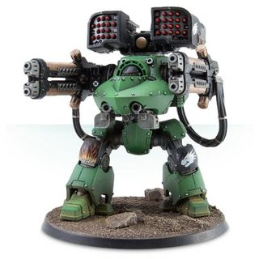

# 1306 狱火等离子大炮 Hellfire Plasma Cannonade

精校状态：中文行文已逐段精校，部分术语仍为暂定

分类：武器 / 远程武器

原文来源：https://www.bilibili.com/opus/1011362573709213719

原作者：帝国神选罐头

原文时间：2024年12月16日 10:03

[返回分类目录](目录.md) · [全书目录](../../目录.md)

原篇名：地狱火等离子大炮 Hellfire Plasma Cannonade

<!-- A1306-B0001 -->
**英文原文**

The Hellfire Plasma Cannonade was a type of Imperial heavy plasma weapon used during the Great Crusade and Horus Heresy. They were typically equipped to Dreadnoughts.

<!-- /A1306-B0001 -->

<!-- A1306-B0002 -->

原译文

地狱火等离子炮是大远征和荷鲁斯叛乱期间使用的一种帝国重型等离子武器。他们通常装备于无畏。

**校订译文**

狱火等离子大炮是帝国在大远征和荷鲁斯之乱期间使用的重型等离子武器，通常装备于无畏机甲。

<!-- /A1306-B0002 -->

<!-- A1306-B0003 图片 -->

<!-- A1306-B0004 -->

原译文

Deredeo Pattern Dreadnought with Hellfire Plasma Cannonade 装备地狱火等离子炮的德雷都无畏

**校订译文**

Deredeo Pattern Dreadnought with Hellfire Plasma Cannonade 装备狱火等离子大炮的德雷都型无畏机甲

<!-- /A1306-B0004 -->

本篇核心术语与暂定项

以下列出本篇出现的英文原形及核心术语表用词。同形词可能指不同对象，具体词义以本篇正文和校注为准；单复数、别名和仅见于图注的名称可能尚未列入。完整候选见[术语表](../../术语表/双语术语候选.csv)。

| 英文 | 采用中文 | 状态 |
| --- | --- | --- |
| Horus Heresy | 荷鲁斯之乱 | 官方已核对 |
| Great Crusade | 大远征 | 暂定·官方待核 |
| Horus | 荷鲁斯 | 暂定·官方待核 |
| Plasma Weapon | 等离子武器 | 暂定·官方待核 |
| Hellfire Plasma Cannonade | 狱火等离子大炮 | 暂定·官方待核 |

