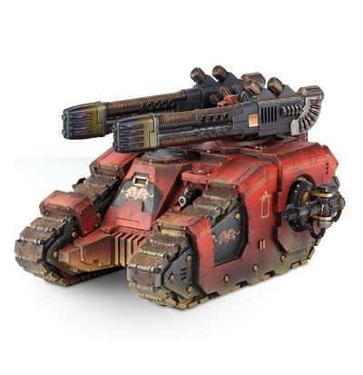

# 1307 欧米伽等离子阵列 Omega Plasma Array

精校状态：中文行文已逐段精校，部分术语仍为暂定

分类：武器 / 远程武器

原文来源：https://www.bilibili.com/opus/1011763964185411589

原作者：帝国神选罐头

原文时间：2024年12月17日 12:00

[返回分类目录](目录.md) · [全书目录](../../目录.md)

<!-- A1307-B0001 -->
**英文原文**

The Omega Plasma Array is a type of Plasma Weapon mounted on Space Marine Sicaran Omega Tanks.

<!-- /A1307-B0001 -->

<!-- A1307-B0002 -->

原译文

欧米伽等离子阵列是一种安装在星际战士西卡然欧米伽坦克上的等离子武器。

**校订译文**

欧米伽等离子阵列是一种安装在星际战士西卡然欧米伽坦克上的等离子武器。

<!-- /A1307-B0002 -->

<!-- A1307-B0003 图片 -->

<!-- A1307-B0004 -->

原译文

Sicaran Omega mounted with the Omega Plasma Array 装备欧米伽等离子阵列的西卡然欧米伽

**校订译文**

Sicaran Omega mounted with the Omega Plasma Array 装备欧米伽等离子阵列的西卡然欧米伽

<!-- /A1307-B0004 -->

<!-- A1307-B0005 -->
**英文原文**

The plasma array mounted on the Sicaran Omega is capable of focusing and projecting a highly pressurized stream of volatile and highly charged plasma, vaporizing outer armor layers and literally burning through an enemy tank’s defenses. This crude application of plasma technology is rarely capable of the elegant destruction of weapons of the same caliber as the ubiquitous lascannon, but is capable of eventually reducing even the toughest enemy vehicles to molten ruin.

<!-- /A1307-B0005 -->

<!-- A1307-B0006 -->

原译文

安装在西卡然欧米伽上的等离子阵列能够聚焦和投射高压的挥发性和高电荷等离子体流，蒸发外装甲层，并真正烧毁敌方坦克的防御。这种等离子技术的粗略应用很少能够像无处不在的激光炮那样优雅地摧毁相同口径的武器，但最终能够将最坚固的敌方车辆夷为平地。

**校订译文**

西卡然欧米伽的等离子阵列能将不稳定的高能等离子体聚焦，以高压流束射出，汽化外层装甲，烧穿敌方坦克的防护。这种等离子技术的运用颇为粗糙，很少能像激光炮等常见的同级武器那样干净利落地摧毁目标，却终究能将最坚固的敌方载具熔成废墟。

**校注：** of weapons修饰破坏效果，并非“摧毁相同口径的武器”。volatile在此指等离子体不稳定，不是易挥发。

<!-- /A1307-B0006 -->

本篇核心术语与暂定项

以下列出本篇出现的英文原形及核心术语表用词。同形词可能指不同对象，具体词义以本篇正文和校注为准；单复数、别名和仅见于图注的名称可能尚未列入。完整候选见[术语表](../../术语表/双语术语候选.csv)。

| 英文 | 采用中文 | 状态 |
| --- | --- | --- |
| Space Marine | 星际战士 | 暂定·官方待核 |
| Plasma Weapon | 等离子武器 | 暂定·官方待核 |
| Omega Plasma Array | 欧米伽等离子阵列 | 暂定·官方待核 |
| Lascannon | 激光炮 | 官方已核对 |
| Sicaran Omega | 西卡然欧米伽 | 暂定·官方待核 |

