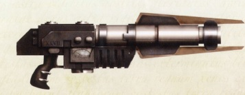

# 1309 激光切割枪 Lascutter

精校状态：中文行文已逐段精校，部分术语仍为暂定

分类：武器 / 远程武器

原文来源：https://www.bilibili.com/opus/1009982811168309251

原作者：帝国神选罐头

原文时间：2024年12月12日 16:49

[返回分类目录](目录.md) · [全书目录](../../目录.md)

<!-- A1309-B0001 -->
**英文原文**

Lascutters are a powerful but extremely unwieldy type of Laser Weapon.

<!-- /A1309-B0001 -->

<!-- A1309-B0002 -->

原译文

激光切割枪是一种强大但极其笨重的激光武器。

**校订译文**

激光切割枪是一种强大但极其笨重的激光武器。

<!-- /A1309-B0002 -->

<!-- A1309-B0003 图片 -->

<!-- A1309-B0004 -->

原译文

Lascutters 激光切割枪

**校订译文**

Lascutters 激光切割枪

<!-- /A1309-B0004 -->

<!-- A1309-B0005 -->
**英文原文**

Originally industrial tools used for cutting through armored bulkheads and dense ores, these weapons make use of disruption field-assisted short-range laser arcs. They were later utilized for warfare, being used in sieges where they were able to breach enemy fortifications, and, if necessary, become devastating close-quarters weapons.

<!-- /A1309-B0005 -->

<!-- A1309-B0006 -->

原译文

这些武器最初是用于切割装甲舱壁和致密矿石的工业工具，它们利用了干扰场辅助的短程激光弧。它们后来被用于战争，被用于攻城，在那里它们能够突破敌人的防御工事，并在必要时成为毁灭性的近距离武器。

**校订译文**

激光切割枪最初是切开装甲舱壁和致密矿石的工业工具，利用扰乱场辅助的短程激光弧进行切割。后来它被用于战争，既能在攻城时破开敌方工事，必要时也可成为杀伤力惊人的近战武器。

<!-- /A1309-B0006 -->

本篇核心术语与暂定项

以下列出本篇出现的英文原形及核心术语表用词。同形词可能指不同对象，具体词义以本篇正文和校注为准；单复数、别名和仅见于图注的名称可能尚未列入。完整候选见[术语表](../../术语表/双语术语候选.csv)。

| 英文 | 采用中文 | 状态 |
| --- | --- | --- |
| Laser Weapon | 激光武器 | 暂定·官方待核 |

