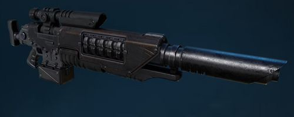

# 1310 激光狙击枪 Las Fusils

精校状态：中文行文已逐段精校，部分术语仍为暂定

分类：武器 / 远程武器

原文来源：https://www.bilibili.com/opus/1001020524378193925

原作者：帝国神选罐头

原文时间：2024年11月18日 13:10

[返回分类目录](目录.md) · [全书目录](../../目录.md)

<!-- A1310-B0001 -->
**英文原文**

Las Fusils are a type of Sniper weapon used by Space Marine Eliminators. A type of Laser Weapon, the Las Fusil is a long-range rifle that requires charging time between shots.

<!-- /A1310-B0001 -->

<!-- A1310-B0002 -->

原译文

激光狙击枪是星际战士歼灭者使用的一种狙击武器。激光狙击枪是一种激光武器，是一种长程步枪，两次射击之间需要充电时间。

**校订译文**

激光狙击枪是星际战士歼灭者使用的狙击武器，属于激光兵器。它是一种远程步枪，每次射击后都需要短暂充能。

<!-- /A1310-B0002 -->

<!-- A1310-B0003 图片 -->

<!-- A1310-B0004 -->

原译文

Las Fusil 激光狙击枪

**校订译文**

Las Fusil 激光狙击枪

<!-- /A1310-B0004 -->

本篇核心术语与暂定项

以下列出本篇出现的英文原形及核心术语表用词。同形词可能指不同对象，具体词义以本篇正文和校注为准；单复数、别名和仅见于图注的名称可能尚未列入。完整候选见[术语表](../../术语表/双语术语候选.csv)。

| 英文 | 采用中文 | 状态 |
| --- | --- | --- |
| Las Fusil | 激光狙击枪 | 暂定·官方待核 |
| Space Marine | 星际战士 | 暂定·官方待核 |
| Fusil | 相位火枪 | 暂定·官方待核 |
| Laser Weapon | 激光武器 | 暂定·官方待核 |

