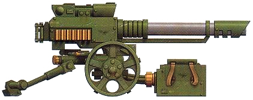
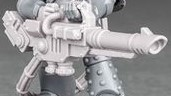
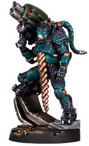
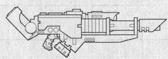
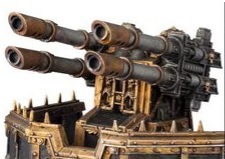
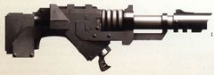

# 1311 激光炮 Lascannon

精校状态：中文行文已逐段精校，部分术语仍为暂定

分类：武器 / 远程武器

原文来源：https://www.bilibili.com/opus/1005074681484541960

原作者：帝国神选罐头

原文时间：2024年11月29日 11:23

[返回分类目录](目录.md) · [全书目录](../../目录.md)

<!-- A1311-B0001 -->
**英文原文**

A lascannon (also known as a laser cannon or a blazooga) is a formidable laser weapon, capable of piercing most vehicle armour and killing powerful and heavily armoured troops. However, its slow recharge and fire rate make it a poor anti-personnel weapon.

<!-- /A1311-B0001 -->

<!-- A1311-B0002 -->

原译文

激光炮（也称为镭射炮或布拉佐加）是一种强大的激光武器，能够穿透大多数车辆装甲，杀死强大而重装甲的部队。然而，其缓慢的充能和射击速度使其成为一种糟糕的人员杀伤武器。

**校订译文**

激光炮在英文中也称 Laser Cannon，另有“布拉佐加”（Blazooga）的别称。这种武器威力强大，能击穿多数载具装甲，杀死强壮或重甲防护的敌人。但它充能慢、射速低，不适合用来普遍杀伤步兵。

<!-- /A1311-B0002 -->

<!-- A1311-B0003 图片 -->

<!-- A1311-B0004 -->

原译文

lascannon 激光炮

**校订译文**

lascannon 激光炮

<!-- /A1311-B0004 -->

<!-- A1311-B0005 -->
## Overview 概述

<!-- /A1311-B0005 -->

<!-- A1311-B0006 -->
**英文原文**

The primary difference between a lasgun and a lascannon is the size. While a lasgun is easily handled by a Guardsman, a lascannon is much larger, and therefore heavier, has restricted it to mounted or crew-served positions. Space Marines, with their gene-enhanced strength and power armour, can carry and shoulder-fire a lascannon with ease.

<!-- /A1311-B0006 -->

<!-- A1311-B0007 -->

原译文

激光枪和激光炮的主要区别在于尺寸。虽然激光炮很容易被卫队操作，但激光炮要大得多，因此也更重，这限制了它只能在载具或班组操作的位置使用。星际战士凭借其基因增强的力量和动力装甲，可以轻松携带和肩扛激光炮。

**校订译文**

激光枪与激光炮的主要区别在于尺寸。普通卫队士兵可以轻松使用激光枪，激光炮却大得多，也重得多，通常需要固定安装或由武器组操作。星际战士凭借基因增强的力量和动力盔甲，则能轻松携带并抵肩发射。

**校注：** 原译将lasgun与lascannon都译成激光炮，现恢复两者尺寸对比。

<!-- /A1311-B0007 -->

<!-- A1311-B0008 图片 -->

<!-- A1311-B0009 -->

原译文

Ryza-pattern Lascannon 瑞扎型激光炮

**校订译文**

Ryza-pattern Lascannon 瑞扎型激光炮

<!-- /A1311-B0009 -->

<!-- A1311-B0010 -->
**英文原文**

A lascannon's removable charge pack is only good for one shot. Lascannons not attached to external power supplies require a crew member to swap charge packs.

<!-- /A1311-B0010 -->

<!-- A1311-B0011 -->

原译文

激光炮的可拆卸能量包只适用于一次射击。未连接外部电源的激光炮需要机组人员更换能量包。

**校订译文**

激光炮的可拆卸能量单元只能供射击一次。如果没有外接电源，就需要一名炮组成员负责更换。

<!-- /A1311-B0011 -->

<!-- A1311-B0012 -->
**英文原文**

They are very reliable as the technology has been perfected rather than scrounged from ancient STCs. As such, they are the preferred weapon type by many Imperial Commanders as, even though other weapons may have other advantages, the reliability of the weapon is most important on the battlefield.

<!-- /A1311-B0012 -->

<!-- A1311-B0013 -->

原译文

它们非常可靠，因为该技术已经完善，而不是从古代STC中寻找。因此，它们是许多帝国指挥官的首选武器类型，因为即使其他武器可能有其他优势，武器的可靠性在战场上也是最重要的。

**校订译文**

激光炮的技术已经得到充分完善，并非只是从古代标准建造模板（STC）中东拼西凑而来，因此十分可靠。许多帝国指挥官尤其青睐它：其他武器或许各有优势，但战场上最要紧的仍是可靠性。

<!-- /A1311-B0013 -->

<!-- A1311-B0014 图片 -->

<!-- A1311-B0015 -->

原译文

House Van Saar double-barreled Lascannon 凡萨尔家族双管激光炮

**校订译文**

House Van Saar double-barreled Lascannon 凡·萨尔家族的双管激光炮

<!-- /A1311-B0015 -->

<!-- A1311-B0016 -->
**英文原文**

Lascannons, due to their high strength and reliability, are often mounted on tanks. Here they are often twin-linked to improve their accuracy. Many tanks can have sponson or hull-mounted lascannons to provide them with a secondary weapon to their primary turret in case it is damaged. Lascannons are a common sight amongst the Imperial Guard, but less so in the ranks of the Space Marines, who typically rely more on melta-type weapons.

<!-- /A1311-B0016 -->

<!-- A1311-B0017 -->

原译文

激光炮因其高强度和可靠性，通常安装在坦克上。在这里，它们通常是成对的，以提高它们的准确性。许多坦克可以配备在侧舷或车体安装的激光炮，以便在主炮塔损坏时为其提供辅助武器。激光炮在帝国卫队中很常见，但在星际战士中不太常见，他们通常更依赖于热熔武器。

**校订译文**

激光炮威力大、可靠性高，常被安装于坦克，并以双联配置提高精度。许多坦克在侧炮座或车体上安装激光炮作为副武器，即使主炮塔损坏，仍可继续作战。激光炮在帝国卫队中十分常见，在更依赖热熔武器的星际战士中则相对较少。

<!-- /A1311-B0017 -->

<!-- A1311-B0018 -->
## Known Lascannon Patterns 已知激光炮型号

<!-- /A1311-B0018 -->

<!-- A1311-B0019 -->
**英文原文**

MK VII Mars Pattern — Used by Space Marines.

<!-- /A1311-B0019 -->

<!-- A1311-B0020 -->

原译文

MK VII火星型 — 星际战士使用。

**校订译文**

MK VII火星型 — 星际战士使用。

<!-- /A1311-B0020 -->

<!-- A1311-B0021 图片 -->

<!-- A1311-B0022 -->

原译文

MK VII Mars Pattern lascannon MK VII火星型激光炮

**校订译文**

MK VII Mars Pattern lascannon MK VII火星型激光炮

<!-- /A1311-B0022 -->

<!-- A1311-B0023 -->
**英文原文**

Desolator Pattern — Mounted on the Overlord Gunship.

<!-- /A1311-B0023 -->

<!-- A1311-B0024 -->

原译文

毁灭者型 — 霸主炮艇上搭载。

**校订译文**

毁灭者型 — 霸主炮艇上搭载。

<!-- /A1311-B0024 -->

<!-- A1311-B0025 -->
**英文原文**

Godhammer Pattern — Used on the Land Raider.

<!-- /A1311-B0025 -->

<!-- A1311-B0026 -->

原译文

神锤型 — 用于兰德掠袭者。

**校订译文**

神锤型 — 用于兰德掠袭者。

<!-- /A1311-B0026 -->

<!-- A1311-B0027 -->
**英文原文**

Icarus-Pattern — Large cannon used in defensive positions.

<!-- /A1311-B0027 -->

<!-- A1311-B0028 -->

原译文

伊卡洛斯型 — 用于防御阵地的大炮。

**校订译文**

伊卡洛斯型 — 用于防御阵地的大炮。

<!-- /A1311-B0028 -->

<!-- A1311-B0029 图片 -->

<!-- A1311-B0030 -->

原译文

Icarus pattern lascannon quad mount 四联装伊卡洛斯型激光炮

**校订译文**

Icarus pattern lascannon quad mount 四联装伊卡洛斯型激光炮

<!-- /A1311-B0030 -->

<!-- A1311-B0031 -->
**英文原文**

Hell Hammer Pattern — Crew-served version used by the Imperial Guard.

<!-- /A1311-B0031 -->

<!-- A1311-B0032 -->

原译文

地狱之锤型 — 帝国卫队使用的班组操作版本。

**校订译文**

地狱之锤型 — 帝国卫队使用的班组操作版本。

<!-- /A1311-B0032 -->

<!-- A1311-B0033 -->
**英文原文**

Primus Standard Template Construct Pattern — Found mounted on some Imperial tanks, including certain patterns of Baneblade.

<!-- /A1311-B0033 -->

<!-- A1311-B0034 -->

原译文

原铸标准模板构建型 — 发现安装在一些帝国坦克上，包括毒刃的某些型号。

**校订译文**

首要标准模板构造型——安装于部分帝国坦克，包括某些毒刃型号。

<!-- /A1311-B0034 -->

<!-- A1311-B0035 -->
**英文原文**

Stormbringer Pattern — Used on the Predator Annihilator.

<!-- /A1311-B0035 -->

<!-- A1311-B0036 -->

原译文

风暴使者型 — 用于歼灭掠食者坦克上

**校订译文**

风暴使者型——用于歼灭者型掠食者战车。

<!-- /A1311-B0036 -->

<!-- A1311-B0037 -->
**英文原文**

Sol Militaris Pattern — KZ8.23 Range, Terran-manufactured, issued to the Legiones Astartes during the Great Crusade and Horus Heresy.

<!-- /A1311-B0037 -->

<!-- A1311-B0038 -->

原译文

太阳军型 — KZ8.23范围，泰拉制造，在大远征和荷鲁斯叛乱期间发放给阿斯塔特军团。

**校订译文**

太阳军型——KZ8.23 系列，在泰拉制造，曾于大远征和荷鲁斯之乱期间配发给阿斯塔特军团。

**校注：** Range在型号说明中暂按系列处理；原文没有距离单位，不将KZ8.23解释为射程数值。

<!-- /A1311-B0038 -->

<!-- A1311-B0039 图片 -->

<!-- A1311-B0040 -->

原译文

Sol Militaris Pattern Lascannon 太阳军型激光炮

**校订译文**

Sol Militaris Pattern Lascannon 太阳军型激光炮

<!-- /A1311-B0040 -->

<!-- A1311-B0041 -->
**英文原文**

Heavy Lascannon - Imperial Guard Field Ordnance Battery.

<!-- /A1311-B0041 -->

<!-- A1311-B0042 -->

原译文

重型激光炮 - 帝国卫队野战炮兵班组。

**校订译文**

重型激光炮——由帝国卫队的野战炮群使用。

<!-- /A1311-B0042 -->

<!-- A1311-B0043 -->
**英文原文**

Voss-pattern — Mounted on the Valkyrie.

<!-- /A1311-B0043 -->

<!-- A1311-B0044 -->

原译文

沃斯型 — 安装在瓦尔基里上。

**校订译文**

沃斯型——安装于女武神炮艇。

<!-- /A1311-B0044 -->

<!-- A1311-B0045 -->
## Known Non-Standard Types of Lascannons 已知非标准激光炮类型

<!-- /A1311-B0045 -->

<!-- A1311-B0046 -->
**英文原文**

Las-Ripper — Used by the Astraeus Super-heavy Tank

<!-- /A1311-B0046 -->

<!-- A1311-B0047 -->

原译文

激光开膛手 — 阿斯特赖俄斯超重型坦克使用

**校订译文**

激光撕裂炮——阿斯特赖俄斯超重型坦克使用。

<!-- /A1311-B0047 -->

<!-- A1311-B0048 -->
**英文原文**

Las-Talon — Mounted on the Stormhawk Interceptor and Repulsor

<!-- /A1311-B0048 -->

<!-- A1311-B0049 -->

原译文

激光爪 — 安装在风暴鹰拦截机和反击者坦克上

**校订译文**

激光爪——安装于风暴鹰拦截者战机和反重力战车。

<!-- /A1311-B0049 -->

<!-- A1311-B0050 -->
**英文原文**

Magna Lascannons - great Lascannons mounted on the Acastus Knight Porphyrions.

<!-- /A1311-B0050 -->

<!-- A1311-B0051 -->

原译文

巨型激光炮 - 巨人王型阿卡斯托斯骑士上安装了巨型激光炮。

**校订译文**

巨型激光炮——安装于巨人王型阿卡斯托斯骑士。

<!-- /A1311-B0051 -->

<!-- A1311-B0052 -->
**英文原文**

Arachnus Heavy Lascannon - Used on Deredeo Dreadnoughts

<!-- /A1311-B0052 -->

<!-- A1311-B0053 -->

原译文

阿拉克努斯重型激光炮 - 用于德雷都无畏

**校订译文**

阿拉克纳斯重型激光炮——用于德雷都型无畏机甲。

<!-- /A1311-B0053 -->

<!-- A1311-B0054 -->
**英文原文**

Sollex Heavy Lascannon - Used on Thanatar-Calix Class Robots

<!-- /A1311-B0054 -->

<!-- A1311-B0055 -->

原译文

索雷克斯重型激光炮 - 用于圣杯型死灭级机兵

**校订译文**

索莱克斯重型激光炮——用于圣杯型死灭级机兵。

<!-- /A1311-B0055 -->

本篇核心术语与暂定项

以下列出本篇出现的英文原形及核心术语表用词。同形词可能指不同对象，具体词义以本篇正文和校注为准；单复数、别名和仅见于图注的名称可能尚未列入。完整候选见[术语表](../../术语表/双语术语候选.csv)。

| 英文 | 采用中文 | 状态 |
| --- | --- | --- |
| Space Marines | 星际战士 | 官方已核对 |
| Imperial Guard | 帝国卫队 | 暂定·语境区分 |
| Horus Heresy | 荷鲁斯之乱 | 官方已核对 |
| Great Crusade | 大远征 | 暂定·官方待核 |
| Horus | 荷鲁斯 | 暂定·官方待核 |
| Legiones Astartes | 阿斯塔特军团 | 暂定·官方待核 |
| Mars | 火星 | 暂定·官方待核 |
| Land Raider | 兰德掠袭者战车 | 官方已核对 |
| Standard Template Construct | 标准模板构造 | 暂定·官方待核 |
| Ancient | 旗手 | 官方已核对 |
| Predator Annihilator | 歼灭者型掠食者战车 | 官方已核对 |
| Sol | 太阳系 | 暂定·官方待核 |
| Power Armour | 动力盔甲 | 暂定·官方待核 |
| Astraeus | 阿斯特赖俄斯超重型坦克 | 暂定·官方待核 |
| Repulsor | 反重力战车 | 官方已核 |
| Overlord | 霸主 | 官方已核对 |
| Stormhawk Interceptor | 风暴鹰拦截者战机 | 官方已核 |
| Stormhawk | 风暴隼 | 暂定·官方待核 |
| Baneblade | 毒刃 | 官方已核对 |
| Valkyrie | 女武神炮艇 | 官方已核对 |
| Raider | 掠袭者飞艇 | 官方已核对 |
| Primus | 领军 | 官方已核对 |
| The Weapon | 武器 | 暂定·官方待核 |
| Arachnus | 阿拉克纳斯 | 暂定·官方待核 |
| Voss | 沃斯 | 暂定·官方待核 |
| Sol Militaris Pattern | 太阳军型 | 暂定·官方待核 |
| Las-Ripper | 激光撕裂炮 | 暂定·官方待核 |
| Laser Weapon | 激光武器 | 暂定·官方待核 |
| Arachnus Heavy Lascannon | 阿拉克纳斯重型激光炮 | 暂定·官方待核 |
| Sollex Heavy Lascannon | 索莱克斯重型激光炮 | 暂定·官方待核 |
| Lascannon | 激光炮 | 官方已核对 |
| Blazooga | 布拉佐加 | 暂定·官方待核 |
| Godhammer Pattern | 神锤型 | 暂定·官方待核 |
| Hell Hammer Pattern | 地狱之锤型 | 暂定·官方待核 |
| Primus Standard Template Construct Pattern | 首要标准建造模板型 | 暂定·官方待核 |
| Stormbringer Pattern | 风暴使者型 | 暂定·官方待核 |
| Las-Talon | 激光爪 | 暂定·官方待核 |
| Overlord Gunship | 霸主炮艇 | 暂定·官方待核 |
| Astraeus Super-heavy Tank | 阿斯特赖俄斯超重型坦克 | 暂定·官方待核 |

