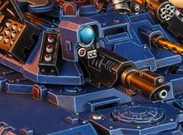

# 1312 激光爪 Las-talon

精校状态：中文行文已逐段精校，部分术语仍为暂定

分类：武器 / 远程武器

原文来源：https://www.bilibili.com/opus/1005074814628528136

原作者：帝国神选罐头

原文时间：2024年11月29日 11:23

[返回分类目录](目录.md) · [全书目录](../../目录.md)

<!-- A1312-B0001 -->
**英文原文**

Las-talons are a type of heavy Laser Weapon utilized by the Stormhawk Interceptors and primaris Repulsors.

<!-- /A1312-B0001 -->

<!-- A1312-B0002 -->

原译文

激光爪是一种重型激光武器，被风暴鹰拦截机和原铸反击者使用。

**校订译文**

激光爪是风暴鹰拦截者战机和原铸反重力战车使用的重型激光武器。

<!-- /A1312-B0002 -->

<!-- A1312-B0003 图片 -->

<!-- A1312-B0004 -->

原译文

Las-talon 激光爪

**校订译文**

Las-talon 激光爪

<!-- /A1312-B0004 -->

<!-- A1312-B0005 -->
**英文原文**

A Las-Talon fires two potent blasts of laser energy in rapid succession, ensuring a clean kill against even the heaviest of armoured targets. Unlike other heavy las weapons, the las-talon is short-ranged, with its damage output heavily reduced at long-range.

<!-- /A1312-B0005 -->

<!-- A1312-B0006 -->

原译文

激光爪快速连续发射两次强大的能量激光，确保对最重的装甲目标进行彻底杀伤。与其他重型激光武器不同，激光爪是短程的，其远程伤害输出大大降低。

**校订译文**

激光爪能迅速连续射出两道强力激光，足以干净利落地摧毁极厚重的装甲目标。与其他重型激光武器不同，它的射程较短，远距离上的杀伤力会大幅衰减。

<!-- /A1312-B0006 -->

<!-- A1312-B0007 -->
**英文原文**

A variant known as the Thunderstrike Las-Talon is mounted on the Storm Speeder Thunderstrike.

<!-- /A1312-B0007 -->

<!-- A1312-B0008 -->

原译文

一种名为雷击型激光爪的变体安装在雷击型风暴速攻艇上。

**校订译文**

雷霆型风暴速攻艇装有一种称为雷霆激光爪的改型。

**校注：** 武器型号 Thunderstrike 沿其载具官方词根雷霆，完整武器名称仍待核。

<!-- /A1312-B0008 -->

本篇核心术语与暂定项

以下列出本篇出现的英文原形及核心术语表用词。同形词可能指不同对象，具体词义以本篇正文和校注为准；单复数、别名和仅见于图注的名称可能尚未列入。完整候选见[术语表](../../术语表/双语术语候选.csv)。

| 英文 | 采用中文 | 状态 |
| --- | --- | --- |
| Repulsors | 反重力战车 | 暂定·官方待核 |
| Storm Speeder | 风暴速攻艇 | 暂定·官方待核 |
| Interceptors | 拦截者 | 暂定·官方待核 |
| Stormhawk | 风暴隼 | 暂定·官方待核 |
| Laser Weapon | 激光武器 | 暂定·官方待核 |
| Las-Talon | 激光爪 | 暂定·官方待核 |
| Thunderstrike Las-Talon | 雷霆激光爪 | 官方词根参考·全称待核 |
| Storm Speeder Thunderstrike | 雷霆型风暴速攻艇 | 官方已核对 |

