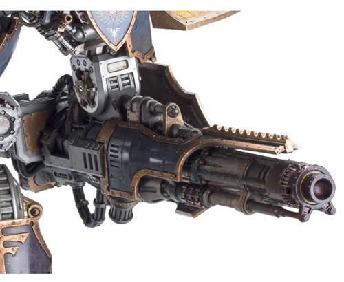
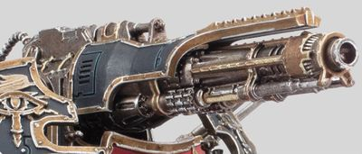
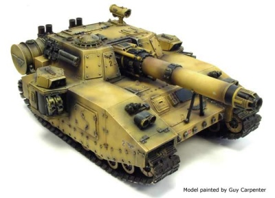

# 1313 火山炮 Volcano Cannon

精校状态：中文行文已逐段精校，部分术语仍为暂定

分类：武器 / 远程武器

原文来源：https://www.bilibili.com/opus/1012483667573866496

原作者：帝国神选罐头

原文时间：2024年12月19日 10:33

[返回分类目录](目录.md) · [全书目录](../../目录.md)

<!-- A1313-B0001 -->
**英文原文**

The Volcano Cannon is amongst the most powerful ground-based laser weapons used by forces of the Imperium of Man, unleashing terawatts of energy in a blazing white laser beam which produces a thunderous crack and tremendous recoil.

<!-- /A1313-B0001 -->

<!-- A1313-B0002 -->

原译文

火山炮是人类帝国部队使用的最强大的地面激光武器之一，释放出数兆瓦的能量，形成一道耀眼的白色激光束，产生雷鸣般的爆裂声和巨大的后坐力。

**校订译文**

火山炮是人类帝国最强大的地面激光武器之一，能以太瓦级功率射出炽白光束，伴随雷鸣般的炸响和巨大的后坐力。

**校注：** terawatt为太瓦（10的12次方瓦），原译兆瓦低了六个数量级；原文虽用energy，瓦为功率单位，译文据单位改为功率。

<!-- /A1313-B0002 -->

<!-- A1313-B0003 -->
## Overview 概述

<!-- /A1313-B0003 -->

<!-- A1313-B0004 -->
**英文原文**

This long-ranged weapon is capable of slicing off a Titan's limb or killing an enemy war engine with a single shot, though even a Warhound Scout Titan with intact Void Shields can survive a direct hit. Its firepower is similarly stupendous against lesser targets, reducing a Razorback to nothing more than a blackened scorch mark and utterly vaporizing a thick hundred meter-tall iron gate as though it never existed.

<!-- /A1313-B0004 -->

<!-- A1313-B0005 -->

原译文

这种远程武器能够一枪斩下泰坦的肢体或杀死敌人的战争引擎，尽管即使是拥有完整虚空盾的战犬侦察泰坦也能在直接命中中幸存下来。它的火力对较小的目标同样惊人，将一辆豪猪化为仅仅是一片焦黑的痕迹，并将一道厚达百米的铁门完全蒸发，仿佛它从未存在过。

**校订译文**

它射程极远，单次开火便能切断泰坦的肢体，或摧毁一台敌方战争机器。不过，拥有完整虚空盾的战犬级侦察泰坦仍可能承受一次直接命中。面对较小目标时，它的威力同样惊人：豪猪战车会被彻底抹去，只留一片焦痕；一扇百米高的厚重铁门也能被完全汽化，仿佛从未存在。

**校注：** hundred meter-tall指高一百米，不是厚一百米。

<!-- /A1313-B0005 -->

<!-- A1313-B0006 图片 -->

<!-- A1313-B0007 -->

原译文

Volcano Cannon of the Warlord Battle Titan 军阀战斗泰坦的火山炮

**校订译文**

Volcano Cannon of the Warlord Battle Titan 战将级战斗泰坦的火山炮

<!-- /A1313-B0007 -->

<!-- A1313-B0008 -->
**英文原文**

Volcano Cannons are manufactured in small numbers on just a handful of Forge Worlds in addition to Mars. These included Estaban III, Phaeton and Gryphonne IV, all of which are surrounded by formidable Imperial defences.

<!-- /A1313-B0008 -->

<!-- A1313-B0009 -->

原译文

除了火星，火山炮在少数铸造世界上也有少量生产。其中包括埃斯塔班三号、法厄同和格里芬四号，它们都被强大的帝国防御所包围。

**校订译文**

除了火星，火山炮在少数铸造世界上也有少量生产。其中包括埃斯塔班三号、法厄同和格里芬四号，它们都被强大的帝国防御所包围。

<!-- /A1313-B0009 -->

<!-- A1313-B0010 -->
**英文原文**

The crystals needed for the weapon to fire, are taken from a mineral vein on the Mining World Cinderus XI. Created when Heretic Psykers were slaughtered and buried beneath the lava rivers on the planet, after a failed plot to kill the Planetary Governor, the crystals cause a loud crackling noise to be emitted by the Volcano Cannon when fired. This noise, which some claim are the final screams of the dead Psykers, has been known to drive those who fight beside the weapon insane; though the tank or Titan crews themselves have never been reported to suffer from these ill effects. As a result units of infantry escorting vehicles and Titans using the Volcano Cannon are subject to periodic purges. The Imperium sees this as an acceptable price to pay for deploying such a devastating weapon on the battlefield.

<!-- /A1313-B0010 -->

<!-- A1313-B0011 -->

原译文

武器发射所需的晶体取自矿业世界煤灰十一号的矿脉。在杀死行星总督的阴谋失败后，异端灵能者被屠杀并埋在星球上的熔岩河下，这些晶体在发射时会引起火山炮发出巨大的噼啪声。这种噪音，一些人声称是死去的灵能者的最后尖叫声，众所周知，它会让那些在武器旁边战斗的人发疯；尽管从未有报道称坦克或泰坦乘员本身受到这些不良影响。因此，护送车辆的步兵部队以及使用火山炮的泰坦会定期受到清理。帝国认为，在战场上部署如此毁灭性的武器是可以接受的代价。

**校订译文**

火山炮开火所需的晶体，产自采矿世界煤灰十一号的一处矿脉。一群异端灵能者刺杀行星总督失败后遭到屠杀，尸体埋在熔岩河下，随后形成了这些晶体。它们会使火山炮开火时发出巨大的爆裂声；有人认为那是死去灵能者最后的惨叫。这种声音曾使在炮旁作战的人员发疯，却没有坦克或泰坦乘员受害的报道。因此，为装备火山炮的载具和泰坦提供护卫的步兵，会定期受到清洗。帝国认为，为在战场上使用如此可怕的武器，这一代价可以接受。

**校注：** 被定期清洗的是护卫步兵，并非泰坦。晶体起源和影响沿所给设定，不另增解释。

<!-- /A1313-B0011 -->

<!-- A1313-B0012 -->
**英文原文**

Titans or Shadowswords using a Volcano Cannon must have them replaced after being fired 1,500 times, in order to avoid catastrophic misfire.

<!-- /A1313-B0012 -->

<!-- A1313-B0013 -->

原译文

使用火山炮的泰坦或影剑在发射1500次后必须更换，以避免灾难性的失火。

**校订译文**

泰坦或影剑的火山炮每发射1,500次便须更换，以免发生灾难性击发故障。

<!-- /A1313-B0013 -->

<!-- A1313-B0014 -->
## Known Patterns 已知型号

<!-- /A1313-B0014 -->

<!-- A1313-B0015 -->
### Titans 泰坦

<!-- /A1313-B0015 -->

<!-- A1313-B0016 -->
**英文原文**

A Reaver Battle Titan can mount a Volcano Cannon only on its two arm mounts, while a Warlord Battle Titan can equip Volcano Cannons on each of its armor carapace hard-points. The massive Imperator Titan can carry up to six on its carapace hard-points.

<!-- /A1313-B0016 -->

<!-- A1313-B0017 -->

原译文

收割者战斗泰坦只能在其两个臂架上安装火山炮，而军阀战斗泰坦可以在其每个装甲甲壳硬点上装备火山炮。巨大的帝皇泰坦可以在其甲壳上携带多达六个硬点。

**校订译文**

掠夺者级战斗泰坦只能将火山炮安装在两处臂部挂点；战将级战斗泰坦则可在各个背甲挂点上安装。庞大的帝皇泰坦最多可在背甲上搭载六门。

**校注：** 本段挂点描述与后面的具体型号配置存在差异，照各自原文保留，不擅自统一武器安装位置。

<!-- /A1313-B0017 -->

<!-- A1313-B0018 -->
### Belicosa pattern 好战型

<!-- /A1313-B0018 -->

<!-- A1313-B0019 -->
**英文原文**

Carried on arm mounts by Mars-Alpha pattern Warlord titans. Too large and powerful to be carried by lesser vehicles or titans, it requires the plasma reactor of a mighty Warlord titan to feed its ravenous appetite for energy.

<!-- /A1313-B0019 -->

<!-- A1313-B0020 -->

原译文

由火星-阿尔法型的军阀泰坦携带的武器。它太大太强，无法由较小的车辆或泰坦携带，需要强大的军阀泰坦的等离子反应堆来满足其对能量的贪婪需求。

**校订译文**

好战型安装于火星—阿尔法型战将级泰坦的臂部。它过于庞大、威力过强，较小的载具或泰坦无法承载，必须由战将级的等离子反应堆满足其巨大的能量需求。

<!-- /A1313-B0020 -->

<!-- A1313-B0021 图片 -->

<!-- A1313-B0022 -->

原译文

Warbringer Titan Belicosa Volcano Cannon 战争使者泰坦好战型火山炮

**校订译文**

Warbringer Titan Belicosa Volcano Cannon 战争使者泰坦好战型火山炮

<!-- /A1313-B0022 -->

<!-- A1313-B0023 -->
### Estaban VII pattern 埃斯塔班七号型

原题：Estaban VII pattern 埃斯塔班VII型

<!-- /A1313-B0023 -->

<!-- A1313-B0024 -->
**英文原文**

The Estaban VII pattern Volcano Cannon is mounted on Shadowswords like the Castigatus.

<!-- /A1313-B0024 -->

<!-- A1313-B0025 -->

原译文

埃斯塔班VII型火山炮像严惩号一样安装在影剑上。

**校订译文**

埃斯塔班七号型火山炮安装于“严惩号”等影剑坦克。

<!-- /A1313-B0025 -->

<!-- A1313-B0026 -->
### Mars-Alpha Pattern Nemesis 火星-阿尔法型复仇女神

<!-- /A1313-B0026 -->

<!-- A1313-B0027 -->
**英文原文**

Can be carried on the carapace of a Warbringer Nemesis Titan.

<!-- /A1313-B0027 -->

<!-- A1313-B0028 -->

原译文

可以携带在战争使者复仇女神泰坦的甲壳上。

**校订译文**

可安装于战争使者型天罚级泰坦的背甲。

<!-- /A1313-B0028 -->

<!-- A1313-B0029 -->
### MkIV Phaeton pattern MkIV法厄同型

<!-- /A1313-B0029 -->

<!-- A1313-B0030 -->
**英文原文**

The current model sanctioned by the Adeptus Mechanicus; which perfected its use in mid-M35.

<!-- /A1313-B0030 -->

<!-- A1313-B0031 -->

原译文

由机械神教批准的现行模式；这完善了它在M35中期的使用。

**校订译文**

这是底稿所述机械修会认可的现行型号，其运用在M35中期得到完善。

<!-- /A1313-B0031 -->

<!-- A1313-B0032 -->
**英文原文**

The Type 22-S, MkIV Volcano Cannon, Phaeton pattern is the Volcano cannon mounted on Imperial Guard Shadowswords. Due to the immense power requirements to fire the weapon, the Shadowsword must be stationary so that the main drive can be disconnected and the generator connected in its place, allowing power to transfer to the vehicle's capacitors. Firing the weapon just once will completely drain the capacitors, again requiring the vehicle to remain stationary so that they may be recharged.

<!-- /A1313-B0032 -->

<!-- A1313-B0033 -->

原译文

22-S型MkIV法厄同火山炮是安装在帝国卫队影剑上的火山炮。由于发射武器的巨大功率要求，影剑必须保持静止，以便可以断开主驱动，并将发电机连接到位，从而将电力传输到车辆的电容器。只发射一次武器就会完全耗尽电容器，再次要求车辆保持静止，以便它们可以充电。

**校订译文**

帝国卫队的影剑使用22-S、Mk.IV 法厄同型火山炮。由于开火所需功率极高，影剑必须停下，断开主驱动装置，转而接通发电装置，为车内电容器充能。开火一次便会耗尽电容器中的能量，因此车辆必须继续保持静止，才能重新充能。

<!-- /A1313-B0033 -->

<!-- A1313-B0034 图片 -->

<!-- A1313-B0035 -->

原译文

Shadowsword with Volcano Cannon 装备火山炮的影剑

**校订译文**

Shadowsword with Volcano Cannon 装备火山炮的影剑

<!-- /A1313-B0035 -->

<!-- A1313-B0036 -->
### MkIII Synne pattern MkIII罪恶型

<!-- /A1313-B0036 -->

<!-- A1313-B0037 -->
### MkII Teracharge pattern Mk.II 太级充能型

原题：MkII Teracharge pattern MkII兆级充能型

**校注：** Tera前缀对应太，原稿兆级充能型保留对照；型号中文仍为暂译。

<!-- /A1313-B0037 -->

<!-- A1313-B0038 -->
**英文原文**

Was said to be even more powerful than the current MkIV, but was never used in service due to being too volatile. When the Teracharge was fired it almost always destroyed the arms of the Titans and hulls of the tanks that carried it. As a result, it was ultimately determined to be a failure by the Adeptus Mechanicus.

<!-- /A1313-B0038 -->

<!-- A1313-B0039 -->

原译文

据说比目前的MkIV更强大，但由于过于不稳定，从未投入使用。当兆级充能发射时，它几乎总是摧毁泰坦的手臂和携带它的坦克的外壳。因此，最终被机械神教确定失败。

**校订译文**

据说太级充能型比后来的 Mk.IV 威力更大，却因极不稳定而从未正式服役。每次开火，它几乎都会毁掉承载它的泰坦手臂或坦克车体，最终被机械修会判定为失败设计。

<!-- /A1313-B0039 -->

<!-- A1313-B0040 -->
### Mk I Variant pattern MkI变体型

<!-- /A1313-B0040 -->

<!-- A1313-B0041 -->
**英文原文**

Volatile when fired; almost as much as the failed MkII pattern.

<!-- /A1313-B0041 -->

<!-- A1313-B0042 -->

原译文

开火时不稳定；几乎和失败的MkII型一样多。

**校订译文**

开火时很不稳定，危险程度几乎与失败的 Mk.II 型相当。

<!-- /A1313-B0042 -->

<!-- A1313-B0043 -->
## Notes 注释

原题：Notes 注意

<!-- /A1313-B0043 -->

<!-- A1313-B0044 -->
**英文原文**

In the original Adeptus Titanicus-era material, the Volcano Cannon was referred to as the Defence Laser

<!-- /A1313-B0044 -->

<!-- A1313-B0045 -->

原译文

在最初的泰坦修会时期的材料中，火山炮被称为防御激光

**校订译文**

在最初《泰坦修会》（Adeptus Titanicus）时期的游戏资料中，火山炮被称为“防御激光”。

**校注：** Adeptus Titanicus此处是游戏及出版时期，不是设定内的泰坦修会时代。

<!-- /A1313-B0045 -->

本篇核心术语与暂定项

以下列出本篇出现的英文原形及核心术语表用词。同形词可能指不同对象，具体词义以本篇正文和校注为准；单复数、别名和仅见于图注的名称可能尚未列入。完整候选见[术语表](../../术语表/双语术语候选.csv)。

| 英文 | 采用中文 | 状态 |
| --- | --- | --- |
| Adeptus Mechanicus | 机械修会 | 官方已核对 |
| Imperial Guard | 帝国卫队 | 暂定·语境区分 |
| Imperium of Man | 人类帝国 | 官方已核对 |
| Imperium | 帝国 | 暂定·简称 |
| Mars | 火星 | 暂定·官方待核 |
| Gryphonne IV | 格里芬四号 | 暂定·官方待核 |
| Titan | 泰坦 | 暂定·官方待核 |
| Razorback | 豪猪战车 | 官方已核对 |
| Scout | 侦察兵 | 暂定·官方待核 |
| Nemesis | 复仇女神 | 暂定·官方待核 |
| Shadowsword | 影剑 | 官方已核对 |
| Warlord Battle Titan | 战将级战斗泰坦 | 官方词根参考·全称待核 |
| The Weapon | 武器 | 暂定·官方待核 |
| Warbringer Nemesis Titan | 战争使者型天罚级泰坦 | 官方已核对 |
| Warlord Titan | 战将级泰坦 | 官方已核对 |
| Price | 普莱斯 | 暂定·官方待核 |
| Estaban III | 埃斯塔班三号 | 暂定·官方待核 |
| Estaban VII | 埃斯塔班七号 | 暂定·官方待核 |
| Phaeton | 法厄同 | 暂定·官方待核 |
| Mining World | 矿业世界 | 暂定·官方待核 |
| Laser Weapons | 激光武器 | 暂定·官方待核 |
| Phaeton Pattern | 法厄同型 | 暂定·官方待核 |
| Volcano cannon | 火山炮 | 官方已核对 |
| Cinderus XI | 煤灰十一号 | 暂定·官方待核 |
| Castigatus | 严惩号 | 暂定·官方待核 |

