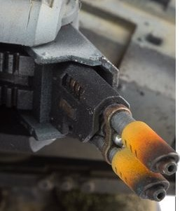

# 1314 激光撕裂炮 Las-Ripper

精校状态：中文行文已逐段精校，部分术语仍为暂定

分类：武器 / 远程武器

原文来源：https://www.bilibili.com/opus/1005074750187241481

原作者：帝国神选罐头

原文时间：2024年11月29日 11:23

[返回分类目录](目录.md) · [全书目录](../../目录.md)

原篇名：激光开膛炮 Las-Ripper

<!-- A1314-B0001 -->
**英文原文**

The Las-Ripper is a type of Laser Weapon used on the Imperial Astraeus Super-Heavy Tank. These weapons are frequently mounted on the sponsons of the vehicle.

<!-- /A1314-B0001 -->

<!-- A1314-B0002 -->

原译文

激光开膛手是帝国阿斯特赖俄斯超重型坦克上使用的一种激光武器。这些武器经常安装在车辆的舷侧。

**校订译文**

激光撕裂炮是帝国阿斯特赖俄斯超重型坦克使用的激光武器，通常安装在侧炮座上。

<!-- /A1314-B0002 -->

<!-- A1314-B0003 图片 -->

<!-- A1314-B0004 -->

原译文

Twin-linked Las-Rippers 双联激光开膛手

**校订译文**

Twin-linked Las-Rippers 双联激光撕裂炮

<!-- /A1314-B0004 -->

本篇核心术语与暂定项

以下列出本篇出现的英文原形及核心术语表用词。同形词可能指不同对象，具体词义以本篇正文和校注为准；单复数、别名和仅见于图注的名称可能尚未列入。完整候选见[术语表](../../术语表/双语术语候选.csv)。

| 英文 | 采用中文 | 状态 |
| --- | --- | --- |
| Astraeus | 阿斯特赖俄斯超重型坦克 | 暂定·官方待核 |
| Las-Ripper | 激光撕裂炮 | 暂定·官方待核 |
| Laser Weapon | 激光武器 | 暂定·官方待核 |
| Astraeus Super-heavy Tank | 阿斯特赖俄斯超重型坦克 | 暂定·官方待核 |

