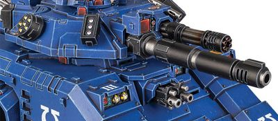
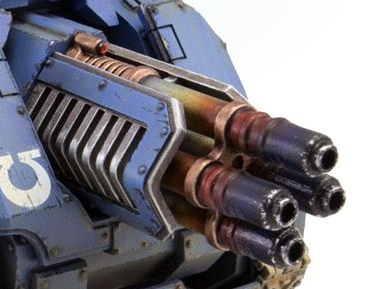

# 1315 激光毁灭炮 Laser Destroyer

精校状态：中文行文已逐段精校，部分术语仍为暂定

分类：武器 / 远程武器

原文来源：https://www.bilibili.com/opus/1004335079496876067

原作者：帝国神选罐头

原文时间：2024年11月27日 11:33

[返回分类目录](目录.md) · [全书目录](../../目录.md)

原篇名：激光破坏炮 Laser Destroyer

<!-- A1315-B0001 -->
**英文原文**

The Laser Destroyer is a laser weapon, capable of destroying enemy tanks from long range. It is a highly-complex system that all but a few Forge Worlds can still reproduce; those who can create new ones must hand-craft each one through a painstakingly slow process.

<!-- /A1315-B0001 -->

<!-- A1315-B0002 -->

原译文

激光破坏炮是一种激光武器，能够远距离摧毁敌方坦克。这是一个非常复杂的系统，几乎只有少数几个铸造世界仍然能够复制；那些创造者必须通过一个极其缓慢的过程手工制作每一个。

**校订译文**

激光毁灭炮是一种能在远距离摧毁敌方坦克的激光武器。其系统极其复杂，只有少数铸造世界还能生产，而且每一门都必须经历漫长而精细的手工制作。

**校注：** 原文all but a few与后半句逻辑不合，按全文仅少数铸造世界能制造的明确语境译出。

<!-- /A1315-B0002 -->

<!-- A1315-B0003 -->
## Rapier Laser Destroyer 细剑激光毁灭炮

原题：Rapier Laser Destroyer 细剑激光破坏炮

<!-- /A1315-B0003 -->

<!-- A1315-B0004 -->
**英文原文**

The Rapier Laser Destroyer is a semi-automated tracked weapons carrier used by the Imperium of Man, including the Imperial Guard, Adeptus Mechanicus and Space Marines. A potent anti-tank weapon, it mounts a powerful multi-barrelled laser cannon with which it shares its name.

<!-- /A1315-B0004 -->

<!-- A1315-B0005 -->

原译文

细剑激光破坏炮是一种半自动履带式武器平台，由帝国卫队、机械神教和星际战士使用。作为一种强大的反坦克武器，它装备了一门与其同名的强大多管激光炮。

**校订译文**

细剑激光毁灭炮也是一种半自动履带式武器平台的名称，帝国卫队、机械修会和星际战士都会使用。平台搭载与其同名的多管激光炮，是威力强大的反坦克武器。

**校注：** 同名条目兼指武器及其履带平台，避免将整个平台当成单门火炮。

<!-- /A1315-B0005 -->

<!-- A1315-B0006 图片 -->

<!-- A1315-B0007 -->

原译文

Rapier Laser Destroyer 细剑激光破坏炮

**校订译文**

Rapier Laser Destroyer 细剑激光毁灭炮

<!-- /A1315-B0007 -->

<!-- A1315-B0008 -->
## Imperial Guard 帝国卫队

<!-- /A1315-B0008 -->

<!-- A1315-B0009 -->
**英文原文**

The Imperial Guard uses this weapon primarily on the Destroyer Tank Hunter. The chance of receiving any replacement for lost or destroyed models is very slim, often leading to recovered tank destroyers instead being fitted with another weapon. During the invasion of Armageddon, though, a number of Chimeras were refitted with Laser Destroyers and re-designated APDS-6a 'Defenders' as an effective stop-gap measure against the Orks.

<!-- /A1315-B0009 -->

<!-- A1315-B0010 -->

原译文

帝国卫队主要在毁灭者坦克歼击车身上使用这种武器。获得替换丢失或被摧毁型号的机会非常渺茫，这通常导致回收的坦克歼击车被改装成装备其他武器的车辆。然而，在阿米吉多顿入侵期间，许多奇美拉被改装激光破坏炮，并重新指定APDS-6a“防御者”，作为对抗兽人的有效权宜之计。

**校订译文**

帝国卫队主要将这种武器用于毁灭者反坦克车。损失或损坏的激光毁灭炮极难得到补充，因此回收的坦克往往只能改装其他武器。不过，在阿玛吉多顿遭入侵期间，一批奇美拉装甲车被改装激光毁灭炮，重新定名为 APDS-6a“防御者”，成为对付欧克的有效应急措施。

<!-- /A1315-B0010 -->

<!-- A1315-B0011 -->
## Space Marines 星际战士

<!-- /A1315-B0011 -->

<!-- A1315-B0012 -->
### Heavy Laser Destroyer 重型激光毁灭炮

原题：Heavy Laser Destroyer 重型激光破坏炮

<!-- /A1315-B0012 -->

<!-- A1315-B0013 -->
**英文原文**

The Heavy Laser Destroyer is a type of heavy Laser Weapon with powerful anti-armor capability. It is commonly mounted on the Repulsor Executioner tank.

<!-- /A1315-B0013 -->

<!-- A1315-B0014 -->

原译文

重型激光破坏炮是一种具有强大反装甲能力的重型激光武器。它通常安装在处刑反击者坦克上。

**校订译文**

重型激光毁灭炮是一种反装甲能力极强的重型激光武器，通常安装于处决者型反重力战车。

<!-- /A1315-B0014 -->

<!-- A1315-B0015 图片 -->

<!-- A1315-B0016 -->

原译文

Heavy Laser Destroyer 重型激光破坏炮

**校订译文**

Heavy Laser Destroyer 重型激光毁灭炮

<!-- /A1315-B0016 -->

<!-- A1315-B0017 -->
### Magna Laser Destroyer 巨型激光毁灭炮

原题：Magna Laser Destroyer 巨型激光破坏炮

<!-- /A1315-B0017 -->

<!-- A1315-B0018 -->
**英文原文**

During the Horus Heresy, Deimos Pattern Vindicators could be equipped with a Magna Laser Destroyer array, allowing them to tear through the armour plating of enemy vehicles. The laser destroyer's rate of fire could be greatly increase through mounting a power capacitor in the vehicle's internal volume, which is normally taken up with a munitions store for the more common Vindicator's Demolisher cannon. Stability is required for this overcharged firing however, and it is possible for the capacitor to overload the vehicle's energy grid with disastrous consequences.

<!-- /A1315-B0018 -->

<!-- A1315-B0019 -->

原译文

在荷鲁斯叛乱期间，火卫二型维护者可以配备巨型激光破坏炮阵列，使他们能够撕裂敌方车辆的装甲。通过在车辆内部安装一个动力电容器，激光破坏炮的射速可以大大提高，而这个空间通常用于存放更常见的维护者的粉碎者加农炮的弹药。然而，过载射击需要稳定性，动力电容器有可能会使车辆的电网过载，导致灾难性的后果。

**校订译文**

荷鲁斯之乱期间，迪莫斯型维护者战车可配备巨型激光毁灭炮阵列，以撕开敌方载具的装甲。常规维护者原本用于存放破坏者炮弹药的车内空间，可改装供能电容器，大幅提高激光毁灭炮的射速。不过，过载射击要求平台保持稳定；电容器也可能使全车供能网络过载，酿成灾难。

<!-- /A1315-B0019 -->

<!-- A1315-B0020 图片 -->

<!-- A1315-B0021 -->

原译文

Magna Laser Destroyer 巨型激光破坏炮

**校订译文**

Magna Laser Destroyer 巨型激光毁灭炮

<!-- /A1315-B0021 -->

本篇核心术语与暂定项

以下列出本篇出现的英文原形及核心术语表用词。同形词可能指不同对象，具体词义以本篇正文和校注为准；单复数、别名和仅见于图注的名称可能尚未列入。完整候选见[术语表](../../术语表/双语术语候选.csv)。

| 英文 | 采用中文 | 状态 |
| --- | --- | --- |
| Space Marines | 星际战士 | 官方已核对 |
| Adeptus Mechanicus | 机械修会 | 官方已核对 |
| Imperial Guard | 帝国卫队 | 暂定·语境区分 |
| Orks | 欧克蛮人 | 官方已核对 |
| Horus Heresy | 荷鲁斯之乱 | 官方已核对 |
| Imperium of Man | 人类帝国 | 官方已核对 |
| Imperium | 帝国 | 暂定·简称 |
| Horus | 荷鲁斯 | 暂定·官方待核 |
| Armageddon | 阿玛吉多顿 | 暂定·官方待核 |
| Deimos | 迪莫斯 | 暂定·官方待核 |
| Vindicator | 维护者战车 | 官方已核对 |
| Destroyer | 毁灭者 | 暂定·官方待核 |
| Destroyers | 毁灭者 | 暂定·官方待核 |
| Vindicators | 维护者 | 暂定·官方待核 |
| Repulsor | 反重力战车 | 官方已核 |
| Repulsor Executioner | 处决者型反重力战车 | 官方已核对 |
| System | 星系（恒星系统） | 暂定·官方待核 |
| Demolisher Cannon | 破坏者加农炮 | 暂定·官方待核 |
| Rapier Laser Destroyer | 细剑激光毁灭炮 | 暂定·官方待核 |
| Laser Weapon | 激光武器 | 暂定·官方待核 |
| Laser Destroyer | 激光毁灭炮 | 暂定·官方待核 |
| Heavy Laser Destroyer | 重型激光毁灭炮 | 暂定·官方待核 |
| Magna Laser Destroyer | 巨型激光毁灭炮 | 暂定·官方待核 |

