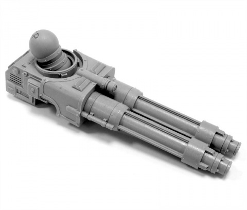
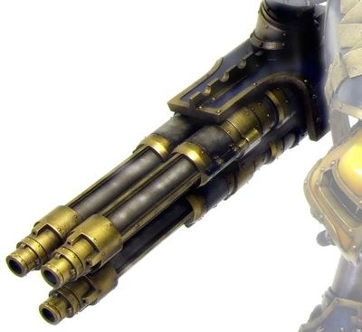

# 1316 涡轮激光破坏炮 Turbo-Laser Destructor

精校状态：中文行文已逐段精校，部分术语仍为暂定

分类：武器 / 远程武器

原文来源：https://www.bilibili.com/opus/1006596242357092359

原作者：帝国神选罐头

原文时间：2024年12月03日 13:47

[返回分类目录](目录.md) · [全书目录](../../目录.md)

<!-- A1316-B0001 -->
**英文原文**

The Turbo-Laser Destructor is a potent laser-based energy weapon typically mounted on Imperial Titans, but employed elsewhere in the Imperium on other super-heavy vehicles.

<!-- /A1316-B0001 -->

<!-- A1316-B0002 -->

原译文

涡轮激光破坏炮是一种强大的基于激光的能量武器，通常安装在帝国泰坦上，但在帝国的其他地方也用于其他超重型载具。

**校订译文**

涡轮激光破坏炮是一种强大的激光能量武器，通常安装于帝国泰坦，也可用于其他超重型载具。

<!-- /A1316-B0002 -->

<!-- A1316-B0003 -->
## Overview 概述

<!-- /A1316-B0003 -->

<!-- A1316-B0004 -->
**英文原文**

Typically mounted in groups of two or three to inflict as much damage as possible, the weapon is best employed against other superheavy vehicles due to its long range and concentrated destructive power.

<!-- /A1316-B0004 -->

<!-- A1316-B0005 -->

原译文

该武器通常以两到三个一组的形式安装，以造成尽可能大的伤害，由于其射程远、破坏力集中，最适合用于对抗其他超重型载具。

**校订译文**

它通常以两门或三门成组安装，以集中造成更大破坏。凭借远射程与集中的杀伤力，它最适合对付其他超重型载具。

<!-- /A1316-B0005 -->

<!-- A1316-B0006 -->
**英文原文**

Turbo-lasers are known to be very destructive to the surrounding environment, capable of penetrating through the ground down to the bedrock and leaving behind long gouges of fused earth. In urban environments their scorching emissions have shivered tiles off roofs and shattered windows at their passing, and an entire block-row of buildings can be leveled in one sweep of these weapons. Against lesser foes turbo-lasers have been known to cause infantry to ignite and evaporate almost instantly. Even passing just a few meters overhead will sear the meat off the bone of exposed troopers. Turbo-lasers will also punch right through the armour of Battle Tanks, tearing them in two and disintegrating them with a single shot. Imperial super-heavy tanks will also be destroyed by a single blast, though it may take scant seconds to melt through their frontal armour. However the Void Shields of even a Warhound Scout Titan allow it to survive multiple hits from a turbo-laser.

<!-- /A1316-B0006 -->

<!-- A1316-B0007 -->

原译文

众所周知，涡轮激光对周围环境具有极大的破坏性，能够穿透地面到达基岩，并留下熔融土的长孔。在城市环境中，它们灼热的投射物在经过时把屋顶上的瓷砖都震碎了，窗户也碎了，用这些武器一次就能把整排建筑夷为平地。众所周知，对付弱小敌人时，涡轮激光会使步兵几乎立即点燃并蒸发。即使从头顶经过几米，暴露在外的士兵的骨头上的肉也会被烧焦。涡轮激光也会直接穿透战斗坦克的装甲，将其撕成两半，并在一次射击中将其瓦解。帝国的超重型坦克也将被一次爆炸摧毁，尽管可能需要几秒钟的时间才能穿透其正面装甲。然而，即使是战犬侦察泰坦的虚空盾也能让它在涡轮激光的多次打击下幸存下来。

**校订译文**

涡轮激光能严重破坏周围环境：光束可贯穿地面直达基岩，在熔融的大地上犁出长沟。在城市中，灼热光束经过时会震落屋瓦、击碎窗户，一次横扫便可夷平整排建筑。普通步兵会在瞬间燃烧、汽化；即使光束只是从头顶几米处掠过，也足以将无遮蔽士兵的血肉从骨头上烧去。主战坦克的装甲会被直接贯穿，车体被撕裂、瓦解。帝国超重型坦克也可能被一发摧毁，只是熔穿其正面装甲需要短短数秒。相比之下，即使战犬级侦察泰坦也能凭借虚空盾，承受多次涡轮激光命中。

<!-- /A1316-B0007 -->

<!-- A1316-B0008 图片 -->

<!-- A1316-B0009 -->

原译文

twin-linked Turbo-Laser 双联涡轮激光

**校订译文**

twin-linked Turbo-Laser 双联涡轮激光

<!-- /A1316-B0009 -->

<!-- A1316-B0010 -->
## Configurations 构造

<!-- /A1316-B0010 -->

<!-- A1316-B0011 -->
**英文原文**

Single-Barreled - A single Turbo-Laser Destructor barrel is sometimes mounted on some patterns of Thunderhawk gunship, as well as on some "counterfeit" Shadowswords.

<!-- /A1316-B0011 -->

<!-- A1316-B0012 -->

原译文

单管 - 一个涡轮激光破坏炮管有时安装在某些型号的雷鹰炮艇上，以及一些“伪造”的影剑上。

**校订译文**

单管——部分雷鹰炮艇，以及一些“仿制”影剑，会装备单管涡轮激光破坏炮。

<!-- /A1316-B0012 -->

<!-- A1316-B0013 -->
**英文原文**

Double-Barreled - Twin-linked Turbo-Lasers are commonly carried by Warhounds in their arm mounts, they are also sometimes fitted to the carapace hard-points of the larger Reaver and Warlord Battle Titan.

<!-- /A1316-B0013 -->

<!-- A1316-B0014 -->

原译文

双管 - 双联涡轮激光通常由战犬携带在臂架上，有时也会安装在较大的掠夺者和军阀战斗泰坦的装甲硬点上。

**校订译文**

双管——双联涡轮激光炮常安装于战犬级泰坦的臂部，有时也安装于更大的掠夺者级和战将级战斗泰坦的背甲挂点。

<!-- /A1316-B0014 -->

<!-- A1316-B0015 -->
**英文原文**

Laser Blaster (Triple-Barreled) - The Laser Blaster is essentially three Turbo-Laser barrels mounted together on a single hard-point. Reaver titans commonly mount one or more as an arm weapon, as do certain patterns of Warlord titan, with the Mars-Alpha pattern Warlord commonly mounting a pair in carapace mounts. The Imperator-class Titan can also carry one or more Laser Blasters on its carapace hard-points.

<!-- /A1316-B0015 -->

<!-- A1316-B0016 -->

原译文

激光爆破炮（三管式）- 激光爆破炮本质上是三个涡轮激光炮管安装在一个硬点上。掠夺者泰坦通常会安装一个或多个作为武器，某些型号的军阀泰坦也是如此，火星-阿尔法型的军阀通常会在甲壳架上安装一对。帝皇级泰坦还可以在其装甲硬点上携带一个或多个激光发射器。

**校订译文**

激光爆破炮（三管）——将三根涡轮激光炮管集成在一个挂点上。掠夺者级泰坦通常在臂部装备一门或多门，部分战将级型号也如此；火星—阿尔法型战将级则常在背甲上安装一对。帝皇级泰坦也可在背甲挂点上搭载一门或多门激光爆破炮。

<!-- /A1316-B0016 -->

<!-- A1316-B0017 图片 -->

<!-- A1316-B0018 -->

原译文

Laser Blaster 激光爆破炮

**校订译文**

Laser Blaster 激光爆破炮

<!-- /A1316-B0018 -->

本篇核心术语与暂定项

以下列出本篇出现的英文原形及核心术语表用词。同形词可能指不同对象，具体词义以本篇正文和校注为准；单复数、别名和仅见于图注的名称可能尚未列入。完整候选见[术语表](../../术语表/双语术语候选.csv)。

| 英文 | 采用中文 | 状态 |
| --- | --- | --- |
| Imperium | 帝国 | 暂定·简称 |
| Mars | 火星 | 暂定·官方待核 |
| Titan | 泰坦 | 暂定·官方待核 |
| Scout | 侦察兵 | 暂定·官方待核 |
| Thunderhawk Gunship | 雷鹰炮艇 | 暂定·官方待核 |
| Destructor | 破坏者（史洛斯类别） | 暂定·官方待核 |
| Warlord Battle Titan | 战将级战斗泰坦 | 官方词根参考·全称待核 |
| The Weapon | 武器 | 暂定·官方待核 |
| Warlord Titan | 战将级泰坦 | 官方已核对 |
| Turbo-laser Destructor | 涡轮激光破坏炮 | 暂定·官方待核 |
| Laser Blaster | 激光爆破炮 | 暂定·官方待核 |

