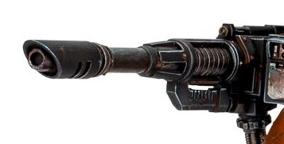

# 1317 阿拉克纳斯重型激光炮 Arachnus Heavy Lascannon

精校状态：中文行文已逐段精校，部分术语仍为暂定

分类：武器 / 远程武器

原文来源：https://www.bilibili.com/opus/1011020586947706899

原作者：帝国神选罐头

原文时间：2024年12月15日 11:56

[返回分类目录](目录.md) · [全书目录](../../目录.md)

原篇名：阿拉克努斯重型激光炮 Arachnus Heavy Lascannon

<!-- A1317-B0001 -->
**英文原文**

The Arachnus Heavy Lascannon is a type of heavy Lascannon sometimes mounted on Space Marine Deredeo Dreadnoughts.

<!-- /A1317-B0001 -->

<!-- A1317-B0002 -->

原译文

阿拉克努斯重型激光炮是一种有时安装在星际战士德雷都无畏上的重型激光炮。

**校订译文**

阿拉克纳斯重型激光炮是一种重型激光炮，有时安装于星际战士的德雷都型无畏机甲。

<!-- /A1317-B0002 -->

<!-- A1317-B0003 图片 -->

<!-- A1317-B0004 -->

原译文

Arachnus Heavy Lascannon 阿拉克努斯重型激光炮

**校订译文**

Arachnus Heavy Lascannon 阿拉克纳斯重型激光炮

<!-- /A1317-B0004 -->

本篇核心术语与暂定项

以下列出本篇出现的英文原形及核心术语表用词。同形词可能指不同对象，具体词义以本篇正文和校注为准；单复数、别名和仅见于图注的名称可能尚未列入。完整候选见[术语表](../../术语表/双语术语候选.csv)。

| 英文 | 采用中文 | 状态 |
| --- | --- | --- |
| Space Marine | 星际战士 | 暂定·官方待核 |
| Arachnus | 阿拉克纳斯 | 暂定·官方待核 |
| Arachnus Heavy Lascannon | 阿拉克纳斯重型激光炮 | 暂定·官方待核 |
| Lascannon | 激光炮 | 官方已核对 |

