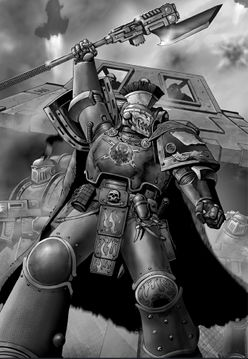
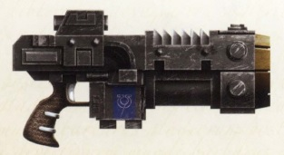
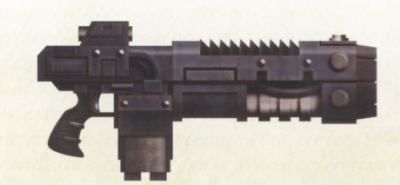
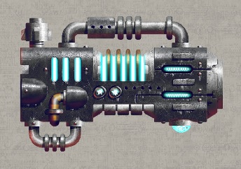
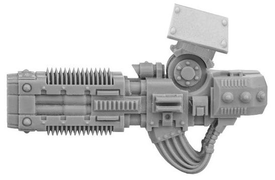

# 1318 爆燃武器 Volkite Weapon

精校状态：中文行文已逐段精校，部分术语仍为暂定

分类：武器 / 远程武器

原文来源：https://www.bilibili.com/opus/1008412596914618372

原作者：帝国神选罐头

原文时间：编辑于 2025年08月18日 09:16

[返回分类目录](目录.md) · [全书目录](../../目录.md)

<!-- A1318-B0001 -->
**英文原文**

"Volkite Weapon" is a Mechanicum term for a type of ancient "thermal" ray weapon dating back to the Age of Strife. How these differ from other rays that heat up a target (such as a thermal laser or melta weapon) is unclear.

<!-- /A1318-B0001 -->

<!-- A1318-B0002 -->

原译文

“爆燃武器”是一个机械教术语，指的是一种可以追溯到纷争时代的古代“热能”射线武器。这些射线与加热目标的其他射线（如热激光或热熔武器）有何不同尚不清楚。

**校订译文**

“爆燃武器”是一个机械教术语，指的是一种可以追溯到纷争时代的古代“热能”射线武器。这些射线与加热目标的其他射线（如热激光或热熔武器）有何不同尚不清楚。

<!-- /A1318-B0002 -->

<!-- A1318-B0003 -->
## Overview 概述

<!-- /A1318-B0003 -->

<!-- A1318-B0004 -->
**英文原文**

Possessing a killing power surpassing most armaments of their size, Volkites were little-understood and difficult to replicate on even the most capable Mechanicus Forge Worlds. Volkite weapons could deflagrate organic matter, explosively burning flesh into ash and jetting fire. A direct hit by a Volkite weapon could cause a target to simply combust, often taking nearby comrades with them.

<!-- /A1318-B0004 -->

<!-- A1318-B0005 -->

原译文

爆燃武器拥有超过大多数同尺寸武器的杀伤力，即使在最有能力的机械神教铸造世界上也难以理解和复制。爆燃武器能够使有机物迅速燃烧，爆炸性地将肉体烧成灰烬并喷射火焰。爆燃武器的直接命中可以使目标瞬间燃烧，通常还会波及附近的同伴。

**校订译文**

爆燃武器的杀伤力超过大多数同等尺寸的兵器，但其原理鲜为人知，即使技术最强的机械修会铸造世界也很难仿造。它能使有机物发生爆燃，将血肉猛烈焚为灰烬，并喷出烈火。直接命中的目标往往会整个人燃烧起来，连累附近同伴一同遭殃。

<!-- /A1318-B0005 -->

<!-- A1318-B0006 -->
**英文原文**

At one point they were relatively common in the fledgling Space Marine Legions, but by the time of the Horus Heresy were a rarity and had been replaced by the more flexible and easy to manufacture bolter. The loss of Forge Worlds during the Horus Heresy sped the decline of Volkite weapons in the Imperium.

<!-- /A1318-B0006 -->

<!-- A1318-B0007 -->

原译文

在星际战士军团的初创时期，爆燃武器相对常见，但到了荷鲁斯叛乱时期，它们已经变得稀有，并被更灵活且易于制造的爆弹枪所取代。荷鲁斯叛乱期间铸造世界的损失加速了爆燃武器在帝国中的衰退。

**校订译文**

星际战士军团初创时，爆燃武器曾相当常见；到了荷鲁斯之乱时期，它们已日益稀少，被用途更灵活、制造更容易的爆矢枪取代。战乱期间铸造世界的损失，又加速了它们在帝国中的衰落。

<!-- /A1318-B0007 -->

<!-- A1318-B0008 -->
**英文原文**

Telerac pattern weapons are far more ancient and ill-omened than even those designated 'Proteus', the name implying dark associations with the technological horrors of the Age of Strife. The shortage of reliable supplies of Volkite weaponry saw many Telerac pattern weapons restored to service, and carefully maintained in the Space Marine armouries.

<!-- /A1318-B0008 -->

<!-- A1318-B0009 -->

原译文

特勒拉克型武器比那些被称为“普罗透斯”的武器更为古老且不祥，其名称暗示着与纷争时代恐怖技术的黑暗联系。由于热熔武器的可靠供应的短缺，许多特勒拉克型武器被恢复使用，并在星际战士武器库中精心维护。

**校订译文**

特勒拉克型甚至比普罗透斯型更古老、更不祥，其名称暗示着与纷争时代恐怖技术的阴暗联系。由于爆燃武器缺乏可靠供应，许多特勒拉克型被重新启用，并在星际战士军械库中得到精心维护。

**校注：** 原译将Volkite误作热熔，已恢复爆燃；关于特勒拉克与普罗透斯孰早，1323同篇内部也存在相反描述，保留源文差异。

<!-- /A1318-B0009 -->

<!-- A1318-B0010 -->
## Types 类别

<!-- /A1318-B0010 -->

<!-- A1318-B0011 -->
### Personal 个人

<!-- /A1318-B0011 -->

<!-- A1318-B0012 -->
**英文原文**

Artellus Numeon's glaive - A glaive with an integrated volkite weapon.

<!-- /A1318-B0012 -->

<!-- A1318-B0013 -->

原译文

阿特路斯·努梅翁的长刀 - 一种集成了爆燃武器的长刀。

**校订译文**

阿泰勒斯·努梅昂的长刀——集成了爆燃武器。

<!-- /A1318-B0013 -->

<!-- A1318-B0014 图片 -->

<!-- A1318-B0015 -->

原译文

Artellus Numeon 阿特路斯·努梅翁

**校订译文**

Artellus Numeon 阿泰勒斯·努梅昂

<!-- /A1318-B0015 -->

<!-- A1318-B0016 -->
**英文原文**

Volkite Serpenta - Used by Mechanicum, Adeptus Mechanicus, and Legiones Astartes

<!-- /A1318-B0016 -->

<!-- A1318-B0017 -->

原译文

爆燃蛇铳 - 被机械神教和阿斯塔特军团使用

**校订译文**

爆燃蛇铳——由机械教、机械修会和阿斯塔特军团使用。

<!-- /A1318-B0017 -->

<!-- A1318-B0018 -->
**英文原文**

Neo-Volkite Pistol - Modern Volkite weapon used by Primaris Space Marines

<!-- /A1318-B0018 -->

<!-- A1318-B0019 -->

原译文

新型爆燃手枪 - 原铸星际战士使用的现代爆燃武器

**校订译文**

新型爆燃手枪 - 原铸星际战士使用的现代爆燃武器

<!-- /A1318-B0019 -->

<!-- A1318-B0020 -->
**英文原文**

Volkite Charger - Used by the Imperialis Militia, Solar Auxilia, Mechanicum, and the Legiones Astartes / Adeptus Astartes

<!-- /A1318-B0020 -->

<!-- A1318-B0021 -->

原译文

爆燃突击铳 - 供帝国民兵、太阳辅助军、机械教和阿斯塔特军团/阿斯塔特修会使用

**校订译文**

爆燃突击铳 - 供帝国民兵、太阳辅助军、机械教和阿斯塔特军团/阿斯塔特修会使用

<!-- /A1318-B0021 -->

<!-- A1318-B0022 图片 -->

<!-- A1318-B0023 -->

原译文

Volkite Charger 爆燃突击铳

**校订译文**

Volkite Charger 爆燃突击铳

<!-- /A1318-B0023 -->

<!-- A1318-B0024 -->
**英文原文**

Volkite Caliver - Used by the Legiones Astartes, Mechanicum and Astra Militarum

<!-- /A1318-B0024 -->

<!-- A1318-B0025 -->

原译文

爆燃火铳 - 被阿斯塔特军团、机械教和星界军使用

**校订译文**

爆燃火铳 - 被阿斯塔特军团、机械教和星界军使用

<!-- /A1318-B0025 -->

<!-- A1318-B0026 图片 -->

<!-- A1318-B0027 -->

原译文

Volkite Caliver 爆燃火铳

**校订译文**

Volkite Caliver 爆燃火铳

<!-- /A1318-B0027 -->

<!-- A1318-B0028 -->
**英文原文**

Volkite Blaster - Used by Tech-Priest Dominus

<!-- /A1318-B0028 -->

<!-- A1318-B0029 -->

原译文

爆燃爆破枪 - 由统御神甫使用

**校订译文**

爆燃爆破枪——技术祭司主宰者使用。

<!-- /A1318-B0029 -->

<!-- A1318-B0030 图片 -->

<!-- A1318-B0031 -->

原译文

Volkite Blaster 爆燃爆破枪

**校订译文**

Volkite Blaster 爆燃爆破枪

<!-- /A1318-B0031 -->

<!-- A1318-B0032 -->
**英文原文**

Volkite Cavitor - Used by Contekar Terminators

<!-- /A1318-B0032 -->

<!-- A1318-B0033 -->

原译文

空腔爆燃枪 - 肯特卡终结者使用

**校订译文**

空腔爆燃铳——肯特卡终结者使用。

<!-- /A1318-B0033 -->

<!-- A1318-B0034 -->
### Support/Vehicle 支援/载具

<!-- /A1318-B0034 -->

<!-- A1318-B0035 -->
**英文原文**

Volkite Incinerator - Mounted into the chest of Ursarax troops.

<!-- /A1318-B0035 -->

<!-- A1318-B0036 -->

原译文

爆燃焚化者 - 安装在铁熊部队的胸前。

**校订译文**

爆燃焚化器——安装于铁熊部队胸部。

<!-- /A1318-B0036 -->

<!-- A1318-B0037 -->
**英文原文**

Volkite Falconet - Used on the Deredeo Dreadnought

<!-- /A1318-B0037 -->

<!-- A1318-B0038 -->

原译文

爆燃隼炮 - 用于德雷都无畏

**校订译文**

爆燃隼炮——用于德雷都型无畏机甲。

<!-- /A1318-B0038 -->

<!-- A1318-B0039 -->
**英文原文**

Volkite Sentinel - Twin-Linked Volkite Chargers controlled by a Servitor brain. Mounted on larger Mechanicum war engines such as the Triaros Armoured Conveyer.

<!-- /A1318-B0039 -->

<!-- A1318-B0040 -->

原译文

爆燃哨兵 - 由机仆大脑控制的双联爆燃突击者。安装在更大的机械教战争引擎上，如特里亚罗斯装甲运输机。

**校订译文**

爆燃哨兵——由机仆大脑控制的双联爆燃突击铳，安装于特里亚罗斯装甲运输车等大型机械教战争机器。

<!-- /A1318-B0040 -->

<!-- A1318-B0041 -->
**英文原文**

Volkite Saker - Mounted on the Sabre Tank Hunter

<!-- /A1318-B0041 -->

<!-- A1318-B0042 -->

原译文

爆燃长管炮 - 安装在军刀反坦克载具上

**校订译文**

爆燃长管炮 - 安装在军刀反坦克载具上

<!-- /A1318-B0042 -->

<!-- A1318-B0043 -->
**英文原文**

Volkite Demi-Culverin - Mounted on the Leman Russ Incinerator

<!-- /A1318-B0043 -->

<!-- A1318-B0044 -->

原译文

爆燃半长炮 - 安装在黎曼鲁斯焚化者上

**校订译文**

爆燃半长炮 - 安装在黎曼鲁斯焚化者上

<!-- /A1318-B0044 -->

<!-- A1318-B0045 -->
**英文原文**

Volkite Culverin - Used by Myrmidon Destructors, Knight Acastus-pattern Imperial Knights, Tactical Support Squads and Contemptor Pattern Dreadnoughts

<!-- /A1318-B0045 -->

<!-- A1318-B0046 -->

原译文

爆燃长炮 - 被辅军歼灭士、帝国骑士的阿卡斯托斯型骑士、战术支援小队和蔑视者型无畏使用

**校订译文**

爆燃长炮——由辅军精锐毁灭士、阿卡斯托斯型帝国骑士、战术支援小队和蔑视者型无畏机甲使用。

<!-- /A1318-B0046 -->

<!-- A1318-B0047 图片 -->

<!-- A1318-B0048 -->

原译文

Volkite Culverin 爆燃长炮

**校订译文**

Volkite Culverin 爆燃长炮

<!-- /A1318-B0048 -->

<!-- A1318-B0049 -->
**英文原文**

Volkite Carronade - Mounted on the Glaive Super-heavy Special Weapons Tank

<!-- /A1318-B0049 -->

<!-- A1318-B0050 -->

原译文

爆燃短重炮 - 安装在飞刃超重型特种武器坦克上

**校订译文**

爆燃短重炮 - 安装在飞刃超重型特种武器坦克（Fellglaive 原稿亦译残暴刃）上

**校注：** Glaive/Fellglaive 为同一坦克，与448的长刀号舰船不同；本处保留原稿异译。

<!-- /A1318-B0050 -->

<!-- A1318-B0051 -->
**英文原文**

Volkite Cardanelle - Mounted on the Kratos Heavy Tank.

<!-- /A1318-B0051 -->

<!-- A1318-B0052 -->

原译文

爆燃臼炮 - 安装在奎托斯重型坦克上。

**校订译文**

爆燃臼炮 - 安装在奎托斯重型坦克上。

<!-- /A1318-B0052 -->

<!-- A1318-B0053 -->
### War Engine 战争引擎

<!-- /A1318-B0053 -->

<!-- A1318-B0054 -->
**英文原文**

Volkite Combustor - Mounted on Chaos Knight Abominants

<!-- /A1318-B0054 -->

<!-- A1318-B0055 -->

原译文

爆燃燃烧炮 - 安装在混沌憎恶骑士身上

**校订译文**

爆燃燃烧炮 - 安装在混沌憎恶骑士身上

<!-- /A1318-B0055 -->

<!-- A1318-B0056 -->
**英文原文**

Volkite Veuglaire - Mounted on Knight Moirax-pattern Armiger-class Imperial Knights

<!-- /A1318-B0056 -->

<!-- A1318-B0057 -->

原译文

爆燃射线 - 安装在帝国骑士的穆伊拉克型侍从级骑士

**校订译文**

爆燃射线炮——安装于天命型侍从帝国骑士。

<!-- /A1318-B0057 -->

<!-- A1318-B0058 -->
**英文原文**

Volkite Chieorovile - Mounted on Knight Styrix-pattern Questoris-class Imperial Knights

<!-- /A1318-B0058 -->

<!-- A1318-B0059 -->

原译文

爆燃邪光 - 安装在帝国骑士的怒河型巡游级骑士

**校订译文**

爆燃邪光 - 安装在帝国骑士的怒河型巡游级骑士

<!-- /A1318-B0059 -->

<!-- A1318-B0060 -->
**英文原文**

Volkite Eradicators - Mounted on Warhound-class and Reaver-class Imperial Titan

<!-- /A1318-B0060 -->

<!-- A1318-B0061 -->

原译文

爆燃根除者 - 安装在战犬级和掠夺者级帝国泰坦上

**校订译文**

爆燃根除者 - 安装在战犬级和掠夺者级帝国泰坦上

<!-- /A1318-B0061 -->

<!-- A1318-B0062 -->
**英文原文**

Volkite Destructors - Mounted on Warlord-class Imperial Titan

<!-- /A1318-B0062 -->

<!-- A1318-B0063 -->

原译文

爆燃破坏炮 - 安装在军阀级帝国泰坦上

**校订译文**

爆燃破坏炮——安装于战将级帝国泰坦。

<!-- /A1318-B0063 -->

<!-- A1318-B0064 -->
**英文原文**

Volkite Storm Accelerators - The largest known Volkite weapon, mounted on the Emperor's flagship Imperator Somnium during the Great Crusade.

<!-- /A1318-B0064 -->

<!-- A1318-B0065 -->

原译文

爆燃风暴加速炮 - 已知最大的爆燃武器，在大远征期间安装在帝皇的旗舰帝皇幻梦号上。

**校订译文**

爆燃风暴加速炮 - 已知最大的爆燃武器，在大远征期间安装在帝皇的旗舰帝皇幻梦号上。

<!-- /A1318-B0065 -->

本篇核心术语与暂定项

以下列出本篇出现的英文原形及核心术语表用词。同形词可能指不同对象，具体词义以本篇正文和校注为准；单复数、别名和仅见于图注的名称可能尚未列入。完整候选见[术语表](../../术语表/双语术语候选.csv)。

| 英文 | 采用中文 | 状态 |
| --- | --- | --- |
| Space Marines | 星际战士 | 官方已核对 |
| Adeptus Astartes | 阿斯塔特修会 | 官方已核对 |
| Adeptus Mechanicus | 机械修会 | 官方已核对 |
| Astra Militarum | 星界军 | 官方已核对 |
| Horus Heresy | 荷鲁斯之乱 | 官方已核对 |
| Imperium | 帝国 | 暂定·简称 |
| Mechanicum | 机械教 | 暂定·历史称谓 |
| Tech-Priest | 技术祭司 | 官方已核对 |
| Servitor | 机仆 | 暂定 |
| Emperor | 帝皇 | 官方已核对 |
| Great Crusade | 大远征 | 暂定·官方待核 |
| Age of Strife | 纷争时代 | 暂定·官方待核 |
| Horus | 荷鲁斯 | 暂定·官方待核 |
| Legiones Astartes | 阿斯塔特军团 | 暂定·官方待核 |
| Solar Auxilia | 太阳辅助军 | 暂定·官方待核 |
| Imperialis Militia | 帝国民兵 | 暂定·官方待核 |
| Titan | 泰坦 | 暂定·官方待核 |
| Tech | 技术语 | 暂定·官方待核 |
| Ancient | 旗手 | 官方已核对 |
| Tech-Priest Dominus | 技术祭司主宰者 | 官方已核对 |
| Artellus Numeon | 阿泰勒斯·努梅昂 | 暂定·官方待核 |
| Space Marine | 星际战士 | 暂定·官方待核 |
| Terminators | 终结者 | 暂定·官方待核 |
| Proteus | 普罗透斯 | 暂定·官方待核 |
| Imperialis | 帝国徽记 | 暂定·官方待核 |
| Contekar | 肯特卡 | 暂定·官方待核 |
| Dreadnought | 无畏机甲 | 暂定·官方待核 |
| Glaive | 长刀号（舰船）／飞刃（坦克） | 语境定译·官方待核 |
| Incinerator | 焚化枪 | 暂定·官方待核 |
| Imperator Somnium | 帝皇幻梦号 | 暂定·官方待核 |
| Bolter | 爆矢枪 | 暂定·官方待核 |
| Melta Weapon | 热熔武器 | 暂定·官方待核 |
| Volkite Weapon | 爆燃武器 | 暂定·官方待核 |
| Telerac Pattern | 特勒拉克型 | 暂定·官方待核 |
| Volkite Serpenta | 爆燃蛇铳 | 暂定·官方待核 |
| Neo-Volkite Pistol | 新型爆燃手枪 | 暂定·官方待核 |
| Volkite Charger | 爆燃突击铳 | 暂定·官方待核 |
| Volkite Caliver | 爆燃火铳 | 暂定·官方待核 |
| Volkite Blaster | 爆燃爆破枪 | 暂定·官方待核 |
| Volkite Cavitor | 空腔爆燃铳 | 暂定·官方待核 |
| Volkite Incinerator | 爆燃焚化器 | 暂定·官方待核 |
| Volkite Falconet | 爆燃隼炮 | 暂定·官方待核 |
| Volkite Sentinel | 爆燃哨兵 | 暂定·官方待核 |
| Volkite Saker | 爆燃长管炮 | 暂定·官方待核 |
| Volkite Demi-Culverin | 爆燃半长炮 | 暂定·官方待核 |
| Volkite Culverin | 爆燃长炮 | 暂定·官方待核 |
| Volkite Carronade | 爆燃短重炮 | 暂定·官方待核 |
| Volkite Cardanelle | 爆燃臼炮 | 暂定·官方待核 |
| Volkite Combustor | 爆燃燃烧炮 | 暂定·官方待核 |
| Volkite Veuglaire | 爆燃射线炮 | 暂定·官方待核 |
| Volkite Chieorovile | 爆燃邪光 | 暂定·官方待核 |
| Triaros Armoured Conveyer | 特里亚罗斯装甲运输车 | 暂定·官方待核 |
| The Loss | 失落 | 暂定·官方待核 |
| Leman Russ Incinerator | 黎曼鲁斯焚化者 | 暂定·官方待核 |

