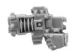

# 1319 爆燃蛇铳 Volkite Serpenta

精校状态：中文行文已逐段精校，部分术语仍为暂定

分类：武器 / 远程武器

原文来源：https://www.bilibili.com/opus/1010281624955256867

原作者：帝国神选罐头

原文时间：2024年12月13日 12:08

[返回分类目录](目录.md) · [全书目录](../../目录.md)

<!-- A1319-B0001 -->
**英文原文**

The Volkite Serpenta is the smallest type of Volkite Weapon. It is a pistol-like weapon wielded single-handed.

<!-- /A1319-B0001 -->

<!-- A1319-B0002 -->

原译文

爆燃蛇铳是爆燃武器中最小的一种。这是一种单手使用的类似手枪的武器。

**校订译文**

爆燃蛇铳是最小型的爆燃武器，外形类似手枪，可单手持用。

<!-- /A1319-B0002 -->

<!-- A1319-B0003 图片 -->

<!-- A1319-B0004 -->

原译文

Volkite Serpenta 爆燃蛇铳

**校订译文**

Volkite Serpenta 爆燃蛇铳

<!-- /A1319-B0004 -->

本篇核心术语与暂定项

以下列出本篇出现的英文原形及核心术语表用词。同形词可能指不同对象，具体词义以本篇正文和校注为准；单复数、别名和仅见于图注的名称可能尚未列入。完整候选见[术语表](../../术语表/双语术语候选.csv)。

| 英文 | 采用中文 | 状态 |
| --- | --- | --- |
| Volkite Weapon | 爆燃武器 | 暂定·官方待核 |
| Volkite Serpenta | 爆燃蛇铳 | 暂定·官方待核 |

