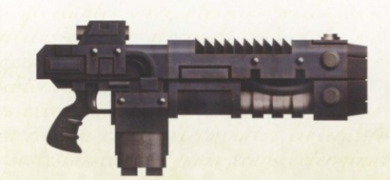

# 1321 爆燃火铳 Volkite Caliver

精校状态：中文行文已逐段精校，部分术语仍为暂定

分类：武器 / 远程武器

原文来源：https://www.bilibili.com/opus/1010752310409691142

原作者：帝国神选罐头

原文时间：编辑于 2025年08月18日 09:15

[返回分类目录](目录.md) · [全书目录](../../目录.md)

<!-- A1321-B0001 -->
**英文原文**

The Volkite Caliver was a type of Volkite Weapon used by the Legiones Astartes and Mechanicum during the Great Crusade and Horus Heresy.

<!-- /A1321-B0001 -->

<!-- A1321-B0002 -->

原译文

爆燃火铳是阿斯塔特军团和机械神教在大远征和荷鲁斯叛乱期间使用的一种爆燃武器。

**校订译文**

爆燃火铳是阿斯塔特军团和机械教在大远征及荷鲁斯之乱期间使用的爆燃武器。

<!-- /A1321-B0002 -->

<!-- A1321-B0003 图片 -->

<!-- A1321-B0004 -->

原译文

Volkite Caliver 爆燃火铳

**校订译文**

Volkite Caliver 爆燃火铳

<!-- /A1321-B0004 -->

<!-- A1321-B0005 -->
**英文原文**

A rifle Volkite variant with a devastating effect on flesh and bone, the volkite caliver was often employed by mobile Legion Tactical Support Squads, utilizing firepower superior to that of the more common bolter.

<!-- /A1321-B0005 -->

<!-- A1321-B0006 -->

原译文

爆燃火铳是步枪的一种爆燃变体，对血肉和骨骼具有毁灭性的影响，经常被移动的军团战术支援小队使用，其火力优于更常见的爆矢枪。

**校订译文**

它是步枪形制的爆燃武器，对血肉和骨骼杀伤极强。执行机动作战的军团战术支援小队经常使用它，其火力胜过更常见的爆矢枪。

<!-- /A1321-B0006 -->

<!-- A1321-B0007 -->
## Known Patterns 已知型号

<!-- /A1321-B0007 -->

<!-- A1321-B0008 -->
**英文原文**

Mars-Omega Pattern: The Mars-Omega Pattern volkite caliver was much favoured by the tactical support squads of the Night Lords for its terrifying and highly destructive effect.

<!-- /A1321-B0008 -->

<!-- A1321-B0009 -->

原译文

火星-欧米茄型号：火星-欧米茄型号的爆燃火铳因其可怕和高度破坏性的效果而受到午夜领主战术支援小组的青睐。

**校订译文**

火星—欧米伽型——因杀伤效果可怖、破坏力强，深受午夜领主战术支援小队青睐。

<!-- /A1321-B0009 -->

本篇核心术语与暂定项

以下列出本篇出现的英文原形及核心术语表用词。同形词可能指不同对象，具体词义以本篇正文和校注为准；单复数、别名和仅见于图注的名称可能尚未列入。完整候选见[术语表](../../术语表/双语术语候选.csv)。

| 英文 | 采用中文 | 状态 |
| --- | --- | --- |
| Horus Heresy | 荷鲁斯之乱 | 官方已核对 |
| Mechanicum | 机械教 | 暂定·历史称谓 |
| Night Lords | 午夜领主 | 暂定·官方待核 |
| Great Crusade | 大远征 | 暂定·官方待核 |
| Horus | 荷鲁斯 | 暂定·官方待核 |
| Legiones Astartes | 阿斯塔特军团 | 暂定·官方待核 |
| Mars | 火星 | 暂定·官方待核 |
| Bolter | 爆矢枪 | 暂定·官方待核 |
| Volkite Weapon | 爆燃武器 | 暂定·官方待核 |
| Volkite Caliver | 爆燃火铳 | 暂定·官方待核 |
| Mars-Omega Pattern | 火星—欧米伽型 | 暂定·官方待核 |

