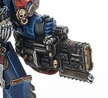

# 1322 空腔爆燃铳 Volkite Cavitor

精校状态：中文行文已逐段精校，部分术语仍为暂定

分类：武器 / 远程武器

原文来源：https://www.bilibili.com/opus/1010281809602150400

原作者：帝国神选罐头

原文时间：2024年12月13日 12:09

[返回分类目录](目录.md) · [全书目录](../../目录.md)

<!-- A1322-B0001 -->
**英文原文**

The Volkite Cavitor was a type of Volkite Weapon used by Night Lords Contekar Terminators. It was a heavy weapon with a Chainblade attached.

<!-- /A1322-B0001 -->

<!-- A1322-B0002 -->

原译文

空腔爆燃枪是午夜领主肯特卡终结者使用的一种爆燃武器。这是一件附有链锯刃的重型武器。

**校订译文**

空腔爆燃铳是午夜领主肯特卡终结者使用的重型爆燃武器，附有链锯刃。

<!-- /A1322-B0002 -->

<!-- A1322-B0003 图片 -->

<!-- A1322-B0004 -->

原译文

Volkite Cavitor 空腔爆燃枪

**校订译文**

Volkite Cavitor 空腔爆燃铳

<!-- /A1322-B0004 -->

<!-- A1322-B0005 -->
**英文原文**

The Cavitor is a variant of the more common volkite weapons that were produced on Nostramo, a rare example of lost technology on the blighted world. The removal of safety equipment allows the cavitor to project more diffused beams at limited ranges.

<!-- /A1322-B0005 -->

<!-- A1322-B0006 -->

原译文

空腔爆燃枪是诺斯特拉莫生产的更常见的爆燃武器的变体，这是枯萎世界上罕见的失传技术的例子。安全设备的移除使空腔爆燃枪能够在有限的范围内投射出更多的散射光束。

**校订译文**

它是诺斯特拉莫生产的一种爆燃武器改型，在这个饱受蹂躏的世界上，是少见的失落技术遗存。拆除安全装置后，它能在较短距离内射出更为分散的光束。

<!-- /A1322-B0006 -->

本篇核心术语与暂定项

以下列出本篇出现的英文原形及核心术语表用词。同形词可能指不同对象，具体词义以本篇正文和校注为准；单复数、别名和仅见于图注的名称可能尚未列入。完整候选见[术语表](../../术语表/双语术语候选.csv)。

| 英文 | 采用中文 | 状态 |
| --- | --- | --- |
| Equipment | 装备 | 编辑用语已统一 |
| Night Lords | 午夜领主 | 暂定·官方待核 |
| Nostramo | 诺斯特拉莫 | 暂定·官方待核 |
| Terminators | 终结者 | 暂定·官方待核 |
| Contekar | 肯特卡 | 暂定·官方待核 |
| Volkite Weapon | 爆燃武器 | 暂定·官方待核 |
| Volkite Cavitor | 空腔爆燃铳 | 暂定·官方待核 |

