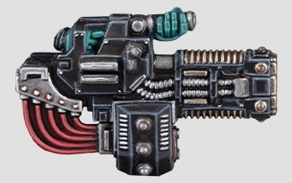
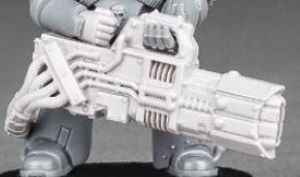

# 1323 爆燃长炮 Volkite Culverin

精校状态：中文行文已逐段精校，部分术语仍为暂定

分类：武器 / 远程武器

原文来源：https://www.bilibili.com/opus/1012483757753499654

原作者：帝国神选罐头

原文时间：2024年12月19日 10:34

[返回分类目录](目录.md) · [全书目录](../../目录.md)

<!-- A1323-B0001 -->
**英文原文**

The Volkite Culverin is a heavy Volkite Weapon. The most potent man-portable Volkite weapon in the Imperium's arsenal, its beam has a devastating effect on organic matter, explosively burning flesh into ash and jetting fire.

<!-- /A1323-B0001 -->

<!-- A1323-B0002 -->

原译文

爆燃长炮是一种重型爆燃武器。作为帝国军械库中最强大的便携式爆燃武器，它的光束对有机物具有毁灭性的影响，会爆炸性地将肉体烧成灰烬并喷出火焰。

**校订译文**

爆燃长炮是帝国军械库中威力最强的单兵携行爆燃武器。其光束对有机物杀伤极大，能使血肉猛烈爆燃，化作灰烬与喷涌的火焰。

<!-- /A1323-B0002 -->

<!-- A1323-B0003 图片 -->

<!-- A1323-B0004 -->

原译文

Volkite Culverin 爆燃长炮

**校订译文**

Volkite Culverin 爆燃长炮

<!-- /A1323-B0004 -->

<!-- A1323-B0005 -->
## Known Patterns 已知型号

<!-- /A1323-B0005 -->

<!-- A1323-B0006 -->
### Contemptor Pattern 蔑视者型

<!-- /A1323-B0006 -->

<!-- A1323-B0007 -->
**英文原文**

Contemptor Pattern Dreadnoughts could mount this twin-linked variant of the Volkite Culverin, thanks to their powerful reactor and load bearing capacity.

<!-- /A1323-B0007 -->

<!-- A1323-B0008 -->

原译文

由于其强大的反应堆和承载能力，蔑视者型无畏可以安装这种爆燃长炮的双联变体。

**校订译文**

蔑视者型无畏机甲凭借强大的反应堆和承载能力，可以安装这种双联爆燃长炮。

<!-- /A1323-B0008 -->

<!-- A1323-B0009 -->
### Telerac Pattern 特勒拉克型

原题：Telerac Pattern 特莱拉克型

<!-- /A1323-B0009 -->

<!-- A1323-B0010 -->
**英文原文**

Telerac Pattern weapons are far more ancient and ill-omened even those designated 'Proteus', the name implying dark associations with the technological horrors of the deep reaches of the Age of Strife. The shortage of reliable supplies of Volkite weaponry saw many Telerac pattern weapons restored to service in the name of the Emperor, and carefully maintained in Adeptus Astartes armouries.

<!-- /A1323-B0010 -->

<!-- A1323-B0011 -->

原译文

特莱拉克型的武器要古老得多，甚至是那些被指定为“普罗透斯”的武器，这个名字暗示着与纷争时代深处的恐怖技术的黑暗联系。由于爆燃武器可靠供应的短缺，许多特莱拉克型的武器以帝皇的名义恢复使用，并在阿斯塔特修会的军械库中得到精心维护。

**校订译文**

特勒拉克型甚至比普罗透斯型更古老、更不祥，其名称暗示着与纷争时代深处那些恐怖技术的阴暗联系。由于爆燃武器缺乏可靠供应，许多特勒拉克型奉帝皇之名重新服役，并在阿斯塔特修会军械库中得到精心维护。

<!-- /A1323-B0011 -->

<!-- A1323-B0012 图片 -->

<!-- A1323-B0013 -->

原译文

Telerac Pattern Volkite Culverin 特莱拉克型爆燃长炮

**校订译文**

Telerac Pattern Volkite Culverin 特勒拉克型爆燃长炮

<!-- /A1323-B0013 -->

<!-- A1323-B0014 -->
### Proteus Pattern 普罗透斯型

<!-- /A1323-B0014 -->

<!-- A1323-B0015 -->
**英文原文**

The Proteus Pattern variant of the Volkite Culverin pre-dates the Telerac Pattern.

<!-- /A1323-B0015 -->

<!-- A1323-B0016 -->

原译文

爆燃长炮的普罗透斯型变体早于特莱拉克型。

**校订译文**

爆燃长炮的普罗透斯型早于特勒拉克型。

**校注：** 本句英文称普罗透斯型更早，与上文特勒拉克型更古老的说法直接矛盾；两处按各自原文保留，待核原始出版资料。

<!-- /A1323-B0016 -->

本篇核心术语与暂定项

以下列出本篇出现的英文原形及核心术语表用词。同形词可能指不同对象，具体词义以本篇正文和校注为准；单复数、别名和仅见于图注的名称可能尚未列入。完整候选见[术语表](../../术语表/双语术语候选.csv)。

| 英文 | 采用中文 | 状态 |
| --- | --- | --- |
| Adeptus Astartes | 阿斯塔特修会 | 官方已核对 |
| Imperium | 帝国 | 暂定·简称 |
| Emperor | 帝皇 | 官方已核对 |
| Age of Strife | 纷争时代 | 暂定·官方待核 |
| Ancient | 旗手 | 官方已核对 |
| Proteus | 普罗透斯 | 暂定·官方待核 |
| Volkite Weapon | 爆燃武器 | 暂定·官方待核 |
| Telerac Pattern | 特勒拉克型 | 暂定·官方待核 |
| Volkite Culverin | 爆燃长炮 | 暂定·官方待核 |

