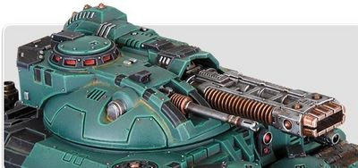

# 1324 爆燃臼炮 Volkite Cardanelle

精校状态：中文行文已逐段精校，部分术语仍为暂定

分类：武器 / 远程武器

原文来源：https://www.bilibili.com/opus/1012875995639709705

原作者：帝国神选罐头

原文时间：2024年12月20日 11:56

[返回分类目录](目录.md) · [全书目录](../../目录.md)

<!-- A1324-B0001 -->
**英文原文**

The Volkite Cardanelle is a type of heavy Volkite Weapon that was mounted on the Kratos Space Marine Heavy Tank. The weapon specialized in melting down formations of enemy infantry.

<!-- /A1324-B0001 -->

<!-- A1324-B0002 -->

原译文

爆燃臼炮是一种重型爆燃武器，安装在星际战士奎托斯重型坦克上。专门用于熔化敌方步兵编队的武器。

**校订译文**

爆燃臼炮是安装于星际战士奎托斯重型坦克的重型爆燃武器，专门用于焚熔成群的敌方步兵。

<!-- /A1324-B0002 -->

<!-- A1324-B0003 图片 -->

<!-- A1324-B0004 -->

原译文

Volkite Cardanelle 爆燃短重炮

**校订译文**

Volkite Cardanelle 爆燃臼炮

**校注：** 图注原译短重炮与Carronade混淆，按本条Cardanelle统一为臼炮；不据译名增添曲射性能。

<!-- /A1324-B0004 -->

本篇核心术语与暂定项

以下列出本篇出现的英文原形及核心术语表用词。同形词可能指不同对象，具体词义以本篇正文和校注为准；单复数、别名和仅见于图注的名称可能尚未列入。完整候选见[术语表](../../术语表/双语术语候选.csv)。

| 英文 | 采用中文 | 状态 |
| --- | --- | --- |
| Space Marine | 星际战士 | 暂定·官方待核 |
| The Weapon | 武器 | 暂定·官方待核 |
| Volkite Weapon | 爆燃武器 | 暂定·官方待核 |
| Volkite Cardanelle | 爆燃臼炮 | 暂定·官方待核 |

