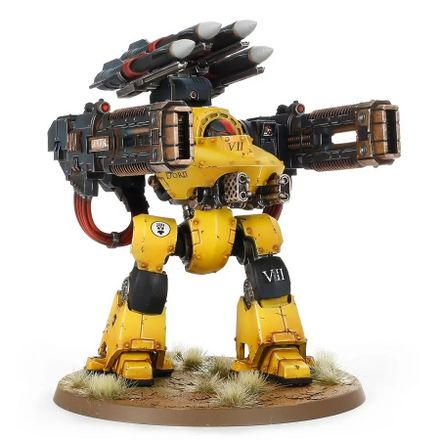

# 1325 爆燃隼炮 Volkite Falconet

精校状态：中文行文已逐段精校，部分术语仍为暂定

分类：武器 / 远程武器

原文来源：https://www.bilibili.com/opus/1012876322050932739

原作者：帝国神选罐头

原文时间：2024年12月20日 11:57

[返回分类目录](目录.md) · [全书目录](../../目录.md)

<!-- A1325-B0001 -->
**英文原文**

The Volkite Falconet was a type of Volkite Weapon mounted on the Deredeo Dreadnought.

<!-- /A1325-B0001 -->

<!-- A1325-B0002 -->

原译文

爆燃隼炮是一种安装在德雷都无畏上的爆燃武器。

**校订译文**

爆燃隼炮是安装于德雷都型无畏机甲的爆燃武器。

<!-- /A1325-B0002 -->

<!-- A1325-B0003 图片 -->

<!-- A1325-B0004 -->

原译文

Deredeo Dreadnought with arm-mounted Volkite Falconets 装备臂载爆燃隼炮的德雷都无畏

**校订译文**

Deredeo Dreadnought with arm-mounted Volkite Falconets 臂部装备爆燃隼炮的德雷都型无畏机甲

<!-- /A1325-B0004 -->

本篇核心术语与暂定项

以下列出本篇出现的英文原形及核心术语表用词。同形词可能指不同对象，具体词义以本篇正文和校注为准；单复数、别名和仅见于图注的名称可能尚未列入。完整候选见[术语表](../../术语表/双语术语候选.csv)。

| 英文 | 采用中文 | 状态 |
| --- | --- | --- |
| Dreadnought | 无畏机甲 | 暂定·官方待核 |
| Volkite Weapon | 爆燃武器 | 暂定·官方待核 |
| Volkite Falconet | 爆燃隼炮 | 暂定·官方待核 |

