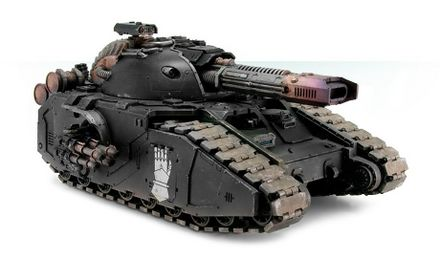

# 1326 爆燃短重炮 Volkite Carronade

精校状态：中文行文已逐段精校，部分术语仍为暂定

分类：武器 / 远程武器

原文来源：https://www.bilibili.com/opus/1012876085815148551

原作者：帝国神选罐头

原文时间：2024年12月20日 11:56

[返回分类目录](目录.md) · [全书目录](../../目录.md)

<!-- A1326-B0001 -->
**英文原文**

The Volkite Carronade was a type of Volkite Weapon used by the Legiones Astartes and Mechanicum during the Great Crusade and Horus Heresy.

<!-- /A1326-B0001 -->

<!-- A1326-B0002 -->

原译文

爆燃短重炮是一种爆燃武器，在大远征和荷鲁斯叛乱期间由阿斯塔特军团和机械教使用。

**校订译文**

爆燃短重炮是阿斯塔特军团和机械教在大远征及荷鲁斯之乱期间使用的爆燃武器。

<!-- /A1326-B0002 -->

<!-- A1326-B0003 图片 -->

<!-- A1326-B0004 -->

原译文

Volkite Carronade on a Fellglaive 残暴刃上的爆燃短重炮

**校订译文**

Volkite Carronade on a Fellglaive 飞刃坦克上的爆燃短重炮

**校注：** Fellglaive 与 Glaive 为同一坦克型号，沿1318飞刃统一；原残暴刃。参见 https://wh40k.lexicanum.com/wiki/Glaive；该二级来源仅用以核实英文异名，不据此认定中文官译。

<!-- /A1326-B0004 -->

<!-- A1326-B0005 -->
**英文原文**

The Volkite Carronade was a larger variant of the Volkite weapons family, mounted on Fellglaive tanks. They could destroy large enemy targets in a single sweep.

<!-- /A1326-B0005 -->

<!-- A1326-B0006 -->

原译文

爆燃短重炮是爆燃武器家族的一个较大变体，安装在残暴刃坦克上。他们可以在一次扫荡中摧毁敌人的大型目标。

**校订译文**

它是爆燃武器家族中的大型版本，安装于飞刃坦克，一次横扫便能摧毁敌方大型目标。

**校注：** Fellglaive 为 Glaive 异名，沿1318飞刃统一，中文暂定；https://wh40k.lexicanum.com/wiki/Glaive。

<!-- /A1326-B0006 -->

本篇核心术语与暂定项

以下列出本篇出现的英文原形及核心术语表用词。同形词可能指不同对象，具体词义以本篇正文和校注为准；单复数、别名和仅见于图注的名称可能尚未列入。完整候选见[术语表](../../术语表/双语术语候选.csv)。

| 英文 | 采用中文 | 状态 |
| --- | --- | --- |
| Horus Heresy | 荷鲁斯之乱 | 官方已核对 |
| Mechanicum | 机械教 | 暂定·历史称谓 |
| Great Crusade | 大远征 | 暂定·官方待核 |
| Horus | 荷鲁斯 | 暂定·官方待核 |
| Legiones Astartes | 阿斯塔特军团 | 暂定·官方待核 |
| Volkite Weapon | 爆燃武器 | 暂定·官方待核 |
| Volkite Carronade | 爆燃短重炮 | 暂定·官方待核 |
| Fellglaive | 飞刃坦克 | 暂定·官方待核 |

