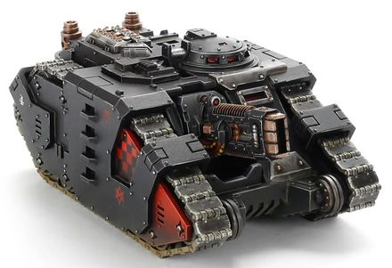

# 1327 爆燃长管炮 Volkite Saker

精校状态：中文行文已逐段精校，部分术语仍为暂定

分类：武器 / 远程武器

原文来源：https://www.bilibili.com/opus/1012876420824694789

原作者：帝国神选罐头

原文时间：2024年12月20日 11:57

[返回分类目录](目录.md) · [全书目录](../../目录.md)

<!-- A1327-B0001 -->
**英文原文**

The Volkite Saker was a type of heavy Volkite Weapon sometimes mounted on Space Marine Sabre Strike Tanks during the Great Crusade and Horus Heresy.

<!-- /A1327-B0001 -->

<!-- A1327-B0002 -->

原译文

爆燃长管炮是一种重型爆燃武器，有时在大远征和荷鲁斯叛乱期间安装在星际战士军刀突击坦克上。

**校订译文**

爆燃长管炮是大远征和荷鲁斯之乱期间，有时安装于星际战士军刀突击坦克的重型爆燃武器。

<!-- /A1327-B0002 -->

<!-- A1327-B0003 图片 -->

<!-- A1327-B0004 -->

原译文

Sabre Tank Hunter with a Volkite Saker 装备爆燃长管炮的军刀坦克猎手

**校订译文**

Sabre Tank Hunter with a Volkite Saker 装备爆燃长管炮的军刀反坦克车

<!-- /A1327-B0004 -->

<!-- A1327-B0005 -->
**英文原文**

A modified version of the Volkite Culverin, the saker was optimized to provide a maximized spread of high energy particle beams while the Sabre manoeuvres at high speed. While it cannot penetrate heavy armour, it is more than capable of cutting a swathe through heavy infantry and shredding the hulls of lighter vehicles.

<!-- /A1327-B0005 -->

<!-- A1327-B0006 -->

原译文

长管炮是爆燃长炮的改进版本，经过优化，在军刀高速机动时提供了最大的高能粒子束传播。虽然它不能穿透重型装甲，但它完全有能力穿透重型步兵，粉碎轻型车辆的外壳。

**校订译文**

它由爆燃长炮改进而来，经过优化，可在军刀高速机动时，以高能粒子束覆盖尽可能宽的区域。虽然无法穿透重型装甲，却足以扫灭重装步兵，撕碎轻型载具的车体。

<!-- /A1327-B0006 -->

本篇核心术语与暂定项

以下列出本篇出现的英文原形及核心术语表用词。同形词可能指不同对象，具体词义以本篇正文和校注为准；单复数、别名和仅见于图注的名称可能尚未列入。完整候选见[术语表](../../术语表/双语术语候选.csv)。

| 英文 | 采用中文 | 状态 |
| --- | --- | --- |
| Horus Heresy | 荷鲁斯之乱 | 官方已核对 |
| Great Crusade | 大远征 | 暂定·官方待核 |
| Horus | 荷鲁斯 | 暂定·官方待核 |
| Space Marine | 星际战士 | 暂定·官方待核 |
| Volkite Weapon | 爆燃武器 | 暂定·官方待核 |
| Volkite Saker | 爆燃长管炮 | 暂定·官方待核 |
| Volkite Culverin | 爆燃长炮 | 暂定·官方待核 |

