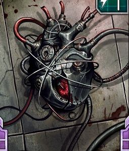

# 1328 仿生部件 Bionics

精校状态：中文行文已逐段精校，部分术语仍为暂定

分类：装备 / 增强

原文来源：https://www.bilibili.com/opus/1013394746089930752

原作者：帝国神选罐头

原文时间：2024年12月21日 21:29

[返回分类目录](目录.md) · [全书目录](../../目录.md)

<!-- A1328-B0001 -->
**英文原文**

Bionics, or also Augmetics, are Imperial mechanical or technological substitutes for biological limbs or organs. Generally the replacement is stronger, more durable or effective than the original, or gives its user completely new abilities.

<!-- /A1328-B0001 -->

<!-- A1328-B0002 -->

原译文

仿生部件，也称为人体增强，是帝国机械或技术对生物肢体或器官的替代品。一般来说，替代品比原版更强、更耐用或更有效，或者为使用者提供全新的能力。

**校订译文**

仿生部件也称机械增强体，是帝国用机械或技术装置替代生物肢体、器官的产物。它们通常比原有部位更强韧、更耐用或更高效，有时还能赋予使用者全新的能力。

**校注：** Bionics依语境分别表示仿生改造与仿生部件；Augmetics在此指装置，暂译机械增强体。

<!-- /A1328-B0002 -->

<!-- A1328-B0003 -->
**英文原文**

The use of bionics is widespread in the Imperium. However, bionics are expensive and mostly limited to valuable servants of the Imperium, such as veteran warriors or skilled adepts, high-ranking Imperial officials and Inquisitors, as well as Planetary Governors who possess the required wealth.

<!-- /A1328-B0003 -->

<!-- A1328-B0004 -->

原译文

仿生部件在帝国中广泛使用。然而，仿生部件很昂贵，而且大多仅限于帝国有价值的仆从，如经验丰富的战士或熟练的行家、高级帝国官员和审判官，以及拥有所需财富的行星总督。

**校订译文**

仿生改造在帝国颇为普遍，但部件价格昂贵，通常只有重要人员能够获得，例如资深战士、熟练的专业人员、帝国高级官员、审判官，以及拥有足够财富的行星总督。

<!-- /A1328-B0004 -->

<!-- A1328-B0005 图片 -->

<!-- A1328-B0006 -->

原译文

Augmetic arm 强化手臂

**校订译文**

Augmetic arm 强化手臂

<!-- /A1328-B0006 -->

<!-- A1328-B0007 -->
## Effects and distribution 影响和分布

<!-- /A1328-B0007 -->

<!-- A1328-B0008 -->
**英文原文**

An individual may have artificial limbs and organs to replace diseased or damaged parts, or simply to improve their abilities. Bionics include partial and full replacements of body parts, brain implants, cybernetic weaponry and other devices. Although bionic parts are mechanical, many of them do use the user's bloodstream, nerve endings, etc., so damage to one may be as debilitating as an injury to the original part, although in general the bionics are much more durable than their organic counterparts.

<!-- /A1328-B0008 -->

<!-- A1328-B0009 -->

原译文

一个人可能有假肢和器官来替换患病或受损的部位，或者只是为了提高他们的能力。仿生植入物包括部分和全部替换身体部位、大脑植入物、智控武器和其他设备。尽管仿生部件是机械的，但它们中的许多确实使用了用户的血液、神经末梢等，因此对一个人的伤害可能和对原始部件的伤害一样令人虚弱，尽管总的来说，仿生部件比有机部件更耐用。

**校订译文**

人们可以用人工肢体和器官替换病变或受损部位，也可以纯粹为了增强能力而接受改造。仿生技术包括局部或整个身体部位的替换、脑部植入物、机械增强武器及其他装置。虽然部件由机械构成，其中许多仍接入使用者的血液循环和神经末梢，因此一旦损坏，也可能像原生部位受伤一样使人失去行动能力。不过，总体上它们仍比血肉组织耐用得多。

<!-- /A1328-B0009 -->

<!-- A1328-B0010 图片 -->

<!-- A1328-B0011 -->

原译文

Augmetic eye 强化眼

**校订译文**

Augmetic eye 强化眼

<!-- /A1328-B0011 -->

<!-- A1328-B0012 -->
**英文原文**

There is no standard level of bionic technology throughout the Imperium: many bionics are clumsy and inefficient replacements, while the best can replicate or even improve upon the performance of the original limb or organ. Inquisition bionics are among the more sophisticated and can reverse what would otherwise be fatal or crippling injuries.

<!-- /A1328-B0012 -->

<!-- A1328-B0013 -->

原译文

整个帝国没有仿生技术的标准水平：许多仿生技术都是笨拙而低效的替代品，而最好的仿生技术可以复制甚至改善原始肢体或器官的性能。审判庭仿生部件是其中较为复杂的，可以扭转致命或致残的伤害。

**校订译文**

帝国各地的仿生技术水平并不一致。许多部件笨重而低效，最好的则能复现乃至超越原生肢体或器官的性能。审判庭使用的部件属于较先进的类型，能挽救本来足以致命或致残的伤势。

<!-- /A1328-B0013 -->

<!-- A1328-B0014 图片 -->

<!-- A1328-B0015 -->

原译文

Augmetic heart 强化心脏

**校订译文**

Augmetic heart 强化心脏

<!-- /A1328-B0015 -->

<!-- A1328-B0016 -->
**英文原文**

Personnel in practically all branches of the Imperium use bionics in some capacity. In most Imperial Guard Regiments, only officers will have access to bionic equipment. On the other hand, there are a few regiments where virtually every soldier is bionically enhanced. Also, the Iron Hands Space Marine Chapter are infamous for making extensive use of them, almost to the point of removing all flesh in favour of machinery. Even some particularly wealthy members of the Imperial citizenry can afford, and have been known to use, bionics.

<!-- /A1328-B0016 -->

<!-- A1328-B0017 -->

原译文

帝国几乎所有部门的人员都以某种身份使用仿生部件。在大多数帝国卫队中，只有军官才能使用仿生部件。另一方面，有几个团几乎每个士兵都进行了仿生增强。此外，钢铁之手星际战士因广泛使用它们而声名狼藉，几乎到了为了机械而去除所有肉体的地步。即使是一些特别富有的帝国公民也能负担得起，并且众所周知，他们使用仿生部件。

**校订译文**

帝国几乎所有部门都会在一定程度上使用仿生改造。多数帝国卫队团只有军官能获得这类装备，但也有少数团几乎人人都经过强化。钢铁之手战团更因大规模机械改造而闻名，几乎到了以机械取代全部血肉的程度。少数特别富有的普通帝国公民，也能负担并接受仿生改造。

<!-- /A1328-B0017 -->

<!-- A1328-B0018 图片 -->

<!-- A1328-B0019 -->

原译文

Augmetic leg 强化腿

**校订译文**

Augmetic leg 强化腿

<!-- /A1328-B0019 -->

<!-- A1328-B0020 -->
## Examples of Imperial bionics 帝国仿生部件的例子

<!-- /A1328-B0020 -->

<!-- A1328-B0021 -->
### Bionic organs 仿生器官

<!-- /A1328-B0021 -->

<!-- A1328-B0022 -->
**英文原文**

For the wealthy or privileged, bionics can replace diseased or aged organs and therefore offer an increased life span. Practically any organ can be replaced, even parts of the brain. The simplest are mere replacements, while the more advanced increase the functionality and performance of the organ beyond its previous capacity.

<!-- /A1328-B0022 -->

<!-- A1328-B0023 -->

原译文

对于富人或特权阶层来说，仿生部件可以替代患病或衰老的器官，从而延长寿命。实际上，任何器官都可以被替换，甚至是大脑的一部分。最简单的只是替代品，而更先进的则可以提高器官的功能和性能，使其超出以前的能力。

**校订译文**

对于富人或特权阶层来说，仿生部件可以替代患病或衰老的器官，从而延长寿命。实际上，任何器官都可以被替换，甚至是大脑的一部分。最简单的只是替代品，而更先进的则可以提高器官的功能和性能，使其超出以前的能力。

<!-- /A1328-B0023 -->

<!-- A1328-B0024 -->
### Bionic senses 仿生感官

<!-- /A1328-B0024 -->

<!-- A1328-B0025 -->
**英文原文**

Such is the level of technology in certain parts of the Imperium that bionic senses can replace eyes, ears, noses, and even touch and taste. More advanced bionic senses can even produce effects of synaesthesia.

<!-- /A1328-B0025 -->

<!-- A1328-B0026 -->

原译文

这就是帝国某些地区的技术水平，仿生感官可以取代眼睛、耳朵、鼻子，甚至触觉和味觉。更先进的仿生感官甚至可以产生通感效果。

**校订译文**

帝国某些地区的技术足以用人工感官取代眼、耳、鼻，乃至触觉和味觉；更先进的装置甚至能产生通感。

<!-- /A1328-B0026 -->

<!-- A1328-B0027 -->
**英文原文**

Bionic eyes can increase a subject's visual spectrum, allowing the ability to see heat, energies, etc., as well as incorporating targeters and resistance to the effects of blinding flashes. The addition of digi-weapons into bionic eyes is also not unknown for high-ranking individuals.

<!-- /A1328-B0027 -->

<!-- A1328-B0028 -->

原译文

仿生眼可以增加使用者的视觉光谱，使其能够看到热量、能量等，并包括目标和对致盲闪光效果的抵抗力。对于高级人士来说，将数字武器添加到仿生眼中也不是什么新鲜事。

**校订译文**

仿生眼可扩展视觉感知的光谱范围，使使用者看见热源和其他能量，还可集成瞄准装置，并抵御致盲闪光的影响。某些地位显赫者甚至会在仿生眼中安装微型武器。

**校注：** digi-weapons指小型化武器，不是数字武器。

<!-- /A1328-B0028 -->

<!-- A1328-B0029 -->
**英文原文**

Bionic hearing can improve normal hearing to the point where the user can hear living creatures breathing, hearts beating, etc.

<!-- /A1328-B0029 -->

<!-- A1328-B0030 -->

原译文

仿生听觉可以改善正常听力，使用者可以听到生物的呼吸、心跳等。

**校订译文**

仿生听觉可以改善正常听力，使用者可以听到生物的呼吸、心跳等。

<!-- /A1328-B0030 -->

<!-- A1328-B0031 -->
### Bionic implants 仿生植入物

<!-- /A1328-B0031 -->

<!-- A1328-B0032 -->
**英文原文**

Implants come in all shapes and sizes, from memory upgrades for the brain to implant weapons. Some of the more esoteric are listed below. The Tech-priests of the Adeptus Mechanicus are infamous for making use of extensive bionic implants, and some of the more exotic ones they create are used solely by them. This list is by no means exhaustive.

<!-- /A1328-B0032 -->

<!-- A1328-B0033 -->

原译文

植入物有各种形状和大小，从大脑的记忆升级到植入武器。下面列出了一些更深奥的。机械神教的技术神甫因使用广泛的仿生植入物而声名狼藉，他们创造的一些更奇特的植入物仅供他们使用。这份清单绝不是详尽无遗的。

**校订译文**

植入物形态各异，既有增强脑部记忆的装置，也有植入式武器。机械修会的技术祭司尤其以广泛使用仿生植入物著称，其中一些奇特装置仅供他们自己使用。以下列举若干较罕见的类型，并非完整清单。

<!-- /A1328-B0033 -->

<!-- A1328-B0034 -->
### Psi-booster 灵能增强器

<!-- /A1328-B0034 -->

<!-- A1328-B0035 -->
**英文原文**

A psi-booster increases activity in the part of the brain responsible for controlling psychic ability. A person with one of these is usually a proficient psyker and has greater control over his powers compared to someone of the same ability without a psi-booster.

<!-- /A1328-B0035 -->

<!-- A1328-B0036 -->

原译文

灵能增强器增加了大脑中负责控制心灵能力的部分的活动。拥有其中之一的人通常是一名熟练的灵能者，与没有灵能增强器的具有相同能力的人相比，他对自己的力量有更大的控制力。

**校订译文**

灵能增强器能提升脑部负责控制灵能的区域的活动。其使用者通常已是熟练的灵能者；与天赋相当、却没有该装置的人相比，他们能更精确地控制自身力量。

<!-- /A1328-B0036 -->

<!-- A1328-B0037 -->
### Mind Impulse Unit 思维驱动单元

<!-- /A1328-B0037 -->

<!-- A1328-B0038 -->
**英文原文**

A Mind Impulse Unit (MIU) is a neural link between a sentient brain and a piece of equipment, allowing an individual to control and monitor a system by thought alone. MIUs are most commonly used in Dreadnought armour and the gigantic Titans of the Adeptus Mechanicus but are rarely seen elsewhere. Other uses include hands-free equipment operation, such as for shoulder- or wrist-mounted gear (including weapons). In some rare cases the weapon is carried normally; the MIU allows the user a greater intimacy with their weapon's internal workings, such as ammunition count or barrel temperature. This is sometimes found amongst the Skitarii tech guard of the Adeptus Mechanicus. Wireless MIUs also exist, although they are exceptionally rare and are used to control mechanical familiars or certain types of servitor. This type of MIU is most common when the user cannot perform a common task themselves (perhaps being too large to fit somewhere) or when they prefer to stay out of harm's way.

<!-- /A1328-B0038 -->

<!-- A1328-B0039 -->

原译文

思维驱动单元（MIU）是一种连接有知觉的大脑和设备的神经连接，使个人能够仅通过思维来控制和监测系统。MIU最常用于无畏装甲和机械神教的巨型泰坦，但在其它地方很少见到。其他用途包括非手持设备操作，例如用于肩上或手腕上的装备（包括武器）。在极少数情况下，武器会正常携带；MIU使使用者能够更深入地了解武器的内部运作，如弹药数量或枪管温度。这有时会在机械神教的护教军科技卫队中发现。无线MIU也存在，尽管它们非常罕见，用于控制机械守卫或某些类型的机仆。当使用者无法自己执行常见任务（可能太大而无法放置在某个地方）或他们更喜欢远离伤害时，这种MIU最为常见。

**校订译文**

思维驱动单元（MIU）在有意识的大脑与设备之间建立神经连接，使人仅凭思维便能控制、监测系统。它最常用于无畏机甲和机械修会的巨型泰坦，其他用途相对少见。它也能让使用者不动双手便操作肩部或腕部装备，包括武器。有时武器仍按常规方式持握，MIU则让使用者直接感知其内部状态，如余弹量和枪管温度；机械修会的护教军中偶有这种配置。另有极罕见的无线 MIU，用来控制机械使魔或特定类型的机仆，尤其适合使用者因体形过大等原因无法亲自到达某处，或希望避开危险时使用。

<!-- /A1328-B0039 -->

<!-- A1328-B0040 -->
### Implant weaponry 植入武器

<!-- /A1328-B0040 -->

<!-- A1328-B0041 -->
**英文原文**

An implant weapon is one that has been grafted onto an existing limb, replacing a hand or occasionally the entire arm, and is controlled by a simpler MIU than needed for a more sophisticated device. The obvious benefit of finer weapon control is substantially offset by loss of hand or arm functionality outside of combat. This bionic is thus not especially practical, and is usually intended to intimidate, as the surgery used to graft them onto the user is often quite crude, leaving gruesome suture scars frightening above and beyond the "body horror" qualities of the implant itself. Another reason for implantation of bionic weapons is the user not being expected to need his arm for other tasks; this approach is most often seen in the cases of pit slave gladiators or certain types of battlefield servitor.

<!-- /A1328-B0041 -->

<!-- A1328-B0042 -->

原译文

植入武器是一种移植到现有肢体上的武器，可以取代一只手，有时甚至是整个手臂，并且由比更复杂的设备所需的更简单的MIU控制。更精细的武器控制的明显优点被战斗外手或手臂功能的丧失而大大抵消了。因此，这种仿生装置并不特别实用，通常是为了恐吓，因为将它们移植到使用者身上的手术通常非常粗糙，留下可怕的缝合疤痕，超出了植入物本身的“身体恐怖”特性。植入仿生武器的另一个原因是，使用者不需要他的手臂来执行其他任务；这种方法最常见于深坑奴隶角斗士或某些类型的战场机仆的情况。

**校订译文**

植入武器直接接入原有肢体，替换一只手，有时甚至整条手臂，并由较简单的思维驱动单元控制。它能提升操控精度，却使手或手臂失去战斗之外的用途，很大程度上抵消了优势。因此，这类改造通常不以实用为首要目的，而是为了威慑；植入手术往往十分粗糙，留下触目惊心的缝合疤痕，使本就骇人的机械化身体更加可怖。另一些使用者本来就不需要手臂执行其他工作，例如深坑奴隶角斗士和某些战场机仆，也会接受这种改造。

<!-- /A1328-B0042 -->

<!-- A1328-B0043 -->
### Mechadendrites 机械触须

<!-- /A1328-B0043 -->

<!-- A1328-B0044 -->
**英文原文**

Mechadendrites are mechanical tendrils used by the Adeptus Mechanicus to aid them in construction, maintenance, and research. These bionics contain small motors and actuators within their armoured shells and wave about the Techpriest almost with a life of their own.

<!-- /A1328-B0044 -->

<!-- A1328-B0045 -->

原译文

机械触须是机械神教用来帮助他们进行建造、维护和研究的机械卷须。这些仿生部件在其装甲外壳内包含小型电机和执行机构，像有自己的生命一样在技术神甫周围摆动。

**校订译文**

机械触须是机械修会用于辅助建造、维修和研究的机械附肢。装甲外壳中装有小型电动机与执行装置，使它们如同有生命般在技术祭司周围摆动。

<!-- /A1328-B0045 -->

<!-- A1328-B0046 -->
### Skinplants 皮肤植入纹饰

原题：Skinplants 植皮

**校注：** Skinplants不是医疗植皮，而是具有功能的皮肤植入装置，暂称皮肤植入纹饰。

<!-- /A1328-B0046 -->

<!-- A1328-B0047 -->
**英文原文**

Using crystal technology made possible this sophisticated tattoo via creating a functioning device between layers of skin. It is quite useful, because with it every citizen with sufficient money can have symbols on their skin that light up and flash. Skinplants could be either light-sensitive, permanent fixtures, or controllable. The most common skinplants is a wristwatch that can be activated with light touch – so a digital display activated beneath the skin. Some people even get skinplants on whole limbs or even their entire body. The emitted light is enough to see in darkness for nearly 10cm, so skinplants on arms became known as ‘thief’s light’, providing sufficient light to operate objects, pick locks, etc.

<!-- /A1328-B0047 -->

<!-- A1328-B0048 -->

原译文

使用晶体技术，通过在皮肤层之间创建一个功能装置，使这种复杂的纹身成为可能。它非常有用，因为有了它，每个有足够钱的公民都可以在他们的皮肤上移植发光和闪烁的符号。植皮可以是光敏的、永久性的固定装置，也可以是可控的。最常见的植皮是可以通过轻触激活的手表，因此可以在皮肤下激活数字显示器。有些人甚至全身甚至四肢都植满了皮肤。发出的光足以在黑暗中看到近10厘米，因此手臂上的植皮被称为“盗贼之光”，为操作物体、撬锁等提供了足够的光线。

**校订译文**

晶体技术能在皮肤层之间构建可工作的装置，形成这种精巧的植入纹饰。有钱的公民可以让皮肤上的图案发光或闪烁；有些装置感光启动，有些持续显示，也有些可由使用者控制。最常见的是轻触即可激活的腕表，在皮下显示数字。有人会在整条肢体，乃至全身植入纹饰。其光亮足以照清黑暗中约10厘米内的物体，因此手臂上的装置又称“盗贼之光”，可用于操作器物、撬锁等。

<!-- /A1328-B0048 -->

<!-- A1328-B0049 -->
### Electoos 源力回路

<!-- /A1328-B0049 -->

<!-- A1328-B0050 -->
**英文原文**

Similar to skinplants, Electoos also utilise crystal technology, but are much more complex and elaborate. Beneath the skin of recipient is placed an inert layer of conductive material. On this film the crystal stacks are built up and waste material is dissolved out. The electoos could then be attached to this and programmed to function as any control or monitoring device. The electoos could be used for carrying secret information, personal information, data banks and so on. Further, some electoos can contain reservoirs of chemicals, such as antivenom, which can trigger automatically when necessary.

<!-- /A1328-B0050 -->

<!-- A1328-B0051 -->

原译文

与植皮类似，源力回路也利用了晶体技术，但要复杂得多，也要精细得多。在受体皮肤下放置一层惰性导电材料。在这张薄皮上，晶体堆叠起来，废料被溶解掉。然后，可以将电极连接到该设备上，并编程为任何控制或监测设备。源力回路可用于携带秘密信息、个人信息、数据库等。此外，一些源力回路可能含有化学物质，如抗蛇毒血清，必要时可以自动触发。

**校订译文**

源力回路与皮肤植入纹饰一样使用晶体技术，却复杂、精巧得多。制作时，先在接受者皮下置入一层惰性导电材料，再在薄膜上构建晶体堆层，溶去多余材料。随后接入源力回路并编程，使其充当控制或监测装置。它可存储秘密资料、个人信息和数据库；有些甚至带有化学药剂储囊，例如抗毒血清，能在需要时自动释放。

<!-- /A1328-B0051 -->

<!-- A1328-B0052 -->
**英文原文**

One sort of electoo is metallic strips bonded subdermally to enable tech-priests to channel limited amounts of energy; an extreme example are the renowned electro-priests, who turn themselves into crackling fonts of electricity in battle. Electoos enable the user to directly absorb electricity from equipment or power sources and then expel it, with sometimes devastating results.

<!-- /A1328-B0052 -->

<!-- A1328-B0053 -->

原译文

一种电子装置是皮下粘合的金属条，使技术神甫能够输送有限的能量；一个极端的例子是著名的流电祭司（电僧），他们在战斗中把自己变成了噼啪作响的电流。源力回路使使用者能够直接从设备或电源吸收电力，然后将其排出，有时会造成毁灭性的后果。

**校订译文**

一种源力回路是在皮下接入金属条，使技术祭司能够传导有限的能量。驭电祭司是极端例子，他们在战斗中会化作噼啪作响的电能源泉。这类回路让使用者直接从设备或电源吸收电力，再将其释放，产生毁灭性的效果。

<!-- /A1328-B0053 -->

<!-- A1328-B0054 -->
**英文原文**

Electrografts are another special form of electoo inserted directly into the recipient’s cerebellum. This is implemented by cutting away part of the skull and creating the electoo directly on the brain tissue and covering the cut cranium with synthetic material. Electrografts could alter the creature’s memory, knowledge, and personality. It is an easy and quick way to learn new languages, operate machinery, etc. Unfortunately, this could also cause problems with memory, personality disorders, and occasionally total mental breakdowns. After insertion an electrograph could be reprogrammed almost indefinitely, although too frequent reprogramming increases the degenerative process.

<!-- /A1328-B0054 -->

<!-- A1328-B0055 -->

原译文

源力植入物是直接插入受体小脑的另一种特殊形式的源力回路。这是通过切除颅骨的一部分，直接在脑组织上产生电，并用合成材料覆盖切开的颅骨来实现的。源力植入物可以改变生物的记忆、知识和个性。这是一种学习新语言、操作机器等的简单快捷的方法。不幸的是，这也可能导致记忆问题、人格障碍，偶尔还会导致彻底精神崩溃。插入后，源力记录几乎可以无限期地重新编程，尽管过于频繁的重新编程会增加退化过程。

**校订译文**

源力植入物是直接接入小脑的特殊源力回路。安装时须切开部分颅骨，在脑组织上直接构建回路，再用合成材料封闭开口。它可改变接受者的记忆、知识和人格，使学习语言、操作机械等变得迅速而简单；但也可能造成记忆问题、人格障碍，乃至彻底的精神崩溃。植入后可近乎无限次重新编程，不过改写越频繁，退化就越严重。

**校注：** 原文末句electrograph疑为electrograft异写，按同一植入物译出；不是源力记录。

<!-- /A1328-B0055 -->

<!-- A1328-B0056 -->
### Rite of Pure Thought 纯净思维仪式

<!-- /A1328-B0056 -->

<!-- A1328-B0057 -->
**英文原文**

The Rite is considered an extreme measure even among some Tech-priests. The creative, emotional, illogical right hemisphere of the brain is replaced with a cogitator linked directly to the logical left hemisphere. This frees the recipient of any irrationality and illogic.

<!-- /A1328-B0057 -->

<!-- A1328-B0058 -->

原译文

仪式即使在一些技术神甫中也被认为是一种极端的措施。创造性的、情绪化的、不合逻辑的大脑右半球被直接与逻辑左半球相连的沉思者所取代。这使接受者摆脱了任何非理性和不合逻辑的行为。

**校订译文**

即使在一些技术祭司看来，纯净思维仪式也是极端手段。按照这一仪式的观念，脑部右半球负责创造、情绪和非逻辑活动，应由沉思者取代，并直接连接被视为逻辑中枢的左半球，以使接受者摆脱非理性与非逻辑因素。

**校注：** 左右脑职能的绝对划分按作品中仪式的理念表述，不将其当成现实脑科学结论。

<!-- /A1328-B0058 -->

<!-- A1328-B0059 -->
### Toxiphage 噬毒体

<!-- /A1328-B0059 -->

<!-- A1328-B0060 -->
**英文原文**

An implant used to neutralise toxins and drugs administered to or by the recipient, targeting anything stronger than caffeine. Used in the treatment of addicts.

<!-- /A1328-B0060 -->

<!-- A1328-B0061 -->

原译文

一种植入物，用于中和给接受者或由接受者服用的毒素和药物，靶向任何比咖啡因更强的东西。用于治疗成瘾者。

**校订译文**

噬毒体是一种中和进入接受者体内的毒素与药物的植入物，无论物质由本人服用还是由他人施用，作用强度超过咖啡因的都会成为其清除对象。它也用于治疗成瘾者。

<!-- /A1328-B0061 -->

本篇核心术语与暂定项

以下列出本篇出现的英文原形及核心术语表用词。同形词可能指不同对象，具体词义以本篇正文和校注为准；单复数、别名和仅见于图注的名称可能尚未列入。完整候选见[术语表](../../术语表/双语术语候选.csv)。

| 英文 | 采用中文 | 状态 |
| --- | --- | --- |
| Adeptus Mechanicus | 机械修会 | 官方已核对 |
| Imperial Guard | 帝国卫队 | 暂定·语境区分 |
| Psyker | 灵能者 | 官方已核对 |
| Inquisition | 审判庭 | 暂定 |
| Imperium | 帝国 | 暂定·简称 |
| Servitor | 机仆 | 暂定 |
| Equipment | 装备 | 编辑用语已统一 |
| Iron Hands | 钢铁之手 | 暂定·官方待核 |
| Skitarii | 护教军 | 暂定·官方待核 |
| Tech | 技术语 | 暂定·官方待核 |
| Bionics | 仿生改造／仿生部件（依语境） | 语境定译·官方待核 |
| Scars | 伤疤 | 暂定·官方待核 |
| Space Marine | 星际战士 | 暂定·官方待核 |
| Chapter | 战团 | 暂定·官方待核 |
| Veteran | 老兵 | 暂定·官方待核 |
| Gladiators | 角斗士 | 暂定·官方待核 |
| Monitor | 监视者 | 暂定·官方待核 |
| Powers | 能天使 | 暂定·官方待核 |
| Dreadnought | 无畏机甲 | 暂定·官方待核 |
| Graft | 格拉夫特 | 暂定·官方待核 |
| The Weapon | 武器 | 暂定·官方待核 |
| System | 星系（恒星系统） | 暂定·官方待核 |
| Augmetics | 机械增强体 | 暂定·官方待核 |
| Psi-booster | 灵能增强器 | 暂定·官方待核 |
| Mind Impulse Unit | 思维驱动单元 | 暂定·官方待核 |
| MIU | 思维驱动单元 | 暂定·官方待核 |
| Mechadendrites | 机械触须 | 暂定·官方待核 |
| Skinplants | 皮肤植入纹饰 | 暂定·官方待核 |
| Electoos | 源力回路 | 暂定·官方待核 |
| Electrografts | 源力植入物 | 暂定·官方待核 |

