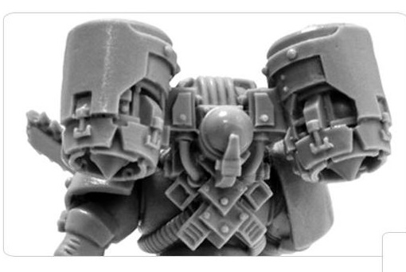
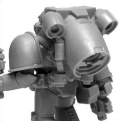
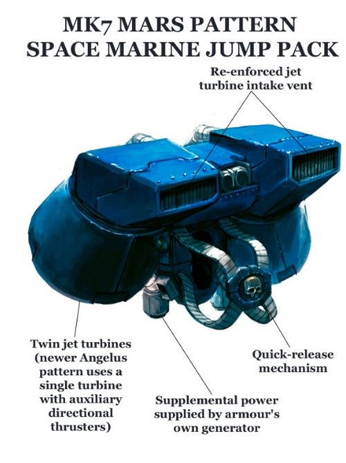
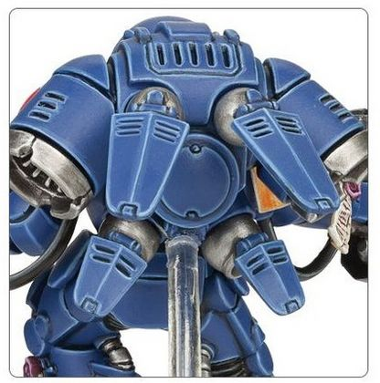
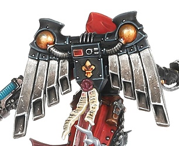
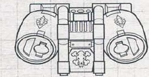
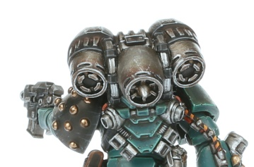

# 1339 跳跃背包 Jump Pack

精校状态：中文行文已逐段精校，部分术语仍为暂定

分类：装备 / 工具

原文来源：https://www.bilibili.com/opus/1014323897830473734

原作者：帝国神选罐头

原文时间：编辑于 2025年01月16日 14:58

[返回分类目录](目录.md) · [全书目录](../../目录.md)

<!-- A1339-B0001 -->
**英文原文**

A Jump Pack is a back mounted device containing turbines or jets powerful enough to lift even a user in Power Armour.

<!-- /A1339-B0001 -->

<!-- A1339-B0002 -->

原译文

跳跃背包是一种背部安装的装备，其中包含足够强大的涡轮机或强力的喷气发动机，甚至可以抬高动力装甲中的使用者。

**校订译文**

跳跃背包是一种背负式装置，内置涡轮或喷气推进器，动力强得足以将穿着动力盔甲的使用者送上空中。

<!-- /A1339-B0002 -->

<!-- A1339-B0003 -->
## Overview 概述

<!-- /A1339-B0003 -->

<!-- A1339-B0004 -->
**英文原文**

Jump packs are based on ancient STC technology. Intake vents on the top of the pack intake air to feed the jets, while the turbine blades expel it to create lift. Even with the aid of the power armour's energy coils the jump pack has its own fuel supply, such is the power required to send a fully armed and armoured Space Marine into the sky. A Jump Pack is usually good for around a dozen or so "jumps" before it must be refuelled or discarded.

<!-- /A1339-B0004 -->

<!-- A1339-B0005 -->

原译文

跳跃背包是基于古老的STC技术。背包顶部的进气口吸入空气以供给喷口，而涡轮叶片将其排出以产生升力。即使有动力装甲的能量线圈的辅助，跳跃背包也有自己的燃料供应，这就是将全副武装和披甲的星际战士送上天空所需的力量。在必须补给或丢弃之前，跳跃背包通常适合大约十几次“跳跃”。

**校订译文**

跳跃背包源自古老的标准建造模板（STC）技术。顶部进气口将空气送入喷气系统，再由涡轮叶片排出，产生升力。将全副武装的星际战士推上天空需要极大功率，因此即使有动力盔甲能量线圈辅助，背包仍需独立供给燃料。通常使用十来次后，就必须补充燃料或弃置。

<!-- /A1339-B0005 -->

<!-- A1339-B0006 图片 -->

<!-- A1339-B0007 -->

原译文

Heresy-era Jump Pack 叛乱时期跳跃背包

**校订译文**

Heresy-era Jump Pack 荷鲁斯之乱时期的跳跃背包

<!-- /A1339-B0007 -->

<!-- A1339-B0008 -->
**英文原文**

A jump pack greatly enhances a warrior's mobility by allowing him to travel quickly across the battlefield, making great bounding leaps over obstructions and launching him into the melee of close combat. Its roaring engines can also slow the wearer's descent when leaping from low-flying aircraft, allowing him to Deep Strike with relative safety directly into the fray.

<!-- /A1339-B0008 -->

<!-- A1339-B0009 -->

原译文

跳跃背包极大地提高了战士的机动性，使他能够快速穿越战场，在障碍物上跳跃，并将他带入近距离的混战中。其轰鸣的发动机还可以减缓佩戴者从低空飞行的飞机上跳跃时的下降速度，使他能够相对安全地直接进入战斗。

**校订译文**

它能大幅提升战士的机动性，使其快速穿越战场、跃过障碍，直接扑入近战。使用者从低空飞行器跃下时，轰鸣的发动机也能减缓下降速度，使其相对安全地以深度打击方式直接投入交锋。

**校注：** 对照本段英文确认同一实体，与全书核心译名统一；不改变同形异义词或省略称呼。

<!-- /A1339-B0009 -->

<!-- A1339-B0010 -->
**英文原文**

Some models of jump pack feature inbuilt grenade launchers that can clear out the space that the user will land in.

<!-- /A1339-B0010 -->

<!-- A1339-B0011 -->

原译文

一些型号的跳跃背包具有内置的榴弹发射器，可以清理使用者降落的空间。

**校订译文**

一些型号的跳跃背包具有内置的榴弹发射器，可以清理使用者降落的空间。

<!-- /A1339-B0011 -->

<!-- A1339-B0012 -->
## Known Patterns 已知型号

<!-- /A1339-B0012 -->

<!-- A1339-B0013 -->
**英文原文**

Mk.IV Maximus Pattern — Used by Space Marines clad in Mk.IV Power Armour, this unusual design had a single thruster with smaller manoeuvring jets.

<!-- /A1339-B0013 -->

<!-- A1339-B0014 -->

原译文

Mk.IV马克西姆型 — 由穿着Mk.IV动力装甲的星际战士使用，这种不同寻常的设计有一个带有较小机动喷气式发动机的推进器。

**校订译文**

Mk.IV 马克西姆型——由穿着 Mk.IV 动力盔甲的星际战士使用。这一特殊设计采用单个主推进器，并配有较小的机动喷口。

<!-- /A1339-B0014 -->

<!-- A1339-B0015 图片 -->

<!-- A1339-B0016 -->

原译文

Mk.IV Maximus Pattern Jump Pack Mk.IV马克西姆型跳跃背包

**校订译文**

Mk.IV Maximus Pattern Jump Pack Mk.IV马克西姆型跳跃背包

<!-- /A1339-B0016 -->

<!-- A1339-B0017 -->
**英文原文**

Mk.VII Mars Pattern — Standard design used by Assault Marines

<!-- /A1339-B0017 -->

<!-- A1339-B0018 -->

原译文

Mk.VII火星型 — 突击战士使用的标准设计

**校订译文**

Mk.VII火星型 — 突击战士使用的标准设计

<!-- /A1339-B0018 -->

<!-- A1339-B0019 图片 -->

<!-- A1339-B0020 -->

原译文

Mk.7 Mars Pattern Jump Pack Mk.VII火星型跳跃背包

**校订译文**

Mk.7 Mars Pattern Jump Pack Mk.VII火星型跳跃背包

<!-- /A1339-B0020 -->

<!-- A1339-B0021 -->
**英文原文**

Corvid Pattern Jump Pack — Used by the Raven Guard. This redesigned version of the Warhawk Pattern, the Corvid adds a sophisticated vector thrust assembly that allows its wearer to make longer more precise leaps.

<!-- /A1339-B0021 -->

<!-- A1339-B0022 -->

原译文

鸦型跳跃背包 — 暗鸦守卫使用。这种重新设计的战鹰型，鸦型增加了一个复杂的矢量推力组件，使其佩戴者能够进行更长更精确的跳跃。

**校订译文**

鸦型跳跃背包——暗鸦守卫使用。它在战鹰型基础上改进，加入精密的矢量推力组件，使跳跃距离更远、落点更精准。

<!-- /A1339-B0022 -->

<!-- A1339-B0023 -->
**英文原文**

Heavy Jump Pack - Used by Inceptor Squads

<!-- /A1339-B0023 -->

<!-- A1339-B0024 -->

原译文

重型跳跃背包 - 供先驱者小队使用

**校订译文**

重型跳跃背包 - 供先驱者小队使用

<!-- /A1339-B0024 -->

<!-- A1339-B0025 图片 -->

<!-- A1339-B0026 -->

原译文

Heavy Jump Pack 重型跳跃背包

**校订译文**

Heavy Jump Pack 重型跳跃背包

<!-- /A1339-B0026 -->

<!-- A1339-B0027 -->
**英文原文**

Enigmatus Pattern Jump Pack — Used by the Firewing of the Dark Angels during the Horus Heresy.

<!-- /A1339-B0027 -->

<!-- A1339-B0028 -->

原译文

迷影型跳跃背包 — 荷鲁斯叛乱时期黑暗天使炎翼所用。

**校订译文**

迷影型跳跃背包——荷鲁斯之乱期间，黑暗天使炎翼使用。

<!-- /A1339-B0028 -->

<!-- A1339-B0029 -->
**英文原文**

Seraphim Jump Pack - Used by Adepta Sororitas Seraphim Squads

<!-- /A1339-B0029 -->

<!-- A1339-B0030 -->

原译文

炽天使跳跃背包 - 由修女会炽天使小队使用

**校订译文**

炽天使跳跃背包 - 由修女会炽天使小队使用

<!-- /A1339-B0030 -->

<!-- A1339-B0031 图片 -->

<!-- A1339-B0032 -->

原译文

Seraphim Jump Pack 炽天使跳跃背包

**校订译文**

Seraphim Jump Pack 炽天使跳跃背包

<!-- /A1339-B0032 -->

<!-- A1339-B0033 -->
**英文原文**

Valkyris Pattern — Used by the Space Wolves.

<!-- /A1339-B0033 -->

<!-- A1339-B0034 -->

原译文

瓦尔基里型 — 太空野狼使用。

**校订译文**

瓦尔基里型 — 太空野狼使用。

<!-- /A1339-B0034 -->

<!-- A1339-B0035 图片 -->

<!-- A1339-B0036 -->

原译文

Valkyris Pattern Jump Pack 瓦尔基里型跳跃背包

**校订译文**

Valkyris Pattern Jump Pack 瓦尔基里型跳跃背包

<!-- /A1339-B0036 -->

<!-- A1339-B0037 -->
**英文原文**

Venatari Jump Harness — Used by Custodian Venatari.

<!-- /A1339-B0037 -->

<!-- A1339-B0038 -->

原译文

猎鹰跳跃背包 — 由禁军猎鹰使用。

**校订译文**

翔猎跳跃套具——翔猎禁军使用。

<!-- /A1339-B0038 -->

<!-- A1339-B0039 -->
**英文原文**

Warhawk Pattern — Standard during the Great Crusade.

<!-- /A1339-B0039 -->

<!-- A1339-B0040 -->

原译文

战鹰型 — 大远征时期的标准。

**校订译文**

战鹰型 — 大远征时期的标准。

<!-- /A1339-B0040 -->

<!-- A1339-B0041 图片 -->

<!-- A1339-B0042 -->

原译文

Warhawk Pattern Jump Pack 战鹰型跳跃背包

**校订译文**

Warhawk Pattern Jump Pack 战鹰型跳跃背包

<!-- /A1339-B0042 -->

<!-- A1339-B0043 -->
**英文原文**

Winged Jump Pack — Used by the Sanguinary Guard of the Blood Angels

<!-- /A1339-B0043 -->

<!-- A1339-B0044 -->

原译文

飞翼跳跃背包 — 圣血天使圣血卫队使用

**校订译文**

飞翼跳跃背包——圣血天使的圣血守卫使用。

<!-- /A1339-B0044 -->

<!-- A1339-B0045 -->
## Notable Jump Packs 著名跳跃背包

<!-- /A1339-B0045 -->

<!-- A1339-B0046 -->

原译文

Angel's Wing 天使之翼

**校订译文**

Angel's Wing 天使之翼

<!-- /A1339-B0046 -->

<!-- A1339-B0047 -->

原译文

The Korvidine Pinions 卡尔维迪之翼

**校订译文**

The Korvidine Pinions 渡鸦翼羽

<!-- /A1339-B0047 -->

<!-- A1339-B0048 -->

原译文

Raven's Fury 渡鸦狂怒

**校订译文**

Raven's Fury 渡鸦狂怒

<!-- /A1339-B0048 -->

<!-- A1339-B0049 -->

原译文

Victorious Flight 胜利飞行

**校订译文**

Victorious Flight 胜利飞行

<!-- /A1339-B0049 -->

<!-- A1339-B0050 -->

原译文

Wings of Saronath 萨罗南斯之翼

**校订译文**

Wings of Saronath 萨罗南斯之翼

<!-- /A1339-B0050 -->

<!-- A1339-B0051 -->

原译文

Wings of the Raven 渡鸦之翼

**校订译文**

Wings of the Raven 渡鸦之翼

<!-- /A1339-B0051 -->

本篇核心术语与暂定项

以下列出本篇出现的英文原形及核心术语表用词。同形词可能指不同对象，具体词义以本篇正文和校注为准；单复数、别名和仅见于图注的名称可能尚未列入。完整候选见[术语表](../../术语表/双语术语候选.csv)。

| 英文 | 采用中文 | 状态 |
| --- | --- | --- |
| Space Marines | 星际战士 | 官方已核对 |
| Blood Angels | 圣血天使 | 官方已核对 |
| Dark Angels | 黑暗天使 | 官方已核对 |
| Space Wolves | 太空野狼 | 官方已核对 |
| Adepta Sororitas | 修女会 | 官方已核对 |
| Deep Strike | 深度打击 | 官方已核对 |
| Horus Heresy | 荷鲁斯之乱 | 官方已核对 |
| Sanguinary | 圣血学派 | 暂定·学派语境 |
| Great Crusade | 大远征 | 暂定·官方待核 |
| Horus | 荷鲁斯 | 暂定·官方待核 |
| STC | 标准建造模板 | 暂定·官方待核 |
| Mars | 火星 | 暂定·官方待核 |
| Clear | 清明 | 暂定·官方待核 |
| Ancient | 旗手 | 官方已核对 |
| Sanguinary Guard | 圣血守卫 | 官方已核对 |
| Raven Guard | 暗鸦守卫 | 官方已核 |
| Power Armour | 动力盔甲 | 暂定·官方待核 |
| Space Marine | 星际战士 | 暂定·官方待核 |
| Inceptor | 先驱者 | 暂定·官方待核 |
| The Warhawk | 战鹰 | 暂定·官方待核 |
| The Dark | 《黑暗》 | 暂定·官方待核 |
| The Blood | 鲜血 | 暂定·官方待核 |
| Jump Pack | 跳跃背包 | 暂定·官方待核 |
| Corvid Pattern Jump Pack | 鸦型跳跃背包 | 暂定·官方待核 |
| Heavy Jump Pack | 重型跳跃背包 | 暂定·官方待核 |
| Enigmatus Pattern Jump Pack | 迷影型跳跃背包 | 暂定·官方待核 |
| Valkyris Pattern | 瓦尔基里型 | 暂定·官方待核 |
| Venatari Jump Harness | 翔猎跳跃套具 | 暂定·官方待核 |
| Warhawk Pattern | 战鹰型 | 暂定·官方待核 |
| Winged Jump Pack | 飞翼跳跃背包 | 暂定·官方待核 |
| Grenade | 手榴弹 | 暂定·官方待核 |

