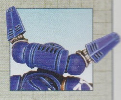

# 1340 重力伞 Grav Chutes

精校状态：中文行文已逐段精校，部分术语仍为暂定

分类：装备 / 工具

原文来源：https://www.bilibili.com/opus/1014001809636720643

原作者：帝国神选罐头

原文时间：2024年12月23日 12:44

[返回分类目录](目录.md) · [全书目录](../../目录.md)

<!-- A1340-B0001 -->
**英文原文**

Astartes Grav Chutes are used on the occasions when Space Marine Scout Squads must deploy stealthily and are unable to utilise more common methods like teleportation or drop pods. Grav chutes rely on suspensor fields to counter gravity and slow descent. Unlike a jump pack, which allows the user to leap into the air, a grav chute’s lower power output only allows for a safe, guided fall such as a combat drop from a transport.

<!-- /A1340-B0001 -->

<!-- A1340-B0002 -->

原译文

当星际战士侦察小队必须秘密部署并且无法使用更常见的方法（如传送或空降仓）时，会使用阿斯塔特重力伞。重力伞依靠悬浮立场来对抗重力并缓慢下降。与允许使用者跳跃到空中的跳跃背包不同，重力伞的较低功率输出只允许安全、有引导的坠落，例如从运输工具上进行战斗空降。

**校订译文**

星际战士侦察小队需要隐秘部署，又无法使用传送或空降舱等常规方式时，会使用阿斯塔特重力伞。它以悬浮力场抵消重力、减缓下降。跳跃背包能够将使用者推上空中，重力伞的输出却只够控制下落方向并安全着陆，例如从运输机进行战斗空降。

<!-- /A1340-B0002 -->

<!-- A1340-B0003 -->
**英文原文**

Primaris Space Marines equipped with Mark X Phobos Armour also utilize grav chutes, in particular Reiver Squads and Vanguard Suppressors.

<!-- /A1340-B0003 -->

<!-- A1340-B0004 -->

原译文

配备Mark X 福波斯装甲的原铸星际战士也使用重力伞，特别是掠夺者小队和先锋压制者。

**校订译文**

装备 Mk.X 恐惧型护甲的原铸星际战士也使用重力伞，尤其是掠夺者小队和先锋压制者。

**校注：** 按原文保留对使用者护甲的归类；不据其他单位资料擅改本篇范围。

<!-- /A1340-B0004 -->

<!-- A1340-B0005 图片 -->

<!-- A1340-B0006 -->

原译文

Primaris Space Marine Grav Chute 原铸星际战士重力伞

**校订译文**

Primaris Space Marine Grav Chute 原铸星际战士重力伞

<!-- /A1340-B0006 -->

本篇核心术语与暂定项

以下列出本篇出现的英文原形及核心术语表用词。同形词可能指不同对象，具体词义以本篇正文和校注为准；单复数、别名和仅见于图注的名称可能尚未列入。完整候选见[术语表](../../术语表/双语术语候选.csv)。

| 英文 | 采用中文 | 状态 |
| --- | --- | --- |
| Space Marines | 星际战士 | 官方已核对 |
| Teleportation | 传送 | 暂定 |
| Phobos | 火卫一 | 暂定·官方待核 |
| Phobos Armour | 恐惧型护甲 | 官方已核 |
| Space Marine | 星际战士 | 暂定·官方待核 |
| Scout | 侦察兵 | 暂定·官方待核 |
| Vanguard | 先锋 | 暂定·官方待核 |
| Reiver | 掠夺者 | 暂定·官方待核 |
| Jump Pack | 跳跃背包 | 暂定·官方待核 |
| Grav Chutes | 重力伞 | 暂定·官方待核 |
| Suspensor | 悬浮装置 | 暂定·官方待核 |

