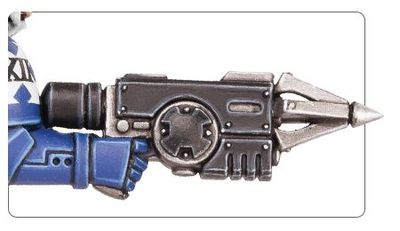

# 1341 抓钩发射器 Grapnel Launcher

精校状态：中文行文已逐段精校，部分术语仍为暂定

分类：装备 / 工具

原文来源：https://www.bilibili.com/opus/1001020253824614403

原作者：帝国神选罐头

原文时间：2024年11月18日 13:09

[返回分类目录](目录.md) · [全书目录](../../目录.md)

<!-- A1341-B0001 -->
**英文原文**

The Grapnel Launcher is a type of grappling hook weapon used by Primaris Space Marine Reivers and Scout Hunters.

<!-- /A1341-B0001 -->

<!-- A1341-B0002 -->

原译文

抓钩发射器是一种抓钩武器，主要用于原铸星际战士掠夺者和侦察兵猎手。

**校订译文**

抓钩发射器是一种发射攀援钩索的装备，由原铸星际战士掠夺者和侦察兵猎手使用。

<!-- /A1341-B0002 -->

<!-- A1341-B0003 图片 -->

<!-- A1341-B0004 -->

原译文

Grapnel Launcher 抓钩发射器

**校订译文**

Grapnel Launcher 抓钩发射器

<!-- /A1341-B0004 -->

本篇核心术语与暂定项

以下列出本篇出现的英文原形及核心术语表用词。同形词可能指不同对象，具体词义以本篇正文和校注为准；单复数、别名和仅见于图注的名称可能尚未列入。完整候选见[术语表](../../术语表/双语术语候选.csv)。

| 英文 | 采用中文 | 状态 |
| --- | --- | --- |
| Space Marine | 星际战士 | 暂定·官方待核 |
| Scout | 侦察兵 | 暂定·官方待核 |
| Primaris Space Marine | 原铸星际战士 | 暂定·官方待核 |
| Grapnel Launcher | 抓钩发射器 | 暂定·官方待核 |
| Reivers | 掠夺者 | 暂定·官方待核 |

