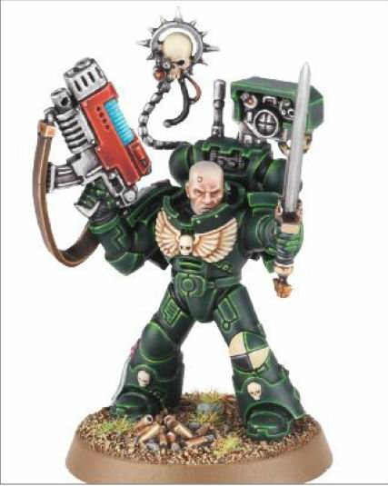

# 1344 目标指示器 Signum

精校状态：中文行文已逐段精校，部分术语仍为暂定

分类：装备 / 探查

原文来源：https://www.bilibili.com/opus/1015085258087858194

原作者：帝国神选罐头

原文时间：2024年12月26日 10:49

[返回分类目录](目录.md) · [全书目录](../../目录.md)

<!-- A1344-B0001 -->
**英文原文**

The Signum is a special communication device which allows the user to access a myriad of useful battlefield targeting data and pass that information on to their companions, allowing for more accurate and coordinated fire. Signums are available to members of a Deathwatch Kill-Team as well as normal Adeptus Astartes Techmarines, Devastator Sergeants and Techpriest Enginseers of the Imperial Guard. While useful on its own, pairing a signum with the interconnected autosenses of a squad of Space Marines allows them to strike their foe with deadly and inescapable coordinated precision.

<!-- /A1344-B0001 -->

<!-- A1344-B0002 -->

原译文

目标指示器是一种特殊的通信设备，允许使用者访问无数有用的战场目标数据，并将这些信息传递给他们的同伴，从而实现更准确和协调的射击。死亡守望杀戮小队的成员以及普通星际战士的技术军士、毁灭者军士和帝国卫队的技术神甫工造士都可以使用标志。虽然其本身就很有用，但将一个目标指示器与一队星际战士相互连接的自动感知系统相结合，可使他们以致命且无可逃避的协同精度打击敌人。

**校订译文**

目标指示器是一种特殊通讯设备，能获取大量有用的战场瞄准数据，并传给同伴，使射击更精准、配合更协调。死亡守望杀戮小队成员、其他阿斯塔特战团的科技战士、破坏者军士，以及帝国卫队的技术祭司机械教士，都可使用。它单独便有实用价值；若接入整队星际战士相互联通的自动感官系统，更能协助他们以精准协调、难以躲避的火力打击敌人。

<!-- /A1344-B0002 -->

<!-- A1344-B0003 图片 -->

<!-- A1344-B0004 -->

原译文

Dark Angels Devastator Sergeant with a Signum on his backpack 在背包上装备目标指示器的暗黑天使毁灭者军士

**校订译文**

Dark Angels Devastator Sergeant with a Signum on his backpack 背包装有目标指示器的黑暗天使破坏者军士

<!-- /A1344-B0004 -->

本篇核心术语与暂定项

以下列出本篇出现的英文原形及核心术语表用词。同形词可能指不同对象，具体词义以本篇正文和校注为准；单复数、别名和仅见于图注的名称可能尚未列入。完整候选见[术语表](../../术语表/双语术语候选.csv)。

| 英文 | 采用中文 | 状态 |
| --- | --- | --- |
| Space Marines | 星际战士 | 官方已核对 |
| Adeptus Astartes | 阿斯塔特修会 | 官方已核对 |
| Deathwatch | 死亡守望 | 官方已核对 |
| Imperial Guard | 帝国卫队 | 暂定·语境区分 |
| Signum | 目标指示器 | 暂定·官方待核 |
| Companions | 近侍 | 暂定·官方待核 |
| Devastator | 破坏者 | 暂定·官方待核 |

