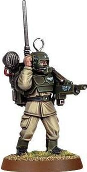
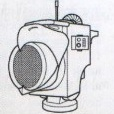
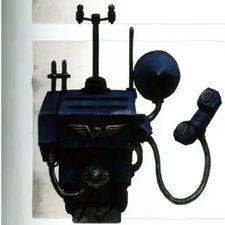
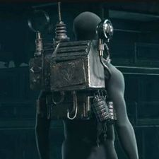
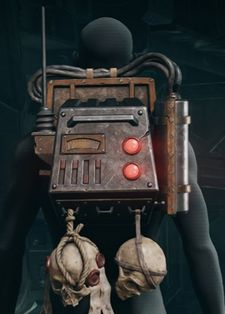
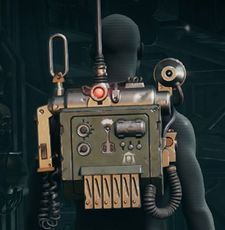

# 1349 通讯器 Vox-caster

精校状态：中文行文已逐段精校，部分术语仍为暂定

分类：装备 / 探查

原文来源：https://www.bilibili.com/opus/1215497219606577154

原作者：帝国神选罐头

原文时间：2026年06月19日 12:30

[返回分类目录](目录.md) · [全书目录](../../目录.md)

原篇名：音阵发射器 Vox-caster

<!-- A1349-B0001 -->
**英文原文**

A Vox-caster, Vox-set, Comm-link or Communicator is a sophisticated and reliable piece of Imperial technology used by the Imperial Guard to communicate orders over long distances via audio or audio-visual pickups. It ties into the strategic command and tactical command net via tight beam transmitters and signal decoders.

<!-- /A1349-B0001 -->

<!-- A1349-B0002 -->

原译文

音阵释放器、音阵发射器、通信链接或通信器是帝国卫队使用的一种复杂可靠的帝国技术，用于通过音频或视听接收器远距离传达命令。它通过窄波束发射机和信号解码器与战略指挥和战术指挥网相连。

**校订译文**

通讯器在英文中也称 Vox-set、Comm-link 或 Communicator，是帝国卫队用来远距离传达命令的精密可靠设备，可传输声音或视听信号，并通过窄束发射器与信号解码器接入战略和战术指挥网络。

**校注：** Vox-caster依据GW-04/GW-11同版索引第31页采用通讯器；原音阵发射器、音阵释放器保留对照。其他专名中的vox不机械替换。

<!-- /A1349-B0002 -->

<!-- A1349-B0003 图片 -->

<!-- A1349-B0004 -->

原译文

Cadian Guardsman with a vox-caster 配备音阵释放器的卡迪亚卫兵

**校订译文**

Cadian Guardsman with a vox-caster 配备通讯器的卡迪亚卫队士兵

<!-- /A1349-B0004 -->

<!-- A1349-B0005 -->
## Description 描述

<!-- /A1349-B0005 -->

<!-- A1349-B0006 -->
**英文原文**

The appearance and size of a Vox-caster is based on its origin point and can vary from a separate handheld instrument to a helmet-unit, a wrist strap or a longer-ranged backpack unit. It can also be vehicle-mounted, where it can be upgraded to Improved Comms.. The Vox-caster operates on an oscillating frequency to prevent detection and is heavily shielded to prevent electromagnetic interferences. Even if the transmission is intercepted, a successful deciphering of the message is considered unlikely without dedicated complex deciphering equipment. For this reason, Vox-casters can have closed channels, only receivable by another unit that has the pre-approved deciphering code.

<!-- /A1349-B0006 -->

<!-- A1349-B0007 -->

原译文

音阵发射器的外观和尺寸取决于其原点，可以从单独的手持仪器到头盔单元、腕带或长程背包单元。它也可以安装在载具上，可以升级为改进型通信。音阵发射器在振荡频率下工作以防止检测，并被严格屏蔽以防止电磁干扰。即使传输被截获，如果没有专用的复杂解密设备，也不太可能成功解密消息。因此，音阵发射器可以拥有封闭的通道，只能由具有预先批准的解密代码的另一个单位接收。

**校订译文**

通讯器的外形、尺寸因产地而异，既有独立手持式、头盔式、腕带式，也有射程更远的背负式；车载型号还可升级为增强通讯设备。它通过不断变化的频率降低被侦测的风险，并以严密屏蔽抵御电磁干扰。即使信号被截获，没有专门的复杂解密设备，也很难读出内容。因此，它可建立封闭频道，只有预先持有获准解码密钥的另一台设备才能接收。

<!-- /A1349-B0007 -->

<!-- A1349-B0008 图片 -->

<!-- A1349-B0009 -->

原译文

vox-caster 音阵发射器

**校订译文**

vox-caster 通讯器

<!-- /A1349-B0009 -->

<!-- A1349-B0010 -->
**英文原文**

Ranges vary depending on size, handheld units having a range of a hundred kilometres, with backpack units having longer ranges, capable of communicating planet-wide or with orbiting spaceships. Vehicle-mounted Vox-caster units have a range of ten million miles.

<!-- /A1349-B0010 -->

<!-- A1349-B0011 -->

原译文

范围因大小而异，手持设备的范围为一百公里，背包式设备的范围更远，能够在全球范围内或与轨道宇宙飞船进行通信。车载音阵发射器装置的射程为1000万英里。

**校订译文**

通讯距离随型号大小而异。手持式可达100公里，背负式更远，能跨越整颗行星，或与轨道上的星舰联络；车载型号的通讯距离可达1,000万英里。

<!-- /A1349-B0011 -->

<!-- A1349-B0012 -->
**英文原文**

By being set to a white noise broadcast, a Vox-Caster can serve as an improvised if short-ranged jamming device, wiping enemy Vox-channels. Vox-casters have transmission logs to store received vox-traffic. These logs can be copied from captioned enemy vox-units by direct connection through usage of a cable. Vox-casters also have a translator system to translate the copied transmission logs.

<!-- /A1349-B0012 -->

<!-- A1349-B0013 -->

原译文

通过设置为白噪声广播，音阵发射器可以作为短程干扰设备，清除敌方音阵频道。音阵发射器有传输日志来存储接收到的音阵流。这些日志可以通过使用电缆直连从目标敌方音阵单元复制。音阵发射器还有一个翻译系统来翻译复制的传输日志。

**校订译文**

将通讯器设为广播白噪声后，便能把它用作临时短程干扰器，扰乱敌方通讯频道。它也有日志功能，可保存收到的通讯内容。用线缆直接连接缴获的敌方设备，就能复制其中的日志，再由内置翻译系统解读。

**校注：** 英文captioned依上下文应为captured，即缴获的设备；不是给设备添加字幕。

<!-- /A1349-B0013 -->

<!-- A1349-B0014 -->
**英文原文**

It is also useful for projecting the leadership of a command unit to the rest of the army, especially if the Vox-caster in the command squad is upgraded to a Master-Vox, although the effects of equipment like standards are not transmitted due to the need to see the standard to gain faith from it. When using the Master-Vox, it allows the commander to send multiple messages to the squads opposed to a normal Vox-caster which can only send one message at a time.

<!-- /A1349-B0014 -->

<!-- A1349-B0015 -->

原译文

它也有助于将指挥单位的领导投射到军队的其他编组，特别是如果指挥组中的音阵发射器升级为大师级音阵，尽管由于需要查看标准以获得信任，因此不会传输设备类标准的效果。使用大师级音阵时，它允许指挥官向小队发送多条消息，而不是一次只能发送一条消息的普通音阵发射器。

**校订译文**

通讯器可让指挥单位将指挥效能传递给其他部队，升级为大功率通讯器后尤其有效。它允许指挥官同时向小队发出多条消息，普通型号则一次只能发送一条。不过，军旗等装备的作用无法通过通讯传递，因为士兵必须亲眼看见军旗，才能从中获得信念。

**校注：** standards为军旗，不是标准；Master Vox依据官方索引第15页译大功率通讯器。

<!-- /A1349-B0015 -->

<!-- A1349-B0016 -->
## Known models 已知设计

<!-- /A1349-B0016 -->

<!-- A1349-B0017 -->
## Bombast-Class Vox-Array 浮夸级音阵阵列

<!-- /A1349-B0017 -->

<!-- A1349-B0018 -->
**英文原文**

The Bombast-Class Vox-Array was manufactured on the long-lost Forge World of Urvax. It is an omni-frequency master vox-array that allows for the rapid propagation of orders throughout a combat detachment.

<!-- /A1349-B0018 -->

<!-- A1349-B0019 -->

原译文

浮夸级音阵阵列是在失落已久的乌尔瓦克斯铸造世界上制造的。它是一个全频大师级音阵阵列，允许在整个作战分遣队中快速传播命令。

**校订译文**

浮夸级音阵阵列由失落已久的铸造世界乌尔瓦克斯制造，是一种全频大功率通讯阵列，能够将命令迅速传遍作战分遣队。

<!-- /A1349-B0019 -->

<!-- A1349-B0020 -->
## Clarion Vox Array 号角音阵阵列

<!-- /A1349-B0020 -->

<!-- A1349-B0021 -->
**英文原文**

The Clarion Vox Array is the primary mobile Vox system deployed by the Militarum Tempestus among the special operations troops known as Tempestus Scions. It is a triumph of audio-military hardware that overrides its designated airwaves with the crystal clear and perfectly enunciated commands of the Tempestors leading each detachment of Scions.

<!-- /A1349-B0021 -->

<!-- A1349-B0022 -->

原译文

号角音阵阵列是暴风军在被称为暴风忠嗣的特种作战部队中部署的主要移动音阵系统。这是音频军事硬件的胜利，它以领导忠嗣每个分遣队的驭风者清晰而完美的命令覆盖了其指定的波段。

**校订译文**

号角音阵阵列是风暴军为风暴忠嗣军特种作战部队部署的主要移动通讯系统。它是军用音讯设备中的杰作，能够占据指定频段，将各分遣队风暴忠嗣队长清晰、分明的命令送达部下。

<!-- /A1349-B0022 -->

<!-- A1349-B0023 图片 -->

<!-- A1349-B0024 -->

原译文

Clarion Vox Array 号角音阵阵列

**校订译文**

Clarion Vox Array 号角音阵阵列

<!-- /A1349-B0024 -->

<!-- A1349-B0025 -->
## Nuncio-Vox 大使音阵

<!-- /A1349-B0025 -->

<!-- A1349-B0026 -->
**英文原文**

A Nuncio-Vox is a beacon and communications array used by the Legiones Astartes that allowed constant co-ordination with other elements of an army be they in a neighbouring region or in orbit high overhead. This allowed precision reinforcements to be deployed nearby and strikes to be targeted with deadly accuracy.

<!-- /A1349-B0026 -->

<!-- A1349-B0027 -->

原译文

大使音阵是阿斯塔特军团使用的信标和通信阵列，它允许与邻近地区或高空轨道上的其他部队进行持续协调。这使得精确增援能够部署在附近，并以致命的精确度进行打击。

**校订译文**

通讯引导阵列是阿斯塔特军团使用的信标与通讯阵列，可持续联络邻近地区或高空轨道上的友军，使增援部队精确部署在附近，并引导打击准确命中目标。

<!-- /A1349-B0027 -->

<!-- A1349-B0028 -->
## Sonegraph 160 索尼格拉夫160

<!-- /A1349-B0028 -->

<!-- A1349-B0029 -->
**英文原文**

The Sonegraph 160 is a very old, non-portable Vox-caster model used by the forces of Chaos. It can tune into main command channels and data relays, being part of the principal communications network. To decrypt transmissions, the Sonegraph 160 is equipped with a cypher module which itself must be activated by a physical key. The Vox-caster can store at least eight months of received vox-traffic in its transmission logs.

<!-- /A1349-B0029 -->

<!-- A1349-B0030 -->

原译文

索尼格拉夫160是混沌部队使用的一种非常古老的非便携式音阵发射器设计。它可以调谐到主指挥信道和数据中继，是主要通信网络的一部分。为了解密传输，索尼格拉夫160配备了一个密码模块，该模块本身必须由物理密钥激活。音阵发射器可以在其传输日志中存储至少八个月的接收到的音阵流。

**校订译文**

索尼格拉夫160是混沌部队使用的一种古老、不可便携的通讯器。它可接入主指挥频道和数据中继，成为主要通讯网络的一部分。解密模块须以实体钥匙启动，日志则至少能保存八个月的通讯记录。

<!-- /A1349-B0030 -->

<!-- A1349-B0031 -->
## MK IIC

<!-- /A1349-B0031 -->

<!-- A1349-B0032 -->
**英文原文**

The MK IIC is a type of portable Vox-caster.

<!-- /A1349-B0032 -->

<!-- A1349-B0033 -->

原译文

MK IIC是一种便携式音阵发射器。

**校订译文**

Mk.IIC 是一种便携式通讯器。

<!-- /A1349-B0033 -->

<!-- A1349-B0034 图片 -->

<!-- A1349-B0035 -->

原译文

Munitorum Mk IIc Vox Caster (Factorum Finish) 军务Mk IIc 音阵发射器（工厂抛光）

**校订译文**

Munitorum Mk IIc Vox Caster (Factorum Finish) 军务部 Mk.IIc 通讯器（工厂涂装）

**校注：** Finish指表面处理或涂装，不认定为抛光。

<!-- /A1349-B0035 -->

<!-- A1349-B0036 -->
## Theta-901 西塔-901

<!-- /A1349-B0036 -->

<!-- A1349-B0037 -->
**英文原文**

The Theta-901 is a type of portable Vox-caster.

<!-- /A1349-B0037 -->

<!-- A1349-B0038 -->

原译文

西塔-901是一种便携式音阵发射器。

**校订译文**

西塔-901是一种便携式通讯器。

<!-- /A1349-B0038 -->

<!-- A1349-B0039 图片 -->

<!-- A1349-B0040 -->

原译文

Vox-Caster Theta-901 音阵发射器西塔-901

**校订译文**

Vox-Caster Theta-901 西塔-901通讯器

<!-- /A1349-B0040 -->

<!-- A1349-B0041 -->
## MKVIII Field Vox Unit MKVIII野外音阵单元

<!-- /A1349-B0041 -->

<!-- A1349-B0042 -->
**英文原文**

Used by the brave soldiers of the Astra Militarum.

<!-- /A1349-B0042 -->

<!-- A1349-B0043 -->

原译文

由星界军的勇敢士兵使用。

**校订译文**

由星界军的勇敢士兵使用。

<!-- /A1349-B0043 -->

<!-- A1349-B0044 图片 -->

<!-- A1349-B0045 -->

原译文

MKVIII Field Vox Unit MKVIII野外音阵单元

**校订译文**

MKVIII Field Vox Unit MKVIII野外音阵单元

<!-- /A1349-B0045 -->

<!-- A1349-B0046 -->
## Trivia 琐事

<!-- /A1349-B0046 -->

<!-- A1349-B0047 -->
**英文原文**

Vox is Latin for "voice".

<!-- /A1349-B0047 -->

<!-- A1349-B0048 -->

原译文

音阵在拉丁语中意为“声音”。

**校订译文**

Vox 在拉丁语中意为“声音”。

<!-- /A1349-B0048 -->

本篇核心术语与暂定项

以下列出本篇出现的英文原形及核心术语表用词。同形词可能指不同对象，具体词义以本篇正文和校注为准；单复数、别名和仅见于图注的名称可能尚未列入。完整候选见[术语表](../../术语表/双语术语候选.csv)。

| 英文 | 采用中文 | 状态 |
| --- | --- | --- |
| Astra Militarum | 星界军 | 官方已核对 |
| Imperial Guard | 帝国卫队 | 暂定·语境区分 |
| Equipment | 装备 | 编辑用语已统一 |
| Forge World | 铸造世界 | 暂定·官方待核 |
| Legiones Astartes | 阿斯塔特军团 | 暂定·官方待核 |
| Clear | 清明 | 暂定·官方待核 |
| Master | 导师（审判庭职衔）／舰务官（舰员职务） | 语境定译·官方待核 |
| Command Squad | 指挥小队 | 暂定·官方待核 |
| Nuncio-Vox | 通讯引导阵列 | 暂定·官方待核 |
| Militarum Tempestus | 暴风军 | 暂定·官方待核 |
| Tempestors | 唤风者 | 暂定·官方待核 |
| Cypher | 塞弗 | 官方已核对 |
| Tempestus Scions | 风暴忠嗣军 | 官方已核对 |
| Principal | 首席（史洛斯职衔） | 暂定·官方待核 |
| System | 星系（恒星系统） | 暂定·官方待核 |
| Vox-caster | 通讯器 | 官方已核对 |
| Master Vox | 大功率通讯器 | 官方已核对 |
| Bombast-Class Vox-Array | 浮夸级音阵阵列 | 暂定·官方待核 |
| Urvax | 乌尔瓦克斯 | 暂定·官方待核 |
| Clarion Vox Array | 号角音阵阵列 | 暂定·官方待核 |
| Sonegraph 160 | 索尼格拉夫160 | 暂定·官方待核 |
| Theta-901 | 西塔-901 | 暂定·官方待核 |

