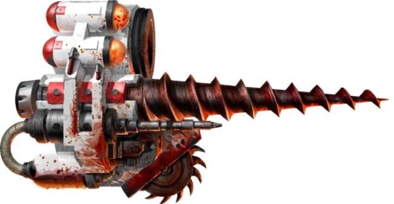

# 1353 医疗套件 Narthecium

精校状态：中文行文已逐段精校，部分术语仍为暂定

分类：装备 / 医疗

原文来源：https://www.bilibili.com/opus/1014324078239023108

原作者：帝国神选罐头

原文时间：编辑于 2025年07月30日 10:17

[返回分类目录](目录.md) · [全书目录](../../目录.md)

<!-- A1353-B0001 -->
**英文原文**

The Narthecium is a Space Marine Apothecary's medical field kit, containing the necessary tools to treat wounded Marines and get them back into action as quickly as possible.

<!-- /A1353-B0001 -->

<!-- A1353-B0002 -->

原译文

医疗套件是星际战士药剂师的现场医疗工具包，其中包含治疗受伤星际战士并让他们尽快恢复行动的必要工具。

**校订译文**

医疗套件是星际战士药剂师的战地医疗工具组，包含救治伤员、使其尽快恢复作战能力所需的器具。

<!-- /A1353-B0002 -->

<!-- A1353-B0003 图片 -->

<!-- A1353-B0004 -->

原译文

Hagen Pattern Narthecium 哈根型医疗套件

**校订译文**

Hagen Pattern Narthecium 哈根型医疗套件

<!-- /A1353-B0004 -->

<!-- A1353-B0005 -->
## Overview 概述

<!-- /A1353-B0005 -->

<!-- A1353-B0006 -->
**英文原文**

Included in the standard kit are:

<!-- /A1353-B0006 -->

<!-- A1353-B0007 -->

原译文

标准套件包括：

**校订译文**

标准套件包括：

<!-- /A1353-B0007 -->

<!-- A1353-B0008 -->

原译文

Anti-venom. 抗毒血清

**校订译文**

Anti-venom. 抗毒血清

<!-- /A1353-B0008 -->

<!-- A1353-B0009 -->

原译文

Stim-packs. 兴奋剂包

**校订译文**

Stim-packs. 兴奋剂包

<!-- /A1353-B0009 -->

<!-- A1353-B0010 -->

原译文

Healing agents. 治疗剂

**校订译文**

Healing agents. 治疗剂

<!-- /A1353-B0010 -->

<!-- A1353-B0011 -->

原译文

Sterile clay for sealing wounds. 用于密封伤口的无菌粘土

**校订译文**

Sterile clay for sealing wounds. 用于封闭伤口的无菌黏土

<!-- /A1353-B0011 -->

<!-- A1353-B0012 -->
**英文原文**

A Carnifex for euthanizing fatally injured Marines.

<!-- /A1353-B0012 -->

<!-- A1353-B0013 -->

原译文

一个刽子手，对重伤的星际战士实施安乐死

**校订译文**

刽子手装置——为伤重不治的星际战士实施安乐死。

**校注：** Carnifex在此是医疗器械，不能套用同名泰伦生物的身份。

<!-- /A1353-B0013 -->

<!-- A1353-B0014 -->
**英文原文**

A carbon alloy Reductor: a tool for extracting the Progenoid organs (gene-seed) from fallen Marines.

<!-- /A1353-B0014 -->

<!-- A1353-B0015 -->

原译文

碳合金还原者：一种从阵亡的星际战士身上提取原胚状体器官（基因种子）的工具。

**校订译文**

碳合金基因提取器——用于从阵亡战士体内取出基因存收腺，回收基因种子。

<!-- /A1353-B0015 -->

<!-- A1353-B0016 -->
**英文原文**

Other components may include a chainblade and an apothecarion drill for piercing armor. The Deep Bore version lowers the placement of the chainblade, and replace it with a saw-disc. The main focus of this version is the drill for piercing armor and retrieving gene-seed as quickly as possible. The Hagen pattern drill is larger and stronger, designed to be able to work on Terminator armor as well as standard Space Marine armor.

<!-- /A1353-B0016 -->

<!-- A1353-B0017 -->

原译文

其他组件可能包括链锯刃和用于刺穿盔甲的药剂师钻头。深孔版本降低了链锯刀的位置，并用锯盘代替。这个版本的主要重点是穿甲钻头和尽快检索基因种子。哈根型钻头更大更强，设计用于能够在终结者装甲和标准星际战士装甲上工作。

**校订译文**

其他部件可包括链锯刃，以及穿透盔甲的医疗钻。深孔型将链锯刃所在位置下移，并改用圆盘锯；其重点是钻穿装甲，尽快回收基因种子。哈根型的钻头更大、更强，不仅能处理常规星际战士盔甲，也能穿透终结者盔甲。

**校注：** 原文对链锯刃下移与替换的叙述略显含混，保留两项动作，不据图像之外的信息重设计结构。

<!-- /A1353-B0017 -->

<!-- A1353-B0018 -->
**英文原文**

The Knights Vestal of the Sisters of Silence also operate Narthecia.

<!-- /A1353-B0018 -->

<!-- A1353-B0019 -->

原译文

寂静修女的贞洁骑士也操作医疗套件。

**校订译文**

寂静修女的贞洁骑士也操作医疗套件。

<!-- /A1353-B0019 -->

<!-- A1353-B0020 -->
## Chapter Variants 战团变体

<!-- /A1353-B0020 -->

<!-- A1353-B0021 -->
**英文原文**

Acus Placidus: a specialised wrist-mounted Reductor pistol, used by Blood Angels Sanguinary Priests to euthanize grievously-wounded Marines;

<!-- /A1353-B0021 -->

<!-- A1353-B0022 -->

原译文

平静针：一种特殊的腕装式还原者手枪，被圣血天使圣血祭司用来对严重受伤的战士实施安乐死；

**校订译文**

平静针——圣血天使圣血祭司使用的特殊腕装式基因提取手枪，用于为重伤战士实施安乐死。

<!-- /A1353-B0022 -->

<!-- A1353-B0023 -->
**英文原文**

Exsanguinator: a specialized Reductor, which doubles as a weapon, carried by the Sanguinary Priests of the Blood Angels;

<!-- /A1353-B0023 -->

<!-- A1353-B0024 -->

原译文

放血者：一种特殊的还原者，兼作武器，由圣血天使的圣血祭司携带；

**校订译文**

放血器——圣血天使圣血祭司携带的特殊基因提取器，也可充当武器。

<!-- /A1353-B0024 -->

<!-- A1353-B0025 -->
**英文原文**

The Fang of Morkai: a specialized Reductor carried by the Wolf Priests of the Space Wolves.

<!-- /A1353-B0025 -->

<!-- A1353-B0026 -->

原译文

莫凯獠牙：由太空狼的狼牧师携带的特殊还原者。

**校订译文**

莫凯之牙——太空野狼的狼牧师携带的特殊基因提取器。

<!-- /A1353-B0026 -->

本篇核心术语与暂定项

以下列出本篇出现的英文原形及核心术语表用词。同形词可能指不同对象，具体词义以本篇正文和校注为准；单复数、别名和仅见于图注的名称可能尚未列入。完整候选见[术语表](../../术语表/双语术语候选.csv)。

| 英文 | 采用中文 | 状态 |
| --- | --- | --- |
| Blood Angels | 圣血天使 | 官方已核对 |
| Space Wolves | 太空野狼 | 官方已核对 |
| Terminator | 终结者 | 官方已核对 |
| Sanguinary | 圣血学派 | 暂定·学派语境 |
| Sisters of Silence | 寂静修女 | 暂定·官方待核 |
| Apothecarion | 药剂部 | 暂定·官方待核 |
| Narthecium | 医疗套件 | 暂定·官方待核 |
| Carnifex | 刽子手 | 暂定·官方待核 |
| Apothecary | 药剂师 | 官方已核对 |
| Space Marine | 星际战士 | 暂定·官方待核 |
| Gene-seed | 基因种子 | 暂定·官方待核 |
| Exsanguinator | 放血器 | 暂定·官方待核 |
| Reductor | 基因提取器 | 暂定·官方待核 |
| Fang of Morkai | 莫凯之牙 | 暂定·官方待核 |
| The Blood | 鲜血 | 暂定·官方待核 |
| Reductor Pistol | 基因提取手枪 | 暂定·官方待核 |
| Acus Placidus | 平静针 | 暂定·官方待核 |

