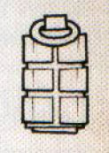
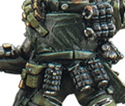

# 1358 破片手榴弹 Frag Grenade

精校状态：中文行文已逐段精校，部分术语仍为暂定

分类：装备 / 爆炸物

原文来源：https://www.bilibili.com/opus/1006986727870431236

原作者：帝国神选罐头

原文时间：2024年12月04日 15:02

[返回分类目录](目录.md) · [全书目录](../../目录.md)

<!-- A1358-B0001 -->
**英文原文**

Frag grenades (or fragmentation grenades) are small, anti-personnel grenades, exploding in a hail of thousands of tiny and deadly shards of metal, the effect being to deny an enemy the benefits of any cover as they are assaulted.

<!-- /A1358-B0001 -->

<!-- A1358-B0002 -->

原译文

破片手榴弹（或称碎裂手榴弹）是一种小型人员杀伤手榴弹，在爆炸中数千块微小而致命的金属碎片如冰雹般散射，其效果的优点是在敌人受到攻击时剥夺了任何掩护。

**校订译文**

破片手榴弹又称碎裂手榴弹，是小型杀伤人员武器。爆炸时会抛出数千块细小、致命的金属碎片，在己方发起冲锋时削弱敌人依托掩体的优势。

<!-- /A1358-B0002 -->

<!-- A1358-B0003 图片 -->

<!-- A1358-B0004 -->

原译文

Frag grenades 破片手榴弹

**校订译文**

Frag grenades 破片手榴弹

<!-- /A1358-B0004 -->

<!-- A1358-B0005 -->
## Construction and Detonation 构造和引爆

<!-- /A1358-B0005 -->

<!-- A1358-B0006 -->
**英文原文**

Frag grenades are very simple in design and effect, consisting of a central explosive core with a fuse inserted and secured by a pin, wrapped in a steel casing. Upon detonation, irregular shards of the casing are propelled at high velocity into the nearby surrounding area. The casing is typically grooved, both to create more shrapnel upon detonation and to provide a secure grip.

<!-- /A1358-B0006 -->

<!-- A1358-B0007 -->

原译文

破片手榴弹的设计和效果非常简单，由一个中央爆炸芯组成，引信插入并用销钉固定，包裹在钢壳中。引爆后，不规则的弹壳碎片被高速推进到附近的周围区域。外壳通常有凹槽，既可以在引爆时产生更多的弹片，又可以提供安全的抓握。

**校订译文**

其结构和作用方式都很简单：爆炸核心装有以保险销固定的引信，外面包覆钢壳。起爆后，弹壳裂成不规则碎片，高速飞散。外壳通常刻有凹槽，既便于握持，也使其在爆炸时形成更多破片。

<!-- /A1358-B0007 -->

<!-- A1358-B0008 图片 -->

<!-- A1358-B0009 -->

原译文

Frag grenades carried by a Stormtrooper 风暴部队携带的破片手榴弹

**校订译文**

Frag grenades carried by a Stormtrooper 风暴兵携带的破片手榴弹

<!-- /A1358-B0009 -->

<!-- A1358-B0010 -->
**英文原文**

A single frag grenade weighs about 1 kilogram and has a blast radius between 3 meters and 5 meters

<!-- /A1358-B0010 -->

<!-- A1358-B0011 -->

原译文

一枚破片手榴弹重约1公斤，爆炸半径在3米至5米之间

**校订译文**

一枚破片手榴弹重约1公斤，爆炸半径为3至5米。

<!-- /A1358-B0011 -->

本篇核心术语与暂定项

以下列出本篇出现的英文原形及核心术语表用词。同形词可能指不同对象，具体词义以本篇正文和校注为准；单复数、别名和仅见于图注的名称可能尚未列入。完整候选见[术语表](../../术语表/双语术语候选.csv)。

| 英文 | 采用中文 | 状态 |
| --- | --- | --- |
| Frag Grenades | 破片手榴弹 | 暂定·官方待核 |
| Grenade | 手榴弹 | 暂定·官方待核 |
| Frag Grenade | 破片手榴弹 | 暂定·官方待核 |

