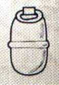

# 1359 穿甲手榴弹 Krak Grenade

精校状态：中文行文已逐段精校，部分术语仍为暂定

分类：装备 / 爆炸物

原文来源：https://www.bilibili.com/opus/1007296725744877574

原作者：帝国神选罐头

原文时间：2024年12月05日 11:05

[返回分类目录](目录.md) · [全书目录](../../目录.md)

<!-- A1359-B0001 -->
**英文原文**

Krak grenades are anti-tank weapons - the opposite of the anti-personnel frag grenade - designed to "crack" open armored targets such as vehicles through a concentrated implosive blast. However, the krak grenade must be placed more carefully on the target than frag grenades, because their explosive radius is only half that of a frag grenade.

<!-- /A1359-B0001 -->

<!-- A1359-B0002 -->

原译文

穿甲手榴弹是反坦克武器，与人员杀伤破片手榴弹相反，旨在通过集中内爆爆炸“破解”车辆等装甲目标。然而，与破片手榴弹相比，穿甲手榴弹必须更小心地放置在目标上，因为它们的爆炸半径只有破片手榴弹的一半。

**校订译文**

穿甲手榴弹是反坦克武器，以集中内爆的方式破开载具等装甲目标；破片手榴弹则主要杀伤人员。它的爆炸半径只有破片手榴弹的一半，因此在目标上的安放位置也需要更加精确。

<!-- /A1359-B0002 -->

<!-- A1359-B0003 图片 -->

<!-- A1359-B0004 -->

原译文

Krak grenades 穿甲手榴弹

**校订译文**

Krak grenades 穿甲手榴弹

<!-- /A1359-B0004 -->

<!-- A1359-B0005 -->
**英文原文**

Krak grenades are commonly used by the Imperial Guard, Sisters of Battle, loyal Space Marines, and Chaos Space Marines

<!-- /A1359-B0005 -->

<!-- A1359-B0006 -->

原译文

穿甲手榴弹通常被帝国卫队、战斗修女、忠诚派星际战士和混沌星际战士使用

**校订译文**

穿甲手榴弹通常被帝国卫队、战斗修女、忠诚派星际战士和混沌星际战士使用

<!-- /A1359-B0006 -->

本篇核心术语与暂定项

以下列出本篇出现的英文原形及核心术语表用词。同形词可能指不同对象，具体词义以本篇正文和校注为准；单复数、别名和仅见于图注的名称可能尚未列入。完整候选见[术语表](../../术语表/双语术语候选.csv)。

| 英文 | 采用中文 | 状态 |
| --- | --- | --- |
| Space Marines | 星际战士 | 官方已核对 |
| Imperial Guard | 帝国卫队 | 暂定·语境区分 |
| Chaos Space Marines | 混沌星际战士 | 官方已核对 |
| Sisters of Battle | 战斗修女 | 暂定·官方待核 |
| Frag Grenades | 破片手榴弹 | 暂定·官方待核 |
| Krak Grenades | 穿甲手榴弹 | 暂定·官方待核 |
| Grenade | 手榴弹 | 暂定·官方待核 |
| Frag Grenade | 破片手榴弹 | 暂定·官方待核 |
| Krak Grenade | 穿甲手榴弹 | 暂定·官方待核 |

