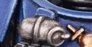

# 1361 震撼手榴弹 Shock Grenade

精校状态：中文行文已逐段精校，部分术语仍为暂定

分类：装备 / 爆炸物

原文来源：https://www.bilibili.com/opus/1007686661517082659

原作者：帝国神选罐头

原文时间：2024年12月06日 12:18

[返回分类目录](目录.md) · [全书目录](../../目录.md)

<!-- A1361-B0001 -->
**英文原文**

Shock Grenades are a type of flash-bang grenade used by Reiver Squads of Space Marines. Emitting a cacophny of explosive sound when activate, Reivers use these grenades to close the distance with an enemy before engaging in close combat.

<!-- /A1361-B0001 -->

<!-- A1361-B0002 -->

原译文

震撼手榴弹是星际战士掠夺者小队使用的一种闪爆弹。当激活时，手榴弹会发出刺耳的爆炸声，在进行近距离战斗之前，他们会使用这些手榴弹与敌人拉近距离。

**校订译文**

震撼手榴弹是星际战士掠夺者小队使用的闪光震撼弹，起爆时发出刺耳轰鸣，使他们能趁机接近敌人，展开近战。

<!-- /A1361-B0002 -->

<!-- A1361-B0003 图片 -->

<!-- A1361-B0004 -->

原译文

Shock Grenades 震撼手榴弹

**校订译文**

Shock Grenades 震撼手榴弹

<!-- /A1361-B0004 -->

本篇核心术语与暂定项

以下列出本篇出现的英文原形及核心术语表用词。同形词可能指不同对象，具体词义以本篇正文和校注为准；单复数、别名和仅见于图注的名称可能尚未列入。完整候选见[术语表](../../术语表/双语术语候选.csv)。

| 英文 | 采用中文 | 状态 |
| --- | --- | --- |
| Space Marines | 星际战士 | 官方已核对 |
| Reiver | 掠夺者 | 暂定·官方待核 |
| Grenade | 手榴弹 | 暂定·官方待核 |
| Reivers | 掠夺者 | 暂定·官方待核 |

