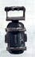

# 1364 热熔炸弹 Melta Bomb

精校状态：中文行文已逐段精校，部分术语仍为暂定

分类：装备 / 爆炸物

原文来源：https://www.bilibili.com/opus/1007296803067920387

原作者：帝国神选罐头

原文时间：2024年12月05日 11:06

[返回分类目录](目录.md) · [全书目录](../../目录.md)

<!-- A1364-B0001 -->
**英文原文**

A melta bomb is a type of explosive charge belonging to the melta design tree. Typical examples have dimensions analogous to that of a grenade, but can be larger. When activated, they explode with intense thermal energy, 'melting' the target away. Like all melta-weapons, melta bombs are especially useful for attacking vehicles, buildings and other armoured targets.

<!-- /A1364-B0001 -->

<!-- A1364-B0002 -->

原译文

热熔炸弹是属于热熔设计树的一种炸药。典型的实例具有类似于手榴弹的尺寸，但可以更大。当被激活时，它们会以强烈的热能爆炸，将目标“熔化”掉。与所有热熔武器一样，热熔炸弹对攻击车辆、建筑物和其他装甲目标特别有用。

**校订译文**

热熔炸弹是一种采用热熔技术的爆破装药，常见型号大小与手榴弹相仿，也有更大的版本。起爆时，它释放强烈热能，将目标熔毁。与其他热熔武器一样，它尤其适合攻击载具、建筑和其他装甲目标。

<!-- /A1364-B0002 -->

<!-- A1364-B0003 图片 -->

<!-- A1364-B0004 -->

原译文

melta bomb 热熔炸弹

**校订译文**

melta bomb 热熔炸弹

<!-- /A1364-B0004 -->

<!-- A1364-B0005 -->
**英文原文**

They are used by being attached to walls, hulls or bulkheads and have an integral timer that can be set for one hour.

<!-- /A1364-B0005 -->

<!-- A1364-B0006 -->

原译文

它们通过附着在墙壁、船体或舱壁上使用，并有一个可设置为一小时的内置计时器。

**校订译文**

它们通过附着在墙壁、船体或舱壁上使用，并有一个可设置为一小时的内置计时器。

<!-- /A1364-B0006 -->

本篇核心术语与暂定项

以下列出本篇出现的英文原形及核心术语表用词。同形词可能指不同对象，具体词义以本篇正文和校注为准；单复数、别名和仅见于图注的名称可能尚未列入。完整候选见[术语表](../../术语表/双语术语候选.csv)。

| 英文 | 采用中文 | 状态 |
| --- | --- | --- |
| Grenade | 手榴弹 | 暂定·官方待核 |
| Melta Bomb | 热熔炸弹 | 暂定·官方待核 |

