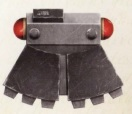

# 1366 攻坚炸药 Breacher Charge

精校状态：中文行文已逐段精校，部分术语仍为暂定

分类：装备 / 爆炸物

原文来源：https://www.bilibili.com/opus/1009530662810550280

原作者：帝国神选罐头

原文时间：2024年12月11日 11:34

[返回分类目录](目录.md) · [全书目录](../../目录.md)

原篇名：突击破坏者 Breacher Charge

<!-- A1366-B0001 -->
**英文原文**

A Breacher Charge is used to destroy armored emplacements and fortifications. Much like a Melta-bomb, these powerful electro-chemical explosive charges are too bulky and cumbersome to be thrown, and additionally pose risk to their user at close range. Nonetheless they are extremely destructive in skilled hands.

<!-- /A1366-B0001 -->

<!-- A1366-B0002 -->

原译文

突击破坏者用于摧毁装甲阵地和防御工事。就像热熔炸弹一样，这些强大的电化学炸药装药太笨重，难以投掷，而且还会对近距离使用者构成风险。尽管如此，它们在熟练者的手中具有极大的破坏性。

**校订译文**

攻坚炸药用于摧毁装甲阵地和防御工事。与热熔炸弹类似，这种强力电化学装药过于笨重，无法投掷，近距离使用也会危及操作者；但在熟练人员手中，其破坏力极为可怕。

**校注：** Charge此处为爆破装药，不是突击者或兵种；原名突击破坏者保留对照。

<!-- /A1366-B0002 -->

<!-- A1366-B0003 图片 -->

<!-- A1366-B0004 -->

原译文

Breacher Charge 突击破坏者

**校订译文**

Breacher Charge 攻坚炸药

<!-- /A1366-B0004 -->

本篇核心术语与暂定项

以下列出本篇出现的英文原形及核心术语表用词。同形词可能指不同对象，具体词义以本篇正文和校注为准；单复数、别名和仅见于图注的名称可能尚未列入。完整候选见[术语表](../../术语表/双语术语候选.csv)。

| 英文 | 采用中文 | 状态 |
| --- | --- | --- |
| Breacher Charge | 攻坚炸药 | 暂定·官方待核 |

