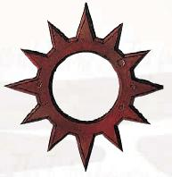
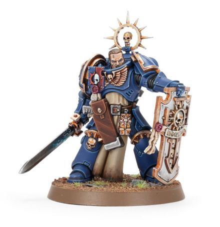

# 1372 铁光环 Iron Halo

精校状态：中文行文已逐段精校，部分术语仍为暂定

分类：装备 / 保护

原文来源：https://www.bilibili.com/opus/1017649113048547333

原作者：帝国神选罐头

原文时间：2025年01月02日 08:38

[返回分类目录](目录.md) · [全书目录](../../目录.md)

<!-- A1372-B0001 -->
**英文原文**

The Iron Halo is part of the Space Marine Armoury. It is an ancient artifact, a special Honour Badge given to a Space Marine who has shown exceptional initiative or bravery on the battlefield. It incorporates a powerful conversion field, similar to the Rosarius or Refractor Field, that reinforces the resiliency of Power Armour, allowing them to weather even the most fierce attacks.

<!-- /A1372-B0001 -->

<!-- A1372-B0002 -->

原译文

铁光环是星际战士军械库的一部分。这是一种古老的圣物，是一种特殊的荣誉徽章，授予在战场上表现出非凡主动性或勇气的星际战士。它包含了一个强大的偏转力场，类似于玫瑰念珠或折射力场，可以增强动力盔甲的耐久性，使其能够抵御最猛烈的攻击。

**校订译文**

铁光环是星际战士军械库中的古老遗物，也是一种特殊荣誉徽章，授予战场上表现出卓越主动性或勇气的战士。它内置强大的转换力场，类似玫瑰念珠或折射力场，可在动力盔甲之外提供额外防护，使佩戴者承受极为猛烈的攻击。

**校注：** conversion field沿815转换力场，区别折射力场及Shift Field偏转力场。

<!-- /A1372-B0002 -->

<!-- A1372-B0003 图片 -->

<!-- A1372-B0004 -->

原译文

Iron Halo 铁光环

**校订译文**

Iron Halo 铁光环

<!-- /A1372-B0004 -->

<!-- A1372-B0005 -->
## Overview 概述

<!-- /A1372-B0005 -->

<!-- A1372-B0006 -->
**英文原文**

The Iron Halo appears as a spiked circle or half-circle of grey iron worn either on the helmet or the left shoulder pad. Sometimes it is more elaborate and takes the form of an actual halo arching over the Battle-Brother’s helmet, connected either to his gorget or backpack. In rare cases, the Iron Halo will also be inlaid with litanies of the Battle-Brother's deeds or the names of heroes of his Chapter.

<!-- /A1372-B0006 -->

<!-- A1372-B0007 -->

原译文

铁光环看起来像是戴在头盔或左肩甲上的灰色铁钉环或半圆。有时，它更为精致，以一个实际的光环的形式拱在战斗兄弟的头盔上，与他的颈甲或背包相连。在极少数情况下，铁光环还将镶嵌战斗兄弟的事迹或其战团英雄的名字。

**校订译文**

铁光环通常是灰铁制成、带尖刺的圆环或半环，佩戴于头盔或左肩甲。有些形制更精巧，像真正的光环一样拱立于战斗兄弟头顶，连接颈甲或背包。少数光环还镶刻有颂扬佩戴者功绩的祷词，或战团英雄的名字。

<!-- /A1372-B0007 -->

<!-- A1372-B0008 图片 -->

<!-- A1372-B0009 -->

原译文

Primaris Lieutenant with Iron Halo 装备铁光环的原铸副官

**校订译文**

Primaris Lieutenant with Iron Halo 装备铁光环的原铸副官

<!-- /A1372-B0009 -->

<!-- A1372-B0010 -->
**英文原文**

The Iron Halo Honour is a mark of rank within the Adeptus Astartes, and in most Chapters is only awarded to Space Marine Captains and above. As a sign of rank within a Chapter, it is assigned by the Chapter Master to Space Marine. Iron Halos are so rare that in the Ultramarines, only Captains and Company Champions are authorised to wear them. As a sign of rank, the Iron Halo grants a Space Marine command privileges and responsibilities on the battlefield. His peers will look to him for leadership, and tactical decisions will often fall to him unless a more senior ranking officer is present. For Space Marine serving in the Deathwatch, rank is largely a formality, though other Space Marines and Imperial soldiers familiar with the Chapter hierarchy will usually respect his decisions. The rank may also play a part in the decisions of his commanders as he will represent a proven leader of men and an asset they may call upon in certain combat situations.

<!-- /A1372-B0010 -->

<!-- A1372-B0011 -->

原译文

铁光环荣誉是阿斯塔特修会中的等级标志，在大多数战团中，只有星际战士连长及以上才能获得。作为战团内等级的标志，它由战团长分配给星际战士。铁光环非常罕见，在极限战士中，只有连长和连队冠军才有权佩戴。作为军衔的标志，铁光环赋予星际战士在战场上的指挥权和责任。他的同僚会期望他发挥领导作用，除非有更高级的军官在场，否则战术决策往往会落在他身上。对于在死亡守望中服役的星际战士来说，军衔在很大程度上是一种形式，尽管熟悉该战团等级制度的其他星际战士和帝国士兵通常会尊重他的决定。军衔也可能在指挥官的决策中发挥作用，因为他代表一位久经考验的领导者，也是他们在某些战斗情况下可能需要的资产。

**校订译文**

铁光环也是阿斯塔特修会的等级标志，由战团长授予。多数战团只颁给连长及以上人员；极限战士中，则只有连长和连队冠军获准佩戴。它象征战士在战场上的指挥权限与责任：同袍会期待他领导，若没有更高级的军官在场，战术决策往往由他承担。在死亡守望服役时，原有等级大体只是形式，但熟悉战团层级的星际战士和帝国士兵通常仍会尊重他的判断。指挥官也可能据此委派任务，因为佩戴者已证明自己的领导能力，是特定战况下可以倚重的人选。

**校注：** 各战团授予对象按原文分别保留；与图注原铸副官也佩戴的情况不强行抹平。

<!-- /A1372-B0011 -->

<!-- A1372-B0012 -->
**英文原文**

The Blood Ravens Chapter possesses a special Iron Halo, a revered relic assumed to have belonged to their unknown Primarch.

<!-- /A1372-B0012 -->

<!-- A1372-B0013 -->

原译文

血鸦战团拥有一个特殊的铁光环，这是一个受人尊敬的圣物，被认为属于他们未知的原体。

**校订译文**

血鸦珍藏着一枚特殊铁光环，被奉为重要遗物，据信曾属于他们身份未知的原体。

<!-- /A1372-B0013 -->

<!-- A1372-B0014 -->
## Famous Iron Halo users 著名铁光环使用者

<!-- /A1372-B0014 -->

<!-- A1372-B0015 -->
**英文原文**

Marneus Calgar, Chapter Master of the Ultramarines

<!-- /A1372-B0015 -->

<!-- A1372-B0016 -->

原译文

马涅乌斯·卡尔加，极限战士战团长

**校订译文**

马涅乌斯·卡尔加，极限战士战团长

<!-- /A1372-B0016 -->

<!-- A1372-B0017 -->
**英文原文**

Brother-Captain Sicarius of the Ultramarines

<!-- /A1372-B0017 -->

<!-- A1372-B0018 -->

原译文

极限战士的兄弟连长西卡留斯

**校订译文**

极限战士的兄弟连长西卡留斯

<!-- /A1372-B0018 -->

<!-- A1372-B0019 -->
**英文原文**

Commander Dante, Chapter Master of the Blood Angels

<!-- /A1372-B0019 -->

<!-- A1372-B0020 -->

原译文

指挥官但丁，圣血天使战团长

**校订译文**

指挥官但丁，圣血天使战团长

<!-- /A1372-B0020 -->

<!-- A1372-B0021 -->
**英文原文**

Davian Thule, Captain of the Blood Ravens

<!-- /A1372-B0021 -->

<!-- A1372-B0022 -->

原译文

戴维安·图勒，圣血天使连长

**校订译文**

戴维安·图勒——血鸦连长。

**校注：** Blood Ravens为血鸦，原译圣血天使混淆战团。

<!-- /A1372-B0022 -->

<!-- A1372-B0023 -->
**英文原文**

Titus, Captain of the Ultramarines

<!-- /A1372-B0023 -->

<!-- A1372-B0024 -->

原译文

泰图斯，极限战士连长

**校订译文**

泰图斯，极限战士连长

<!-- /A1372-B0024 -->

<!-- A1372-B0025 -->
**英文原文**

Pedro Kantor, Chapter Master of the Crimson Fists

<!-- /A1372-B0025 -->

<!-- A1372-B0026 -->

原译文

佩德罗·坎托，绯红之拳战团长

**校订译文**

佩德罗·坎托，绯红之拳战团长

<!-- /A1372-B0026 -->

本篇核心术语与暂定项

以下列出本篇出现的英文原形及核心术语表用词。同形词可能指不同对象，具体词义以本篇正文和校注为准；单复数、别名和仅见于图注的名称可能尚未列入。完整候选见[术语表](../../术语表/双语术语候选.csv)。

| 英文 | 采用中文 | 状态 |
| --- | --- | --- |
| Space Marines | 星际战士 | 官方已核对 |
| Adeptus Astartes | 阿斯塔特修会 | 官方已核对 |
| Blood Angels | 圣血天使 | 官方已核对 |
| Deathwatch | 死亡守望 | 官方已核对 |
| Ultramarines | 极限战士 | 官方已核对 |
| Blood Ravens | 血鸦 | 暂定 |
| Primarch | 原体 | 官方已核对 |
| Master | 导师（审判庭职衔）／舰务官（舰员职务） | 语境定译·官方待核 |
| Rosarius | 玫瑰念珠 | 暂定·官方待核 |
| Ancient | 旗手 | 官方已核对 |
| Crimson Fists | 绯红之拳 | 暂定·官方待核 |
| Refractor Field | 折射力场 | 暂定·官方待核 |
| Iron Halo | 铁光环 | 暂定·官方待核 |
| Power Armour | 动力盔甲 | 暂定·官方待核 |
| Space Marine | 星际战士 | 暂定·官方待核 |
| Chapter | 战团 | 暂定·官方待核 |
| Chapter Master | 战团长 | 暂定·官方待核 |
| Captain | 连长 | 暂定·官方待核 |
| Brother | 修士 | 暂定·官方待核 |
| Battle-Brother | 战斗兄弟 | 暂定·官方待核 |
| Marneus Calgar | 马涅乌斯·卡尔加 | 暂定·官方待核 |
| Dante | 但丁 | 暂定·官方待核 |
| Pedro Kantor | 佩德罗·坎托 | 官方已核 |
| Armoury | 军械库 | 暂定·官方待核 |
| Brother-Captain | 兄弟会连长（灰骑士）／兄弟连长（通称） | 语境定译·灰骑士职衔官译已核 |
| Thule | 图勒 | 暂定·官方待核 |
| The Blood | 鲜血 | 暂定·官方待核 |
| conversion field | 转换力场 | 暂定·官方待核 |
| Davian Thule | 戴维安·图勒 | 暂定·官方待核 |

