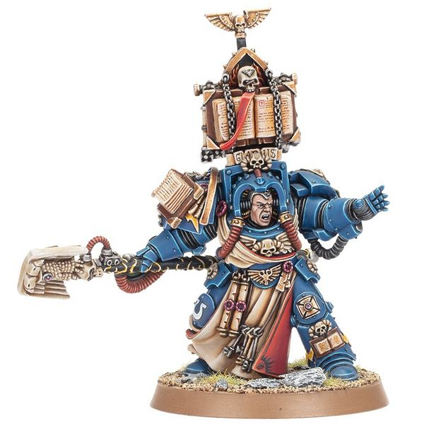

# 1373 灵能兜帽 Psychic Hood

精校状态：中文行文已逐段精校，部分术语仍为暂定

分类：装备 / 保护

原文来源：https://www.bilibili.com/opus/1014774822143524881

原作者：帝国神选罐头

原文时间：2024年12月25日 14:44

[返回分类目录](目录.md) · [全书目录](../../目录.md)

原篇名：灵能头箍 Psychic Hood

<!-- A1373-B0001 -->
**英文原文**

The Psychic Hood is used by Space Marine Librarians to protect themselves from enemy psychic powers.

<!-- /A1373-B0001 -->

<!-- A1373-B0002 -->

原译文

星际战士智库使用灵能头箍来保护自己免受敌人的灵能力量。

**校订译文**

星际战士智库员使用灵能兜帽，抵御敌方灵能攻击。

<!-- /A1373-B0002 -->

<!-- A1373-B0003 图片 -->

<!-- A1373-B0004 -->

原译文

Ultramarine Librarian wearing a psychic hood 极限战士智库穿戴灵能头箍

**校订译文**

Ultramarine Librarian wearing a psychic hood 戴着灵能兜帽的极限战士智库员

<!-- /A1373-B0004 -->

<!-- A1373-B0005 -->
**英文原文**

Often distinguished by a metal hood that rises from the backplate of their Power Armour, it uses a set of interwoven intricately aligned crystals to nullify an opponents psychic attacks; however they are of a very arcane design and are likely not to have been produced perfectly and so are not one hundred percent effective. This was demonstrated when various Space Marine Librarians turned to Chaos during the Horus Heresy, becoming Chaos Sorcerers. Psychic hoods are also occasionally employed by Inquisitors.

<!-- /A1373-B0005 -->

<!-- A1373-B0006 -->

原译文

通常以从他们的动力护甲背板上升起的金属罩为特征，它使用一组交织的错综复杂排列的晶体来消除对手的灵能攻击；然而，它们的设计非常神秘，可能生产得并不完美，因此不是百分之百有效。当各种星际战士智库在荷鲁斯叛乱期间转向混沌，成为混沌巫师时，这一点得到了证明。灵能头箍偶尔也会被审判官使用。

**校订译文**

灵能兜帽通常呈金属罩形，从动力盔甲背板向上延伸。内部精密排列、相互交织的晶体用来抵消敌方灵能，但其设计极为玄奥，制造未必完美，因此效果并非绝对。底稿将荷鲁斯之乱期间一些智库员投向混沌、成为混沌巫师，作为这种局限的例证。审判官偶尔也会使用灵能兜帽。

**校注：** 原文将防御灵能攻击与抵御混沌腐化并提，因果关系未另说明，按底稿论述保留而不补设机制。

<!-- /A1373-B0006 -->

本篇核心术语与暂定项

以下列出本篇出现的英文原形及核心术语表用词。同形词可能指不同对象，具体词义以本篇正文和校注为准；单复数、别名和仅见于图注的名称可能尚未列入。完整候选见[术语表](../../术语表/双语术语候选.csv)。

| 英文 | 采用中文 | 状态 |
| --- | --- | --- |
| Horus Heresy | 荷鲁斯之乱 | 官方已核对 |
| Psychic Hood | 灵能兜帽 | 暂定·官方待核 |
| Horus | 荷鲁斯 | 暂定·官方待核 |
| Power Armour | 动力盔甲 | 暂定·官方待核 |
| Space Marine | 星际战士 | 暂定·官方待核 |
| Powers | 能天使 | 暂定·官方待核 |

