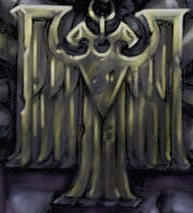

# 1376 玫瑰念珠 Rosarius

精校状态：中文行文已逐段精校，部分术语仍为暂定

分类：装备 / 保护

原文来源：https://www.bilibili.com/opus/1017339991353720835

原作者：帝国神选罐头

原文时间：2025年01月01日 12:38

[返回分类目录](目录.md) · [全书目录](../../目录.md)

<!-- A1376-B0001 -->
**英文原文**

A Rosarius is an amulet that incorporates a powerful conversion field generator to defend the wearer from attack. A rare and highly prized piece of technology, it is also an icon of the Imperial Creed, and entrusted only to the highest officials of the Ecclesiarchy.

<!-- /A1376-B0001 -->

<!-- A1376-B0002 -->

原译文

玫瑰念珠是一种护身符，它包含一个强大的偏转力场发生器，可以保护佩戴者免受攻击。这是一项罕见而珍贵的技术，也是帝国信条的象征，只交付给国教的最高官员。

**校订译文**

玫瑰念珠是一种内置强大转换力场发生器的护符，能够保护佩戴者免受攻击。这项技术罕见而珍贵，同时也是帝国教义的象征，通常仅交予国教会最高层的神职人员。

**校注：** Conversion field 沿核心转换力场，与 Refractor Field 折射力场不同；本篇原偏转力场掩盖了将能量转成光的工作机制。英文称仅最高层国教官员持有，但后续使用者清单更广，按其概括口径保留。

<!-- /A1376-B0002 -->

<!-- A1376-B0003 图片 -->

<!-- A1376-B0004 -->

原译文

Imperial Rosarius 帝国玫瑰念珠

**校订译文**

Imperial Rosarius 帝国玫瑰念珠

<!-- /A1376-B0004 -->

<!-- A1376-B0005 -->
## Overview 概述

<!-- /A1376-B0005 -->

<!-- A1376-B0006 -->
**英文原文**

The Rosarius takes the form of an amulet, often displaying the Aquila or a square, stylized cross of adamantium or other durable metal, with a jewel or Ecclesiarchy symbol in the center. It is worn around the neck or waist on a sash, a cord, or a string of prayer beads.

<!-- /A1376-B0006 -->

<!-- A1376-B0007 -->

原译文

玫瑰念珠采用护身符的形式，通常展示出天鹰图案或一个方形、风格化的精金或其他耐用金属制成的十字，中心有一颗宝石或国教符号。它被佩戴在脖子上或腰部，用饰带、绳索或一串念珠系着。

**校订译文**

玫瑰念珠呈护符状，常见造型是天鹰，或由精金等耐用金属制成的方正抽象十字，中央嵌有宝石或国教会徽记。它可用饰带、绳索或一串祈祷念珠系在颈间或腰际。

<!-- /A1376-B0007 -->

<!-- A1376-B0008 -->
**英文原文**

It contains a tiny conversion field generator, emitting a protective energy barrier around the wearer. The field's effect converts the energy of an impact into light; thus, a blinding flash is produced when the field stops a shot. The field is capable of rendering even plasma gun shots harmless.

<!-- /A1376-B0008 -->

<!-- A1376-B0009 -->

原译文

它包含一个微小的偏转力场发生器，在佩戴者周围发射一个保护性的能量屏障。力场作用将撞击的能量转化为光；因此，当该力场阻挡一次射击时，会产生一道足以致盲的闪光。该力场甚至能够使等离子枪的射击变得无害。

**校订译文**

内部的微型转换力场发生器会在佩戴者周围形成能量屏障，将冲击能量转化为光。因此，挡住射击时会迸发耀眼的闪光，甚至能够化解等离子枪的攻击。

<!-- /A1376-B0009 -->

<!-- A1376-B0010 -->
**英文原文**

The rosarius is referred to as the "soul's armour."

<!-- /A1376-B0010 -->

<!-- A1376-B0011 -->

原译文

玫瑰念珠被称为“灵魂盔甲”

**校订译文**

玫瑰念珠又被称为“灵魂的护甲”。

<!-- /A1376-B0011 -->

<!-- A1376-B0012 -->
## Examples of Use 使用例子

<!-- /A1376-B0012 -->

<!-- A1376-B0013 -->
**英文原文**

The most notable bearers of Rosarii are Space Marine Chaplains, who receive them from the Ecclesiarchy as a symbol of the link they share.

<!-- /A1376-B0013 -->

<!-- A1376-B0014 -->

原译文

玫瑰念珠最著名的持有者是星际战士牧师，他们从国教那里接受它们，作为他们共同联系的象征。

**校订译文**

最著名的使用者是星际战士教士。国教会将玫瑰念珠授予他们，以象征双方之间的联系。

<!-- /A1376-B0014 -->

<!-- A1376-B0015 -->
**英文原文**

The Wolf Priests of the Space Wolves Chapter, who combine the roles of Chaplain and Apothecary, are equipped with Wolf Amulets, which confer many of the same benefits.

<!-- /A1376-B0015 -->

<!-- A1376-B0016 -->

原译文

太空野狼战团的狼牧师结合了牧师和药剂师的角色，他们配备了野狼护身符，赋予了他们许多相同的益处。

**校订译文**

太空野狼的狼牧师兼具教士与药剂师职责，装备的野狼护符具有许多相近的防护效果。

<!-- /A1376-B0016 -->

<!-- A1376-B0017 -->
**英文原文**

Confessors and Missionaries also wear rosarii.

<!-- /A1376-B0017 -->

<!-- A1376-B0018 -->

原译文

告解者和传教士也佩戴玫瑰念珠。

**校订译文**

告解者和传教士也佩戴玫瑰念珠。

<!-- /A1376-B0018 -->

<!-- A1376-B0019 -->
**英文原文**

Inquisitors sometimes carry them as well, although it is probably out of practical concerns rather than allegiance to the Ecclesiarchy.

<!-- /A1376-B0019 -->

<!-- A1376-B0020 -->

原译文

审判官有时也会携带它们，尽管这可能是出于实际考虑，而不是对国教的忠诚。

**校订译文**

审判官有时也携带玫瑰念珠，不过多半出于实用考虑，而非表示效忠国教会。

<!-- /A1376-B0020 -->

<!-- A1376-B0021 -->
**英文原文**

Are worn by Canonesses of the Adepta Sororitas.

<!-- /A1376-B0021 -->

<!-- A1376-B0022 -->

原译文

由修女会的大修女们佩戴。

**校订译文**

修女会的大修女也佩戴玫瑰念珠。

<!-- /A1376-B0022 -->

<!-- A1376-B0023 -->
**英文原文**

Also, a large number of Witch Hunters carry a Rosarius due to the affiliation between the Adepta Sororitas and the Adeptus Ministorum.

<!-- /A1376-B0023 -->

<!-- A1376-B0024 -->

原译文

此外，由于修女会和国教之间的联系，许多猎巫人都佩戴着玫瑰念珠。

**校订译文**

此外，由于修女会与国教会的密切关系，许多猎巫人也携带玫瑰念珠。

<!-- /A1376-B0024 -->

<!-- A1376-B0025 -->
**英文原文**

Goge Vandire used a rosarius to trick the Brides of the Emperor into believing he had the Emperor's grace by having a soldier shoot him only to seemingly be divinely protected.

<!-- /A1376-B0025 -->

<!-- A1376-B0026 -->

原译文

高戈·范迪尔用玫瑰念珠欺骗帝皇的新娘，让她们相信他有帝皇的恩典，通过让一名士兵射击他，但似乎得到了神的保护。

**校订译文**

高戈·范迪尔曾利用玫瑰念珠欺骗帝皇新娘。他命令士兵向自己射击，借力场防护伪装成得到神明庇佑，让修女们相信自己深得帝皇恩宠。

<!-- /A1376-B0026 -->

<!-- A1376-B0027 -->
**英文原文**

Cardinal Xaphan acquired a rosarius prior to an attempt on his life by a Vindicare sniper, whose unerring shot was handily blocked by the device's field.

<!-- /A1376-B0027 -->

<!-- A1376-B0028 -->

原译文

红衣主教萨凡在文迪卡狙击手试图杀害他之前获得了一个念珠，该狙击手的精准射击被该装置的力场轻易地挡住了。

**校订译文**

红衣主教萨凡在一次文迪卡刺客的狙杀行动前取得了玫瑰念珠，刺客精准无误的射击被护符力场轻易挡下。

<!-- /A1376-B0028 -->

本篇核心术语与暂定项

以下列出本篇出现的英文原形及核心术语表用词。同形词可能指不同对象，具体词义以本篇正文和校注为准；单复数、别名和仅见于图注的名称可能尚未列入。完整候选见[术语表](../../术语表/双语术语候选.csv)。

| 英文 | 采用中文 | 状态 |
| --- | --- | --- |
| Space Wolves | 太空野狼 | 官方已核对 |
| Adepta Sororitas | 修女会 | 官方已核对 |
| Emperor | 帝皇 | 官方已核对 |
| Adeptus Ministorum | 国教会 | 暂定 |
| Ecclesiarchy | 国教会 | 暂定 |
| Goge Vandire | 高戈·范迪尔 | 暂定·官方待核 |
| Brides of the Emperor | 帝皇新娘 | 暂定·官方待核 |
| Imperial Creed | 帝国教义 | 暂定·官方待核 |
| Aquila | 天鹰 | 暂定·官方待核 |
| Witch Hunters | 猎巫者 | 暂定 |
| Cardinal | 红衣主教 | 暂定 |
| Rosarius | 玫瑰念珠 | 暂定·官方待核 |
| Chaplain | 教士 | 官方已核对 |
| Apothecary | 药剂师 | 官方已核对 |
| Space Marine | 星际战士 | 暂定·官方待核 |
| Chapter | 战团 | 暂定·官方待核 |
| Chaplains | 教士 | 暂定·官方待核 |
| Gun | 甘 | 暂定·官方待核 |
| conversion field | 转换力场 | 暂定·官方待核 |
| Plasma gun | 等离子枪 | 官方已核对 |
| Cardinal Xaphan | 红衣主教萨凡 | 暂定·官方待核 |

