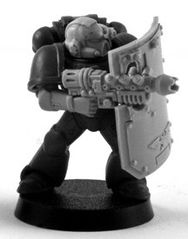
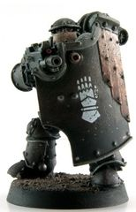
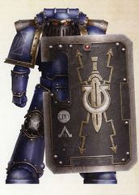

# 1378 跳帮盾 Boarding Shield

精校状态：中文行文已逐段精校，部分术语仍为暂定

分类：装备 / 盾牌

原文来源：https://www.bilibili.com/opus/1016277339174076423

原作者：帝国神选罐头

原文时间：2024年12月29日 15:55

[返回分类目录](目录.md) · [全书目录](../../目录.md)

<!-- A1378-B0001 -->
**英文原文**

Boarding Shields (or Breacher Shields) are shields used by Space Marines during boarding operations, allowing them to absorb incoming enemy fire. They are also employed during siege operations.

<!-- /A1378-B0001 -->

<!-- A1378-B0002 -->

原译文

跳帮盾（或称“突破盾”）是星际战士在跳帮行动中使用的盾牌，使其能够吸收敌方来袭的火力。他们也在攻城行动中被使用。

**校订译文**

跳帮盾又称攻坚盾，是星际战士在跳帮行动中用于抵挡敌军火力的盾牌，也用于攻城作战。

<!-- /A1378-B0002 -->

<!-- A1378-B0003 图片 -->

<!-- A1378-B0004 -->

原译文

Space Marine with Boarding Shield and Graviton Gun 装备跳帮盾和重力枪的星际战士

**校订译文**

Space Marine with Boarding Shield and Graviton Gun 装备跳帮盾和重力枪的星际战士

<!-- /A1378-B0004 -->

<!-- A1378-B0005 -->
**英文原文**

A bulkier version of the standard Combat Shields, the boarding shields were the wargear of choice for Space Marine Legion squads before the introduction of the storm shields, with the main task of breaching enemy ships and performing siege assaults Although the protective field of Boarding Shields was inferior to the field of mighty Storm Shields the prototypes of which were beginning to enter service of Legiones Astartes at the time of the Horus Heresy, the boarding shield provided additional protection as its bulk reduced the effectiveness of a direct enemy attack against the shield bearer. The generators used in combat and boarding shields at the time of the Horus Heresy were also refined to offer increased protection from close combat attacks. With these benefits, the venerable boarding shield remained an essential part of the Legions’ armouries long after the storm shield came into common service.

<!-- /A1378-B0005 -->

<!-- A1378-B0006 -->

原译文

跳帮盾是标准战斗盾的一个更笨重的版本，在引入风暴盾之前，跳帮盾是星际战士军团小队的首选作战装备，其主要任务是突破敌舰并进行攻城攻击。其原型在荷鲁斯叛乱时期开始为阿斯塔特军团服役，尽管跳帮盾的防护范围不如强大的风暴盾，但跳帮盾提供了额外的保护，因为它的体积降低了敌人对盾牌持有者的直接攻击的有效性。荷鲁斯叛乱时期用于战斗和跳帮盾的发生器也经过了改进，以提供更强的近战攻击防护。有了这些好处，在风暴盾投入使用很久之后，古老的跳帮盾仍然是军团军械库的重要组成部分。

**校订译文**

跳帮盾比标准战斗盾更厚重。在风暴盾问世前，它是承担敌舰突破与攻城突击任务的军团小队的首选装备。风暴盾原型在荷鲁斯之乱时期开始列装阿斯塔特军团，防护力场比跳帮盾更强，但跳帮盾厚实的实体结构也能削弱直接命中持盾者的攻击，提供额外保护。同一时期，战斗盾与跳帮盾的发生器经过改良，提高了抵御近战攻击的能力。因此，即使风暴盾已广泛列装，古老的跳帮盾仍长期在军团军械库中占有重要地位。

**校注：** “在荷鲁斯之乱时期开始列装的原型”修饰风暴盾，不是跳帮盾。field 在此比较防护力场效能，而非覆盖范围。

<!-- /A1378-B0006 -->

<!-- A1378-B0007 图片 -->

<!-- A1378-B0008 -->

原译文

Iron Hands Space Marine with a Boarding Shield 装备跳帮盾的钢铁之手星际战士

**校订译文**

Iron Hands Space Marine with a Boarding Shield 装备跳帮盾的钢铁之手星际战士

<!-- /A1378-B0008 -->

<!-- A1378-B0009 -->
**英文原文**

Boarding shields were most often carried by Breacher squads and specialist units who fulfilled similar roles. The Ultramarines Invictarus Suzerain squads, in particular, carried ornate boarding shields to aid their defence in close combat.

<!-- /A1378-B0009 -->

<!-- A1378-B0010 -->

原译文

跳帮盾通常由执行类似任务的跳帮小队和专业部队携带。特别是极限战士宗主常胜军小队，他们携带华丽的跳帮盾，以帮助在近战中进行防御。

**校订译文**

跳帮盾最常见于攻坚小队，以及承担类似任务的专门部队。极限战士宗主常胜军尤其喜欢携带华丽的跳帮盾，增强近战防御。

<!-- /A1378-B0010 -->

<!-- A1378-B0011 图片 -->

<!-- A1378-B0012 -->

原译文

Varinius of the Ultramarines with a Praetorian pattern Breacher Shield 装备禁卫型跳帮盾的极限战士瓦里尼乌斯

**校订译文**

Varinius of the Ultramarines with a Praetorian pattern Breacher Shield 装备禁卫型跳帮盾的极限战士瓦里尼乌斯

<!-- /A1378-B0012 -->

本篇核心术语与暂定项

以下列出本篇出现的英文原形及核心术语表用词。同形词可能指不同对象，具体词义以本篇正文和校注为准；单复数、别名和仅见于图注的名称可能尚未列入。完整候选见[术语表](../../术语表/双语术语候选.csv)。

| 英文 | 采用中文 | 状态 |
| --- | --- | --- |
| Space Marines | 星际战士 | 官方已核对 |
| Ultramarines | 极限战士 | 官方已核对 |
| Horus Heresy | 荷鲁斯之乱 | 官方已核对 |
| Horus | 荷鲁斯 | 暂定·官方待核 |
| Legiones Astartes | 阿斯塔特军团 | 暂定·官方待核 |
| Space Marine Legion | 星际战士军团 | 暂定·官方待核 |
| Space Marine | 星际战士 | 暂定·官方待核 |
| Boarding Shield | 跳帮盾 | 暂定·官方待核 |
| Storm Shield | 风暴盾 | 暂定·官方待核 |

