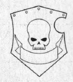

# 1379 战斗盾 Combat Shield

精校状态：中文行文已逐段精校，部分术语仍为暂定

分类：装备 / 盾牌

原文来源：https://www.bilibili.com/opus/1016663070178541568

原作者：帝国神选罐头

原文时间：2024年12月30日 16:51

[返回分类目录](目录.md) · [全书目录](../../目录.md)

<!-- A1379-B0001 -->
**英文原文**

A combat shield is a lighter and more maneuverable version of a Storm Shield.

<!-- /A1379-B0001 -->

<!-- A1379-B0002 -->

原译文

战斗盾是风暴盾的一种更轻、更机动的版本。

**校订译文**

战斗盾是比风暴盾更轻巧、操控更灵活的型号。

<!-- /A1379-B0002 -->

<!-- A1379-B0003 -->
**英文原文**

It utilizes similar technology to that used by power weapons, to produce a field of energy around the face of the shield. It is used by the Space Marines and is a smaller and less-protective version of the Storm Shield. Due to its flexibility, Combat Shields leave one hand of a Space Marine free to use other hand-to-hand weaponry.

<!-- /A1379-B0003 -->

<!-- A1379-B0004 -->

原译文

它利用与动力武器类似的技术，在盾牌表面周围产生能量场。它被星际战士使用，是风暴盾的一个更小、防护性更低的版本。由于其灵活性，战斗盾使星际战士的一只手可以自由使用其他的肉搏武器。

**校订译文**

战斗盾使用类似动力武器的技术，在盾面形成能量场。星际战士使用这种尺寸较小、防护稍弱的风暴盾变型。轻巧的设计让使用者仍能腾出手，握持其他近战武器。

<!-- /A1379-B0004 -->

<!-- A1379-B0005 图片 -->

<!-- A1379-B0006 -->

原译文

Combat Shield, Deliverance pattern 拯救型战斗盾

**校订译文**

Combat Shield, Deliverance pattern 拯救星型战斗盾

<!-- /A1379-B0006 -->

<!-- A1379-B0007 -->
**英文原文**

The shield is made of plasteel and incorporates a power generator which, when activated, produces a small field of energy around the face of the shield. The shield can take many shapes depending on the Chapter. The Crimson Fists use coffin-shaped shields, the Blood Angels use cruciforms, and the Iron Fists' shields take the form of armoured gauntlets. It is small enough to be strapped to the arm, leaving both hands free for another weapon to be used.

<!-- /A1379-B0007 -->

<!-- A1379-B0008 -->

原译文

盾牌由塑钢制成，并包含一个发生器，当启动时，会在盾牌表面周围产生一个小型能量场。根据战团的不同，盾牌可以有多种形状。绯红之拳使用棺材形状的盾牌，圣血天使使用十字架，钢铁之拳的盾牌采用装甲臂铠的形式。它足够小，可以绑在手臂上，双手可以自由使用另一种武器。

**校订译文**

盾牌由塑钢制成，内置发生器启动后，会在盾面周围形成一层小型能量场。不同战团的盾形各异：绯红之拳采用棺形，圣血天使采用十字形，钢铁之拳的盾则呈装甲臂铠形。它小到足以固定在前臂上，使双手都能握持其他武器。

<!-- /A1379-B0008 -->

本篇核心术语与暂定项

以下列出本篇出现的英文原形及核心术语表用词。同形词可能指不同对象，具体词义以本篇正文和校注为准；单复数、别名和仅见于图注的名称可能尚未列入。完整候选见[术语表](../../术语表/双语术语候选.csv)。

| 英文 | 采用中文 | 状态 |
| --- | --- | --- |
| Space Marines | 星际战士 | 官方已核对 |
| Blood Angels | 圣血天使 | 官方已核对 |
| Crimson Fists | 绯红之拳 | 暂定·官方待核 |
| Space Marine | 星际战士 | 暂定·官方待核 |
| Chapter | 战团 | 暂定·官方待核 |
| Iron Fists | 钢铁之拳 | 暂定·官方待核 |
| The Blood | 鲜血 | 暂定·官方待核 |
| Power Weapons | 动力武器 | 暂定·官方待核 |
| Combat Shield | 战斗盾 | 暂定·官方待核 |
| Storm Shield | 风暴盾 | 暂定·官方待核 |

