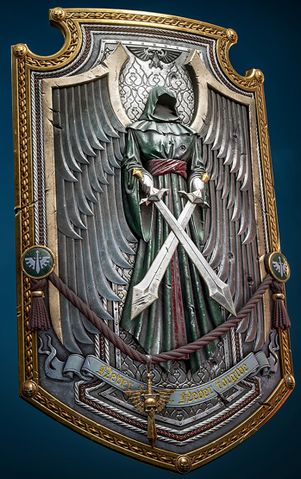
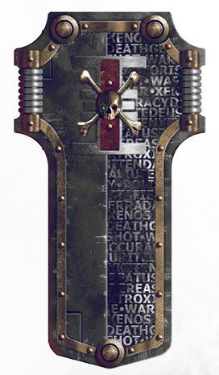
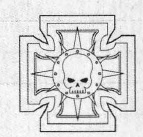
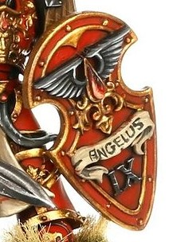
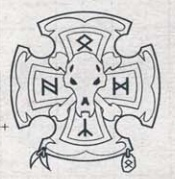

# 1381 风暴盾 Storm Shield

精校状态：中文行文已逐段精校，部分术语仍为暂定

分类：装备 / 盾牌

原文来源：https://www.bilibili.com/opus/1016663267732357138

原作者：帝国神选罐头

原文时间：2024年12月30日 16:52

[返回分类目录](目录.md) · [全书目录](../../目录.md)

<!-- A1381-B0001 -->
**英文原文**

The Storm Shield is a powered shield used by Space Marines, Daemonhunters and the Adeptus Custodes

<!-- /A1381-B0001 -->

<!-- A1381-B0002 -->

原译文

风暴盾是一种由星际战士、恶魔猎手和禁军使用的动力盾

**校订译文**

风暴盾是星际战士、恶魔猎手与禁军使用的动力盾。

<!-- /A1381-B0002 -->

<!-- A1381-B0003 图片 -->

<!-- A1381-B0004 -->

原译文

Dark Angels Storm Shield 黑暗天使风暴盾

**校订译文**

Dark Angels Storm Shield 黑暗天使风暴盾

<!-- /A1381-B0004 -->

<!-- A1381-B0005 -->
## Overview 概述

<!-- /A1381-B0005 -->

<!-- A1381-B0006 -->
**英文原文**

It is a more advanced and bulky version of the Combat Shield, providing better defence. However it is also much larger and must be grasped with the user's hand, unlike a combat shield, which allows the use of two weapons.

<!-- /A1381-B0006 -->

<!-- A1381-B0007 -->

原译文

它是战斗盾的更先进、更笨重的版本，提供了更好的防御。然而，它也要大得多，必须用使用者的手抓住，这与允许使用两件武器的战斗盾不同。

**校订译文**

它比战斗盾更加先进、厚重，防护力更强，但体积也大得多，必须占用一只手持握。战斗盾则可固定在手臂上，让使用者双手各持武器。

<!-- /A1381-B0007 -->

<!-- A1381-B0008 图片 -->

<!-- A1381-B0009 -->

原译文

Deathwatch Storm Shield 死亡守望风暴盾

**校订译文**

Deathwatch Storm Shield 死亡守望风暴盾

<!-- /A1381-B0009 -->

<!-- A1381-B0010 -->
**英文原文**

The shield is often shaped like the Crux Terminatus, although variant shield designs do exist, and is powered by a generator in the user's Power armour or Terminator Armour. When the generator is activated the shield shimmers with blue energy and when struck it emits crackling lightning, which gives it its name. It is often paired with a Thunder Hammer. The shield is effective against both melee and against ranged attacks and able to withstand the might of a lascannon or even super-heavy weaponry.

<!-- /A1381-B0010 -->

<!-- A1381-B0011 -->

原译文

盾牌的形状通常类似于终结者十字章，尽管确实存在变体盾牌设计，并且由使用者的动力盔甲或终结者盔甲中的发生器供电。当发生器启动时，盾牌会闪烁蓝色能量，当被击中时，它会发出噼啪作响的闪电，这就是它的名字由来。它经常与雷霆锤搭配使用。盾牌对近战和远程攻击都很有效，能够承受激光炮甚至超重型武器的威力。

**校订译文**

风暴盾常呈终结者十字章形，也有其他设计。它由使用者动力护甲或终结者护甲内的发生器供能，启动时泛起蓝光，受击时迸发噼啪作响的电弧，因而得名。风暴盾常与雷霆锤搭配，既能抵挡近战，也能承受远程火力，甚至包括激光炮与超重型武器的攻击。

<!-- /A1381-B0011 -->

<!-- A1381-B0012 -->
### Known Patterns 已知型号

<!-- /A1381-B0012 -->

<!-- A1381-B0013 -->
**英文原文**

Mk.II Pattern: Used by Terminators

<!-- /A1381-B0013 -->

<!-- A1381-B0014 -->

原译文

Mk.II型：由终结者使用

**校订译文**

Mk.II型：由终结者使用

<!-- /A1381-B0014 -->

<!-- A1381-B0015 图片 -->

<!-- A1381-B0016 -->

原译文

Mk.II Pattern Storm Shield Mk.II型风暴盾

**校订译文**

Mk.II Pattern Storm Shield Mk.II型风暴盾

<!-- /A1381-B0016 -->

<!-- A1381-B0017 -->
**英文原文**

Cruciform Pattern: Used by Blood Angels

<!-- /A1381-B0017 -->

<!-- A1381-B0018 -->

原译文

十字架型：圣血天使使用

**校订译文**

十字架型：圣血天使使用

<!-- /A1381-B0018 -->

<!-- A1381-B0019 图片 -->

<!-- A1381-B0020 -->

原译文

Coriolis Pattern Power Shield 十字架型动力盾

**校订译文**

Coriolis Pattern Power Shield 科里奥利型动力盾

**校注：** 图注英文为 Coriolis，原中文误抄为前一条 Cruciform（十字架型）；依本篇后文对应型号统一。

<!-- /A1381-B0020 -->

<!-- A1381-B0021 -->
**英文原文**

Sigilite Pattern: Used by the Space Wolves

<!-- /A1381-B0021 -->

<!-- A1381-B0022 -->

原译文

魔纹型：被太空野狼使用

**校订译文**

魔纹型：被太空野狼使用

<!-- /A1381-B0022 -->

<!-- A1381-B0023 图片 -->

<!-- A1381-B0024 -->

原译文

Sigilite Pattern Storm Shield 魔纹型风暴盾

**校订译文**

Sigilite Pattern Storm Shield 魔纹型风暴盾

<!-- /A1381-B0024 -->

<!-- A1381-B0025 -->
**英文原文**

Dragonscale Pattern: Used by the Salamanders. These advanced prototypes were soon standardized across the entire Imperium and contained an incorporated field generator that could stop powerful strikes and yet remain man-portable.

<!-- /A1381-B0025 -->

<!-- A1381-B0026 -->

原译文

龙鳞型：由火蜥蜴使用。这些先进的原型很快在整个帝国中实现了标准化，并包含一个内置的力场发生器，可以阻止强大的打击，同时保持便携性。

**校订译文**

龙鳞型：由火蜥蜴使用。这些先进原型很快在帝国各地成为标准装备，内置力场发生器，既能抵挡强大攻击，又保留了单兵携带的便利。

<!-- /A1381-B0026 -->

<!-- A1381-B0027 -->
**英文原文**

Coriolis Pattern Power Shield: These prototype weapons were used by the Blood Angels Crimson Paladins. Generating short range gravitic fields, they could slow or deflect strikes in combat. They were deemed too power-hungry for mass deployment.

<!-- /A1381-B0027 -->

<!-- A1381-B0028 -->

原译文

科里奥利型动力盾：这些原型武器曾被圣血天使猩红圣骑士使用。通过产生短距力场，它们可以在战斗中减缓或偏转打击。它们被认为过于耗能，不适合大规模部署。

**校订译文**

科里奥利型动力盾：圣血天使深红圣骑士使用的原型盾，能够产生短程重力场，减缓或偏转来袭打击。由于能耗过高，被认为不适合大规模列装。

<!-- /A1381-B0028 -->

<!-- A1381-B0029 -->
**英文原文**

Vigil Pattern. Used by the Imperial Fists. Vigil Pattern Stormshields incorporate potent field generators and were first put into service during the Ullanor Crusade.

<!-- /A1381-B0029 -->

<!-- A1381-B0030 -->

原译文

守夜型。被帝国之拳使用。守夜型风暴盾结合了强大的力场发生器，在乌兰诺远征期间首次投入使用。

**校订译文**

守夜型：由帝国之拳使用，内置强力力场发生器，首次列装于乌兰诺远征期间。

<!-- /A1381-B0030 -->

本篇核心术语与暂定项

以下列出本篇出现的英文原形及核心术语表用词。同形词可能指不同对象，具体词义以本篇正文和校注为准；单复数、别名和仅见于图注的名称可能尚未列入。完整候选见[术语表](../../术语表/双语术语候选.csv)。

| 英文 | 采用中文 | 状态 |
| --- | --- | --- |
| Space Marines | 星际战士 | 官方已核对 |
| Blood Angels | 圣血天使 | 官方已核对 |
| Space Wolves | 太空野狼 | 官方已核对 |
| Adeptus Custodes | 帝皇禁军 | 官方已核对 |
| Terminator | 终结者 | 官方已核对 |
| Imperium | 帝国 | 暂定·简称 |
| Imperial Fists | 帝国之拳 | 暂定 |
| Salamanders | 火蜥蜴 | 暂定·官方待核 |
| Vigil | 警戒团（静默修女编制）／警戒堡（红蝎空间站）／守夜星（行星） | 语境定译·官方待核 |
| Ullanor | 乌兰诺 | 暂定·官方待核 |
| Power Armour | 动力盔甲 | 暂定·官方待核 |
| Terminators | 终结者 | 暂定·官方待核 |
| Crimson Paladins | 深红圣骑士 | 暂定·官方待核 |
| Coriolis Pattern Power Shield | 科里奥利型动力盾 | 暂定·官方待核 |
| The Blood | 鲜血 | 暂定·官方待核 |
| Crux | 南十字 | 暂定·官方待核 |
| Thunder Hammer | 雷霆锤 | 暂定·官方待核 |
| Lascannon | 激光炮 | 官方已核对 |
| Combat Shield | 战斗盾 | 暂定·官方待核 |
| Storm Shield | 风暴盾 | 暂定·官方待核 |
| Terminator Armour | 终结者盔甲 | 暂定·官方待核 |
| Crux Terminatus | 终结者十字章 | 暂定·官方待核 |

