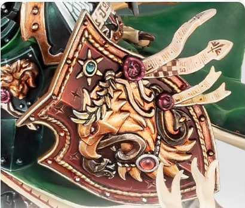

# 1383 帝皇之盾 Emperor's Shield

精校状态：中文行文已逐段精校，部分术语仍为暂定

分类：装备 / 盾牌

原文来源：https://www.bilibili.com/opus/1085992213239824408

原作者：帝国神选罐头

原文时间：2025年07月05日 12:44

[返回分类目录](目录.md) · [全书目录](../../目录.md)

<!-- A1383-B0001 -->
**英文原文**

The Emperor's Shield was once the personal shield of the Emperor, but it is now being wielded by the reborn Primarch Lion El'Jonson in M42.

<!-- /A1383-B0001 -->

<!-- A1383-B0002 -->

原译文

皇帝之盾曾经是帝皇的个人盾牌，但现在由在M42回归的莱昂·艾尔庄森挥舞。

**校订译文**

帝皇之盾曾是帝皇本人的盾牌，M42时由归来的原体莱昂·艾尔’庄森持有。

<!-- /A1383-B0002 -->

<!-- A1383-B0003 图片 -->

<!-- A1383-B0004 -->

原译文

The Emperor's Shield 皇帝之盾

**校订译文**

The Emperor's Shield 帝皇之盾

<!-- /A1383-B0004 -->

<!-- A1383-B0005 -->
**英文原文**

For reasons unknown, the relic was discovered by Lion El'Jonson within a domed structure within the mysterious realm of Mirror-Caliban. Previously, a Watcher in the Dark had warned the Lion to not enter the structure, but he did so anyway to claim the relic. It was first used by The Lion to destroy a shapeshifting Daemon. Holding great power, the Emperor's Shield is able to reflect the attack of an enemy right back at them.

<!-- /A1383-B0005 -->

<!-- A1383-B0006 -->

原译文

由于未知的原因，莱昂·艾尔庄森在神秘的镜像卡利班领域内的一个圆顶结构内发现了这件遗物。此前，一位黑暗守望者曾警告莱昂不要进入这座建筑，但他还是这样做了，以取走遗物。它最初被莱昂用来摧毁变形恶魔。帝皇之盾拥有强大的力量，能够反射敌人对它的攻击。

**校订译文**

莱昂·艾尔’庄森在神秘的镜像卡利班领域中，一座穹顶建筑内发现了这件圣物，其出现在那里的原因仍不明。一名黑暗守望者曾警告他不要进入，但他还是入内取走了盾牌。莱昂第一次使用它，便消灭了一头变形恶魔。帝皇之盾威力非凡，能够把敌人的攻击反弹回去。

<!-- /A1383-B0006 -->

本篇核心术语与暂定项

以下列出本篇出现的英文原形及核心术语表用词。同形词可能指不同对象，具体词义以本篇正文和校注为准；单复数、别名和仅见于图注的名称可能尚未列入。完整候选见[术语表](../../术语表/双语术语候选.csv)。

| 英文 | 采用中文 | 状态 |
| --- | --- | --- |
| Emperor | 帝皇 | 官方已核对 |
| Primarch | 原体 | 官方已核对 |
| Lion El'Jonson | 莱昂·艾尔’庄森 | 官方已核对 |
| Caliban | 卡利班 | 暂定·官方待核 |
| Reborn | 复生者（战团）／重生者（死神军自称） | 语境定译·官方待核 |
| Mirror-Caliban | 镜像卡利班 | 暂定·官方待核 |
| The Dark | 《黑暗》 | 暂定·官方待核 |

