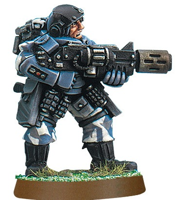

# 1385 甲壳盔甲 Carapace Armour

精校状态：中文行文已逐段精校，部分术语仍为暂定

分类：装备 / 盔甲

原文来源：https://www.bilibili.com/opus/1016277420776357889

原作者：帝国神选罐头

原文时间：2024年12月29日 15:55

[返回分类目录](目录.md) · [全书目录](../../目录.md)

<!-- A1385-B0001 -->
**英文原文**

Carapace Armour refers to a type of heavy body armour used by many agencies of the Imperium of Man, from the Imperial Guard and Imperial Navy to the Adeptus Arbites, as well as individuals wealthy enough to afford it like Rogue Traders, and secessionist realms such as the Severan Dominate.

<!-- /A1385-B0001 -->

<!-- A1385-B0002 -->

原译文

甲壳盔甲是指一种重型防弹衣，由人类帝国的许多机构使用，从帝国卫队和帝国海军到法务部，以及像行商浪人这样有钱买得起的个人，以及像塞韦兰统治者这样的分离主义王国。

**校订译文**

甲壳盔甲是一类重型躯体护甲，广泛用于人类帝国各机构，包括帝国卫队、帝国海军和法务部。财力充足的个人，如行商浪人，也会使用；赛维安帝国等脱离帝国统治的政权同样装备此类护甲。

<!-- /A1385-B0002 -->

<!-- A1385-B0003 图片 -->

<!-- A1385-B0004 -->

原译文

Imperial Guard Stormtrooper wearing carapace armour 穿戴甲壳甲的帝国卫队风暴兵

**校订译文**

Imperial Guard Stormtrooper wearing carapace armour 穿戴甲壳甲的帝国卫队风暴兵

<!-- /A1385-B0004 -->

<!-- A1385-B0005 -->
## Overview 概述

<!-- /A1385-B0005 -->

<!-- A1385-B0006 -->
**英文原文**

Carapace armour consists of large rigid plates of armaplas, ceramite or some other strong material molded to fit parts of the body. While heavy to wear and unable to cover flexible areas such as joints, it offers far better protection over lighter types of armour such as flak armour. This armour is also as much a status symbol as it is a form of protection, with the carapace breastplate worn by many Imperial Guard officers serving the duel purpose of protecting them and displaying their rank. Carapace armour can range from complete armoured suits like those worn by Storm Troopers and the Adeptus Arbites to individual pieces such as chest plates, helmets, etc. Some bodysuits also include simple slots for carapace plates to be inserted, allowing the wearer to customise their level of protection or more easily replace damaged plates.

<!-- /A1385-B0006 -->

<!-- A1385-B0007 -->

原译文

甲壳盔甲由塑钢复合材料、陶钢或其他一些坚固材料制成的大型刚性板组成，这些板被塑成适合身体部位。虽然穿起来很重，无法覆盖关节等柔性区域，但它比防弹衣等较轻类型的装甲提供了更好的保护。这种盔甲既是一种身份象征，也是一种保护形式，许多帝国卫队军官佩戴的甲壳胸甲的决定性目的是用于保护他们并显示他们的军衔。甲壳盔甲的范围可以从风暴兵和法务部穿的全套盔甲到胸甲、头盔等单件盔甲。一些连体衣还包括简单的插槽，用于插入甲壳板，让穿着者可以定制他们的防护等级，或者更容易地更换损坏的板。

**校订译文**

甲壳盔甲由塑甲、陶钢或其他坚固材料制成的大块硬质护板组成，按身体各部位塑形。它虽然沉重，也无法覆盖关节等需要活动的部位，但防护能力远胜防弹甲等轻甲。甲壳盔甲也象征身份：许多帝国卫队军官的甲壳胸甲既保护身体，也展示军衔。它既可制成风暴兵和法务部使用的全套护甲，也可以是单独的胸甲、头盔等部件。有些紧身服设有护板插槽，便于使用者调整防护等级，或更换损坏的护板。

**校注：** armaplas 暂译塑甲，区别 plasteel 塑钢，未把两种材料合并。英文 duel purpose 疑为 dual purpose，中文按防护与展示军衔的双重作用译。

<!-- /A1385-B0007 -->

<!-- A1385-B0008 -->
## Known Carapace Armour Patterns 已知甲壳盔甲型号

<!-- /A1385-B0008 -->

<!-- A1385-B0009 -->
### Cadian-pattern "Kasrkin" Storm Trooper Carapace 卡迪亚型“卡舍津”风暴兵甲壳甲

<!-- /A1385-B0009 -->

<!-- A1385-B0010 -->
**英文原文**

The Cadian-pattern "Kasrkin" carapace suit is the standard body armour of the Cadian Shock Troopers' elite Kasrkin infantry, completely protecting the wearer's body and featuring a suite of advanced technologies. The helmet is equipped with a rebreather, photo-visor, encrypted micro-bead and clip attachment on the side for a light source or vid-recorder, while the suit itself incorporates an integral auspex unit accessed via wrist display and attachments for a grav-chute. Power for these systems is provided for by a small power pack, equivalent in size and cost to a lasgun power pack, which allows for a week of continuous use before requiring replacement. While associated with Cadia, this pattern of carapace suit has been adopted by the Departmento Munitorum for use by other units from as far away as the Calixis Sector.

<!-- /A1385-B0010 -->

<!-- A1385-B0011 -->

原译文

卡迪亚型“卡舍津”甲壳甲套装是卡迪亚突击队精英卡舍津步兵的标准身体防护，完全保护穿着者的身体，并采用了一系列先进技术。头盔侧面配备了一个呼吸器、成像面罩、加密微珠和夹子附件，用于光源或录像机，而套装本身则包含一个集成的鸟卜仪单元，可通过手腕显示器和重力伞的附件访问。这些系统的能源由一个小型能量容器提供，其尺寸和成本与激光枪能量容器相当，可以在需要更换之前连续使用一周。虽然与卡迪亚有关，但这种甲壳甲套装型号已被军务部采用，供远至卡利西斯星区的其他部队使用。

**校订译文**

卡迪亚型“卡舍津”甲壳盔甲是卡迪亚突击部队精锐卡舍津步兵的标准护甲，提供全身防护，集成了多项先进技术。头盔配有循环呼吸器、成像目镜与加密微型通讯珠，侧面夹座可安装照明器或摄像设备。护甲还内置鸟卜仪，可通过腕部显示屏读取，并设有重力伞安装位。全部系统由一个小型能源包供电，其尺寸与成本均相当于激光枪能源包，更换前可连续使用一周。虽然这一型号源自卡迪亚，军务部已将它推广到其他部队，最远甚至包括卡利西斯星区。

**校注：** 修复配件隶属关系：护甲腕部显示屏用于读取鸟卜仪，重力伞是独立安装位；不是通过重力伞访问探测器。

<!-- /A1385-B0011 -->

<!-- A1385-B0012 -->
### Hax-Orthlack MKIII Magistratum Combat Carapace 哈克斯—奥斯拉克 Mk.III 地方法务战斗甲壳盔甲

原题：Hax-Orthlack MKIII Magistratum Combat Carapace 哈克斯-奥尔特拉克MKIII法务战斗甲壳甲

<!-- /A1385-B0012 -->

<!-- A1385-B0013 -->
**英文原文**

The Hax-Orthlack MKIII Magistratum Combat Carapace is produced by Hax-Orthlack for usage by the Magistratum enforcers of Scintilla. It is also fielded by several other authorities across the Calixis Sector. Small numbers of the MKIII can even be found in the private retinues of powerful noble houses. The armour is fully enclosed and incorporates a respirator, flash reactive eyepieces and a comm-bead into the helmet.

<!-- /A1385-B0013 -->

<!-- A1385-B0014 -->

原译文

哈克斯-奥尔特拉克MKIII执法官战斗甲壳甲由哈克斯-奥尔特拉克生产，供辛提拉的执法者使用。卡利西斯星区的其他几个机构也部署了该套装。少数MKIII甚至可以在强大的贵族家族的私人随从中找到。盔甲是全封闭的，头盔中装有呼吸器、闪光反应目镜和通讯念珠。

**校订译文**

哈克斯—奥斯拉克公司制造 Mk.III 地方法务战斗甲壳盔甲，供辛提拉地方执法机构使用。卡利西斯星区的其他一些当局也有装备，少量还流入强大贵族家族的私人卫队。护甲全身封闭，头盔集成呼吸器、防强光自适应目镜与通讯珠。

**校注：** Magistratum 在此为辛提拉地方执法机构，不能直接等同帝国级 Adeptus Arbites 法务部。型号暂以地方法务区分。

<!-- /A1385-B0014 -->

<!-- A1385-B0015 -->
### Hospitaller Carapace Armour 医疗修女甲壳盔甲

<!-- /A1385-B0015 -->

<!-- A1385-B0016 -->
**英文原文**

Although they have access to Adepta Sororitas Power Armour, the Sisters of the Orders Hospitaller usually favor lighter garb when operating outside of active warzones. On top of physical protection, Hospitaller Carapace Armour provides specialized defense against the noxious threats they may encounter as a Medicae: The hooded robes are coated in incense and ungents, while the armour itself is sealed, treated against toxins and comes with a Rebreather, integrated Surgeon Tools and Diagnostor to help the Hospitaller practice her craft.

<!-- /A1385-B0016 -->

<!-- A1385-B0017 -->

原译文

尽管医疗修会的修女们可以使用修女会动力盔甲，但她们在活跃战区外作战时通常喜欢穿着较轻的服装。除了物理保护外，医疗修女甲壳盔甲还提供了专门的防御措施，以抵御他们作为医生可能遇到的有害威胁：连帽长袍上涂有香料和软膏，而盔甲本身是密封的，经过抗毒素处理，并配有呼吸器、集成医疗工具和诊断仪，以帮助医疗修女练习她的手艺。

**校订译文**

医疗修会修女虽然可以装备修女会动力盔甲，但在正在交战的战区以外工作时，通常更喜欢轻便服装。医疗修女甲壳盔甲除了抵御物理伤害，还能防范行医时可能遇到的有害物质。连帽长袍涂有熏香与膏剂，护甲本体密封并经过防毒处理，配有循环呼吸器、集成手术工具与诊断仪，帮助修女施行救治。

<!-- /A1385-B0017 -->

<!-- A1385-B0018 -->
### Hydraphur-pattern Judge's Carapace 海德拉弗型法官甲壳甲

<!-- /A1385-B0018 -->

<!-- A1385-B0019 -->
**英文原文**

The Hydraphur-pattern Judge's carapace suit represents the manifestation of a Judge's authority under the laws of the Lex Imperialis. It is similar to the light carapace suits worn by regular Arbites, complete with distinctive matte-black and red colouring, but also incorporates a storm coat and massive golden eagle topping the helm. The helmet features a photo-visor, encrypted micro-bead and vox-amplifier, while a small light source can be attached to the shoulder pads. A small power pack similar in size and cost to a lasgun's power pack provides enough energy for a week's continuous use.

<!-- /A1385-B0019 -->

<!-- A1385-B0020 -->

原译文

海德拉弗型法官甲壳甲套装代表了法官在帝国法律下的权威表现。它类似于普通执法者穿的轻型甲壳甲，带有独特的哑光黑色和红色，但也包含了风暴外套和巨大的金鹰头盔。头盔配备了一个成像面罩、加密微珠和声音放大器，同时可以在肩甲上安装一个小光源。一个尺寸和成本与激光枪能量容器相似的小型能量容器可以提供足够一周连续使用的能量。

**校订译文**

海德拉弗型法官甲壳盔甲体现了法官依《帝国律法》行使的权威。它与普通法务部人员穿戴的轻型甲壳盔甲相似，采用醒目的哑光黑与红色配色，另配长风衣，盔顶立有巨大的金鹰。头盔内置成像目镜、加密微型通讯珠与扩音器，肩甲上可安装小型照明器。与激光枪能源包尺寸、成本近似的小型能源包，可供整套设备连续运行一周。

<!-- /A1385-B0020 -->

<!-- A1385-B0021 -->
### Solar Pattern Void Armour 太阳型虚空甲

<!-- /A1385-B0021 -->

<!-- A1385-B0022 -->
**英文原文**

A highly advanced, fully enclosed combat suit used by the Solar Auxilia during the Great Crusade and Horus Heresy

<!-- /A1385-B0022 -->

<!-- A1385-B0023 -->

原译文

太阳辅助军在大远征和荷鲁斯叛乱期间使用的一种高度先进的全封闭战斗服

**校订译文**

太阳辅助军在大远征及荷鲁斯之乱期间使用的先进全封闭战斗服。

<!-- /A1385-B0023 -->

本篇核心术语与暂定项

以下列出本篇出现的英文原形及核心术语表用词。同形词可能指不同对象，具体词义以本篇正文和校注为准；单复数、别名和仅见于图注的名称可能尚未列入。完整候选见[术语表](../../术语表/双语术语候选.csv)。

| 英文 | 采用中文 | 状态 |
| --- | --- | --- |
| Adepta Sororitas | 修女会 | 官方已核对 |
| Imperial Guard | 帝国卫队 | 暂定·语境区分 |
| Horus Heresy | 荷鲁斯之乱 | 官方已核对 |
| Imperium of Man | 人类帝国 | 官方已核对 |
| Imperium | 帝国 | 暂定·简称 |
| Imperial Navy | 帝国海军 | 暂定 |
| Departmento Munitorum | 军务部 | 暂定 |
| Adeptus Arbites | 法务部 | 暂定 |
| Great Crusade | 大远征 | 暂定·官方待核 |
| Horus | 荷鲁斯 | 暂定·官方待核 |
| Kasrkin | 卡舍津 | 官方已核对 |
| Enforcers | 地方执法者 | 暂定·官方待核 |
| Lex Imperialis | 帝国律法 | 暂定·官方待核 |
| Solar Auxilia | 太阳辅助军 | 暂定·官方待核 |
| Sector | 星区 | 暂定·官方待核 |
| Severan Dominate | 赛维安帝国 | 暂定·官方待核 |
| Scintilla | 辛提拉 | 暂定·官方待核 |
| Cadia | 卡迪亚 | 暂定·官方待核 |
| Hydraphur | 海德拉弗 | 暂定·官方待核 |
| Orders Hospitaller | 医疗修会 | 暂定 |
| Hospitaller | 医疗修女 | 官方已核对 |
| Power Armour | 动力盔甲 | 暂定·官方待核 |
| Medicae | 医疗工 | 暂定·官方待核 |
| Imperialis | 帝国徽记 | 暂定·官方待核 |
| Calixis Sector | 卡利西斯星区 | 暂定·官方待核 |
| Cadian Shock Troopers | 卡迪亚突击军 | 暂定·官方待核 |
| Orthlack | 奥斯拉克 | 暂定·官方待核 |
| Auspex | 鸟卜仪 | 暂定·官方待核 |
| Carapace Armour | 甲壳盔甲 | 暂定·官方待核 |
| Armaplas | 塑甲 | 暂定·官方待核 |
| Hax-Orthlack MKIII Magistratum Combat Carapace | 哈克斯—奥斯拉克 Mk.III 地方法务战斗甲壳盔甲 | 暂定·官方待核 |
| Magistratum | 地方执法机构 | 暂定·官方待核 |

